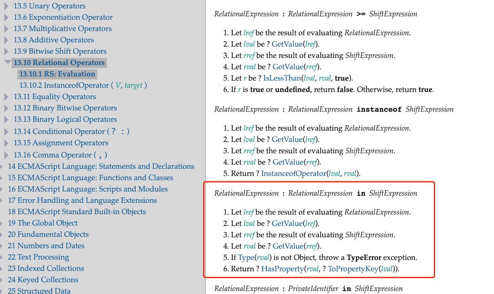

# vue3 - 响应式学习

## 前置知识

### 副作用函数

副作用函数就是指的会产生副作用的函数

```ts
function effect(){
  document.body.innerHTML = 'hello world'
}
```

effect函数会直接或者间接的影响到其他地方函数的执行，也就是说，比如修改一个变量，这个变量其他地方也读取到了


### 响应式数据

假如，有一个引用类型变量, 有一个函数读取到他的属性

```ts
const obj = { a: 'wengkaimin' };

function read(){
  document.body.innerText = obj.a
}
```

当我们修改了obj.a的值的时候，希望`read`这个函数重新执行；如果`read`函数能够因为obj.a的值变化，重新自动的执行，那么我们说obj是一个响应数据

#### 

## 实现响应式数据

有一个data数据

```js
const data = { a: 1 };
```

从两个点出发去实现：

> 1. 副作用函数执行的时候，会触发读取 data.a的操作
> 2. 当修改了data.a的值的时候，会触发data.a的设置操作
>    
>    
>    
>    不难联想到es5的`Object.defineProperty`和es6的`Proxy`代理，都是用于数据的拦截操作，我们只要做好读和取的拦截操作，就能实现数据的响应

### 

### 基本实现

#### 实现读取 拦截

当我们读取data.a的时候，通过拦截将副作用函数加入到一个 “桶” 的数据结构中


接着我们设置data.a的时候把副作用函数取出来

接下来执行对data的代理, obj就是代理的对象

```js
const buckect = new Set(); // 桶

const data = {
  a: 1,
};

const obj = new Proxy(data, {
  get(target, key) {
    buckect.add(effect);
    return target[key];
  },
  set(target, key, newVal) {
    target[key] = newVal;
    // 取出副作用函数effect
    buckect.forEach((fn) => fn());
    return true;
  },
});

const effect = () => {
  document.body.innerText = obj.a;
};

effect();

setTimeout(() => {
  obj.a = 2;
}, 2000);
```

## 

## Step1: 完善系统

上面的基本实现存在很多缺陷

### 硬编码了副作用函数名称 `effect`

> 要想副作用函数被正确的收集到 bucket当中，就不能使用硬编码的函数名

因此，这里提供一个函数的注册机制，用于注册副作用函数

```js
let activeEffect;

// 注册函数
function effect(fn){
    activeEffect = fn;
    fn();
}
```

使用effect包裹 读去了obj的那个管他什么函数

```js
effect(()=>{
 document.body.innerText = obj.a
})
```

之后需要在**读**的拦截器中做判断

```js
const obj = new Proxy(data, {
    get(target, key){
        if(activeEffect){ // ➕
            buckect.add(activeEffect); 
        }
        return target[key]
    },
    set(target, key, newVal){
        target[key] = newVal;
        // 取出副作用函数effect
        buckect.forEach(fn => fn());
        return true
    }
})
```

### 属性和副作用函数关系不明确

>  上面的桶数据结构是一个set，这肯定是不符合情理的，因为一个对象可能存在多个属性，不同的属性之间对应的副作用函数也有可能不一样
> 
> 这样就会导致，无论读取什么值（是否存在）都会去触发副作用函数的重新执行

```js
const buckect = new Set(); // 桶
let activeEffect;

const data = {
    a: 1,
    b: 2,
};

const obj = new Proxy(data, {
    get(target, key) {
    if (activeEffect) {
        // new
        buckect.add(activeEffect);
    }
    return target[key];
    },
    set(target, key, newVal) {
    target[key] = newVal;
    // 取出副作用函数effect
    buckect.forEach((fn) => fn());
    return true;
    },
});

// 注册函数
function effect(fn) {
    activeEffect = fn;
    fn();
}

function setDoc() {
    document.body.innerText = obj.a;
    console.log('触发了')// obj.b的修改也会引起effect重新
}

effect(setDoc);

setTimeout(() => {
    obj.a = 2;
    obj.b = 3; // ➕
}, 2000);
```

> 因此需要重新的设计桶结构，就不能**简单**的用Set了

多个属性，多个响应式数据，要有一一的对应关系


- target：表示不同的需要代理的引用类型数据（当然会存在很多不同的引用数据啊）

- key：表示当前的target里头不同的key（不同的key，触发的副作用函数们也不一样，这里要做区分）
  
  > target存在不同的key，所以不同的key也有不同的副作用
  
  ```js
  function someFn(){
      console.log(obj.a, obj.b)
  }
  ```

- effectFn：表示target下面，这个key所对应的**所有副作用函数**
  
  > 因为存在，例如`obj.a` 被A和B或者C等等其他不同引用地址的函数读取的情况
  
  ```js
  function someFn(){
      console.log(obj.a)
  }
  
  function someFn2(){
      console.log(obj.a)
  }
  ```

综上

这个bucket数据结构可以为

bucket -- > WeakMap （weakMap由target的引用组成）

target --- > Map （map由key组成）

key --- > Set （Set存储了当前key对应的副作用函数）

#### 修改get拦截器

```js
get(target, key){
    // 如果没有 activeEffect说明没有注册过这个副作用函数，直接return
    if(!activeEffect) return; // ➕
    // 根据targt代理引用，取得它对应的map，对应关系target --- > Map
    const depsMap = buckect.get(target); // ➕
    // 假如说这个map不存在，那么就new一个map，与target引用关联
    if(!depsMap) { // ➕
        buckect.set(target, (depsMap = new Map())) // ➕
    }
    // 再根据key从map中取得key对应的Set，key ---> Set
    // Set里头存储了这个key对应的副作用函数
    const deps = depsMap.get(key); // ➕
    if(!deps){ // ➕
        depsMap.set(key, (deps = new Set())) // ➕ 
    }
    // 最后将activeEffect加入到key对应的Set当中
    deps.add(activeEffect);// ➕

    // 返回函数属性
    return target[key]
},
```

#### 修改set拦截

```js
 set(target, key, newVal){
    target[key] = newVal;

    // 根据target引用从桶中取得对应的Map
    const depsMap = buckect.get(target); // ➕
    if(!depsMap) return; // ➕
    // 取得target 上key对应的Set数据，遍历，执行里头的副作用
    const effects = depsMap.get(key);// ➕
    if(effects){
        effects.forEach(fn => fn())
    }
    return true
}
```

这样就可以避免修改其他key值带来的不必要的副作用执行，并且明确了代理目标和副作用函数之间的关系

#### 优化

这一步骤提取一下get和set的里头的一些逻辑，作为封装函数。

`track`：表示追踪的含义，追踪副作用函数

`trigger`：是表示触发副作用的函数

完整代码

```js
let activeEffect;

// 注册函数
function effect(fn){
    activeEffect = fn;
    fn();
}

function track(target,key){
    // 如果没有 activeEffect说明没有注册过这个副作用函数，直接return
    if(!activeEffect) return;
    // 根据targt代理引用，取得它对应的map，对应关系target --- > Map
    let depsMap = buckect.get(target);
    // 假如说这个map不存在，那么就new一个map，与target引用关联
    if(!depsMap) {
        buckect.set(target, (depsMap = new Map()))
    }
    // 再根据key从map中取得key对应的Set，key ---> Set
    // Set里头存储了这个key对应的副作用函数
    let deps = depsMap.get(key);
    if(!deps){
        depsMap.set(key, (deps = new Set()))
    }
    // 最后将activeEffect加入到key对应的Set当中
    deps.add(activeEffect);
}

function trigger(target, key){
    // 根据target引用从桶中取得对应的Map
    const depsMap = buckect.get(target);
    if(!depsMap) return;
    // 取得target 上key对应的Set数据，遍历，执行里头的副作用
    const effects = depsMap.get(key);
    if(effects){
        effects.forEach(fn => fn())
    }
}


const obj = new Proxy(data, {
    get(target, key){
        track(target,key)
        // 返回函数属性
        return target[key]
    },
    set(target, key, newVal){
        target[key] = newVal;
        trigger(target, key)
    }
})
```

> 为何用WeakMap：因为target的数据源是不确定的，存在数据量非常大的情况，假如用Map作为数据结构，在IIFE当中其实是很可能存在内存溢出的现象；

## Step2: 加强系统健壮性

### 考虑切换分支情况（clean up）

在开发过程经常会有条件判断的情况，例如：

```js
const data = { a: true, b: 'weng' };
const obj = new Proxy(data, {....});

effect(function someFn(){
  console.log(obj.a ? obj.b : 'yes!')
})
```

1. 当**someFn**触发的时候，会读取obj.a和obj.b，但是obj.b只有在obj.a为true的情况下，才会打印出来，这时候someFn已经被收集到了a和b各自对应的Set当中了
   
   


2. 假如改变obj.a 为false，会触发`someFn`副作用重新 执行，但是由于obj.a已经是false了，所以就不再读取到obj.b了；
   
   ```js
   obj.a = false
   ```

3. 但是由于第一次读取了b，已经将b的副作用函数someFn收集到了对于的key -- > Set当中了

4. 这时候如果去改变obj.b的值，其实还是会触发someFn
   
   ```js
   const data = {
   a: true,
   b: "weng",
   };
   
   const obj = new Proxy(data, {
   get(target, key) {
       track(target, key);
       // 返回函数属性
       return target[key];
   },
   
   set(target, key, newVal) {
       target[key] = newVal;
       trigger(target, key);
   },
   });
   
   function someFn() {
   console.log(obj.a ? obj.b : "yes!");
   console.log('触发了', bucket);
   }
   
   effect(someFn);
   
   obj.a = false;
   
   setTimeout(() => {
   obj.b = 'kaimin'; // 仍然会触发someFn
   }, 1000);
   ```

> 到这里，目前这套系统还没有一种能够清理这种 **分支切换** 的情况的能力

解决这种问题的思路：

1. 副作用函数执行的时候，第一步，先把它从与之关联的 key--->Set中删除
   
    


2. 副作用函数执行完，去重新建立联系，但是在新的联系中，就不会再包含其他遗留的副作用函数了

#### 改造effect - 1

要想知道这个副作用函数被哪些对象的哪些key -- > Set收集了，必须要知道如何去**收集**以及**标记**下这些 key ---> Set

所以，我们可以先改造一下副作用函数的注册函数effect，**目的在于收集**

```js
// 注册函数
function effect(fn){
    const effectFn = ()=>{
        activeEffect = effectFn;
        fn();
    }
    // 用于存储所有与该副作用函数相关的依赖合集 bucket桶中 key---> Set 的 Set集合
    effectFn.deps = []; // deps: Array<Set>
    effectFn();
}
```

deps就是我们所说的，用于收集 用到这个副作用函数的集合的地方，存储的将是Set的引用

#### 改造track

有了 收集 Set的集合deps，收集的时机也很重要；

看之前的track函数，是作用在get拦截器当中的，将 当前激活的副作用函数 存入Set当中，如果没有key对应的Set，则会new一个，所以在这里，收集deps的时机是最好的

因此我们改造track函数

```js
function track(target,key){
    // 如果没有 activeEffect说明没有注册过这个副作用函数，直接return
    if(!activeEffect) return;
    // 根据targt代理引用，取得它对应的map，对应关系target --- > Map
    let depsMap = buckect.get(target);
    // 假如说这个map不存在，那么就new一个map，与target引用关联
    if(!depsMap) {
        buckect.set(target, (depsMap = new Map()))
    }
    // 再根据key从map中取得key对应的Set，key ---> Set
    // Set里头存储了这个key对应的副作用函数
    let deps = depsMap.get(key);
    if(!deps){
        depsMap.set(key, (deps = new Set()))
    }
    // 最后将activeEffect加入到key对应的Set当中
    deps.add(activeEffect);
    // 将 集合 Set 的引用推入 副作用函数的deps集合里头 ➕
    activeEffect.caller.deps.push(deps); // ➕
}
```

#### 改造effect - 2，实现cleanup清除函数

上面提到，要在副作用函数**执行之前**，将事先收集到的deps中的所有对应的Set中someFn删掉

```js
function cleanup(effectFn){
    for (let i = 0; i < effectFn.caller.deps.length; i++) {
        const deps = effectFn.deps[i];
        // 将 effectFn 从依赖集合从移除
        deps.delete(effectFn)
    }
    // 最后重置一下 deps
    effectFn.deps.length = 0
}

// 注册函数
function effect(fn){
    const effectFn = ()=>{
        cleanup(effectFn)
        activeEffect = effectFn;
        fn();
    }
    // 用于存储所有与该副作用函数相关的依赖合集 bucket桶中 key---> Set 的 Set集合
    effectFn.deps = [];
    effectFn();
}
```

#### 改造trigger函数

因为在副作用执行之前，我们调用cleanup清除包含副作用函数的所有Set，但是执行之后又收集了进去。问题就在这里，我们在trigger的时候，去遍历这个Set执行fn（使用的foreach）

> foreach在遍历Set的时候，如果，一个值虽然被访问了，但是在遍历过程中被删除了，又被重新的添加到了集合当中，如果遍历过程还没有结束的话，就会重新被访问，一直在遍历，所以需要改造一下

```js
function trigger(target, key){
    // 根据target引用从桶中取得对应的Map
    const depsMap = bucket.get(target);
    if(!depsMap) return;
    // 取得target 上key对应的Set数据，遍历，执行里头的副作用
    const effects = depsMap.get(key);
    if(effects){
        effects.forEach(fn => fn()); // 问题所在， 遍历的时候在执行副作用，执行的时候又被收集进去到同一个Set当中了，所以我们可以使这个遍历的effects Set更换为另外一个引用
    }
}
```

改造后

```js
function trigger(target, key){
    // 根据target引用从桶中取得对应的Map
    const depsMap = bucket.get(target);
    if(!depsMap) return;
    // 取得target 上key对应的Set数据，遍历，执行里头的副作用
    const effects = depsMap.get(key);
    if(effects){
        const effectsClone = new Set(effects)  // ➕
        effectsClone.forEach(fn => fn()); // ➕
    }
}
```

这样，重新的创建一个Set的集合，就可以避免无限递归的情况了

```js
      const data = {
        a: true,
        b: "weng",
      };

      const obj = new Proxy(data, {
        get(target, key) {
          track(target, key);
          // 返回函数属性
          return target[key];
        },

        set(target, key, newVal) {
          target[key] = newVal;
          trigger(target, key);
        },
      });

      function someFn() {
        console.log(obj.a ? obj.b : "yes!");
        console.log("触发了", bucket);
      }

      effect(someFn);

      obj.a = false;

      setTimeout(() => {
        obj.b = "kaimin"; // 修改b值的时候，不会再触发someFn了
      }, 1000);
```

### 考虑嵌套执行的情况

> 在MVVM或者MVC的框架中，都会存在，多层组建嵌套的情况
> 
> 在vue中的每一个组建，其实都是存在一个render函数的。
> 
> 多层组建之间的嵌套，在vue中又涉及到了响应式的数据，因此可以当作每一个组建如果使用到了响应式的数据，每一个render的函数其实都是可以看成是需要在数据变更时候重新执行的副作用

组建之间发生了嵌套，可以看成

```js
// 组建B
const B = {
  render(){
    return {.....}
  }
}
// 组建A
const A = {
  render(){
    return <B />
  }
}
// 由于A中嵌套了B，所以可以理解为
effect(()=>{
  A.render();
  effect(()=>{
    B.render();
  })
})
```

这种类似的嵌套情况是非常常见的；但是我们目前的系统是不支持嵌套的

例：

```js
const data = { a:true, b:false };

const obj = new Proxy(data, {....});

let temp1, temp2;

function innerFn() {
    console.log("run effect inner");
    temp2 = obj.b;
}

function outerFn() {
    console.log("run effect outer");
    effect(innerFn);
    temp1 = obj.a;
}

effect(outerFn);

setTimeout(() => {
    obj.a = 3;
}, 2000);
```

常理上我们，理想我们需要这种收集的情况

  


初始化执行结果是这样的

```shell
run effect outer
run effect inner
```

这时候，我们去改动obj.a的值

输出的结果为

```shel
run effect inner
```

发现外层的effect函数并没有执行，而只是执行了内层的

这是由于，我们的effect副作用的包裹函数的问题：

```js
let activeEffect;

// 注册函数
function effect(fn){
    const effectFn = ()=>{
        cleanup(effectFn)
        activeEffect = effectFn;
        fn();
    }
    // 用于存储所有与该副作用函数相关的依赖合集 bucket桶中 key---> Set 的 Set集合
    effectFn.deps = [];
    effectFn();
}
```

每次执行副作用函数的时候之前，会将副作用函数引用赋值给全局遍历activeEffect，而且activeEffect在同一时刻有且仅有一个。 由于发生了嵌套，第二次执行的副作用函数直接覆盖了上一层赋值的activeEffect

在track函数中，最终收集到的是内层的innerEffect副作用

#### 使用副作用函数栈

因为嵌套存在多层的情况，所以，考虑用一个副作用的函数栈 进行存储之前的副作用函数，保证不会丢失上一层的副作用函数

每次的执行之前，将副作用函数压入这个栈当中，等副作用函数执行完之后，再将当前执行完的这个副作用函数从栈中弹出，

**并始终将activeEffect这个全局（正被激活的副作用函数）指向这个栈顶**

```js
// 全局加入effectStack栈结构
let effectStack=[]
```

上述例子的流程如下：


改造effect函数

```js
// 注册函数
function effect(fn){
    const effectFn = ()=>{
        cleanup(effectFn)
        // 当调用effect注册副作用函数时，将副作用函数复制给activeEffect
        activeEffect = effectFn;
        // 在调用副作用函数之前将当前副作用函数压入栈中
        effectStack.push(effectFn) // ➕
        fn();
        effectStack.pop(); // ➕
        // 执行完之后，弹出栈，并把activeEffect还原为之前的值, 指向栈顶
        activeEffect = effectStack[effectStack.length - 1] // ➕
    }
    // 用于存储所有与该副作用函数相关的依赖合集 bucket桶中 key---> Set 的 Set集合
    effectFn.deps = [];
    effectFn();
}
```

修改之后，我们会发现，修改了a的属性之后，会正常打印两次数据

### 考虑自增（自减）值的情况

> 自增就是例如obj.a++这样的

这种情况，等价于 obj.a = obj.a + 1

```js
const data = {
    a: 1,
};

const obj = new Proxy(data, {
    get(target, key) {
        track(target, key);
        // 返回函数属性
        return target[key];
    },

    set(target, key, newVal) {
        target[key] = newVal;
        trigger(target, key);
    },
});

function someFn() {
   console.log((obj.a = obj.a + 1));
}

effect(someFn);
```

这种情况就是既读取了obj.a的值，又设置了obj.a的值，会直接爆栈，**原因如下**

1. 初始化的时候，我们执行副作用函数（**这里我们叫做A，表示初始化的时候执行的**），首先读取了obj.a的值，触发了track函数，会将当前的副作用函数收集到桶中。
2. 接着将其 + 1之后 重新设置obj.a的值的时候，被setter拦截，这时候触发了trigger函数，把副作用函数（**这里叫做B，表示赋值造成的第二次执行**）从桶中取出执行
3. 但是这个时候初始化的那次副作用函数（A）还在执行，赋值操作只会再次触发被收集的副作用函数（产生了B），因此会无限的递归赋值操作到爆栈

#### 增加守卫

其实，这种情况很普遍，不单单是自增的情况，也有可能副作用函数读取obj.a之后，经过一番处理进行了重新赋值。

```js
function someFn(){
  const b = obj.a + ....;
     obj.a = b;
}
```

造成上述的递归，是因为不断的调用自身的副作用函数造成的

所以我们在第三步骤执行的时候，加一个守卫，如果**当前正在执行的副作用函数和trigger触发的副作用函数相同**，则不执行

改造trigger函数

```js
function trigger(target, key){
    // 根据target引用从桶中取得对应的Map
    const depsMap = buckect.get(target);
    if(!depsMap) return;
    // 取得target 上key对应的Set数据，遍历，执行里头的副作用
    const effects = depsMap.get(key);

    const effectsToRun = new Set();

    if(effects){
        effects.forEach((current)=>{
            if(current !== activeEffect){
                // 如果当前trigger执行的，和activeEffect不一样，加入
                effectsToRun.add(current)
            }
        })
    }
    effectsToRun.forEach((fn)=>fn())
}
```

改造之后，就可以正常的进行副作用函数的收集和执行了

```js
const data = {
    a: 1,
};

const obj = new Proxy(data, {
    get(target, key) {
        track(target, key);
        // 返回函数属性
        return target[key];
    },

    set(target, key, newVal) {
        target[key] = newVal;
        trigger(target, key);
    },
});

function someFn() {
   console.log((obj.a = obj.a + 1)); // 不会爆栈了
}

effect(someFn);


setTimeout(()=>{
    obj.a = 3; // 正常触发收集到的副作用函数
})
```

### 

### 考虑调度实现

响应式系统比较重要的就是，一个可调度性，可调度性可以将控制权力交接给用户。

> 可调度性：有能力 决定副作用函数**执行时机**，执行次数，以及**执行方式**

比如修改了obj.a的值，执行顺序是

```js
function someFn(){
  console.log(obj.a)
}

effect(someFn)


obj.a++;

console.log('我是分割');


// 1
// 2
// 我是分割
```

假如我想调整打印的顺序，需要在某些条件延迟去执行这个副作用函数

```js
// 1
// 我是分割
// 2
```

我们可以这样设计

给effect函数加上调度的参数

```js
effect(effectFn, options)

options = {
  scheduler(effectFn){
    ....
  }
}
```

因此，可以想到，我们在trigger函数中进行副作用函数执行的时候，如果有调度器，我们就去执行用户传递进来的调度器，将副作用函数的执行权利抛给外界控制

#### effect加入调度函数参数

加入options，挂载到effectFn上

```js
// 注册函数
function effect(fn, options){ // ➕
    const effectFn = ()=>{
        cleanup(effectFn)
        // 当调用effect注册副作用函数时，将副作用函数复制给activeEffect
        activeEffect = effectFn;
        // 在调用副作用函数之前将当前副作用函数压入栈中
        effectStack.push(effectFn)
        fn();
        // 执行完之后，弹出栈，并把activeEffect还原为之前的值, 指向栈顶
        activeEffect = effectStack[effectStack.length - 1] // ➕
    }
    // 将调度相关的参数加入到副作用函数当中
    effectFn.options = options; // ➕
    // 用于存储所有与该副作用函数相关的依赖合集 bucket桶中 key---> Set 的 Set集合
    effectFn.deps = [];
    effectFn();
}
```

#### trigger触发调度

遍历 执行**副作用函数**的时候，去判定是否具有调度器，有调度器就执行调度器，并将副作用函数**执行权力交给用户**，否则就默认执行副作用函数

```js
function trigger(target, key){
    // 根据target引用从桶中取得对应的Map
    const depsMap = buckect.get(target);
    if(!depsMap) return;
    // 取得target 上key对应的Set数据，遍历，执行里头的副作用
    const effects = depsMap.get(key);

    const effectsToRun = new Set();

    if(effects){
        effects.forEach((current)=>{
            if(current !== activeEffect){
                // 如果当前trigger执行的，和activeEffect不一样，加入
                effectsToRun.add(current)
            }
        })
    }
    effectsToRun.forEach((fn)=>{
        if(fn.options.scheduler){ // ➕
            fn.options.scheduler(fn) // ➕
        }else{
            fn()
        }
    })    
}
```

上述的例子就可以这样实现了

```js
const data = {
    a: 1,
};

const obj = new Proxy(data, {
    get(target, key) {
        track(target, key);
        // 返回函数属性
        return target[key];
    },

    set(target, key, newVal) {
        target[key] = newVal;
        trigger(target, key);
    },
});

function someFn() {
    console.log(obj.a);
}

effect(someFn, {
    scheduler(fn) {
        setTimeout(() => {
            fn();
        }, 0);
    },
});

obj.a++;

console.log("我是分割");
```

### 

### 考虑防抖情况

在vue3中，我们多次在一次执行中，例如对obj.a做了3次赋值操作

```js
const data = { a: 1 };

const obj = new Proxy(data, {...});

function someFn(){
    console.log(obj.a)
}

effect(someFn)

obj.a++;
obj.a++;
obj.a++;
```

3次的自增操作，vue3中只会打印2次

```shell
1  // 第一次是初始化的时候打印的
4
```

但是我们的系统会打印4次

```shell
1
2
3
4
```

其实我们关注的只是最后的结果，所以第2 3次的打印数据我们并不关心；

因此我们可以基于调度器，接入防抖系统

#### 微任务队列实现防抖

```js
// 定义任务队列
const jobQueue = new Set();
// 使用promise.resolve创建微任务，添加到微任务队列
const p = Promise.resolve();

// 一个标志代表是否正在刷新队列
let isFlushing = false;
function flushJob(){
    // 如果队列正在刷新，则什么都不做
    if(isFlushing) return;
    // 设置true, 代码正在刷新
    isFlushing = true;
    // 在微任务队列中刷新 jobQueue 队列
    p.then(()=>{
        jobQueue.forEach((fn => fn()))
    }).finally(()=>{
        // 结束后重置isFlushing
        isFlushing = false;
    })
}
```

```js
effect(someFn, {
    scheduler(fn){
        // 每次调度时，将副作用函数添加到jobQueue队列中
        jobQueue.add(fn);

        // 调用 flushJob 刷新队列
        flushJob();
    }
})
```

1. 定一个任务队列jobQueue ---> Set，目的是利用Set数据结构的自动去重能力。
2. scheduler在每次调用一个副作用函数的时候，将 副作用函数加入jobQueue，然后再调用flushJob刷新队列
3. flushJob函数开始执行的时候，通过isFlushing字段进行限制，只有false的时候才执行；在进行的时候就是true
4. 这样可以知道，无论我们走了多少次的flushJob，每个微任务的周期内都会执行一次；之后在微任务队列里头完成对jobQueue的遍历

> 多次修改响应式的值，其实在vue中也是类似这样的实现，只是比这个更完善

如上的例子就可以实现防抖的效果了

```js
const data = { a: 1 };

const obj = new Proxy(data, {...});

function someFn(){
    console.log(obj.a)
}

effect(someFn, {
    scheduler(fn) {
          jobQueue.add(fn);
          flushJob();
    },
})

obj.a++;
obj.a++;
obj.a++;


// 最终只会打印1 4
```

总结下来的代码：

```js
let activeEffect;

const effectStack = [];

const buckect = new WeakMap();


const source = { 
    a: 'wengkaimin',
    b: 'weng'
}


// 定义任务队列
const jobQueue = new Set();
// 使用promise.resolve创建微任务，添加到微任务队列
const p = Promise.resolve();

// 一个标志代表是否正在刷新队列
let isFlushing = false;
function flushJob(){
    // 如果队列正在刷新，则什么都不做
    if(isFlushing) return;
    // 设置true, 代码正在刷新
    isFlushing = true;
    // 在微任务队列中刷新 jobQueue 队列
    p.then(()=>{
        jobQueue.forEach((fn => fn()))
    }).finally(()=>{
        // 结束后重置isFlushing
        isFlushing = false;
    })
}

function cleanup(effectFn){
    for (let i = 0; i < effectFn.deps.length; i++) {
        const deps = effectFn.deps[i];
        // 将 effectFn 从依赖集合从移除
        deps.delete(effectFn)
    }
    // 最后重置一下 deps
    effectFn.deps.length = 0
}

// 注册函数
function effect(fn, options){ // ➕
    const effectFn = ()=>{
        cleanup(effectFn);
        // 当调用effect注册副作用函数时，将副作用函数复制给activeEffect
        activeEffect = effectFn;
        // 在调用副作用函数之前将当前副作用函数压入栈中
        effectStack.push(effectFn);
        fn();
        // 执行完之后，弹出栈，并把activeEffect还原为之前的值, 指向栈顶
        activeEffect = effectStack[effectStack.length - 1];  // ➕
    }
    // 将调度相关的参数加入到副作用函数当中
    effectFn.options = options; // ➕
    // 用于存储所有与该副作用函数相关的依赖合集 bucket桶中 key---> Set 的 Set集合
    effectFn.deps = [];
    effectFn();
}


function someFn(){
    console.log(source.a)
}

function someFn2(){
    console.log(source.a)
}

effect(someFn, {
    scheduler(fn){
        // 每次调度时，将副作用函数添加到jobQueue队列中
        jobQueue.add(fn);

        // 调用 flushJob 刷新队列
        flushJob();
    }
})


function track(target,key){
    // 如果没有 activeEffect说明没有注册过这个副作用函数，直接return
    if(!activeEffect) return;
    // 根据targt代理引用，取得它对应的map，对应关系target --- > Map
    let depsMap = buckect.get(target);
    // 假如说这个map不存在，那么就new一个map，与target引用关联
    if(!depsMap) {
        buckect.set(target, (depsMap = new Map()))
    }
    // 再根据key从map中取得key对应的Set，key ---> Set
    // Set里头存储了这个key对应的副作用函数
    let deps = depsMap.get(key);
    if(!deps){
        depsMap.set(key, (deps = new Set()))
    }
    // 最后将activeEffect加入到key对应的Set当中
    deps.add(activeEffect);
    // 将 集合 Set 的引用推入 副作用函数的deps集合里头
    activeEffect.deps.push(deps);
}

function trigger(target, key){
    // 根据target引用从桶中取得对应的Map
    const depsMap = buckect.get(target);
    if(!depsMap) return;
    // 取得target 上key对应的Set数据，遍历，执行里头的副作用
    const effects = depsMap.get(key);

    const effectsToRun = new Set();

    if(effects){
        effects.forEach((current)=>{
            if(current !== activeEffect){
                // 如果当前trigger执行的，和activeEffect不一样，加入
                effectsToRun.add(current)
            }
        })
    }
    effectsToRun.forEach((fn)=>{
        if(fn.options.scheduler){ // ➕调度器
            fn.options.scheduler(fn) // ➕调度器
        }else{
            fn()
        }
    })    
}

const obj = new Proxy(data, {
    get(target, key){
        track(target,key)
        // 返回函数属性
        return target[key]
    },
    set(target, key, newVal){
        target[key] = newVal;
        trigger(target, key)
    }
})
```

## Step3: 实现lazy+computed

综上所说的，副作用函数，其实在我们目前的系统都是会立即执行的，但是其实有些情况下我们是不需要去做立刻执行我们的副作用函数的

所以结合上面的options副作用函数的参数，其实能够和调度器一样去实现我们的lazy的能力。

```js
effect(()=>{
  console.log(obj.a)
},{
  scheduler(){....},
  lazy:true // ➕
})
```

### 实现lazy效果 - 改造effect函数

当我们判断lazy字段为true的时候，我们就不立即执行effect函数

```js
// 注册函数
function effect(fn, options){
    const effectFn = ()=>{
        cleanup(effectFn);
        // 当调用effect注册副作用函数时，将副作用函数复制给activeEffect
        activeEffect = effectFn;
        // 在调用副作用函数之前将当前副作用函数压入栈中
        effectStack.push(effectFn);
        fn();
        effectStack.pop();
        // 执行完之后，弹出栈，并把activeEffect还原为之前的值, 指向栈顶
        activeEffect = effectStack[effectStack.length - 1];  
    }
    // 将调度相关的参数加入到副作用函数当中
    effectFn.options = options;
    // 用于存储所有与该副作用函数相关的依赖合集 bucket桶中 key---> Set 的 Set集合
    effectFn.deps = [];
    // ➕ 如果options中 lazy为false，才立即执行副作用函数
    if(!options.lazy){
        effectFn();
    }
    return effectFn // ➕将副作用函数作为返回值返回出去
}
```

但是其实，作为返回值，返回副作用函数其实意义不大的，因为你还得手动执行

```js
const effectFn = effect(someFn, {
    lazy:true // ➕
})
effectFn()
```

所以我们引出computed

### 实现computed

但是假如说，我们的someFn，也就是副作用函数是一个 有返回值的 函数，类似 getter，那么我们就有意思了

```js
function someFn(){
  return obj.a + 1;
}

const effectFn = effect(someFn, {
    lazy:true // ➕
})

const value = effectFn()
```

因此我们可以去除手动执行的这个逻辑，执行的时候，将执行结果返回。

去实现一个computed的工厂函数

```js
function computed(getter){
  // 把getter 作为副作用函数，创建一个lazy的effect
  const effectFn = effect(getter, {
    lazy: true
  })

  const obj = {
    get value(){
      return effectFn() // 手动执行
    }
  }

  return obj 
}

const testA = computed(()=>{
  return obj.a + 1
})
```

computed函数接受一个函数，返回值是一个对象，包含一个value属性。getter函数作为参数，然后getter其实就是副作用函数，用他创建一个lazy的effectFn，然后我们定一个obj，在访问obj的时候去执行getter。

#### 改造effect函数

[我们]()在**effectFn**函数调用的时候，将执行结果返回出去 

```js
// 注册函数
function effect(fn, options){
    const effectFn = ()=>{
        cleanup(effectFn);
        // 当调用effect注册副作用函数时，将副作用函数复制给activeEffect
        activeEffect = effectFn;
        // 在调用副作用函数之前将当前副作用函数压入栈中
        effectStack.push(effectFn);
        const res = fn(); // ➕
        effectStack.pop();

        // 执行完之后，弹出栈，并把activeEffect还原为之前的值, 指向栈顶
        activeEffect = effectStack[effectStack.length - 1];  
        return res; // ➕ 将函数执行结果返回出去，实现getter的效果
    }
    // 将调度相关的参数加入到副作用函数当中
    effectFn.options = options; 
    // 用于存储所有与该副作用函数相关的依赖合集 bucket桶中 key---> Set 的 Set集合
    effectFn.deps = [];
    // 如果options中 lazy为false，才立即执行副作用函数
    if(!options.lazy){
        effectFn();
    }
    return effectFn // 将副作用函数作为返回值返回出去
}
```

总结下来，就是lazy配合getter实现一套computed函数

试验一下，就可以实现computed的效果了

```js
const data = {
    a: 1,
};

const obj = new Proxy(data, {
    get(target, key) {
        track(target, key);
        // 返回函数属性
        return target[key];
    },

    set(target, key, newVal) {
        target[key] = newVal;
        trigger(target, key);
    },
});

function someFn() {
    console.log("执行了getter");
    return obj.a + 1;
}

const computedData = computed(someFn);

console.log(computedData.value);

setTimeout(() => {
    obj.a = 3; // 在改变值得的时候也会做到同步的重新计算
}, 2000);
```

### 实现缓存 优化

如上的例子，假如我们读取了两次computedData

```js
const data = {
    a: 1,
};

const obj = new Proxy(data, {
    get(target, key) {
        track(target, key);
        // 返回函数属性
        return target[key];
    },

    set(target, key, newVal) {
        target[key] = newVal;
        trigger(target, key);
    },
});

function someFn() {
    console.log("执行了getter");
    return obj.a + 1;
}

const computedData = computed(someFn);

console.log(computedData.value);

setTimeout(() => {
    console.log(computedData.value);
}, 2000);
```

会发现，执行了两次的getter

```shell
执行了getter
2
执行了getter
2
```

我们并没有对a的值进行修改，而是重复读取了而已

**原因如下：**

当我们读取 `computedData`值的时候，才会去执行getter副作用函数。

但是目前的实现，我们在每次读取    `computedData`的时候其实都会将getter副作用函数重新执行一遍，就算是obj.a没有变化的情况下。

所以，我们在obj.a没有变化的时候，我们其实并不需要去重新执行副作用函数，我们只需要将第一次读取的值缓存下来就可以了。

#### 改造computed函数

加入缓存，我们可以再computed中，在第一次计算的时候加入缓存字段 - value，通过dirty表示判断，是否需要重新计算新的值，结合调度器参数，在依赖改变的时候，去回归dirty参数

```js
function computed(getter){
  let value; // ➕ 缓存值
  let dirty = true; // true表示需要重新计算值 ➕

  // 把getter 作为副作用函数，创建一个lazy的effect
  const effectFn = effect(getter, {
    lazy: true,
    scheduler(){ // ➕
      dirty = true; // 执行调度，trigger执行的时候，重新触发调度
    }
  })

  const obj = {
    get value(){
      if(dirty){
          value = effectFn();// 手动执行
          dirty = false; // 设置为false ➕
      }
      return value  // ➕
    }
  }

  return obj 
}
```

这样我们就能将计算值缓存起来。

如下的例子：

```js
const data = {
    a: 1,
};

const obj = new Proxy(data, {
    get(target, key) {
        track(target, key);
        // 返回函数属性
        return target[key];
    },

    set(target, key, newVal) {
        target[key] = newVal;
        trigger(target, key);
    },
});

function someFn() {
    console.log("执行了getter");
    return obj.a + 1;
}

const computedData = computed(someFn);

console.log(computedData.value)

obj.a = 8;
```

我们先访问了computedData，会进行一层计算，此刻得值为2

之后我们修改了obj.a的值，会去走getter - 也就是someFn，因为存在调度器，所以这时候执行的是someFn的调度，将dirty设置为了true

所以在下一次访问computedData.value的时候，就会重新计算；

当然，如果没有去调用obj.a的赋值操作，这时候访问的computedData的时候就不会重新计算getter

### 嵌套读取计算属性值 缺陷

我们使用计算属性的时候，经常会在模板或者是另外一个副作用函数里头使用，例如

```js
const data = {
    a: 1,
    b: 2,
};

const obj = new Proxy(data, {
    get(target, key) {
        track(target, key);
        // 返回函数属性
        return target[key];
    },

    set(target, key, newVal) {
        target[key] = newVal;
        trigger(target, key);
    },
});

function someFn() {
    console.log("执行了getter");
    return obj.a + obj.b;
}

const computedData = computed(someFn);

function effectOuter() {
    console.log(computedData.value);
}

effect(effectOuter);

setTimeout(() => {
    obj.a++;
}, 2000);
```

另外一个effect函数中读取了计算数据，当我们修改了obj.a的值之后，发现并不会 打印出 computedSum.value之后的值

回头看computed函数，会发现，getter函数使用到了obj.a和obj.b，getter被收集到了a,b对应的Set当中


getter是一个副作用函数，也是是被effect包裹并且处理为懒执行的函数

如上的情况，就是发生了嵌套，外层的effect包裹了内层effect，而外层的effect真正读取的是computedSum.value，而这玩意并不是响应式数据，也无法收集到这个外层effect包裹的这个函数。

而真正外层副作用函数读取的引用是computed内层的这个数据 `computedSum.value` ---> obj.value

```js
 const obj = {
    get value(){
      if(dirty){
          value = effectFn();// 手动执行
          dirty = false; // 设置为false ➕
      }
      return value  // ➕
    }
  }
```

所以为了能够追踪到读取计算属性的副作用函数，我们可以手动嵌入 track和trigger，用于obj的追踪和触发，追踪的是obj对象的key 为value

#### 改造computed函数

```js
function computed(getter){
    let value; // 
    let dirty = true; // true表示需要重新计算值 

    // 把getter 作为副作用函数，创建一个lazy的effect
    const effectFn = effect(getter, {
      lazy: true,
      scheduler(){
        dirty = true; // 执行调度，trigger执行的时候，重新触发调度
        // 当计算属性依赖的响应式数据发生变化的时候，手动的去调用trigger函数触发相应
        trigger(obj, 'value') // ➕
      }
    })

    const obj = {
      get value(){
        if(dirty){
            value = effectFn();// 手动执行
            dirty = false; // 设置为false 
        }
        track(obj, 'value'); // 当读取这个value值的时候，手动调用track函数  // ➕
        return value;
      }
    }

    return obj 
  }
```

因此这样就可以解决读取计算属性的问题了。

```js
const data = { a: 1, b: 2 };
const obj = new Proxy(data, {...});

const computedData = computed(()=> obj.a + obj.b);

effect(function effectOuter(){
  console.log(computedData.value)
})


setTimeout(()=>{
    obj.a++;
}, 2000)
```

这就样可以打印出修改的之后的computed的值了，并且执行副作用函数

他们之间的依赖关系就如图所示


## Step4: 实现watch

vue3中的wacth函数用法

```js
wactch(obj, ()=>{
  console.log('变化数据')
})

// 修改
obj.a++;
```

观测obj的值的改变，从而触发数据变化

主要是由两个参数，第一个是观测的数据，第二个是数据变化时候触发的回调函数

> watch的实现本质就是利用了effect函数options.scheduler调度器选项。

可以理解为：

```js
effect(()=>{
  console.log(obj.a)
}, {
  scheduler(){
    // 当obj.a变化的时候，执行调度函数
  }
})
```

从之前的调度器属性可以看到，当存在调度器的时候，数据变化会触发调度器的执行

1. 首先要先读取watch的那个数据。
   - 原始值如何处理
   - 对象递归处理
   - 目前暂时不考虑其他的数据结构
2. watch的回调函数，可以直接加入调度器中执行，利用effect的getter骚操作进行响应式数据的track，但是最终trigger触发的副作用函数并不是getter，而是调度器

假如是如下的场景

```js
const data = {
    a: 1,
};

const obj = new Proxy(data, {
    get(target, key) {
        track(target, key);
        // 返回函数属性
        return target[key];
    },

    set(target, key, newVal) {
        target[key] = newVal;
        trigger(target, key);
    },
});

watch(obj, () => {
    console.log("改变了值");
});

setTimeout(() => {
    obj.a = 2;
}, 2000);
```

这个时候去改变a的值，希望能够实现和vue中的一样，直接执行这个回调函数

### 基础实现

scheduler + effect

effect进行数据的读取追踪，scheduler作为调度器

```js
// wacth基本
function watch(source, callback){
    effect(()=> traverse(source),{
        scheduler(){
            callback()
        }
    })
}
```

首先我们要对watch的数据进行读取

- source在这里指的是 数据源

#### 实现traverse

封装一个通用的读取操作，能够保证source能够被完全的读取

```js
function traverse(value, seen = new Set()){
    // 如果要读取的数据是原始值，或者已经被读取过了，那么什么都不做
    if(typeof value !== 'object' || value === null || seen.has(value)) return

    // 将数据添加到seen中，代表遍历的时候读取过了，避免循环引用
    seen.add(value);
    // 。。。。目前不考虑数组等其他数据结构
    // 假设value是一个对象，使用for...in...读取对象的每一个值，递归调用traverse
    for (const key in value) {
        traverse(value[key], seen)
    }

    return value;
}
```

- seen: 是一个Set结构， 这块防止重复读取引用类型数据造成stack overflow

> 这里直接考虑vue中deep的情况，目前暂时不考虑其他的数据结构，只考虑对象类型

### 函数类型兼容

在vue中，watch第一个参数还能是一个getter，在getter内部，可以指定wacth哪些响应式数据，只有数据变化的时候，才会触发回调

```js
watch(()=>obj.a,()=>{
  console.log('修改了值')
})
```

因此对source类型做判断，改造watch

```js
// wacth基本
function watch(source, callback) {
  // 定义一个getter
  let getter; // ➕
  // 如果source为函数, 说明传进来了getter，所以source直接等于getter
  if (typeof source === "function") { // ➕
    getter = source;
  } else {
    getter = () => traverse(source);
  }
  effect(() => getter(source), {
    scheduler() {
      callback();
    },
  });
}
```

这样我们在修改a值得时候就可以如愿检测到数据变化并且执行回调函数

```js
const data = {
    a: 1,
};

const obj = new Proxy(data, {
    get(target, key) {
        track(target, key);
        // 返回函数属性
        return target[key];
    },

    set(target, key, newVal) {
        target[key] = newVal;
        trigger(target, key);
    },
});

watch(obj, () => {
    console.log("改变了值");
});

// or  ()=> obj.a

setTimeout(() => {
    obj.a = 2;
}, 2000);
```

### 新值和旧值

在vue中使用watch的时候，经常需要 知道新的值 和旧的值 传入回调函数之中

```js
watch(obj, (newVal, oldVal) => {
    console.log("改变了值", newVal, oldVal);
});
```

所以需要实现一下这种能力

**需要知道的点**

- 新值和旧值都是 getter函数触发最终的return结果

- 新值和旧值需要传入我们的callback函数当中作为参数提供给外界

- 需要存储新值和旧值

- 需要加入lazy属性，创建懒执行effect

#### 改造watch

```js
// wacth基本
function watch(source, callback) {
  // 定义一个getter
  let getter;
  // 如果source为函数, 说明传进来了getter，所以source直接等于getter
  if (typeof source === "function") {
    getter = source;
  } else {
    getter = () => traverse(source);
  }
  let oldValue; // ➕ 旧值 
  let newValue; // ➕ 新值
  const effectFn = effect(() => getter(source), {
    lazy: true, // ➕
    scheduler() {
      newValue = effectFn(); // 将执行结果返回给新值 ➕ 🐂👃
      callback(newValue, oldValue);
      oldValue = newValue; // 每次记录上一次的值 ➕
    },
  });
}
```

这里最核心的地方就是使用到了lazy创建懒执行的effect；

如下这个例：

```js
const data = {
  a: 1,
};

const obj = new Proxy(data, {
  get(target, key) {
    track(target, key);
    // 返回函数属性
    return target[key];
  },

  set(target, key, newVal) {
    target[key] = newVal;
    trigger(target, key);
  },
});

watch(
  () => obj.a,
  (newVal, oldVal) => {
    console.log("改变了值", oldVal, "--->", newVal);
  }
);

setTimeout(() => {
  obj.a = 2;
}, 2000);
```

这样的话就可以记录下来旧值了

### 立即执行

vue3中的watch能够通过 `immediate`参数立即进行执行

当immediate参数胃true的时候，回调函数就会在watch函数执行的时候，立刻执行一次回调函数

所以我们可以改造下watch加入immediate配置项

```js
// wacth
function watch(source, callback, options = {}) {
  // 定义一个getter
  let getter;
  // 如果source为函数, 说明传进来了getter，所以source直接等于getter
  if (typeof source === "function") {
    getter = source;
  } else {
    getter = () => traverse(source);
  }

  let oldValue; // ➕ 旧值
  let newValue; // ➕ 新值

  // 提取scheduler调度函数为一个独立的job函数
  const job = () => {
    newValue = effectFn(); // 将执行结果返回给新值 ➕
    callback(newValue, oldValue);
    oldValue = newValue; // 每次记录上一次的值 ➕
  };

  const effectFn = effect(() => getter(source), {
    lazy: true, // ➕
    scheduler: job,
  });

  if (options.immediate) {
    job();
  } else {
    oldValue = effectFn(); // 不是immediate的时候，其实只是将getter第一次的执行结果保存为oldValue，并不执行callback
  }
}
```

由于是立即执行，所以第一次没有oldValue是正常的

### 回调的时机

> 处理立即执行之外，vue中还能指定回调函数的执行时机，通过`flush`参数进行限制
> 
> flush： ’pre‘ 'post' 'sync'

‘pre’的执行时机暂时先不处理，后续可以加上，因为涉及到组件的更新时机。

‘sync‘的话相当于同步执行

‘post’则是代表调度的函数需要将副作用函数放到一个微任务队列中，等dom更新后进行执行

#### 

#### 改造watch

```js
// wacth
function watch(source, callback, options = {}) {
  // 定义一个getter
  let getter;
  // 如果source为函数, 说明传进来了getter，所以source直接等于getter
  if (typeof source === "function") {
    getter = source;
  } else {
    getter = () => traverse(source);
  }

  let oldValue; //
  let newValue; // 

  //   提取scheduler调度函数为一个独立的job函数
  const job = () => {
    newValue = effectFn(); // 将执行结果返回给新值 
    callback(newValue, oldValue);
    oldValue = newValue; // 每次记录上一次的值
  };

  const effectFn = effect(() => getter(source), {
    lazy: true,
    scheduler: ()=> {
        if(options.flush === 'post'){  // ➕
            const p = Promise.resolve();  // ➕
            p.then(job) // ➕
        }else{
            job()
        }
    },
  });

  if (options.immediate) {
    job();
  } else {
    oldValue = effectFn(); // 不是immediate的时候，其实只是将getter第一次的执行结果保存为oldValue，并不执行callback
  }
}
```

我们在调度器触发的时候，检测flush的类型，进而进行不一样的执行步骤

### *竞态情况

例如如下的情况

```js
let data;

watch(obj, async ()=>{
 // 发送请求网络请求
  const res = await axios.get('/getData');
  data = res
})
```

我们修改了obj的某个值，会触发getData的请求，假如，我们在短时间内连续修改了，obj的属性两次，其实会触发两次getData的请求

假设第一次叫做A，第二次叫做B。因为两次请求落地的时机不相同，可能B会比A先落定，但是由于，我们第二次修改触发的请求得到的结果，才是我们真实想要的，但是由于AB落定时机不确定，我们无法明确最终是哪一次请求的值赋给了data。这种就存在了竞态的情况


由于B才是我们真正想要的结果，所以 我们可以当B为 “最新”，A为“过期”的副作用函数产生的

> 在vue中watch的回调函数有第三个参数，叫做onInvalidate，这个函数就是当前副作用函数过期的时候执行的回调

```js
watch(obj, async (newValue, oldValue, onInvalidate)=>{
     // 定义一个标志， 代表当前副作用函数是否过期，默认为false，代表没有过期
  let expired = false;
 // 调用onInvalidate()函数注册一个过期的回调
  onInvalidate(()=> {
   // 当过期的时候，将expired的字段设置为true
    expired = true
  })

 // 获取server数据
  const res = await axios.get('/getData');

 // 只有当该副作用函数的执行没有过期的时候，才会执行后续的操作 
  if(!expired){
    data = res;
  }
})
```

通过expired的变量标识，判断当前副作用是不是过期了。没有过期才采用请求结果

> onInvalidate的原理，就是每次watch内部每次检测到变化的时候，在副作用函数执行之前，首先调用onInvalidate就可以了

因此我们可以在watch函数的内部加入onInvalidtae的逻辑

#### 改造watch

```js
// wacth
function watch(source, callback, options = {}) {
  // 定义一个getter
  let getter;
  // 如果source为函数, 说明传进来了getter，所以source直接等于getter
  if (typeof source === "function") {
    getter = source;
  } else {
    getter = () => traverse(source);
  }

  let cleanupEffect; // ➕

  let oldValue; //  旧值
  let newValue; //  新值

  function onInvalidate(fn){ // ➕
    // 将过期的回调存储到 cleanupEffect中，以方便下一次触发回调之前调用
    cleanupEffect = fn;
  }

  //   提取scheduler调度函数为一个独立的job函数
  const job = () => {
    newValue = effectFn(); // 将执行结果返回给新值
    // 在调用回调函数callback之前，先调用过期的回调函数
    if(cleanupEffect){ // ➕
        cleanupEffect() // ➕
    }
    callback(newValue, oldValue, onInvalidate); // ➕
    oldValue = newValue; // 每次记录上一次的值
  };

  const effectFn = effect(() => getter(source), {
    lazy: true,
    scheduler: ()=> {
        if(options.flush === 'post'){
            const p = Promise.resolve();
            p.then(job)
        }else{
            job()
        }
    },
  });

  if (options.immediate) {
    job();
  } else {
    oldValue = effectFn(); // 不是immediate的时候，其实只是将getter第一次的执行结果保存为oldValue，并不执行callback
  }
}
```

引入onInvalidate的注册函数，每次执行job的时候，都会去提前查看之前是否注册过cleanupEffect，有的话在执行之前需要去执行一遍。

#### 方便理解的一个例子

例如如下场景

```js
watch(obj, async (newValue, oldValue, onInvalidate)=>{
  // 定义一个标志， 代表当前副作用函数是否过期，默认为false，代表没有过期
  let expired = false;
 // 调用onInvalidate()函数注册一个过期的回调
  onInvalidate(()=> {
   // 当过期的时候，将expired的字段设置为true
    expired = true
  })

 // 获取server数据
  const res = await axios.get('/getData');

 // 只有当该副作用函数的执行没有过期的时候，才会执行后续的操作 
  if(!expired){
    data = res;
  }
})

// 第一次修改
obj.a++;

setTimeout(()=>{
  obj.a++;
},200)
```

以上代码我们修改了两次obj.a

第一次sync立即执行，导致watch的回调执行。在回调内部，我们调用了onInvalidate，这时候就会在watch内部注册一个cleanupEffect，然后发送请求A（假设A用了2000ms才返回）

第二次200ms后又修改了obj.a，又执行了watch的回调函数，这时候由于第一次已经注册了一个cleanupEffect，在job执行之前呢，其实会先去处理之前注册的回调函数，这时候之前的那个闭包变量expired就会被设置为true，之后就算是A请求落定了，也不会进行data的赋值操作

  

## Step5: 深入代理

### 前置知识

> Vue3中利用的是Proxy以及Reflect去代理对象的

我们知道Proxy是只能代理对象类型的，非对象类型不可以进行代理

所谓代理：

> 指的是对一个 对象 的 **基本语义** 的代理

#### 何为proxy基本语义

比如我们对对象的一堆简单操作

```js
console.log(obj.a); // 读取属性操作
obj.a++; // 设置属性值操作
```

类似这种读取，设置属性值的操作，就是属于基本的语义操作 ---- **基本操作**

类似这种的基本操作就可以用Proxy进行代理拦截

基本操作的基本用法

```js
const data = new Proxy(obj, {
  // 拦截读取属性操作
  get(){ .... },
  // 拦截设置属性操作
  set(){  .... }
})
```

例如函数：我们也可以使用apply对函数进行拦截

```js
const fn = ()=>{
  console.log('wengkaimin')
}

const proFn = new Proxy(fn, {
  apply(target, thisArg, argArray){
    target.call(thisArg, ...argArray)
  }
})
```

#### proxy复合操作

既然有基本操作，可以也有非基本操作，在js里头，我们叫他复合操作

```js
obj.fn()
```

这个显而易见，是又多个语义构成的（调用一个对象的一个函数属性）、

两个语义是：

1. 首先通过get获取到obj的fn属性
2. 通过获取到的fn进行调用

### Reflect基本改造getter

> Reflect是一个全局对象，其中存在和Proxy的拦截器很多名字相同的方法

如下的等价操作

```js
const obj = { a: 'wengkaimin' };
console.log(obj.a);
console.log(Reflect.get(obj, 'a'));
```

但是Reflect它能够传入第三个参数 reveiver

就相当于函数执行过程中，指向的this

```js
console.log(Reflect.get(obj, 'a', { a: 'kaimin' })); // kaimin
```

在我们的响应式代码当中

```js
const obj = new Proxy(data, {
  get(target, key) {
    track(target, key);
    // 返回函数属性
    // 这里没有用Reflect.get实现读取数据
    return target[key];
  },
  set(target, key, newVal) {
    target[key] = newVal;
    trigger(target, key);
  },
});
```

我们在Proxy中无论设置get还是set拦截，都是直接用的原始对象target来进行读取或者赋值

**例子：**

假如目前的obj为，返回了this.foo的值。

接着我们在effect副作用函数中通过代理对象data读取b的值。

之后我们修改了a的值

```js
const data = {
  a:1,
  get b(){
    return this.a + 1;
  }
}

const obj = new Proxy(data, {
  get(target, key) {
    track(target, key);
    // 返回函数属性
    // 这里没有用Reflect.get实现读取数据
    return target[key];
  },
  set(target, key, newVal) {
    // 这里没有用Reflect.set
    target[key] = newVal;
    trigger(target, key);
  },
})

effect(()=>{
  console.log(obj.b) // 2
})

obj.a++
```

修改了a的值之后，按道理应该执行读取了b属性的副作用函数，但是实际并不会相对应的触发副作用函数的重新执行

**梳理下读取步骤：**

1. 首先我们在副作用函数中读取了obj.b的值
2. 会触发obj代理对象的get拦截器，在get拦截器中，通过target[key]读取;
3. 此时target就指的是 data 原始对象，key就是 'b'，所以相当直接读了data.b
4. 访问obj.b的时候，其实是一个getter函数，这个getter的this指向了data，最终实质上是访问了 data.a 并且给他加了个1

当然，在副作用函数effect当中相当于，直接读取了原生对象data的属性，虽然看上去走了代理，但不多。所以这肯定是没有追踪到的，建立不起相应的联系

就类似

```js
effect(()=>{
  console.log(data.a + 1) // 2
})
```

在这种场景下Reflect的第三个参数receiver就派上用场了

#### 改造getter拦截

使用Reflect改造完get拦截器

```js
const obj = new Proxy(data, {
  get(target, key, receiver) {
    track(target, key);
    // 返回函数属性
    return Reflect.get(target, key, receiver) // ➕
  },
    ...
});
```

使用了Relfect之后，this指向就转为了obj代理对象，就可以成功的建立联系了

>  Reflect的作用不仅于此

#### 改造setter拦截

使用Reflect改造完setter拦截器

```js
const obj = new Proxy(data, {
  set(target, key, newVal, receiver) {
    // 设置属性值
    const res = Reflect.set(target, key, newVal, receiver)
    // 执行副作用
    trigger(target, key);

    return res
  },
  ...
});
```

### 代理obj

使一个obj成为响应式的数据，我们必须要做的就是做好它代理。

首先需要知道一个普通对象的所有可能的读取操作

- 访问属性 ob.a
- 使用in操作符，key in obj
- 使用for....in....访问对象属性

属性的读取操作，上面我们已经实现过了, obj.a直接使用getter拦截器来实现拦截

#### in操作符拦截

比如如下的副作用需要实现数据代理

```js
effect(()=>{
  'a' in obj;
})
```

想找拦截in操作符必须知道in操作符的原理，其实需要理解[ECMA-262](https://262.ecma-international.org/13.0/#sec-relational-operators-runtime-semantics-evaluation)的规范

  

第六点的  [HasProperty](https://262.ecma-international.org/13.0/#sec-hasproperty)(rval, ? [ToPropertyKey](https://262.ecma-international.org/13.0/#sec-topropertykey)(lval))

  

这块的 `Return ? O.[[HasProperty]](P).` 的意思就是，调用原生对象的has方法去判断，是否有key值，因此我们可以理解为，in操作符的读取操作我们需要调用[[HasProperty]]函数槽对应的has方法，去做拦截

因此我们可以修改我们的拦截器

```js
const obj = new Proxy(data, {
  has(target, key){ // ➕
    track(target, key); // ➕
    return Reflect.has(target, key) // ➕
  }
  ...
});
```

#### 拦截for...in...

for...in...会在我们为响应式对象添加新的属性的时候，重新触发副作用函数。

```js
const data = { a:1, b:2 };
const obj = new Proxy(data, {....});

effect(()=>{
  // for...in...
  for(const key in obj){
    console.log(key)
  }
})
```

我们查看ECMA规范14.7.5.6


第六步的c. Let iterator be [EnumerateObjectProperties](https://262.ecma-international.org/13.0/#sec-enumerate-object-properties)(obj).

如下是一个抽象方法，EnumerateObjectProperties该方法返回一个迭代器对象

  

实际上，可以看出，如果的obj就是被for...in...循环遍历的对象，其关键点在与 使用到了 `Reflect.ownKeys()`来获取只属于对象自身拥有的键。

因此我们可以使用Proxy的ownKeys来进行拦截。

##### 改造代理，加入ownKeys拦截

```js
const ITERATE_KEY = Symbol()

const obj = new Proxy(data, {
     .....
  // 拦截for...in..., 获取所有对象所有key
  ownKeys(target) {
    // 将副作用函数与ITERATE_KEY关联起来
    track(target, ITERATE_KEY);
    return Reflect.ownKeys(target)
  },
});
```

理解：

- **将`ITERATE_KEY`作为track追踪的key**：因为ownKeys拦截函数和get/set不同，无法具体到某个key值，ownKeys代表的时候拿到所有对象属于自己的key值，因此是无法具体的对应到哪个key的
- 既然追踪的是 `ITERATE_KEY`，在触发响应的时候也应该触发 `trigger(target, ITERATE_KEY)`

##### 改造trigger

上面的for循环的副作用函数，会与`ITERATE_KEY`建立联系，这时候，我们去新增obj的key，会触发setter拦截

```js
obj.c=3;
```

按道理来说是能够触发上面的for循环的副作用函数。但是实际却不能正常触发。

那是因为，我们是将 obj作为一个元素对应的`ITERATE_KEY`做关联

  

其他的Key的Set副作用函数集合并没有将这个for...in...对应的副作用函数收起起来

所以在设置新的属性 c 的时候，for...in...对应的副作用函数 和 c 完全没有任何关系

所以，我们可以这么做，我们在trigger的时候，将那些与`ITERATE_KEY`相关副作用函数耶取出来执行就可以了。

```js
function trigger(target, key) {
  // 根据target引用从桶中取得对应的Map
  const depsMap = buckect.get(target);
  if (!depsMap) return;
  // 取得target 上key对应的Set数据，遍历，执行里头的副作用
  const effects = depsMap.get(key);

  // 取得for...in... 也就是ITERATE_KEY相关的副作用函数
  const iterateEffects = depsMap.get(ITERATE_KEY); // ➕

  const effectsToRun = new Set();

  if (effects) {
    effects.forEach((current) => {
      if (current !== activeEffect) {
        // 如果当前trigger执行的，和activeEffect不一样，加入
        effectsToRun.add(current);
      }
    });
  }
  // 将与ITERATE_KEY挂钩的副作用函数也加入到effectsToRun ➕
  if(iterateEffects){ // ➕
    iterateEffects.forEach((current) => { // ➕
      if (current !== activeEffect) { // ➕
        // 如果当前trigger执行的，和activeEffect不一样，加入 // ➕
        effectsToRun.add(current); // ➕
      }
    });
  }
  effectsToRun.forEach((fn) => {
    if (fn.options.scheduler) {
      // 调度器
      fn.options.scheduler(fn); // 调度器
    } else {
      fn();
    }
  });
}
```

改造之后，我们去新增新的属性值，就会重新触发for...in...的那个副作用函数

```js
const data = {
  a: 1,
};

const obj = new Proxy(data, {
  get(target, key, receiver) {
    track(target, key);
    // 返回函数属性
    return Reflect.get(target, key, receiver); // ➕
  },

  set(target, key, newVal, receiver) {
    // 设置属性值
    const res = Reflect.set(target, key, newVal, receiver);
    // 执行副作用
    trigger(target, key);

    return res;
  },

  has(target, key) {
    track(target, key);
    return Reflect.has(target, key);
  },

  // 拦截for...in..., 获取所有对象所有key
  ownKeys(target) {
    // 将副作用函数与ITERATE_KEY关联起来
    track(target, ITERATE_KEY);
    return Reflect.ownKeys(target);
  },
});

effect(() => {
  // for...in...
  for (const key in obj) {
    console.log(key);
  }
});

setTimeout(() => {
  obj.b = 2;
}, 2000);
```

##### 优化（区分新属性和旧属性）

假如我们修改一个已存在的属性，按道理是不应该去重新出发for...in...副作用函数的

```js
const data = {
  a: 1,
};

const obj = new Proxy(data, {
  get(target, key, receiver) {
    track(target, key);
    // 返回函数属性
    return Reflect.get(target, key, receiver); // ➕
  },

  set(target, key, newVal, receiver) {
    // 设置属性值
    const res = Reflect.set(target, key, newVal, receiver);
    // 执行副作用
    trigger(target, key);

    return res;
  },

  has(target, key) {
    track(target, key);
    return Reflect.has(target, key);
  },

  // 拦截for...in..., 获取所有对象所有key
  ownKeys(target) {
    // 将副作用函数与ITERATE_KEY关联起来
    track(target, ITERATE_KEY);
    return Reflect.ownKeys(target);
  },
});

effect(() => {
  // for...in...
  for (const key in obj) {
    console.log(key);
  }
});

setTimeout(() => {
  obj.a = 2;
}, 2000);
```

但是，目前我们会重新去触发副作用函数，这会造成不必要的性能开销。需要做限制

所以我们真正要做的是，在set的拦截器中去对新增属性和设置 场景 做区分

1. 首先定义一个全局的枚举，表示场景
   
   ```js
   // 枚举 -- 触发类型，set为设置属性，add为添加属性
   const TRIGGER_TYPE = {
     SET:'set',
     ADD:'add'
   }
   ```

2. 改造setter
   
   ```js
   const obj = new Proxy(data, {
     set(target, key, newVal, receiver) {
       // 如果属性不存在，则说明是在添加属性，否则是在设置属性
       const triggerType = Object.prototype.hasOwnProperty.call(target, key) // ➕
         ? TRIGGER_TYPE.SET
         : TRIGGER_TYPE.ADD;
       // 设置属性值
       const res = Reflect.set(target, key, newVal, receiver);
       // 执行副作用
       // 将triggerType作为trigger的第三个参数
       trigger(target, key, triggerType);
       return res;
     },
   });
   ```
   
   通过hasOwnProperty去判断，当前对象上是否存在这个属性了，从而知道是新的属性还是旧的属性

3. 改造trigger函数
   
   ```js
   function trigger(target, key, triggerType) {
     // 根据target引用从桶中取得对应的Map
     const depsMap = bucket.get(target);
     if (!depsMap) return;
     // 取得target 上key对应的Set数据，遍历，执行里头的副作用
     const effects = depsMap.get(key);
   
     const effectsToRun = new Set();
   
     if (effects) {
       effects.forEach((current) => {
         if (current !== activeEffect) {
           // 如果当前trigger执行的，和activeEffect不一样，加入
           effectsToRun.add(current);
         }
       });
     }
     // 只有当 triggerType为 ADD的时候才会去触发与ITERATE_KEY相关联的副作用函数的重新执行
     if (triggerType === TRIGGER_TYPE.ADD) { // ➕
       // 取得for...in... 也就是ITERATE_KEY相关的副作用函数
       const iterateEffects = depsMap.get(ITERATE_KEY);
       // 将与ITERATE_KEY挂钩的副作用函数也加入到effectsToRun
       if (iterateEffects) {
         iterateEffects.forEach((current) => {
           if (current !== activeEffect) {
             // 如果当前trigger执行的，和activeEffect不一样，加入
             effectsToRun.add(current);
           }
         });
       }
     }
   
     effectsToRun.forEach((fn) => {
       if (fn.options.scheduler) {
         // 调度器
         fn.options.scheduler(fn); // 调度器
       } else {
         fn();
       }
     });
   }
   ```
   
   加入triggerType做区分，只有在triggerType为ADD的时候才去触发与ITERATE_KEY相关的副作用函数

#### 拦截delete操作符

```js
delete obj.a
```

删除了a属性时候，其实我们要做的不是去触发，那些和a关联的副作用函数；

其实和for...in...一样，删除了某个对象的key，其实会影响for...in...关联的副作用函数，会导致for...in...减少一层循环，应该合理的去触发这个副作用函数

同样，我们需要拦截delete操作符，也需要提前了解EcMA的规范

  

从 5.d 的步骤可以知道，delete操作符的行为依赖 **[[Delete]]** 函数槽。对应的是Proxy deleteProperty拦截函数

从上就知道了其实我们要做的就是在 删除 某个对象的属性 的时候去触发 那个和 ITERATE_KEY 绑定的副作用函数

##### 加入“删除”类型的TRIGGER_TYPE

```js
// 枚举 -- 触发类型，set为设置属性，add为添加属性，delete为删除属性
const TRIGGER_TYPE = {
  SET: "set",
  ADD: "add",
  DELETE: "delete",
};
```

##### 改造代理，加入deleteProperty拦截

1. 判断当前删除的属性是否存在于自身对象上（如果不在自己的对象上，就不应该触发对应的副作用）
2. 使用Reflect.deleteProperty进行删除
3. 当1 2两者的条件全部都满足的时候，则去触发trigger函数，并且传入 DELETE的标识告诉trigger函数，目前进行的是删除属性操作。

```js
const obj = new Proxy(data, {
  // 拦截delete操作符
  deleteProperty(target, key){
    // 检查被操作的属性是否是对象自己的属性
    const hasKey = Object.prototype.hasOwnProperty.call(target,key);
    // 使用Reflect.deleteProperty 完成属性的删除
    const res = Reflect.deleteProperty(target,key);

    if(hasKey && res){
      // 只有删除的是自己的属性，并且成功删除，才回去触发trigger函数
      trigger(target, key, TRIGGER_TYPE.DELETE)
    }

    return res;
  }
  ....
});
```

##### 改造trigger函数，加入delete判断条件

```js
function trigger(target, key, triggerType) {
  // 根据target引用从桶中取得对应的Map
  const depsMap = buckect.get(target);
  if (!depsMap) return;
  // 取得target 上key对应的Set数据，遍历，执行里头的副作用
  const effects = depsMap.get(key);

  const effectsToRun = new Set();

  if (effects) {
    effects.forEach((current) => {
      if (current !== activeEffect) {
        // 如果当前trigger执行的，和activeEffect不一样，加入
        effectsToRun.add(current);
      }
    });
  }
  // 只有当 triggerType为 ADD 或者 DELETE 的时候才会去触发与ITERATE_KEY相关联的副作用函数的重新执行 // ➕
  if ([TRIGGER_TYPE.ADD, TRIGGER_TYPE.DELETE].includes(triggerType)) { // ➕
    // 取得for...in... 也就是ITERATE_KEY相关的副作用函数
    const iterateEffects = depsMap.get(ITERATE_KEY);
    // 将与ITERATE_KEY挂钩的副作用函数也加入到effectsToRun
    if (iterateEffects) {
      iterateEffects.forEach((current) => {
        if (current !== activeEffect) {
          // 如果当前trigger执行的，和activeEffect不一样，加入
          effectsToRun.add(current);
        }
      });
    }
  }

  effectsToRun.forEach((fn) => {
    if (fn.options.scheduler) {
      // 调度器
      fn.options.scheduler(fn); // 调度器
    } else {
      fn();
    }
   });
}
```

加入 type === 'DELETE'的判断，从而是删除属性的操作也能够触发 与 `ITERATE_KEY` 绑定的操作。

## Step6: 合理的触发响应

> 合理的触发响应，就是在一些情况下，我们其实是不需要去做副作用函数的重新执行的

### 前后值不改变情况的处理

如下例子

```js
const data = { a: 1 };
const obj = new Proxy(obj, {
    ....
})

effect(()=>{
    console.log(obj.a)
})

obj.a = 1;
```

在这种情况下，我们去修改a的值为1，其实实质上是并没有改动到obj的a属性值得，但是在这种情况下还是会疫情副作用函数的重新执行

那是因为并没有做值比较的拦截

#### 修改setter拦截

我们在set拦截器中，进行前后值的全等比较

```js
const obj = new Proxy(data, {
    set(target, key, newVal, receiver) {
    // 首先获取旧值
    const oldValue = target[key];

    // 如果属性不存在，则说明是在添加属性，否则是在设置属性
    const triggerType = Object.prototype.hasOwnProperty(target, key)
      ? TRIGGER_TYPE.SET
      : TRIGGER_TYPE.ADD;
    // 设置属性值
    const res = Reflect.set(target, key, newVal, receiver);

    if (oldValue !== newVal) { // ➕
      // 执行副作用
      // 将triggerType作为trigger的第三个参数
      trigger(target, key, triggerType);
    }

    return res;
  },
    .....
})
```

如上加入了一个全等的比较，但是其实这样是不妥当的。

我们没有考虑到NaN的情况

> 在js中NaN和NaN无论如何全等比较都是得到false的。
> 
> NaN  !== NaN
> 
> NaN === NaN

因此加入NaN的限制

```js
const obj = new Proxy(data, {
  get(target, key, receiver) {
    track(target, key);
    // 返回函数属性
    return Reflect.get(target, key, receiver);
  },

  set(target, key, newVal, receiver) {
    // 首先获取旧值
    const oldValue = target[key];

    // 如果属性不存在，则说明是在添加属性，否则是在设置属性
    const triggerType = Object.prototype.hasOwnProperty(target, key)
      ? TRIGGER_TYPE.SET
      : TRIGGER_TYPE.ADD;
    // 设置属性值
    const res = Reflect.set(target, key, newVal, receiver);
    // 比较新值和旧值，只有他们不全等，并且都不是NaN的时候才触发响应的 ➕
    if (oldValue !== newVal && (oldValue === oldValue || newVal === newVal)) { // ➕
      // 执行副作用
      // 将triggerType作为trigger的第三个参数
      trigger(target, key, triggerType);
    }

    return res;
  },
  ...
});
```

### 封装为reactive

我们将上述的所有的拦截器都封装到一个reactive的函数当中，后续直接以reactive为例子

```js
function reactive(data) {
  return new Proxy(data, {
    get(target, key, receiver) {
      track(target, key);
      // 返回函数属性
      return Reflect.get(target, key, receiver);
    },

    set(target, key, newVal, receiver) {
      // 首先获取旧值
      const oldValue = target[key];

      // 如果属性不存在，则说明是在添加属性，否则是在设置属性
      const triggerType = Object.prototype.hasOwnProperty(target, key)
        ? TRIGGER_TYPE.SET
        : TRIGGER_TYPE.ADD;
      // 设置属性值
      const res = Reflect.set(target, key, newVal, receiver);
      // 比较新值和旧值，只有他们不全等，并且都不是NaN的时候才触发响应的
      if (oldValue !== newVal && (oldValue === oldValue || newVal === newVal)) {
        // 执行副作用
        // 将triggerType作为trigger的第三个参数
        trigger(target, key, triggerType);
      }

      return res;
    },

    // 拦截in操作符
    has(target, key) {
      track(target, key);
      return Reflect.has(target, key);
    },

    // 拦截for...in..., 获取所有对象所有key
    ownKeys(target) {
      // 将副作用函数与ITERATE_KEY关联起来
      track(target, ITERATE_KEY);
      return Reflect.ownKeys(target);
    },

    // 拦截delete操作符
    deleteProperty(target, key) {
      // 检查被操作的属性是否是对象自己的属性
      const hasKey = Object.prototype.hasOwnProperty.call(target, key);
      // 使用Reflect.deleteProperty 完成属性的删除
      const res = Reflect.deleteProperty(target, key);
      if (hasKey && res) {
        // 只有删除的是自己的属性，并且成功删除，才回去触发trigger函数
        trigger(target, key, TRIGGER_TYPE.DELETE);
      }
      return res;
    },
  });
}
```

这样就可以直接使用了

```js
const data = {
  a: 1,
  b: 2,
};

const obj = reactive(data);
```

### 考虑原型情况

存在一种情况，原型和代理的对象都是响应式数据的情况下

例如：

```js
const obj = {};
const prototype = { a: 'weng' };

const child = reactive(obj);
const parent = reactive(prototype);

Object.setPrototypeOf(child, parent);

effect(()=>{
    console.log(child.a);
});


child.a = 'kaimin'; // 会走两次副作用函数
```

为什么会存在两次执行的情况？

**分析如下：**

1. 在读取child.a的时候，会触发get拦截函数
   
   最终的结果如下
   
   ```js
   Reflect.get(obj, 'a', child)
   // obj是child的原生对象
   // child在这里就相当于receiver
   ```

2. 其实最终是通过访问obj.a来访问属性的默认行为的。
   
   引擎内部是通过调用obj对象所部署的[[Get]]内部方法得到最终结果
   
   查看ECMA的规范：
   
   
   
   在第三步骤，判定，如果我们自身的读取对象上没有这个属性的时候，会去原型上去调用原型对象属性的[[Get]]，因此这里就是parent.a，而parent的本身也是一个响应式数据，所以在副作用函数中相当于也访问了parent.a的值；**这样就导致 child.a 和parent.a都与副作用函数建立的响应的联系**

3. 在我们修改child.a的值的时候，会触发obj原生对象的[[Set]]
   
   引擎内部的定义如下：
   
   
   
   由第二步的步骤知道，如果对象上面设置的这个属性不存在的话，那么就会获取它的原型，这里就是parent，由于parent是响应数据，就会调用parent的[[Set]]，所以，我们修改child.a的值的时候，由于在[[Get]]的时候，child.a和parent.a都收集到了副作用函数，所以会执行两次副作用函数。
   
   **总结来说**，两次的触发分别是这样的效果的
   
   第一次，作用在receiver 为child和target为 obj原生对象上

```js
Reflect.set(obj, 'a', 'kaimin', child)
```

   由于引擎的[[Get]]机制，发现没有a属性，就去parent上找了

   第二次，作用在在receiver 为child和target为 prototype原生对象上

```js
Reflect.set(prototype, 'a', 'kaimin', child)
```

4. 第一次和第二次的差距就是，所设置的target的原生对象不一样的。但是receiver永远是那个child响应数据，所以可以利用这个特点来作区分。
   
   > target变化，receiver不变，我们只需要做到一次的屏蔽更新就可以了。去掉那一次由于原型而引起的更新

5. 所以接下来的问题就是确定receiver是不是target的代理对象就可以了。

#### 修改getter拦截

新增加一个代理对象的raw属性，这个属性是指向这个需要代理的对象的，当我们访问这个代理对象的时候，如果key为raw，那我们就直接返回这个代理的对象，为后续的setter触发时间做判断

```js
function reactive(data) {
  return new Proxy(data, {
    get(target, key, receiver) {
      // 代理对象可以通过raw的属性，访问原始的数据
      if (key === "raw") { // ➕
        return target; // ➕
      }

      track(target, key);
      // 返回函数属性
      return Reflect.get(target, key, receiver);
    },
}
```

这样代理对象就可以这么搞了

```js
child.raw === obj; // true;
parent.raw === prototype; // true
```

有了它，我们就能够在setter当中拦截了

#### 修改setter

有了raw的属性，我们可以在setter当中去访问receiver的raw属性，从而将其和当前的target做判断，进行拦截

```js
function reactive(data) {
  return new Proxy(data, {
    set(target, key, newVal, receiver) {
      // 首先获取旧值
      const oldValue = target[key];

      // 如果属性不存在，则说明是在添加属性，否则是在设置属性
      const triggerType = Object.prototype.hasOwnProperty(target, key)
        ? TRIGGER_TYPE.SET
        : TRIGGER_TYPE.ADD;
      // 设置属性值
      const res = Reflect.set(target, key, newVal, receiver);
      //   如果target === receiver.raw（raw指向原生对象）就说明receiver就是target的代理对象
      if (receiver.raw === target) { // ➕
        // 比较新值和旧值，只有他们不全等，并且都不是NaN的时候才触发响应的
        if (
          oldValue !== newVal &&
          (oldValue === oldValue || newVal === newVal)
        ) {
          // 执行副作用
          // 将triggerType作为trigger的第三个参数
          trigger(target, key, triggerType);
        }
      }

      return res;
    },
}
```

经过如上的改造，我们增加了判断条件，这样就可以屏蔽那些 由原型值引起的不必要的更新。

因此上面的例子就能解决两次执行副作用的问题

## Step7: 引入“深”和“浅”概念

### 浅与深响应

> 在vue中，有`shallowReactive`的浅响应的方法，也有`reactive`深响应的方法

目前我们所实现的`reactive`是浅响应

```js
const data = { a: { b: 'weng '} };
const obj = reactive(data);

effect(()=>{
    console.log(obj.a.b)
});

// 修改b的值并不会触发副作用函数
obj.a.b = 'kaimin'
```

目前这种情况造成的原因是因为，在我们getter拦截器中

```js
 get(target, key, receiver) {
      // 代理对象可以通过raw的属性，访问原始的数据
      if (key === "raw") {
        return target;
      }

      track(target, key);
      // 返回函数属性
      return Reflect.get(target, key, receiver);
},
```

我们在读取obj.a.b的时候

1. 需要先访问`obj.a`，通过getter拿到的是`Reflect.get(data, 'a', obj)`

2. 结果拿到的data.a其实是非响应式的数据：`{ b: 'weng' }`

3. 所以说这种情况我们我们无法追踪这个对象的，得不到响应

因此我们称这种为浅响应，如果需要在修改b值的时候，也触发响应，那就是深入到了下面一层级，或者更深一层级，这样的就叫做深响应。

如果要实现深响应的话，我们可以改造getter，让他深入到下一层的数据

#### 改造reactive和getter实现深响应

当读取一个对象的某个属性的时候

1. 先判断这个属性是否是对象

2. 如果是对象的话，则递归地调用reactive函数将其包装成响应式数据并且返回。

   这样的话在下一层级访问属性的时候，就可以简历响应的联系了。

```js
function reactive(data) {
  return new Proxy(data, {
    get(target, key, receiver) {
      // 代理对象可以通过raw的属性，访问原始的数据
      if (key === "raw") {
        return target;
      }

      track(target, key);
      // 返回函数属性，得到原始值结果
      const res = Reflect.get(target, key, receiver); // ➕
      if (typeof res === "object" && res !== null) { // ➕
        // 调用 reactive 将结果包装成响应式数据并返回
        return reactive(res);  // ➕
      }
      // 返回res
      return res;
    },
  });
}
```

#### 封装深响应reactive和浅响应shallowReactive

实现了上层的深响应的方案之后我们希望能够将两者变成vue中的reactive和shallowReactive函数。

封装一个createReactive公共函数，接收一个参数isShallow参数，在这里代表是否为浅层，默认为false，即深层

```js
// 封装
function createReactive(data, isShallow = false) {
  return new Proxy(data, {
    get(target, key, receiver) {
      // 代理对象可以通过raw的属性，访问原始的数据
      if (key === "raw") {
        return target;
      }

      track(target, key);
      // 返回函数属性，得到原始值结果
      const res = Reflect.get(target, key, receiver);
      //   如果是浅响应直接返回
      if (isShallow) { // ➕
        return res; // ➕
      }
      if (typeof res === "object" && res !== null) {
        // 调用 reactive 将结果包装成响应式数据并返回
        return reactive(res);
      }
      // 返回res
      return res;
    },

    set(target, key, newVal, receiver) {
      // 首先获取旧值
      const oldValue = target[key];

      // 如果属性不存在，则说明是在添加属性，否则是在设置属性
      const triggerType = Object.prototype.hasOwnProperty(target, key)
        ? TRIGGER_TYPE.SET
        : TRIGGER_TYPE.ADD;
      // 设置属性值
      const res = Reflect.set(target, key, newVal, receiver);
      //   如果target === receiver.raw（raw指向原生对象）就说明receiver就是target的代理对象
      if (receiver.raw === target) {
        // 比较新值和旧值，只有他们不全等，并且都不是NaN的时候才触发响应的
        if (
          oldValue !== newVal &&
          (oldValue === oldValue || newVal === newVal)
        ) {
          // 执行副作用
          // 将triggerType作为trigger的第三个参数
          trigger(target, key, triggerType);
        }
      }

      return res;
    },

    // 拦截in操作符
    has(target, key) {
      track(target, key);
      return Reflect.has(target, key);
    },

    // 拦截for...in..., 获取所有对象所有key
    ownKeys(target) {
      // 将副作用函数与ITERATE_KEY关联起来
      track(target, ITERATE_KEY);
      return Reflect.ownKeys(target);
    },

    // 拦截delete操作符
    deleteProperty(target, key) {
      // 检查被操作的属性是否是对象自己的属性
      const hasKey = Object.prototype.hasOwnProperty.call(target, key);
      // 使用Reflect.deleteProperty 完成属性的删除
      const res = Reflect.deleteProperty(target, key);
      if (hasKey && res) {
        // 只有删除的是自己的属性，并且成功删除，才回去触发trigger函数
        trigger(target, key, TRIGGER_TYPE.DELETE);
      }
      return res;
    },
  });
}
```

之后的reactive和shallowReactive就调用穿不同参数就好了

```js
function reactive(data) {
    return createReactive(data)
}

function shallowReactive(data){
    return createReactive(data, true)
}
```

如下例子：

```js
const data = { a: { b: "weng" } };
const data2 = { a: { b: "weng2" } };

const obj = reactive(data);
const obj2 = shallowReactive(data2);

effect(() => {
  console.log(obj.a.b);
});

effect(() => {
  console.log(obj2.a.b);
});

obj.a.b = "kaimin";
obj2.a.b = "kaimin2";
```

这样就OK

### 浅与深的只读

只读的概念，就是尝试**修改**只读数据的时候，会阻止其值的修改，或者**删除**某个只读数据的时候，会阻止，并且抛出警告。

我们提供一个 readonly的函数，将某个数据变成只读的。

```js
const obj = readonly({ a: 'weng' });

effect(()=>{
    console.log(obj.a); // 可以读，但是在这里就不需要在追踪数据
})

obj.a = 'kaimin'; // 修改失败，并且抛出警告
```

只读本质也是对数据对象做了一层代理，我们可以服用上述封装的createReactive的函数来改造，并且加入isReadonly参数

#### 改造createReative

```js
// 新增isShallow表示浅还是深响应，isReadonly表示浅还是深只读
function createReactive(data, isShallow = false, isReadonly = false) {
  return new Proxy(data, {
    get(target, key, receiver) {
      // 代理对象可以通过raw的属性，访问原始的数据
      if (key === "raw") {
        return target;
      }

      // 非只读的数据才需要建立响应式的联系
      if (!isReadonly) { // ➕
        track(target, key);
      }

      // 返回函数属性，得到原始值结果
      const res = Reflect.get(target, key, receiver);
      //   如果是浅响应直接返回
      if (isShallow) {
        return res;
      }
      if (typeof res === "object" && res !== null) {
        // 调用 reactive 将结果包装成响应式数据并返回
        return reactive(res);
      }
      // 返回res
      return res;
    },

    set(target, key, newVal, receiver) {
      // 如果是只读的，则打印警告信息并返回
      if (isReadonly) {  // ➕
        console.warn(`the param ${key} is readonly`);
        return true;
      }
      // 首先获取旧值
      const oldValue = target[key];

      // 如果属性不存在，则说明是在添加属性，否则是在设置属性
      const triggerType = Object.prototype.hasOwnProperty(target, key)
        ? TRIGGER_TYPE.SET
        : TRIGGER_TYPE.ADD;
      // 设置属性值
      const res = Reflect.set(target, key, newVal, receiver);
      //   如果target === receiver.raw（raw指向原生对象）就说明receiver就是target的代理对象
      if (receiver.raw === target) {
        // 比较新值和旧值，只有他们不全等，并且都不是NaN的时候才触发响应的
        if (
          oldValue !== newVal &&
          (oldValue === oldValue || newVal === newVal)
        ) {
          // 执行副作用
          // 将triggerType作为trigger的第三个参数
          trigger(target, key, triggerType);
        }
      }

      return res;
    },

    // 拦截in操作符
    has(target, key) {
      track(target, key);
      return Reflect.has(target, key);
    },

    // 拦截for...in..., 获取所有对象所有key
    ownKeys(target) {
      // 将副作用函数与ITERATE_KEY关联起来
      track(target, ITERATE_KEY);
      return Reflect.ownKeys(target);
    },

    // 拦截delete操作符
    deleteProperty(target, key) {
      // 如果是只读的，删除失败，提示
      if (isReadonly) {  // ➕
        console.warn(`the param ${key} is readonly`);
        return true;
      }
      // 检查被操作的属性是否是对象自己的属性
      const hasKey = Object.prototype.hasOwnProperty.call(target, key);
      // 使用Reflect.deleteProperty 完成属性的删除
      const res = Reflect.deleteProperty(target, key);
      if (hasKey && res) {
        // 只有删除的是自己的属性，并且成功删除，才回去触发trigger函数
        trigger(target, key, TRIGGER_TYPE.DELETE);
      }
      return res;
    },
  });
}
```

改造点：

1. 加入第三个参数isReadonly表示是只读还是非只读
2. 在getter中加入判断，当只有非只读的数据，才需要进行响应式的追踪，也就是调用track函数
3. 在setter当中加入判断，只读的数据直接返回true，并且抛出警告
4. 在拦截delete操作符中，加入判断，只读的数据直接返回true，并且抛出警告

#### 封装深响应readonly和浅响应shallowReadonly

如上的实现，只是对数据进行了一层浅层的readonly，也就是vue中的shallowReadonly，我们可以定义深只读readonly函数，对数据进行深层的只读，并且对getter进行改造。

```js
function readonly(data){
  return createReactive(data, false, true)
}

// 新增isShallow表示浅还是深响应，isReadonly表示浅还是深只读
function createReactive(data, isShallow = false, isReadonly = false) {
  return new Proxy(data, {
    get(target, key, receiver) {
      // 代理对象可以通过raw的属性，访问原始的数据
      if (key === "raw") {
        return target;
      }

      // 非只读的数据才需要建立响应式的联系
      if (!isReadonly) {
        track(target, key);
      }

      // 返回函数属性，得到原始值结果
      const res = Reflect.get(target, key, receiver);
      //   如果是浅响应直接返回
      if (isShallow) {
        return res;
      }
      if (typeof res === "object" && res !== null) {
        // 调用 reactive / readonly 将结果包装成响应式数据并返回
        return isReadonly ? readonly(res) : reactive(res); // ➕
      }
      // 返回res
      return res;
    },

    set(target, key, newVal, receiver) {
      // 如果是只读的，则打印警告信息并返回
      if (isReadonly) {
        console.warn(`the param ${key} is readonly`);
        return true;
      }
      // 首先获取旧值
      const oldValue = target[key];

      // 如果属性不存在，则说明是在添加属性，否则是在设置属性
      const triggerType = Object.prototype.hasOwnProperty(target, key)
        ? TRIGGER_TYPE.SET
        : TRIGGER_TYPE.ADD;
      // 设置属性值
      const res = Reflect.set(target, key, newVal, receiver);
      //   如果target === receiver.raw（raw指向原生对象）就说明receiver就是target的代理对象
      if (receiver.raw === target) {
        // 比较新值和旧值，只有他们不全等，并且都不是NaN的时候才触发响应的
        if (
          oldValue !== newVal &&
          (oldValue === oldValue || newVal === newVal)
        ) {
          // 执行副作用
          // 将triggerType作为trigger的第三个参数
          trigger(target, key, triggerType);
        }
      }

      return res;
    },

    // 拦截in操作符
    has(target, key) {
      track(target, key);
      return Reflect.has(target, key);
    },

    // 拦截for...in..., 获取所有对象所有key
    ownKeys(target) {
      // 将副作用函数与ITERATE_KEY关联起来
      track(target, ITERATE_KEY);
      return Reflect.ownKeys(target);
    },

    // 拦截delete操作符
    deleteProperty(target, key) {
      // 如果是只读的，删除失败，提示
      if (isReadonly) {
        console.warn(`the param ${key} is readonly`);
        return true;
      }
      // 检查被操作的属性是否是对象自己的属性
      const hasKey = Object.prototype.hasOwnProperty.call(target, key);
      // 使用Reflect.deleteProperty 完成属性的删除
      const res = Reflect.deleteProperty(target, key);
      if (hasKey && res) {
        // 只有删除的是自己的属性，并且成功删除，才回去触发trigger函数
        trigger(target, key, TRIGGER_TYPE.DELETE);
      }
      return res;
    },
  });
}
```

我们在getter返回属性之前，判断他是否是只读的，再去调用readonly对值包装并且返回

对于shallowReadonly我们只需要把第二个参数设置为true就好了（isShallow）

```js
function shallowReadonly(data) {
  return createReactive(data, true, true);
}
```

如下例子：

```js
const data = { a: { b: "weng" } };
const data2 = { a: { b: "weng2" } };

const obj = readonly(data);
const obj2 = shallowReadonly(data2);

effect(() => {
  console.log(obj.a.b);
});

effect(() => {
  console.log(obj2.a.b);
});

obj.a.b = "kaimin";
obj2.a.b = "kaimin2";
```

## Step8：原始值的响应实现

如上的step1～step7都是在讨论 引用类型的数据响应式（目前到这里只讲过obj的引用代理）

因为我们上述的讨论都是基于js 的proxy的来实现的，但是Proxy不能用于原始值的代理

现在说一下原始数据类型的响应式方案（Boolean，Number，BigInt，String，Symbol，undifined，null）。

### 实现ref

在vue3中，我们可以用ref或者reactive实现数据的响应，比较常用实现原始数据的代理就是用ref包裹实现

```js
const num = ref(2);

// 读取
console.log(num.value)
// 修改
num.value = 3;
```

参照vue3的实现方案，我们可以很容易实现一个ref的工厂函数

**ref函数：**

```js
// ref函数
function ref(val) {
  // 在ref函数内部创建包裹对象
  const wrapper = {
    value: val,
  };
  // 将包裹对象变成响应式数据
  return reactive(wrapper);
}
```

vue3中对ref类型的数据做了很多判断，所以前提是我们需要告诉使用到这个ref的地方，或者某些场景下（例如模板中自动脱离ref的操作）。所以

#### 加入ref标识

```js
// ref函数
function ref(val) {
  // 在ref函数内部创建包裹对象
  const wrapper = {
    value: val,
  };

  //   在wrapper对象上定义一个不可枚举的属性__v_isRef，设置值为true
  Object.defineProperties(wrapper, "__v_isRef", {
    value: true,
    enumerable: false,
  });

  // 将包裹对象变成响应式数据
  return reactive(wrapper);
}
```

### 实现toRef以及toRefs

在实现toRef和toRefs之前，需要了解一个Vue3常用场景，就是**响应式丢失**的场景

在vue3中，我们经常使用setup这么搞

```js
export default {
    setup(){
        const obj = reactive({ a:1, b:2 });
        return {
            ...obj
        }    
    }
}
```

然后在模板中，我们就能读取a, b的值

```html
<temlplate>
    <span>{{ a }} / {{ b }}</span>
</template>
```

但是其实这么做会造成响应式的丢失。

因为在我们的setup中，最终return的是一个 新的对象

```js
return {
    ...obj
}
// 等价于
return {
    a: 1,
    b: 2,
}
```

用另外一个种方式描述响应式丢失就是：

```js
const data = { a: 1 };

const obj = reactive(data);

const newObj = {
  ...obj,
};

effect(() => {
  console.log(newObj.a);
});

setTimeout(() => {
  obj.a = 2; // 无法触发副作用函数的重新执行
}, 2000);
```

我们最终的副作用函数（模板里头就是render函数）读取的其实是newObj对象，这个并不是响应的数据

当然也是有解决的方法

```js
const data = { a: 1 };

const obj = reactive(data);

const newObj = {
  a: {
    get value() {
      return obj.a;
    },
  },
  b: {
    get value() {
      return obj.b;
    },
  },
};
effect(() => {
  console.log(newObj.a.value);
});

setTimeout(() => {
  obj.a = 2; // 无法触发副作用函数的重新执行
}, 2000);
```

我们对newObj的a属性或者b属性都植入一个访问器的属性value，当去读取value的值的时候，最终读取的是响应式数据obj下面的同名属性。这样就可以与副作用函数建立起响应联系

因此我们可以封装一下结构体，提取公共的一个封装函数toRef

#### toRef

```js
function toRef(obj, key){
    const wrapper = {
        get value(){
            return obj[key]
        },
        set value(val){
            return obj[key] = val
        }
    }

    return wrapper
}
```

toRef接受两个参数

- obj: 响应式数据

- key: 响应式数据的一个key

return: 返回一个类似与ref的一个wrapper对象

并且加入setter

这样的话，我们就可以重新定义newObj对象

```js
const newObj = {
    a: toRef(obj, 'a'),
    b: toRef(obj, 'b'),
}
```

#### toRefs

如上的toRef只能实现单一的key值转化

如果需要转化的键值很多，就需要toRefs批量转换的能力

```js
function toRefs(obj){
    const res = {};
    // 使用for...in...循环遍历对象
    for(const key in obj) {
        // 逐个调用toRef完成转换
        res[key] = toRef(obj, key)
    }
    return res;
}
```

因此如上的例子可以简化为：

```js
const data = { a: 1 };

const obj = reactive(data);

const { a } = toRefs(obj);

effect(() => {
  console.log(a.value);
});

setTimeout(() => {
  obj.a = 2; // 重新触发读了a的副作用函数
}, 2000);
```

#### 加入ref标识

因为我们无论使用toRef还是toRefs转化出来的数据，在vue3中都是被标识为ref类型的数据的。所以需要在toRef中增加和如上一致的 `__v_isRef`标识

```js
function toRef(obj, key) {
  const wrapper = {
    get value() {
      return obj[key];
    },
  };

  //   在wrapper对象上定义一个不可枚举的属性__v_isRef，设置值为true
  Object.defineProperties(wrapper, "__v_isRef", {
    value: true,
    enumerable: false,
  });

  return wrapper;
}
```

### 脱离ref

上面的toRef包裹对象，最终生成的ref数据是需要通过'.value'属性访问

```js
const obj = reactive({
    a: 1,
    b: 2,
})


const newObj = toRefs(obj);

console.log(newObj.a.value)
```

在vue3中的模板内，他是存在自动脱离ref的能力

```vue
<template>
    <span> {{ newObj.a }} </span>
</template>
<script setup>
    const obj = reactive({
        a: 1,
        b: 2,
    })

    const newObj = toRefs(obj);
</script>
```

或者

```js
<script>
export default {
    setup(){
        const count = ref(12121)
        
        return { count }
    }
}
</script>
```

最终这个返回的对象都会在vue3中被处理一次，将ref的数据脱离ref

其实最终在setup里头返回的对象，会被vue3通过 **proxyRefs**脱离ref

#### 实现proxyRefs

结合之前加入的 `__v_isRef`标识，使用proxy为ref创建一个代理对象。

```js
function proxyRefs(target){
  return new Proxy(target, {
    get(target, key, receiver){
      const value = Reflect.get(target, key, receiver)
      // 自动脱离ref，通过__v_isRef的标识，判断是否是ref，是的话返回value值
      return value.__v_isRef ? value.value : value
    },
    set(target, key, newValue, receiver){
      // 通过target读取真实的值
      const value = target[key];
      // 如果是Ref， 则设置其对应的value的属性值
      if(value.__v_isRef){
        value.value = newValue;
        return true
      }
      return Reflect.set(target, key, newValue, receiver)
    }
  })
}
```

这样就可以实现自动脱离ref的功能

```js
const newObj = proxyRefs({ ...toRefs(obj) });

console.log(newObj.a); // 1
```
