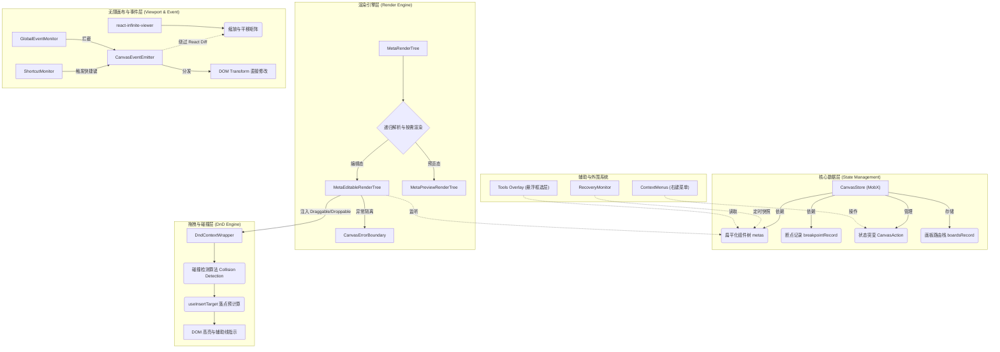

# CanvasPro 核心架构技术总结文档

**CanvasPro** 是由我个人独立从零设计并研发的一套高性能无代码画布架构，致力于解决复杂组件树的渲染性能、复杂的拖拽交互、以及画布无限缩放/平移等一系列无代码/低代码平台的核心难题。

本文档将从整体架构、核心模块设计、关键链路实现以及重点与难点（Performance & Architecture Challenges）四个维度，深度剖析 CanvasPro 的架构设计。

---

## 1. 整体架构概览

CanvasPro 的整体架构在设计上遵循 **状态与视图解耦**、**按需渲染**、**事件驱动分层** 的理念。



- **核心状态驱动 (State Management)**：基于 **MobX** (`mobx-react`) 构建核心状态库 `CanvasStore`。所有页面组件数据（`metas`）、画板路由（`boards`）、选中状态、断点信息等均收敛于此。
- **渲染引擎 (Render Engine)**：基于 React 递归渲染，通过 `MetaRenderTree` 动态解析元数据并生成真实的 DOM 节点。
- **拖拽引擎 (DnD Engine)**：基于 `@dnd-kit/core` 二次封装，提供了组件级别的拖拽节点映射。
- **无限画布 (Infinite Viewport)**：基于 `react-infinite-viewer`，结合自定义的全局事件总线，实现画布丝滑的平移与缩放。

---

## 2. 核心模块与设计细节

为了支撑无代码平台的极高复杂度，我在 CanvasPro 的底层架构中拆分了大量的独立子系统与 Hooks。以下是核心模块的深入解析：

### 2.1 状态管理：平面化与响应式 (CanvasStore)
在无代码应用中，组件树的层级往往极其深邃。若采用传统的 React Context 或纯层级 State，任何叶子节点的修改都会引发自顶向下的重渲染。
- **结构解耦的强类型分层**：在 `CanvasStore/types/index.ts` 中，Store 被严格划分为 `CanvasState` (核心源数据)、`CanvasComputedState` (派生与缓存数据，如 `metaByComponentId` 索引字典) 以及 `CanvasAction` (状态突变接口)。
- **平面化存储 (Flattening)**：组件树被扁平化，以 `id` 为键存放在 `Record<Meta['id'], Meta>` (`metas`) 中，彻底避免了深度嵌套引发的更新困难。
- **精确粒度订阅 (Granular Reactivity)**：结合底层通用的 `memoWithObserver` 高阶组件。通过闭包按需读取具体的 Meta 数据，只有当该 Meta 对应的数据变更时，才会触发对应 DOM 的 Re-render。

### 2.2 渲染树引擎 (MetaRenderTree & Hooks)
渲染树是画布的“血肉”。入口通过传入 `rootId` 开始，进行组件级别的递归渲染。

**引擎层渲染策略与虚拟化伪代码示例：**
```tsx
const childTrees = useMemo(() => {
  if (!childMetas || !childMetas.length) {
    return <MetaPlaceholder meta={meta} />;
  }
  return map(childMetas, (childMeta) => (
    <MetaEditableRenderTree meta={childMeta} key={childMeta.id} />
  ));
}, [childMetas, meta]);

// 核心：基于可视区进行裁剪
const showShadow = useMemo(() => {
  if (isForceVisible) return false;
  return isOutOfView && type !== CONDITIONAL_VIEW; // 如果越界则显示 Shadow 占位
}, [isOutOfView, isForceVisible]);

if (showShadow) {
  return <MetaShadow size={sizeRef.current} />;
}
```

### 2.3 无限视口与高性能事件 (Viewport & EventEmitter)
画布场景下，缩放和平移是最高频的操作。如果在这一层频繁修改 React State，会导致整个画布（几千个节点）进入 Diff 流程。

**完全绕过 VDOM 的处理思路**：
```typescript
// 触发缩放时，不调用 setState，而是通过全局单例的 EventBus 抛出
const onZoomIn = useCallback(() => {
  const newZoom = getViewportLegalZoom(curZoom + rate);
  // 这里直接操作闭包事件，原生修改 DOM Transform！
  CanvasEventEmitter.emit(CanvasEmitterEventType.VIEWPORT_SET_ZOOM, newZoom);
}, []);
```
- 通过 `CanvasEventEmitter.emit` 分发事件，单例闭包直接截获并修改底层节点 Transform 矩阵，保障了 60fps 的交互体验。

### 2.4 独立的高亮与辅助线层 (Tools Overlay)
为了防止业务组件被画布的编辑器状态污染，所有的选中高亮（Select）、悬浮边框（Hover）、以及拖拽插入的辅助线（InsertGuideLine），均被抽离至 `Tools/views` 下独立渲染。它们通过绝对定位浮于渲染树之上，监听 Store 中的 `selectedMetaIds` 进行坐标跟随。

### 2.5 事件监控与快捷键系统 (Shortcut Monitor)
利用 `ShortcutMonitor` 在全局顶层拦截键盘事件。无论是复制（Cmd+C）、粘贴（Cmd+V）、撤销重做（Cmd+Z），还是利用方向键微调绝对定位元素，都在该系统内统一转化为 `CanvasAction`，防止浏览器的默认行为与画布内部逻辑发生冲突。

### 2.6 组件元数据转译管道 (Transpile Pipeline)
不同类型的组件拥有不同的 Schema 结构。在 `useTranspile` 系列钩子中（如 `useListViewTranspile`、`usePageTranspile`），服务端下发的基础 JSON 会根据当前的视口断点（Breakpoint）被动态转译成标准的 `Meta` 数据结构，确保运行时数据格式的绝对统一。

### 2.7 多层级画板路由栈 (Boards & Routing)
无代码搭建经常需要“下钻”编辑（例如双击一个列表组件，进入列表项的独立编辑环境）。通过维护 `boardsRecord` 路由栈，画布支持无缝的上下文切换。每个 Board 记录了当前的 `componentId` 和 `viewConfig`，退出时可以完美回放至上一级视角。

### 2.8 动态上下文菜单体系 (Context Menu System)
封装了 `MetaContextMenu` 与 `PageContextMenu`，在用户右键点击不同节点时，通过计算触发位置的 DOM Dataset 信息，动态唤起菜单。支持基于当前组件类型呈现不同的操作项（如：对列表触发绑定数据源、对普通容器触发组合/拆解）。

### 2.9 异步组件与渲染沙箱 (Canvas Error Boundary)
无代码平台中的配置数据常常存在脏数据。通过在树节点的特定层级包裹 `CanvasErrorBoundary`，一旦某个子组件因为异常参数崩溃，错误边界会将其捕获并渲染为错误提示块（ErrorTips），确保整个画布进程不会“白屏死亡”。

### 2.10 响应式与变体样式合成 (Responsive & Variants)
通过 `useComputedMetaStyles` Hook，在渲染管线中实时对基础样式（Styles）和变体样式（Variants）进行深度合并（`mergeDeep`）。当用户切换画布断点时，对应的变体属性会无缝覆盖原有属性，完美还原 CSS 媒体查询的效果。

### 2.11 只读模式与沙箱拦截 (Readonly & Permission)
通过底层的 `ReadonlyMonitor` 与状态树的 `readonly` 标识，可以在查看历史版本、无权限访问时，彻底锁死拖拽引擎（设置 Dnd 为 disabled）、拦截双击以及右键菜单，实现查看与编辑态的同构复用。

### 2.12 拖拽物料抽象与起源判定 (Drag Origin Calculation)
并非所有的拖拽行为都是相同的。在 `useDraggableConfig` 中，系统会根据组件的 CSS 定位属性预计算出 `DragOrigin`：
- 若为绝对定位（Absolute/Fixed），则为自由移动（`ABS_OR_FIXED_MOVE`）。
- 若为标准文档流，则判定为弹性流式排序（`FLEX_SORT`）或跨层级拖拽（`CROSS_LEVEL`）。

### 2.13 批量选取与框选机制 (Canvas Selecto)
深度整合了 `Selecto.js`，用户在画布空白处拖动鼠标可拉出多选框。通过几何交集算法匹配节点坐标，将多选的 ID 批量写入 `selectedMetaConfigs`，实现对多个组件的一键群组、统一修改样式或批量删除。

---

## 3. 重点与难点突破 (Key Challenges & Solutions)

在开发过程中，我成功攻克了以下几个业界公认的“无代码画布难题”：

### 难点 1：巨型 DOM 树下的渲染性能 (Visibility Optimization)
**场景**：当用户搭建了上千个组件，画布渲染将变得极其卡顿，拖拽也会存在巨大的延迟。
**解法**：**视口外节点裁剪（虚拟化画布）**。
- 在 `MetaEditableRenderTree` 中，深度应用了 `useMetaVisibilityState` 技术。
- 采用 `startTransition` 降级判断优先级。基于底层的 `IntersectionObserver` 监控元素的交叉状态。如果为 `isOutOfView`（不在可视区），就立刻**斩断子树的递归渲染**。
- 为了防止剔除渲染导致父容器塌陷，利用闭包中的 `sizeRef` 记录退出可视区前的宽高，并用 `MetaShadow` 组件去撑开原本的骨架尺寸。这使得滚动条和内部定位完全不会错乱。

### 难点 2：极其复杂的协同与撤销重做 (Diff Apply)
**场景**：多人协同编辑或 Undo/Redo 时，全量替换 Meta 树代价极其高昂，会导致焦点丢失。
**解法**：**细粒度 Diff 补丁分发机制 (`useDiffApply`)**。
- 单独抽象了 `useDiffApply` 机制作为增量构建引擎。服务端传入的并非整棵树，而是属性操作快照（如 `operation: 'add'`）。

**基于 MobX 事务的无闪烁补丁机制**：
```typescript
// useAddOrDeleteComponentDiffApply.ts 中处理 Add 补丁
case 'add': {
  // 1. 获取最新的组件描述信息
  const targetComponent = getComponent(id);
  // 2. Transpile转译器：将原始 Schema 翻译为 Meta 对象
  const pendingTasks = map(canvasStore.breakpoints, (bp) => transpile(targetComponent, bp));
  const metas = await Promise.all(pendingTasks);
  
  // 3. 通过 transaction 将生成的 metas 直接打入 Store 字典中
  return async () => {
    transaction(() => {
      forEach(metas, (newMeta) => {
        canvasStore.addMeta(newMeta);
      });
    });
  };
}
```
- 通过底层事务同步打入状态字典，彻底杜绝了状态不同步引发的白屏与闪烁。

### 难点 3：多维度灾难恢复机制 (Crash Recovery)
**场景**：浏览器内存溢出（OOM）或网络异常退出，会导致用户数小时心血付之东流。
**解法**：**低廉成本的本地快照容灾**。
- 采用了 `useRecoveryRecord` 机制，这套代码深埋在核心链路外。
- 以极低的性能损耗，通过 `ahooks` 的 `useLocalStorageState` 定期对关键状态（Metas、Viewport等）序列化并写入 LocalStorage。
- 重启时平台通过 `RecoveryMonitor` 捕获上次遗留的数据碎片，并无缝重载恢复。

### 难点 4：拖拽的自由度与严谨性 (DnD Collision & Insert Target)
**场景**：组件间嵌套规则复杂（如模态框内不允许插入页面组件），需要灵活处理 Drop 边界与精准高亮框。
**解法**：**极致解耦的碰撞算法引擎**。
- 拖拽事件 `Listeners` 完全与业务组件解耦。组件仅仅透传自身的 `id`，真正的碰撞检测（Collision Detection）由顶层的 `DndContextWrapper` 统一代理结算。
- `useInsertTarget` 预计算落点（基于鼠标指针矩阵的偏移量计算出上插、下插、内嵌），实时派发事件渲染 `DropHighlight` 或特定的虚线占位符。这保证了底层组件依然纯净无副作用，拖拽体感极其丝滑严谨。

---

## 4. 总结

CanvasPro 是一套**工程化成熟、深思熟虑度极高**的前端基石架构。它通过 **MobX 扁平化数据** 解决了状态层级深的痛点，通过 **视区不可见裁剪 (Out-of-view Pruning)** 解决了巨量组件渲染的性能瓶颈，再结合 **基于事件总线的矩阵操作** 与 **细粒度的 Diff 同步机制**，最终打造出了一个具备极客级协同能力、无限拓展视野且交互极致顺滑的无代码基座。
