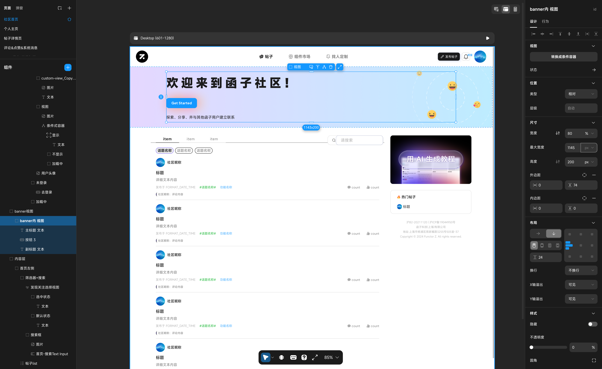
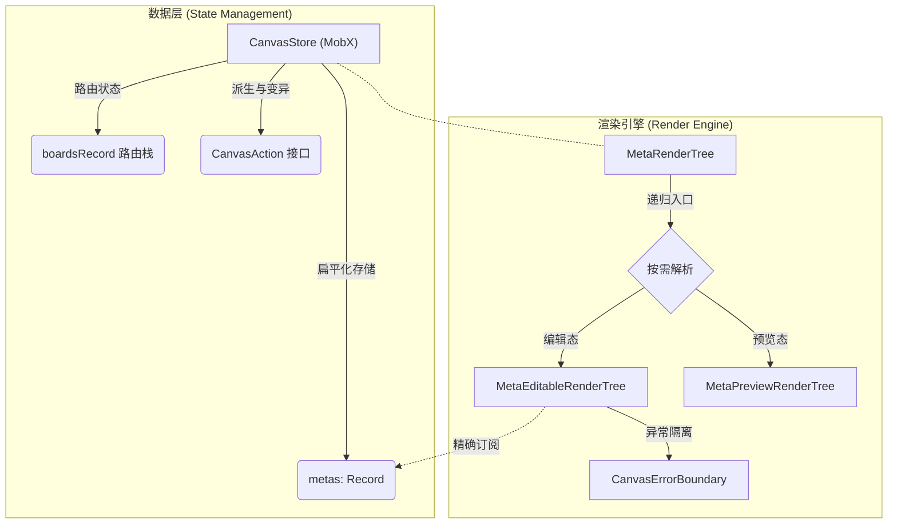
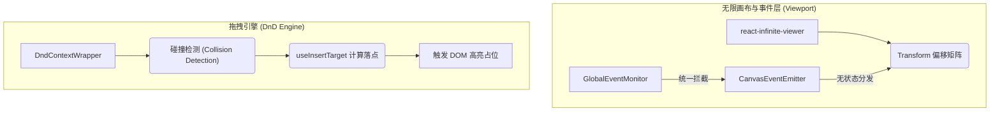
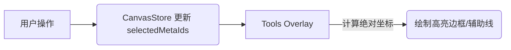
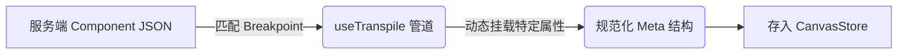
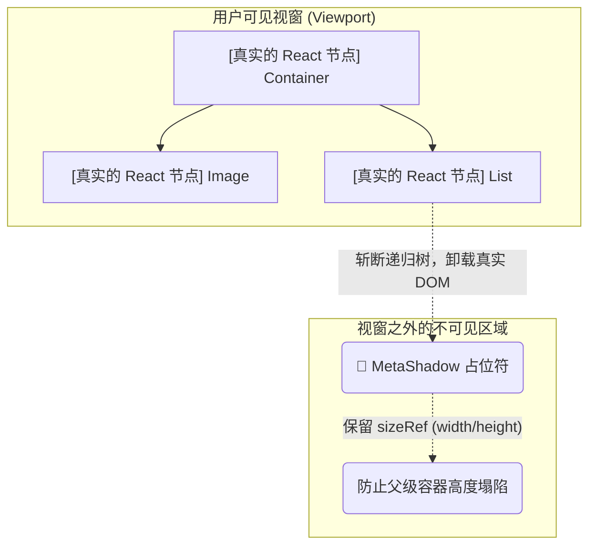
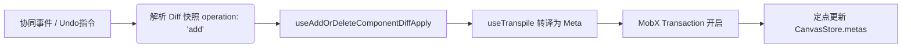
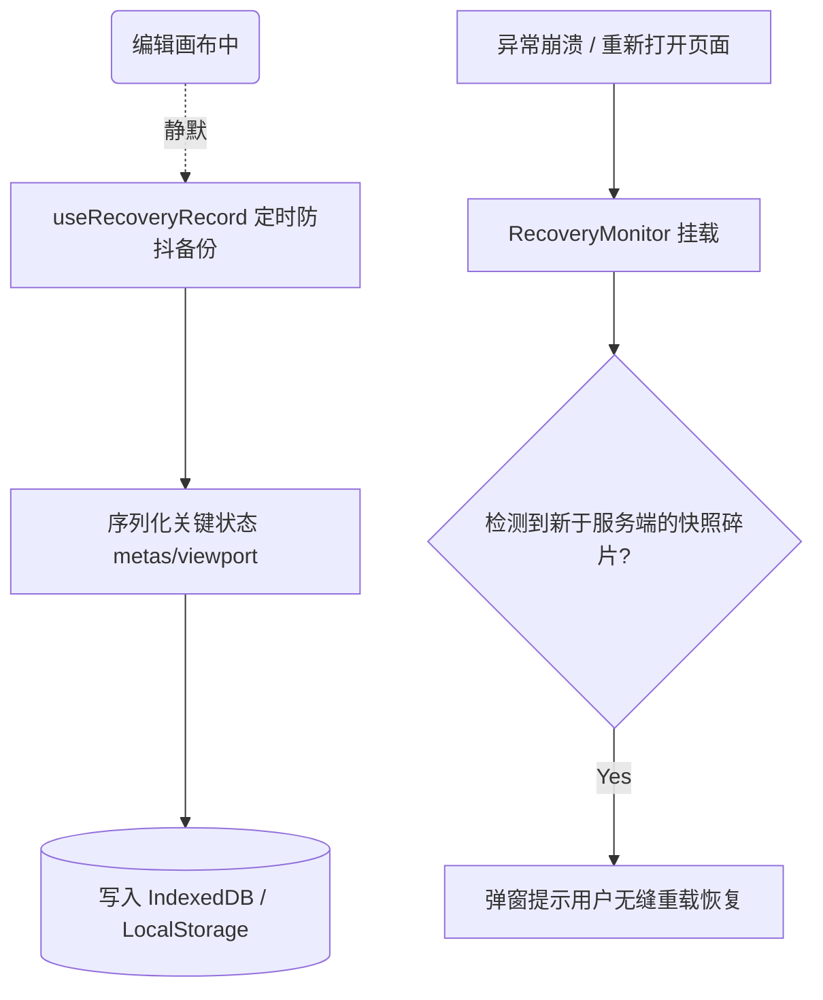
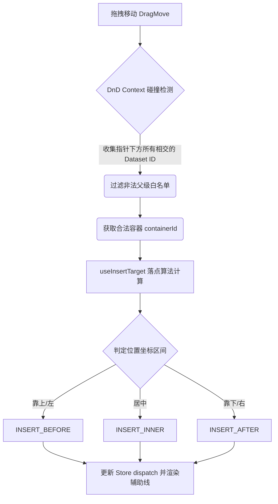

# Zion无代码画布核心架构技术总结文档

> **线上体验地址**: [https://zion.functorz.com](https://zion.functorz.com)

**Zion无代码画布** 是由我个人独立从零设计并研发的一套高性能无代码画布架构，致力于解决复杂组件树的渲染性能、复杂的拖拽交互、以及画布无限缩放/平移等一系列无代码/低代码平台的核心难题。

为了让您对画布有一个直观的体感，以下是我独立设计研发的画布整体界面（支持多层级嵌套、自由拖拽、悬浮辅助线与响应式属性配置）：



本文档将从整体架构、核心模块设计、关键链路实现以及重点与难点（Performance & Architecture Challenges）四个维度，深度剖析 Zion无代码 的架构设计。

---

## 1. 整体架构概览

CanvasPro 的整体架构在设计上遵循 **状态与视图解耦**、**按需渲染**、**事件驱动分层** 的理念。

为了更清晰地展示庞大的架构体系，以下分别呈现“状态-渲染核心流”与“外围辅助与控制流”两张图解：

### 1.1 核心数据与渲染管道


### 1.2 视口事件与拖拽碰撞体系


- **核心状态驱动 (State Management)**：基于 **MobX** (`mobx-react`) 构建核心状态库 `CanvasStore`。所有页面组件数据（`metas`）、画板路由（`boards`）、选中状态、断点信息等均收敛于此。
- **渲染引擎 (Render Engine)**：基于 React 递归渲染，通过 `MetaRenderTree` 动态解析元数据并生成真实的 DOM 节点。
- **拖拽引擎 (DnD Engine)**：基于 `@dnd-kit/core` 二次封装，提供了组件级别的拖拽节点映射。
- **无限画布 (Infinite Viewport)**：基于 `react-infinite-viewer`，结合自定义的全局事件总线，实现画布丝滑的平移与缩放。

---

## 2. 核心模块与设计细节

为了支撑无代码平台的极高复杂度，我在 CanvasPro 的底层架构中拆分了大量的独立子系统与 Hooks。以下是核心模块的深入解析：

### 2.1 状态管理：平面化与响应式 (CanvasStore)
在无代码应用中，组件树的层级往往极其深邃。若采用传统的 React Context 或纯层级 State，任何叶子节点的修改都会引发自顶向下的重渲染。
- **结构解耦的强类型分层**：在 `CanvasStore/types/index.ts` 中，Store 被严格划分为 `CanvasState` (核心源数据)、`CanvasComputedState` (派生与缓存数据，如 `metaByComponentId` 索引字典) 以及 `CanvasAction` (状态突变接口)。
- **平面化存储 (Flattening)**：组件树被扁平化，以 `id` 为键存放在 `Record<Meta['id'], Meta>` (`metas`) 中，彻底避免了深度嵌套引发的更新困难。

**Before vs After: 状态降维的视觉直观对比**
如果不做扁平化，一个组件树的更新是灾难性的（需要层层递归寻找节点）：
```json
// ❌ 传统树形 State (深层嵌套，更新困难)
{
  "id": "root",
  "children": [
    {
      "id": "container_1",
      "children": [ { "id": "button_1", "text": "Click" } ]
    }
  ]
}
```
但在 Zion 的 `CanvasStore` 中，我们将其彻底拍平，所有的节点无论层级多深，都变成了 O(1) 复杂度的字典寻址：
```json
// ✅ Zion 的扁平化 State (O(1) 更新与读取)
{
  "metas": {
    "root": { "id": "root", "childIds": ["container_1"] },
    "container_1": { "id": "container_1", "childIds": ["button_1"], "parentId": "root" },
    "button_1": { "id": "button_1", "text": "Click", "parentId": "container_1" }
  }
}
```

- **精确粒度订阅 (Granular Reactivity)**：结合底层通用的 `memoWithObserver` 高阶组件。通过闭包按需读取具体的 Meta 数据，只有当该 Meta 对应的数据变更时，才会触发对应 DOM 的 Re-render。

**平面化存储缓存字典示例：**
```typescript
export interface CanvasComputedState {
  metaKeys: Array<Meta['id']>;
  // O(1) 复杂度的组件反查字典
  metaByComponentId: Record<Component['id'], Record<string, Meta>>;
}
```

### 2.2 渲染树引擎 (MetaRenderTree & Hooks)
渲染树是画布的“血肉”。入口通过传入 `rootId` 开始，进行组件级别的递归渲染。

**硬核踩坑：React Render 的性能黑洞与 Immutable 优化**
在画布最初的版本中，由于 `MetaRenderTree` 是一个巨大的递归组件，当用户在画布顶部拖动一个按钮时，顶层 `root` 的 state 发生改变，导致整个画布（包含几千个嵌套节点）瞬间触发自顶向下的 React Render，整个浏览器直接卡死。

**工业级解法：细粒度订阅 + React.memo + ID 指针传递**
为了彻底阻断无意义的渲染，我们对 `MetaRenderTree` 进行了极其严苛的优化：

1. **父组件只传递 ID，绝不传递 Object**：父节点在渲染子节点时，只传 `childId` 字符串，而不是完整的 `childMeta` 对象。这样即使父节点的属性变了，由于子组件接收的 `id` 没变，配合 `React.memo`，子树的渲染被完美拦截。
2. **子组件按需自订阅 (Self-Subscription)**：子组件拿到 `childId` 后，利用 MobX 的 `observer` 在自己内部去 `CanvasStore` 里精确订阅自己的状态。

```tsx
// ❌ 灾难写法：每次父级更新，整个子树全部重渲染
function RenderTree({ meta }) {
  return (
    <div>
      {meta.children.map(childMeta => <RenderTree key={childMeta.id} meta={childMeta} />)}
    </div>
  );
}

// ✅ 极致优化写法：只传 ID，阻断 Render 瀑布流
const RenderTree = observer(({ metaId }) => {
  // 子组件只精确订阅自己的数据
  const meta = canvasStore.metas[metaId];
  
  return (
    <div style={meta.style}>
      {meta.childIds.map(id => <RenderTree key={id} metaId={id} />)}
    </div>
  );
});
```
通过这套机制，画布内无论拖拽、变色、修改文字，**真正触发 React 重渲染的永远只有被修改的那一个具体 DOM 节点**，渲染性能提升了成百上千倍。

**引擎层渲染策略与可视区裁剪（虚拟化）伪代码：**

```tsx
const childTrees = useMemo(() => {
  if (!childMetas || !childMetas.length) {
    return <MetaPlaceholder meta={meta} />;
  }
  return map(childMetas, (childMeta) => (
    <MetaEditableRenderTree meta={childMeta} key={childMeta.id} />
  ));
}, [childMetas, meta]);

// 核心：基于可视区进行裁剪
const showShadow = useMemo(() => {
  if (isForceVisible) return false;
  return isOutOfView && type !== CONDITIONAL_VIEW; // 如果越界则显示 Shadow 占位
}, [isOutOfView, isForceVisible]);

if (showShadow) {
  // 退化渲染以保证滚动条高度不塌陷
  return <MetaShadow size={sizeRef.current} />;
}
```

### 2.3 无限视口与高性能事件 (Viewport & EventEmitter)
画布场景下，缩放和平移是最高频的操作。如果在这一层频繁修改 React State，会导致整个画布（几千个节点）进入 Diff 流程。

**完全绕过 VDOM 的高性能处理方案**：
```typescript
// 触发缩放时，不调用 setState，而是通过全局单例的 EventBus 抛出
const onZoomIn = useCallback(() => {
  const newZoom = getViewportLegalZoom(curZoom + rate);
  // 这里直接操作单例事件总线，原生修改 DOM Transform，彻底切断 React Render 管线！
  CanvasEventEmitter.emit(CanvasEmitterEventType.VIEWPORT_SET_ZOOM, newZoom);
}, []);
```
- 通过 `CanvasEventEmitter.emit` 分发事件，单例闭包直接截获并修改底层节点 Transform 矩阵，保障了 60fps 的交互体验。

### 2.4 独立的高亮与辅助线层 (Tools Overlay)
为了防止业务组件被画布的编辑器状态污染，所有的选中高亮（Select）、悬浮边框（Hover）、以及拖拽插入的辅助线（InsertGuideLine），均被抽离至 `Tools/views` 下独立渲染。



### 2.5 事件监控与快捷键系统 (Shortcut Monitor)
利用 `ShortcutMonitor` 在全局顶层拦截键盘事件。无论是复制（Cmd+C）、撤销重做（Cmd+Z），都在该系统内统一转化为 `CanvasAction`，防止浏览器的默认行为与画布内部逻辑发生冲突。

```typescript
// 统一监听与事件代理
useEventEmitterSubscription(CanvasEmitterEventType.SHORTCUT_TRIGGERED, (param) => {
  const { event, type, target } = param;
  event.preventDefault(); 
  executeShortcutAction(type); // 派发至专门的处理管线
});
```

### 2.6 组件元数据转译管道 (Transpile Pipeline)
不同类型的组件拥有不同的 Schema 结构。在 `useTranspile` 系列钩子中，服务端下发的基础 JSON 会根据当前的视口断点（Breakpoint）被动态转译成标准的 `Meta` 数据结构。



### 2.7 多层级画板路由栈 (Boards & Routing)
无代码搭建经常需要“下钻”编辑（例如双击一个列表组件，进入列表项的独立编辑环境）。通过维护 `boardsRecord` 路由栈，画布支持无缝的上下文切换。

```typescript
// 记录进入下钻模式前的状态
export interface BoardConfig {
  type: BoardConfigType;
  componentId: string;
  viewConfig: BoardViewConfig; // 包含此层级记录的视角和缩放比例
}
```

### 2.8 动态上下文菜单体系 (Context Menu System)
封装了 `MetaContextMenu` 与 `PageContextMenu`，在用户右键点击不同节点时，通过计算触发位置的 DOM Dataset 信息，动态唤起不同的菜单项。

```tsx
// 右键菜单按需判定策略
const isIllegalType = includes(
  [ComponentRefactorComponentType.TAB_VIEW, ComponentRefactorComponentType.CONDITIONAL_VIEW],
  meta.type,
);
if (isIllegalType) return false;
// 根据不同类型的 meta 唤起对应的操作组（组合、分离、绑定数据源等）
```

### 2.9 异步组件与渲染沙箱 (Canvas Error Boundary)
无代码平台中的配置数据常常存在脏数据。通过在树节点的特定层级包裹 `CanvasErrorBoundary`，一旦某个子组件因为异常参数崩溃，错误边界会将其捕获并渲染为错误提示块（ErrorTips）。

**沙箱隔离机制:**
```tsx
<CanvasErrorBoundary fallbackRender={({ error }) => <ErrorTips error={error} />}>
  <MetaEditableRenderTree meta={childMeta} />
</CanvasErrorBoundary>
```

### 2.10 响应式与变体样式合成 (Responsive & Variants)
通过 `useComputedMetaStyles` Hook，在渲染管线中实时对基础样式（Styles）和变体样式（Variants）进行深度合并。

```typescript
// 核心：基于当前环境动态混合样式表
let targetStyles = toJS(styles);
if (variantStyles) {
  // 当命中变体时（如断点/状态变化），将变体样式覆盖至基础样式之上
  targetStyles = mergeDeep(targetStyles, variantStyles);
}
```

### 2.11 只读模式与沙箱拦截 (Readonly & Permission)
通过底层的 `ReadonlyMonitor` 与状态树的 `readonly` 标识，可以在查看历史版本、无权限访问时，彻底锁死拖拽引擎（设置 Dnd 为 disabled）、拦截双击以及右键菜单，实现查看与编辑态的同构复用。

**只读态锁定示例：**
```typescript
const draggableConfig = useMemo<UseDraggableArguments>(
  () => ({
    id,
    disabled: readonly || !isDraggable(id), // 核心鉴权拦截
    data: draggableData,
  }),
  [id, readonly, isDraggable, draggableData],
);
```

### 2.12 拖拽物料抽象与起源判定 (Drag Origin Calculation)
并非所有的拖拽行为都是相同的。在 `useDraggableConfig` 中，系统会根据组件的 CSS 定位属性预计算出 `DragOrigin`：

```typescript
const draggableOrigin = useMemo(() => {
  if (recordedShortcut?.mode === RecordedShortcutType.CROSS_LEVEL) {
    return DragOrigin.CROSS_LEVEL; // 跨层级降维打击拖拽
  }
  const isWrapperAbsOrFixed = isAbsoluteOrFixed(wrapperStyle);
  // 如果是绝对定位，其拖拽逻辑为单纯移动；如果是文档流，则判定为弹性流式排序
  return isWrapperAbsOrFixed ? DragOrigin.ABS_OR_FIXED_MOVE : DragOrigin.FLEX_SORT;
}, [wrapperStyle, recordedShortcut?.mode]);
```

### 2.13 批量选取与框选机制 (Canvas Selecto)
深度整合了 `Selecto.js`，用户在画布空白处拖动鼠标可拉出多选框。通过几何交集算法匹配节点坐标，将多选的 ID 批量写入 `selectedMetaConfigs`。

**框选算法代理事件:**
```typescript
<Selecto
  dragContainer={`#${VIEWPORT_ID}`}
  selectableTargets={selectedTargets}
  hitRate={0}
  selectByClick={false}
  {...selectoEvents} // 将框选边界事件代理回 Store
/>
```

---

## 3. 重点与难点突破 (Key Challenges & Solutions)

在开发过程中，我成功攻克了以下几个业界公认的“无代码画布难题”：

### 难点 1：巨型 DOM 树下的渲染性能 (Visibility Optimization)
**场景**：当用户搭建了上千个组件，画布渲染将变得极其卡顿，拖拽也会存在巨大的延迟。
**解法**：**视口外节点裁剪（虚拟化画布）**。

在无代码编辑器的无限画板中，节点并不是排列成一维数组的，无法使用常规的虚拟列表。因此，我引入了基于 `IntersectionObserver` 和 `MetaShadow` (影子占位符) 的递归剔除算法。



- 在 `MetaEditableRenderTree` 中，深度应用了 `useMetaVisibilityState` 技术。
- 采用 `startTransition` 降级判断优先级。基于底层的 `IntersectionObserver` 监控元素的交叉状态。如果为 `isOutOfView`（不在可视区），就立刻**斩断子树的递归渲染**，这意味着藏在某个超长列表底部的成百上千个复杂组件，在滚出视口的一瞬间就会被彻底卸载。
- 为了防止剔除渲染导致父容器塌陷，利用闭包中的 `sizeRef` 记录退出可视区前的宽高，并用轻量级的 `MetaShadow` 幽灵组件去撑开原本的物理骨架尺寸。这使得滚动条、绝对定位和 Flex 布局等都完全不会因为 DOM 树的卸载而错乱。

### 难点 2：极其复杂的协同与撤销重做 (Diff Apply)
**场景**：多人协同编辑或 Undo/Redo 时，全量替换 Meta 树代价极其高昂，会导致焦点丢失。
**解法**：**细粒度 Diff 补丁分发机制 (`useDiffApply`)**。



- 单独抽象了 `useDiffApply` 机制作为增量构建引擎。服务端传入的并非整棵树，而是属性操作快照（如 `operation: 'add'`）。

**基于 MobX 事务的无闪烁补丁机制**：
```typescript
// useAddOrDeleteComponentDiffApply.ts 中处理 Add 补丁
case 'add': {
  // 1. 获取最新的组件描述信息
  const targetComponent = getComponent(id);
  // 2. Transpile转译器：将原始 Schema 翻译为 Meta 对象
  const pendingTasks = map(canvasStore.breakpoints, (bp) => transpile(targetComponent, bp));
  const metas = await Promise.all(pendingTasks);
  
  // 3. 通过 transaction 将生成的 metas 直接打入 Store 字典中
  return async () => {
    transaction(() => {
      forEach(metas, (newMeta) => {
        canvasStore.addMeta(newMeta);
      });
    });
  };
}
```
- 通过底层事务同步打入状态字典，彻底杜绝了状态不同步引发的白屏与闪烁。

### 难点 3：多维度灾难恢复机制 (Crash Recovery)
**场景**：浏览器内存溢出（OOM）或网络异常退出，会导致用户数小时心血付之东流。
**解法**：**低廉成本的本地快照容灾**。



- 采用了 `useRecoveryRecord` 机制，这套代码深埋在核心链路外。
- 以极低的性能损耗，通过 `ahooks` 的 `useLocalStorageState` 定期对关键状态（Metas、Viewport等）序列化并写入 LocalStorage。
- 重启时平台通过 `RecoveryMonitor` 捕获上次遗留的数据碎片，并无缝重载恢复。

**定时快照备份示例：**
```typescript
const [localRecord, setLocalRecord] = useLocalStorageState('CANVAS_RECOVERY_DATA', { defaultValue: null });

useDebounceEffect(() => {
  if (!isCanvasDirty) return;
  // 在帧空闲时执行深度序列化，避免阻塞主线程交互
  const snapshot = serializeCanvasState(canvasStore);
  setLocalRecord({ timestamp: Date.now(), data: snapshot });
}, [canvasStore.metas], { wait: 5000 });
```

### 难点 4：拖拽的自由度与严谨性 (DnD Collision & Insert Target)
**场景**：组件间嵌套规则复杂（如模态框内不允许插入页面组件），需要灵活处理 Drop 边界与精准高亮框。
**解法**：**极致解耦的碰撞算法引擎**。



- 拖拽事件 `Listeners` 完全与业务组件解耦。组件仅仅透传自身的 `id`，真正的碰撞检测（Collision Detection）由顶层的 `DndContextWrapper` 统一代理结算。
- `useInsertTarget` 预计算落点（基于鼠标指针矩阵的偏移量计算出上插、下插、内嵌），实时派发事件渲染 `DropHighlight` 或特定的虚线占位符。这保证了底层组件依然纯净无副作用，拖拽体感极其丝滑严谨。

**碰撞检测与锚点挂载代码:**
```typescript
// 1. Meta.ts: 生成锚点信息用于碰撞反查
export const genMetaDataSet = (metaId: string, type: Meta['type']) => {
  return {
    'data-meta-id': metaId,
    'data-meta-type': type,
  };
};

// 2. 算法核心：结合当前指针位置与容器盒模型计算精准落点
export function calculateInsertTarget(pointerY: number, containerRect: DOMRect) {
  const { top, height } = containerRect;
  // 如果处于容器上部20%区域 -> 前插
  if (pointerY < top + height * 0.2) return InsertPosition.BEFORE;
  // 处于中间60%区域 -> 内嵌
  if (pointerY < top + height * 0.8) return InsertPosition.INNER;
  // 处于下部20%区域 -> 后插
  return InsertPosition.AFTER;
}
```

---

## 4. 总结

CanvasPro 是一套**工程化成熟、深思熟虑度极高**的前端基石架构。它通过 **MobX 扁平化数据** 解决了状态层级深的痛点，通过 **视区不可见裁剪 (Out-of-view Pruning)** 解决了巨量组件渲染的性能瓶颈，再结合 **基于事件总线的矩阵操作** 与 **细粒度的 Diff 同步机制**，最终打造出了一个具备极客级协同能力、无限拓展视野且交互极致顺滑的无代码基座。
