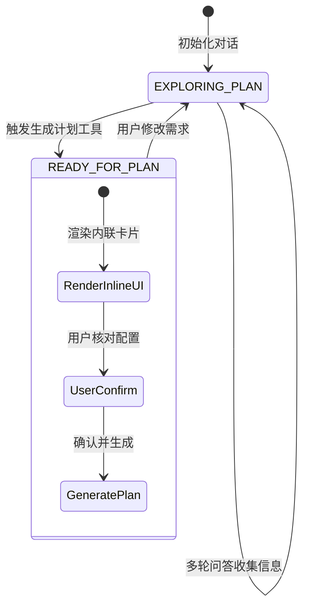
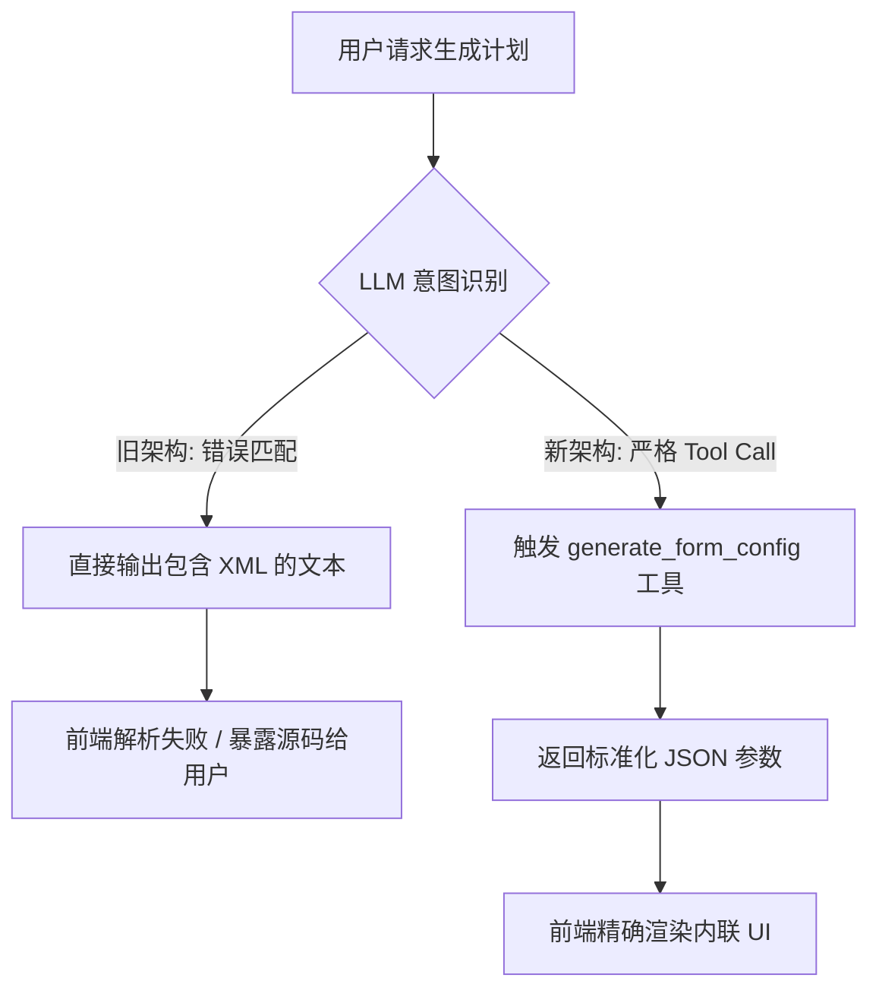
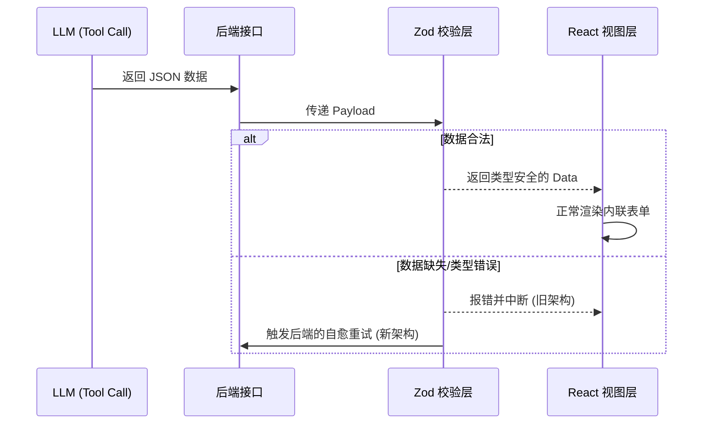

# AI 学习助手架构设计与问题解决记录

本文档记录了 AI 学习助手在开发过程中遇到的核心架构问题、重构原因及最终的解决方案。内容以实际工程问题为导向，说明各项设计的意图与收益。

---

## 0. 业务需求背景 (Business Context)

本项目是一个“AI 学习助手 (AI Learning Assistant)”。核心业务流程如下：

1. **需求表达**：用户通过自然语言聊天表达自己想要学习的知识、技能或目标（例如：“我想学前端开发”）。
2. **顾问式沟通**：为了保证学习计划的有效性，AI 扮演学习顾问的角色。它不会立刻盲目生成计划，而是主动向用户提问，收集制定计划所需的关键基线信息（如：当前的知识基础、每天可用的学习时间、期望的项目目标等）。
3. **定制化生成**：当关键信息收集完整后，AI 结束追问阶段，并基于收集到的精确信息，为用户生成一份高度定制化、结构化的专属学习计划。

（目前阶段需求到这里）

---

## 1. 交互架构：从弹窗表单到对话流状态机 (UX Problem)

在早期版本中，当 AI 收集完用户信息准备生成学习计划时，系统会弹出一个表单弹窗（Modal）让用户确认。这种设计切断了对话的上下文，导致体验割裂。

### 为什么这么设计

我将交互重构为基于状态机的对话流。系统维护 `EXPLORING_PLAN` 和 `READY_FOR_PLAN` 两个核心状态：

- 在 `EXPLORING_PLAN` 阶段，系统通过纯文本与用户对话，收集需求。
- 在状态切换至 `READY_FOR_PLAN` 时，前端不再弹出阻断式的表单，而是在聊天流中直接渲染内联 UI（Inline UI）组件。

### 预防了什么问题以及什么好处

- **预防的问题**：避免了模态弹窗（Modal）遮挡聊天记录，防止用户在确认计划时遗忘之前的对话上下文。
- **带来的好处**：维持了单向滚动的对话心智模型，用户交互更连贯；状态机的引入使得前端 UI 的渲染逻辑更加确定和可预测。

### 架构与流程图



---

## 2. LLM 输出控制 - 解决 XML 输出与工具调用的冲突

在集成结构化表单配置生成时，LLM 没有调用预期的 Tool（函数调用），而是直接在回复中输出了包含 `<form_config>` 的原生 XML 文本，导致前端无法渲染组件。这是一开始不熟悉工具采用的策略。也算是踩的一个很标准的坑

### 为什么这么设计

这是由于 Prompt 冲突导致的。当系统提示词（System Prompt）中包含过多的 XML 示例，且未明确界定“回复文本”与“工具调用”的边界时，LLM 会倾向于模仿示例直接输出文本。
我将架构调整为：

1. 移除 System Prompt 中容易引起误导的 XML 代码块示例。
2. 强制使用严格的 JSON Schema 定义 Tool 的参数结构。
3. 在系统级明确指令：“当需要生成配置时，必须且只能通过调用工具实现，禁止在文本中输出代码块”。

### 预防了什么问题以及什么好处

- **预防的问题**：防止前端解析器因收到混杂着 Markdown 或 XML 的非标准文本而发生正则匹配错误或解析崩溃。
- **带来的好处**：保证了前后端数据交换格式的绝对标准化（纯 JSON），解耦了 LLM 文本生成行为与系统功能触发行为。

### 架构与流程图



---

## 3. 数据校验层：Zod 运行时校验与 Schema 规范化

前端曾多次抛出 `ZodError` 导致页面白屏或崩溃。根本原因是 LLM 返回的 JSON 缺少 `required` 字段或数据类型错误（例如将文本框类型错写为 "text" 而非 "input"），而前端代码使用了 TypeScript 的类型断言（`as Type`）而非运行时校验。

### 为什么这么设计

1. **废弃类型断言**：将所有 `const data = rawData as Config` 修改为 `const data = ConfigSchema.parse(rawData)`。
2. **Schema 补齐与对齐**：在给 LLM 提供的 JSON Schema 描述中，严格对齐前端的类型枚举（如 `['input', 'select']`），并利用 Zod 的 `.parse()` 在后端强行注入 `.default(true)` 的默认值。

### 预防了什么问题以及什么好处

- **预防的问题**：TypeScript 的类型断言只在编译时有效，无法拦截运行时 LLM 生成的脏数据。此设计防止了脏数据进入视图层导致 React 渲染崩溃。
- **带来的好处**：Zod 在数据边界处提供了坚固的防护。一旦数据结构不符，会在逻辑层尽早抛出清晰的错误（Fail Fast），而不是在渲染层产生不可预知的副作用。

### 架构与流程图



---

## 4. 加入容错与自愈架构 - SSE 流中的 LLM 自动修复

当上述 Zod 校验失败或后端业务逻辑报错时，如果直接抛出 Exception，会导致 Server-Sent Events (SSE) 流断开，对话非正常中止。

### 为什么这么设计

我实现了一个基于 `while` 循环的自愈架构（Auto-Healing）。当工具调用发生错误（如必填字段缺失或格式校验失败）时，系统不抛出中断级异常，而是捕获该错误，将其包装为一条 `ToolMessage`（附带具体的错误信息）发送回 LLM。

### 预防了什么问题以及什么好处

- **预防的问题**：防止后端报错直接切断 SSE 网络连接，避免前端用户看到“网络错误”或断流的情况。
- **带来的好处**：赋予了 Agent 自我修正的能力。LLM 能够阅读自己上一次调用产生的错误日志，并在下一次迭代中输出正确格式的参数，全程对用户透明，极大地提升了系统的容错率。

### 架构与流程图

```mermaid
flowchart TD
    Start((开始)) --> CallLLM[调用 LLM]
    CallLLM --> CheckTool{是否触发 Tool?}
    CheckTool -->|否| StreamResponse[返回普通文本响应流]
    CheckTool -->|是| ExecuteTool[执行 Zod 解析与校验]

    ExecuteTool --> CheckResult{校验是否成功?}
    CheckResult -->|成功| ReturnData[返回配置并渲染 UI]

    CheckResult -->|失败 (ZodError)| WrapError[捕获异常并伪造 ToolMessage]
    WrapError --> AppendHistory[将错误信息追加到提示词上下文]
    AppendHistory -->|在同一个 SSE 流中重试| CallLLM

    ReturnData --> EndNode((结束))
    StreamResponse --> EndNode
```
