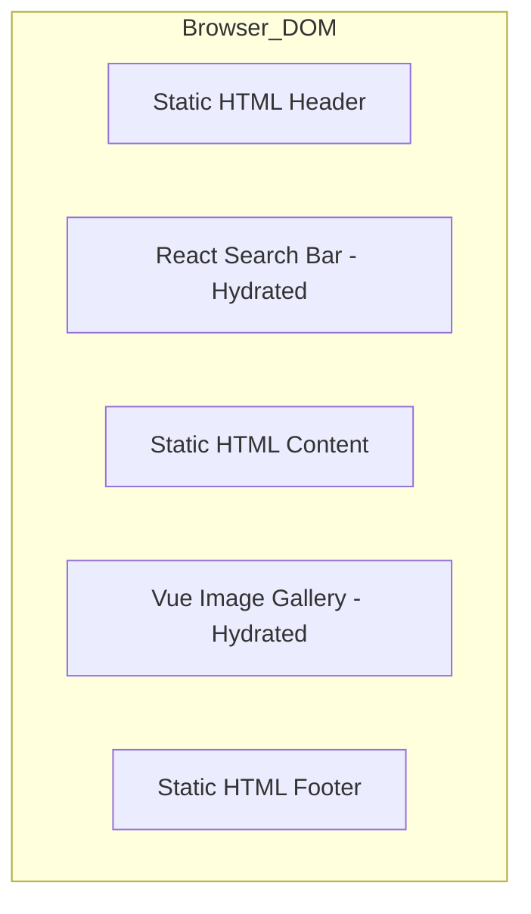

在内容驱动型网站（如博客、文档、电商）中，传统的单页应用 (SPA) 架构面临严重的性能挑战。SPA 要求客户端下载完整的框架运行时并执行全量水合 (Hydration)，这对于大部分是静态内容的页面来说是极大的资源消耗。Astro 通过 Islands 架构改变了这一现状。

## 1. 核心理念：Zero-JS By Default

Astro 默认在服务端将所有组件渲染为纯 HTML。除非开发者显式指定，否则不会向客户端发送任何 JavaScript。这种模式极大地提升了首屏加载速度，并优化了 SEO 表现。

## 2. Islands 架构与局部水合

Islands 架构（群岛架构）允许在静态的 HTML 页面中嵌入独立的交互式组件。这些组件被称为“岛屿”，它们之间相互独立，且仅在需要时才进行水合。



### 2.1 客户端指令 (Client Directives)

Astro 通过指令精准控制每个岛屿的水合时机：

* `client:load`：立即加载并水合 JS。
* `client:idle`：在浏览器空闲时加载。
* `client:visible`：仅当组件进入视口时才加载（利用 Intersection Observer）。
* `client:only`：跳过服务端渲染，仅在客户端运行。

```astro
---
// index.astro
import StaticContent from '../components/StaticContent.astro';
import InteractiveChart from '../components/InteractiveChart.jsx';
---

<StaticContent /> <!-- 渲染为纯 HTML -->

<!-- 仅当用户滚动到图表位置时，才下载 React 运行时和组件逻辑 -->
<InteractiveChart client:visible />
```

## 3. 技术细节：DOM 注入与通信

Astro 在处理岛屿时，会在 HTML 中插入特殊的自定义元素标记（如 `<astro-island>`）。这些标记包含了组件的 Props 数据和水合指令。

### 3.1 局部水合的实现

当 `client:visible` 触发时，Astro 的轻量级运行时会执行以下操作：
1. **动态导入**：通过 `import()` 加载对应的框架运行时（如 React）和组件代码。
2. **数据恢复**：从 HTML 标记中解析出序列化后的 Props。
3. **挂载**：调用框架的 `hydrate` 方法，将交互逻辑绑定到已有的 DOM 节点上。

这种方式避免了 SPA 中常见的“先清空再重新渲染”的闪烁问题，同时也减少了主线程的阻塞时间。


## 3. 业务踩坑：多框架混用下的跨岛屿通信

Islands 架构有一个天生的硬伤：**既然每个“岛屿”都是彼此独立的水合沙箱，那它们之间怎么通信？**

在传统的 SPA 中，如果顶部导航栏有一个“购物车图标”，底部有一个“加入购物车”按钮，我们通常用一个外层包裹的 `<Provider>` 或者全局的 Redux Store 来同步状态。
但在 Astro 中，包裹在它们外面的全都是冰冷的静态 HTML（Zero JS）。此时，如果“购物车图标”是用 Vue 写的，“加入购物车”按钮是用 React 写的，它们该如何对话？

### 3.1 官方推荐方案：Nano Stores

Astro 官方推荐使用 **Nano Stores** 来解决跨岛屿状态共享。这是一个极其轻量级（不到 1KB）的状态库，专为去中心化的原子化状态设计，并且原生支持 React、Vue、Svelte、Solid 等各种框架。

```javascript
// store.ts (公共状态文件)
import { atom } from 'nanostores';

export const cartCount = atom(0);
```

```tsx
// ReactButton.tsx
import { useStore } from '@nanostores/react';
import { cartCount } from '../store';

export default function ReactButton() {
  return <button onClick={() => cartCount.set(cartCount.get() + 1)}>加购</button>;
}
```

```vue
<!-- VueCart.vue -->
<script setup>
import { useStore } from '@nanostores/vue';
import { cartCount } from '../store';

const count = useStore(cartCount);
</script>

<template>
  <div class="cart">🛒 {{ count }}</div>
</template>
```

### 3.2 底层通信机制：DOM 事件代理

如果你不想引入外部状态库，最原生的做法是利用**浏览器原生的 CustomEvent**。由于所有的岛屿最终都挂载在同一个 `window` 对象下，基于 DOM 的发布订阅模式是极其稳健的后备方案。

```javascript
// React 端发送
window.dispatchEvent(new CustomEvent('cart-update', { detail: { count: 1 } }));

// Vue 端监听
window.addEventListener('cart-update', (e) => {
  count.value += e.detail.count;
});
```

**踩坑提醒**：
1. **序列化丢失**：由于 Astro 在构建时会静态序列化 Props，如果你向一个组件传递了一个函数（如 `onClick`）或者复杂的类的实例（如 `new Date()`），它在客户端水合时会报错或者变成字符串。
2. **水合时机的不一致性**：如果一个组件是 `client:load`（立刻加载），另一个组件是 `client:visible`（滚到才加载）。当事件发出时，接收方的 JS 可能根本还没下载完！所以对于跨岛通信，要么确保双方的水合指令一致，要么使用 Nano Stores 这种自带持久化或懒加载订阅机制的库。

## 4. 架构优势与边界

Astro 的核心优势在于其框架不可知 (Framework Agnostic) 的特性。你可以在同一个页面中混合使用 React、Vue、Svelte 等现代框架。


Astro 的核心优势在于其框架不可知 (Framework Agnostic) 的特性。你可以在同一个页面中混合使用 React、Vue、Svelte 等现代框架。

1. **极低的 TTI (Time to Interactive)**：由于减少了 JS 执行量，页面能更快响应用户操作。
2. **开发体验**：类 HTML 的 `.astro` 语法非常直观，同时支持现代前端的所有工程化能力。
3. **按需加载**：只为必要的交互加载 JS。

对于以内容展示为主的应用，Astro 提供的 Islands 架构是目前优化前端加载性能的有效方案。
