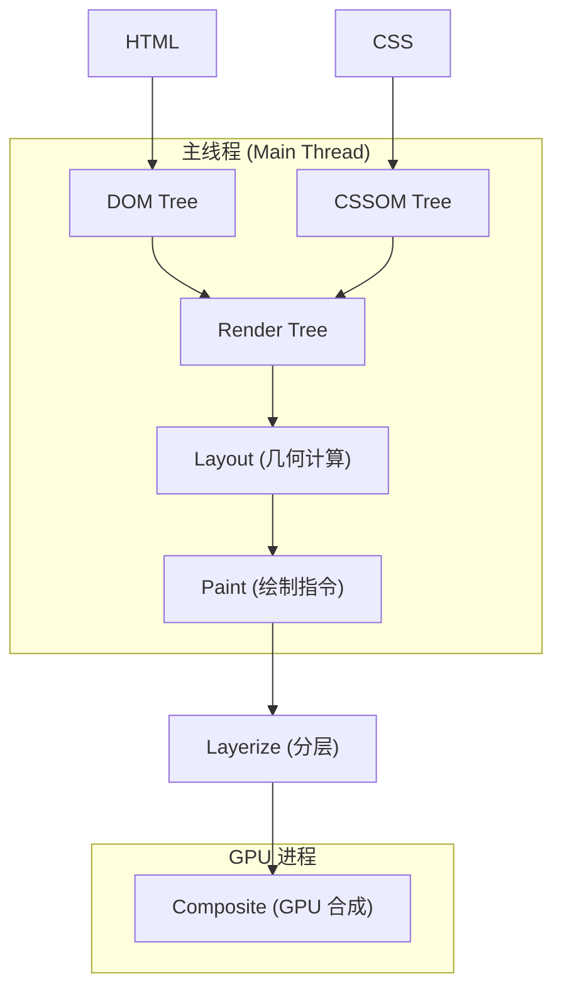

深入理解浏览器渲染管线，是进行前端性能调优和动画优化的核心前提。在现代 Web 应用中，实现 60FPS（每秒 60 帧）的动画已成为基本标准。本文将从底层架构出发，深度解析浏览器如何将 HTML/CSS 转化为屏幕上的像素，并探讨 CSS 硬件加速的本质。

## 1. 渲染管线 (Rendering Pipeline) 的核心阶段

当浏览器接收到网络层传回的资源后，渲染引擎（如 Chrome 的 Blink）会启动一条复杂的流水线。这条管线主要由以下五个核心阶段组成：

### 1.1 解析与 DOM/CSSOM 构建 (Parsing)
浏览器首先解析 HTML 字符串，构建 **DOM 树**（Document Object Model）。与此同时，解析 CSS 文件或 style 标签，构建 **CSSOM 树**（CSS Object Model）。这两个过程是并行的，但 DOM 的构建可能会被同步执行的 JavaScript 阻塞。

### 1.2 样式计算 (Style Calculation)
渲染引擎将 DOM 树和 CSSOM 树合并，计算出每个 DOM 节点的最终样式。这一步需要处理选择器匹配、层叠规则（Cascading）以及继承逻辑。最终生成的结果是 **Render Tree**（渲染树），它只包含需要显示的节点（例如 `display: none` 的节点会被剔除）。

### 1.3 布局 (Layout / Reflow)
布局阶段的任务是计算渲染树中每个节点的几何信息：位置（x, y）和尺寸（width, height）。浏览器从根节点开始遍历，根据盒模型规则确定每个元素在视口内的确切坐标。

### 1.4 绘制 (Paint)
绘制阶段并非直接输出像素，而是生成一系列**绘制指令**（如“在坐标 (10, 10) 处画一个半径为 5 的圆”）。浏览器会将页面拆分为多个图层（Layers），并为每个图层生成各自的指令列表。

### 1.5 合成 (Composite)
这是现代浏览器性能优化的关键。合成线程（Compositor Thread）将页面拆分成的图层发送给 GPU。GPU 根据这些图层及其属性（如位移、透明度），将它们“拼”在一起显示在屏幕上。



## 2. 回流 (Reflow) 与重绘 (Repaint) 的性能瓶颈

在交互过程中，修改 DOM 或 CSS 会导致管线重新执行。

*   **回流 (Reflow)**：当修改了影响几何属性的样式（如 `width`, `height`, `margin`, `top`, `border`）或读取某些属性（如 `offsetWidth`, `getComputedStyle`）时，浏览器必须重新经历 Layout -> Paint -> Composite。这是代价最高的操作，因为它可能引发整个文档的重新计算。
*   **重绘 (Repaint)**：当仅修改外观属性（如 `color`, `background-color`, `visibility`）而不影响几何位置时，浏览器跳过 Layout，直接进入 Paint 阶段。虽然比回流快，但在复杂页面中依然存在明显的 CPU 开销。

## 3. CSS 硬件加速：绕过主线程

为了实现极佳的动画性能，我们需要避开主线程的 Layout 和 Paint。这就是 **CSS 硬件加速**（GPU Acceleration）的意义所在。

### 3.1 合成层 (Compositing Layers)
当一个元素被提升为“合成层”时，它拥有独立的图形上下文。在动画过程中，如果只改变该层的合成属性（如 `transform` 或 `opacity`），浏览器只需要在合成线程中通知 GPU 重新组合这些层，而无需重新布局或重新绘制。

### 3.2 触发合成层提升的条件
以下属性会触发浏览器为元素创建独立的合成层：
1.  使用 3D 变换：`transform: translateZ(0)`, `rotate3d()` 等。
2.  使用 `will-change` 属性：显式告知浏览器该元素即将发生变化。
3.  对 `opacity`, `transform`, `filter`, `backdrop-filter` 应用 `transition` 或 `animation`。
4.  `<video>`, `<canvas>`, `<iframe>` 元素。

### 3.3 为什么 Transform 和 Opacity 如此高效？
与其他属性不同，`transform` 和 `opacity` 的处理完全发生在合成线程和 GPU 中。
*   **Transform**：GPU 只需要对已有的纹理（Texture）进行矩阵变换（Matrix Transform），这在硬件层面是极快的。
*   **Opacity**：GPU 只需要在合成时调整图层的 Alpha 通道。

```css
/* 低效方案：触发回流 */
.box-slow {
  position: absolute;
  left: 0;
  transition: left 0.3s ease;
}
.box-slow:hover {
  left: 100px; 
}

/* 高效方案：仅触发 Composite */
.box-fast {
  transform: translateX(0);
  transition: transform 0.3s cubic-bezier(0.4, 0, 0.2, 1);
  /* 提前提升为合成层，避免动态提升带来的闪烁 */
  will-change: transform; 
}
.box-fast:hover {
  transform: translateX(100px);
}
```

## 4. 进阶机制：分块 (Tiling) 与栅格化 (Rasterization)

在合成阶段之前，还有一个关键步骤：**栅格化**。
由于页面可能非常长，浏览器不会一次性绘制整个页面。合成线程会将图层划分为多个**分块 (Tiles)**（通常是 256x256 或 512x512 像素）。
1.  **栅格化**：将绘制指令转化为位图（Bitmap）的过程。
2.  **GPU 栅格化**：现代浏览器利用 GPU 的并行计算能力来加速位图的生成。
3.  **分块加载**：浏览器优先栅格化视口（Viewport）附近的块，从而实现快速首屏响应。

## 5. 业务踩坑：图层爆炸 (Layer Explosion)

很多前端开发者在学习了 CSS 硬件加速后，喜欢给所有带动画的元素加上 `transform: translateZ(0)` 或者 `will-change: transform`。这种“大力出奇迹”的做法在复杂页面中会导致灾难性的**图层爆炸**。

### 5.1 隐式合成 (Implicit Compositing) 的陷阱

当浏览器决定渲染层级时，有一个严格的规则：**如果元素 B 的 z-index 高于元素 A，且 A 是一个独立的 GPU 合成层，那么为了保证 B 依然能盖在 A 上面，浏览器会被迫把 B 也提升为一个独立的 GPU 合成层。**

设想一个常见的业务场景：
你给页面底部的一个绝对定位的背景动画加了 `will-change: transform`（创建了层 A）。
在这个背景之上，有 1000 个普通的商品列表节点（属于层 B）。
因为这 1000 个节点在 z 轴上高于背景层 A，浏览器不得不为这 1000 个节点创建 1000 个独立的 GPU 纹理！

**后果**：
- 极高的 GPU 显存占用（手机端极易引发 OOM 闪退）。
- 每次滚动时，合成线程需要处理成百上千个图层的计算，掉帧严重。

### 5.2 如何排查图层爆炸？

千万不要盲目猜测。在 Chrome DevTools 中，按下 `Cmd + Shift + P` (Mac) / `Ctrl + Shift + P` (Win)，搜索并打开 **"Show Layers"** 面板。
这里会 3D 可视化地展示当前页面的所有 GPU 图层。点击任意图层，右侧的 `Details` 会明确告诉你**它被提升为合成层的原因**（例如：`Compositing reason: Assumed to overlap a layer with a composited animation` —— 这就是典型的隐式合成受害者）。

解决方案：**给那个需要硬件加速的底层元素设置一个极高的 `z-index`（如果视觉上允许），或者将其与其他正常文档流的元素在空间上剥离开来。**

## 6. 性能优化最佳实践

1.  **区分主线程动画与合成器动画**：
    - `margin-left` 动画：在主线程运行，如果 JS 在执行复杂计算（如 `while(true)`），动画会立刻卡死。
    - `transform: translateX` 动画：在 GPU 合成线程运行，即使主线程被 JS 完全阻塞，动画依然丝滑（这也是为什么很多页面的 Loading 圈用 transform 写，页面卡死了圈还在转）。
2.  **合理使用 `will-change`**：只在动画发生前（如 hover 或 JS 触发前一刻）添加，动画结束后立刻通过 JS 移除。不要写死在 CSS 类中作为常驻属性。
3.  **避免强制同步布局 (Forced Synchronous Layout)**：在 JS 的一个 tick 中，如果先修改了 DOM，立刻又去读取 `offsetHeight` 等几何属性，浏览器会被迫立刻中止当前任务去执行 Layout，引发严重的卡顿。读写操作一定要分离（如使用 FastDOM 库或 `requestAnimationFrame`）。

通过深入理解渲染管线，开发者可以从“凭感觉写代码”转向“基于原理的精准调优”，真正掌控 Web 性能的命脉。
