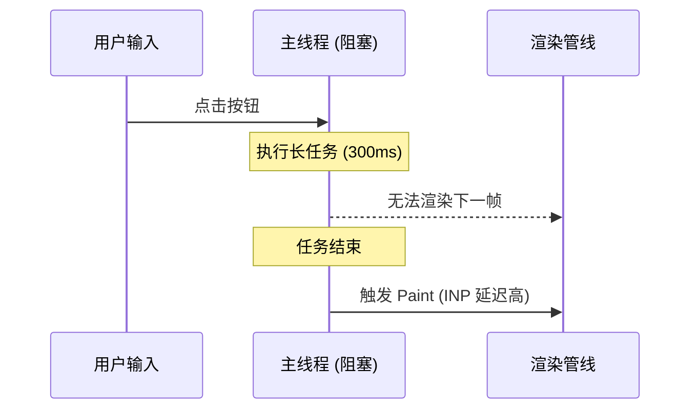

Google 提出的核心网页指标 (Core Web Vitals) 已成为衡量用户体验的工业标准。随着 2024 年 INP (Interaction to Next Paint) 正式取代 FID，性能优化的重心已从单纯的“加载快”转向“交互稳”和“响应灵”。

## 1. Largest Contentful Paint (LCP) 深度优化

LCP 衡量页面视口内最大内容元素的渲染时间。优化 LCP 的核心在于缩短 **关键路径延迟**。

### 资源优先级调度
利用 `Fetch Priority API` 可以显著改变浏览器的下载决策。

```html
<!-- 提升首屏 Hero Image 的优先级 -->


<!-- 降低非关键资源的优先级 -->
<script src="/js/analytics.js" fetchpriority="low" async></script>
```

### 关键路径优化策略
1. **消除渲染阻塞**: 将非关键 CSS 异步加载，或使用 `Critical CSS` 提取首屏样式内联。
2. **预连接与预加载**: 针对第三方 CDN 域名使用 `preconnect`，针对关键字体使用 `preload`。
3. **服务端响应时间 (TTFB)**: 引入边缘计算 (Edge Functions) 或流式渲染 (Streaming SSR) 减少首字节等待。

## 2. Cumulative Layout Shift (CLS) 视觉稳定性

CLS 衡量页面生命周期内发生的意外布局偏移。

### 布局稳定性保障
最常见的偏移源于未定义尺寸的媒体资源。

```css
/* 使用 aspect-ratio 提前占位 */
.video-wrapper {
  width: 100%;
  aspect-ratio: 16 / 9;
  background-color: #f0f0f0; /* 骨架屏底色 */
}

/* 字体加载优化 */
@font-face {
  font-family: 'CustomFont';
  src: url('...');
  font-display: swap; /* 避免不可见文本闪烁 FOIT */
}
```

## 3. Interaction to Next Paint (INP) 响应性革命

INP 是目前最具挑战性的指标，它衡量用户在页面上进行的所有交互（点击、按键）到下一帧渲染的延迟。

### 长任务切片 (Task Yielding)
当主线程被超过 50ms 的 JavaScript 任务占据时，用户交互将被挂起。



### 优化方案：主动让出控制权
利用 `scheduler.yield` (现代浏览器) 或 `setTimeout` 拆分长任务。

```javascript
async function heavyDataProcessing(data) {
  const chunks = splitIntoChunks(data);
  
  for (const chunk of chunks) {
    process(chunk);
    
    // 检查是否需要让出主线程
    if (shouldYield()) {
      // 现代浏览器优先使用 scheduler.yield()
      if ('scheduler' in window && 'yield' in scheduler) {
        await scheduler.yield();
      } else {
        await new Promise(resolve => setTimeout(resolve, 0));
      }
    }
  }
}

function shouldYield() {
  // 利用 isInputPending API 探测是否有挂起的输入事件
  return navigator.scheduling?.isInputPending() || Date.now() - lastYieldTime > 50;
}
```


## 4. 业务踩坑：BFCache 穿透与隐藏的 LCP 杀手

在做 Core Web Vitals 优化时，很多前端会忽略一个能瞬间把 LCP 和整体加载体验提升 10 倍的神器：**BFCache (Back/forward cache)**。

当用户点击浏览器“后退”或“前进”按钮时，如果页面是从 BFCache 中恢复的，它的加载时间几乎是 **0 毫秒**，LCP 直接拉满。然而，在实际业务代码中，我们常常无意间破坏了 BFCache，导致用户每次后退都要重新经历漫长的网络请求和渲染。

### 4.1 什么会破坏 BFCache？

最常见的元凶是：**在 `window` 上绑定了 `unload` 事件监听器。**
在早期的前端代码中，我们习惯用 `unload` 来发送用户离开页面的埋点日志，但这会直接告诉浏览器：“这个页面离开时要执行清理逻辑，不要把它放进 BFCache！”

**正确的做法：改用 `pagehide` 或 `visibilitychange`**

```javascript
// ❌ 错误：彻底封杀了 BFCache
window.addEventListener('unload', () => {
  navigator.sendBeacon('/log', data);
});

// ✅ 正确：在页面隐藏时发送日志，保留 BFCache
window.addEventListener('visibilitychange', () => {
  if (document.visibilityState === 'hidden') {
    navigator.sendBeacon('/log', data);
  }
});
```

### 4.2 React/Vue 单页应用 (SPA) 中的状态恢复陷阱

如果你使用了 WebSocket 或保持了某个长连接（如 SSE），当页面进入 BFCache 时，这些连接会被挂起。当用户按“后退”键回到页面时，连接可能已经超时断开。

此时，你不能依赖常规的 `useEffect` 挂载逻辑，而是需要监听 `pageshow` 事件的 `persisted` 属性，来判断页面是否是从 BFCache 复活的，如果是，则必须手动重连！

```javascript
window.addEventListener('pageshow', (event) => {
  if (event.persisted) {
    console.log('页面从 BFCache 瞬间恢复了！');
    // 1. 重新建立 WebSocket 连接
    // 2. 重新拉取极具时效性的数据（如股票价格）
    reconnectWebSocket();
  }
});
```

**排查工具**：
Chrome DevTools 的 `Application` -> `Back/forward cache` 面板提供了一键测试功能。点击 `Test BFCache`，它会明确指出你的代码中到底是哪个 API（如未关闭的 IndexedDB 事务、特定的 Cache-Control 头等）阻碍了页面的瞬间恢复。

## 5. 性能监控与持续集成


性能优化并不是一劳永逸的，需要建立闭环的监控体系：
- **RUM (Real User Monitoring)**: 使用 `web-vitals` 库收集真实用户的性能数据。
- **Lab Testing**: 在 CI/CD 流程中集成 Lighthouse CI，设置性能预算 (Performance Budgets)。
- **分析工具**: 利用 Chrome DevTools 的 `Performance` 面板定位渲染管线中的 `Long Animation Frames (LoAF)`。

## 总结

现代网页性能优化已进入“精细化调度”时代。通过合理利用 `Fetch Priority`、`Task Yielding` 以及 `Local-first` 等架构模式，我们可以构建出既能快速呈现内容，又能即时响应用户操作的高质量 Web 应用。
