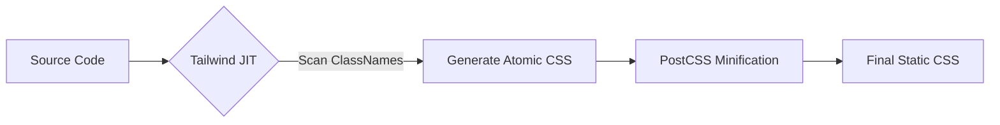

前端样式的组织方式经历了从全局预处理器、CSS Modules 到 CSS-in-JS 与 Utility-first 的演进。在当今复杂组件库和业务开发中，架构的取舍直接影响到应用的渲染性能和开发体验。

## 1. 运行时 CSS-in-JS 的性能代价

以 `styled-components` 或 `emotion` 为代表的运行时方案，通过 JS 动态生成样式。虽然它提供了强大的逻辑处理能力，但在高性能场景下存在瓶颈。

### 1.1 CSSOM 重构开销

当组件状态改变触发样式更新时，运行时库会执行以下步骤：
1. **哈希计算**：根据 props 计算样式的唯一哈希值。
2. **样式注入**：生成 CSS 字符串并将其插入到文档的 `<style>` 标签中。
3. **浏览器重绘**：浏览器检测到样式表变化，触发 CSSOM (CSS Object Model) 的重新构建。

在拥有数千个节点的复杂页面（如大型数据表格）中，这种频繁的 JS 到 CSS 的转换会导致明显的掉帧。

## 2. Utility-first 与构建时提取：Tailwind CSS

Tailwind CSS 采用了完全不同的思路。它通过 AOT (Ahead of Time) 编译，在构建阶段扫描源码并生成静态 CSS 文件。

### 2.1 JIT (Just-in-Time) 引擎原理

Tailwind 的 JIT 引擎不再预生成庞大的 CSS，而是根据代码中的类名按需生成。



这种模式的优势在于：
* **零运行时开销**：样式在构建时已确定，浏览器只需解析静态 CSS 文件。
* **缓存友好**：生成的 CSS 文件体积通常小于 50KB，且不随项目规模线性增长。


## 3. 业务踩坑：Tailwind 的动态类名截断灾难 (Dynamic Class Purging)

很多从传统 CSS 过渡到 Tailwind 的新手，最容易写出这种引发线上事故的代码：

```tsx
// ❌ 灾难写法：动态拼接类名
function StatusBadge({ status, color }) {
  // 假设 color 是 'red', 'green', 'blue' 之一
  return <span className={`bg-${color}-500 text-white`}>{status}</span>;
}
```

**为什么背景色全丢了？**
Tailwind 不是在浏览器里运行的，而是在**构建时（Build-time）**通过正则扫描你的源码字符串。
它只会无脑地提取所有完整的单词（比如它看到了 `text-white`，就会去生成这个类的 CSS）。
但它根本不懂 JavaScript 的运行逻辑！它扫描你的代码时，看到的是 `bg-${color}-500` 这个死板的字符串，它完全不知道 `color` 在运行时会变成 `red` 还是 `blue`。因此，在最终打包出的 `.css` 文件里，`bg-red-500` 这些样式被无情地剔除（Purged）了。

### 3.1 工业级解法：完整写出或白名单 (Safelist)

**方案一：永远写完整的类名（推荐）**

这是 Tailwind 官方最推荐的做法。牺牲一点代码的 DRY（Don't Repeat Yourself），换取绝对的构建安全。

```tsx
// ✅ 正确写法：映射字典
const colorMap = {
  red: 'bg-red-500',
  green: 'bg-green-500',
  blue: 'bg-blue-500',
};

function StatusBadge({ status, color }) {
  return <span className={`${colorMap[color]} text-white`}>{status}</span>;
}
```
Tailwind 在扫描这个文件时，看到了 `bg-red-500` 这个完整的字符串字面量，就会乖乖地把它打包进去。

**方案二：配置 `tailwind.config.js` 的 Safelist**

如果你的颜色真的是由后端下发的一组动态枚举（比如几十种业务状态色），映射表写起来太长，可以通过正则表达式强制打包：

```javascript
// tailwind.config.js
module.exports = {
  safelist: [
    // 强行打包所有 bg-X-500 的类名（哪怕源码里没写全）
    {
      pattern: /bg-(red|green|blue)-500/,
      // 可选：还可以强行打包它们在 hover 时的状态
      variants: ['hover'],
    },
  ],
  // ...
};
```

## 4. 架构进阶：Zero-runtime CSS-in-JS 的崛起

虽然传统的 CSS-in-JS (如 Styled-components) 性能太差，但很多人还是怀念能在 JS 里写 CSS 的开发体验（比如强类型校验、自动提取未使用的样式）。

于是，这两年诞生了一个完美的折中方案：**构建时提取（Zero-runtime / Build-time CSS-in-JS）**。代表作有 `Vanilla Extract`、`Linaria`，以及字节跳动开源的 `Panda CSS`。

### 4.1 鱼与熊掌兼得的魔法

以 Panda CSS 为例，它的写法完全是 CSS-in-JS 的体验，但在底层，它结合了 Tailwind 的 JIT 扫描机制。

```tsx
// 使用 Panda CSS
import { css } from '../styled-system/css';

function Button({ children }) {
  return (
    <button className={css({
      bg: 'blue.500', // 支持设计系统 Token
      color: 'white',
      _hover: { bg: 'blue.600' }, // 伪类
      padding: '4'
    })}>
      {children}
    </button>
  );
}
```

**它是怎么运行的？**
1. 在编写代码时，`css()` 函数提供了完美的 TypeScript 类型提示（甚至比 Tailwind 的 VSCode 插件更准）。
2. 在**构建阶段**，Panda CSS 的分析器（基于 AST）会提取出你写在 `css()` 里的对象。
3. 它在本地悄悄生成了原子化 CSS（如 `.bg_blue_500 { background-color: #3b82f6; }`）。
4. 在**运行阶段**，那个 `css()` 函数会被直接编译成一串纯静态的字符串：`"bg_blue_500 text_white ..."`。

最终，浏览器收到的就是一个干干净净的 `className="bg_blue_500"`，没有任何 JS 运行时的哈希计算、也没有 `<style>` 标签的动态插入，性能与 Tailwind 齐平！

## 5. 深度对比与选型建议


| 维度 | CSS-in-JS (Runtime) | Tailwind CSS |
| :--- | :--- | :--- |
| **开发体验** | 逻辑与样式高度耦合，支持复杂计算 | 快速原型开发，约束感强 |
| **性能** | 运行时有损耗，JS 包体积大 | 零运行时损耗，CSS 体积极小 |
| **动态性** | 极强 (基于 Props) | 较弱 (需预定义类名或使用 style 属性) |
| **学习曲线** | 低 (纯 JS/TS) | 中 (需记忆工具类名) |

### 5.2 混合架构实践

在大型项目中，我们通常采取折中方案：
* **基础布局与原子组件**：使用 Tailwind CSS 保证渲染性能和样式一致性。
* **高度动态的交互组件**：对于需要根据复杂业务逻辑实时计算位置、颜色的组件（如拖拽画布、图表），使用内联样式 (Inline Styles) 或轻量级的 CSS 变量。

```tsx
// 推荐的混合写法
function DynamicBox({ color, size }) {
  return (
    <div 
      className="flex items-center justify-center transition-all" // 静态样式用 Tailwind
      style={{ backgroundColor: color, width: `${size}px` }}      // 动态样式用内联
    >
      Content
    </div>
  );
}
```

## 6. 总结

CSS 架构的演进方向正在从“运行时灵活性”回归到“构建时确定性”。Tailwind CSS 凭借其优秀的性能表现和原子化的设计约束，已成为目前构建现代设计系统的首选方案。对于追求极致动态能力的场景，CSS-in-JS 依然有其应用价值，但在性能敏感的项目中需谨慎使用。
