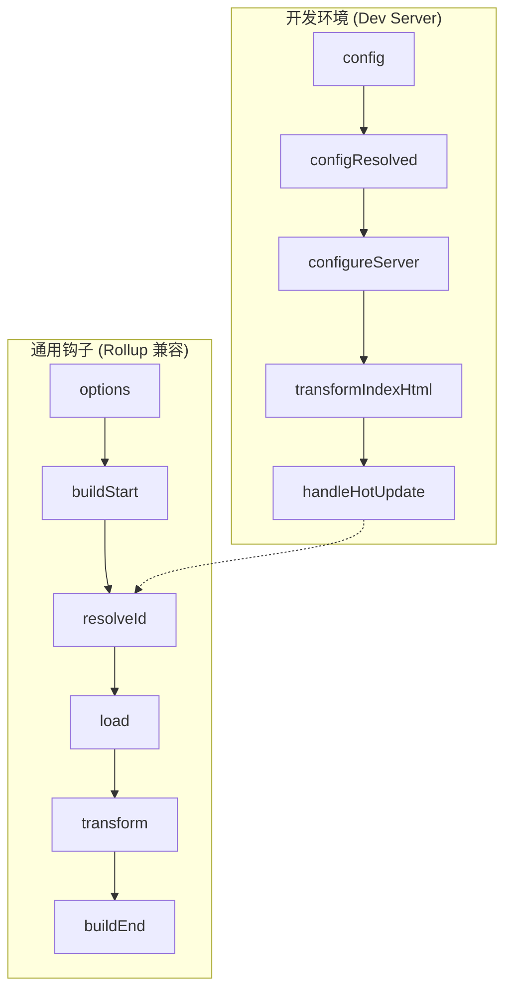

Vite 的构建系统基于 Rollup，其插件体系不仅兼容了大部分 Rollup 钩子，还扩展了特定于开发服务器的专有钩子。理解 Vite 插件的工作原理，对于构建高效的自动化工具链至关重要。

## 1. Vite 插件生命周期全景

Vite 插件的生命周期可以分为三个阶段：服务器启动阶段、请求处理阶段和服务器关闭阶段。在生产构建模式下，Vite 则完全遵循 Rollup 的钩子流程。



### 核心钩子解析
- **`config`**: 在解析 Vite 配置前调用，可以返回一个将被深度合并到现有配置中的对象。
- **`configureServer`**: 用于配置开发服务器，常用于添加自定义中间件（connect middleware）。
- **`transform`**: 最核心的钩子，用于转换模块内容。支持返回 SourceMap 以保证调试体验。

## 2. 虚拟模块 (Virtual Modules) 的深度实现

虚拟模块是 Vite 插件开发中非常核心的模式。它允许我们在内存中动态生成代码，而无需在磁盘上创建物理文件。这在注入全局常量、动态路由生成或构建时元数据注入等场景中非常有用。

### 实现机制
为了防止虚拟模块 ID 被其他插件误处理，通常使用 `\0` 前缀作为内部标识符。

```typescript
import type { Plugin } from 'vite';

export default function virtualModulePlugin(): Plugin {
  const virtualModuleId = 'virtual:env-info';
  const resolvedVirtualModuleId = '\0' + virtualModuleId;

  return {
    name: 'vite-plugin-env-info',
    
    // 1. 拦截解析请求
    resolveId(id) {
      if (id === virtualModuleId) {
        return resolvedVirtualModuleId;
      }
    },
    
    // 2. 加载模块内容
    load(id) {
      if (id === resolvedVirtualModuleId) {
        const info = {
          version: process.env.npm_package_version,
          timestamp: new Date().getTime(),
          nodeVersion: process.version
        };
        return `export const envInfo = ${JSON.stringify(info)};`;
      }
    }
  };
}
```

## 3. 基于 AST 的代码转换拦截

在 `transform` 钩子中，简单的正则替换往往难以处理复杂的语法结构。推荐使用 `magic-string` 配合 AST 工具（如 `estree-walker` 或 `babel`）进行精准转换。

### 实战：自动注入调试元数据
假设我们需要在每个函数的开头注入执行耗时统计：

```typescript
import { parse } from '@babel/parser';
import traverse from '@babel/traverse';
import MagicString from 'magic-string';

export default function autoTracePlugin(): Plugin {
  return {
    name: 'vite-plugin-auto-trace',
    transform(code, id) {
      if (!/\.(t|j)sx?$/.test(id) || id.includes('node_modules')) return;

      const s = new MagicString(code);
      const ast = parse(code, {
        sourceType: 'module',
        plugins: ['typescript', 'jsx']
      });

      traverse(ast, {
        FunctionDeclaration(path) {
          const { start } = path.node.body;
          // 在函数体开始处插入代码
          s.appendLeft(start + 1, `\n  console.time('${path.node.id.name}');`);
          
          // 在函数结束前插入结束统计（简化逻辑）
          const { end } = path.node.body;
          s.appendRight(end - 1, `\n  console.timeEnd('${path.node.id.name}');`);
        }
      });

      return {
        code: s.toString(),
        map: s.generateMap({ hires: true })
      };
    }
  };
}
```


Vite 插件可以通过 `handleHotUpdate` 钩子自定义热更新行为。例如，当某个非 JS 配置文件（如 `.yaml`）发生变化时，我们可以手动触发相关模块的更新，而不是刷新整个页面。

```typescript
}
```

## 4. 业务踩坑：基于 Module Graph 的精准 HMR 控制

Vite 的神级开发体验来源于它的 HMR（热更新）。但在写插件处理自定义文件后缀（比如 `.mdx` 或自己发明的 `.json5`）时，最容易踩的坑就是：**一改文件，整个浏览器就全页刷新（Full Reload），HMR 完全失效。**

### 4.1 为什么会触发 Full Reload？

当你修改了 `foo.mdx`，Vite 的文件监听器（Chokidar）会捕获到变更。然后 Vite 会在它的 **模块关系图（Module Graph）** 里寻找谁导入了 `foo.mdx`。
如果这个 `.mdx` 文件在 `transform` 钩子里被你转换成了一段普通的 JS 代码，但你**没有在这个代码里注入 HMR 的接收代码（`import.meta.hot.accept`）**，Vite 就会认为：“这个模块不知道怎么热更新自己，为了安全起见，我只能把整个页面刷新了。”

### 4.2 工业级解法：handleHotUpdate 与 Module Graph 强干预

有时候，我们不希望在转换后的代码里硬塞 `import.meta.hot` 逻辑，而是希望在插件层直接拦截变更，并手动告诉 Vite 应该去更新哪个组件。

这就需要用到极其核心的 `handleHotUpdate` 钩子和 `server.moduleGraph` API。

假设你写了一个插件，读取 `locales/zh-CN.json`，并把它变成一个供 React 组件导入的字典对象。
当产品经理修改了翻译文件时，我们希望页面能瞬间更新文字，而不是全页白屏刷新。

```typescript
export default function i18nHmrPlugin() {
  return {
    name: 'vite-plugin-i18n-hmr',
    
    // 拦截热更新事件
    async handleHotUpdate({ file, server, read }) {
      // 只拦截我们关心的 json 文件
      if (file.endsWith('zh-CN.json')) {
        console.log('[HMR] 检测到语言包更新');
        
        // 1. 获取这个 JSON 文件在 Vite 内存图谱中的模块节点
        const jsonModule = server.moduleGraph.getModuleById(file);
        
        if (jsonModule) {
          // 2. 核心：手动使这个模块的缓存失效！
          // 否则下次浏览器请求这个文件时，Vite 还是会返回旧的内存缓存
          server.moduleGraph.invalidateModule(jsonModule);
          
          // 3. 通过 WebSocket 向客户端发送自定义事件，通知 React 去重新拉取语言包
          // 客户端需要监听 import.meta.hot.on('i18n-update', ...)
          server.ws.send({
            type: 'custom',
            event: 'i18n-update',
            data: { 
              file, 
              newContent: JSON.parse(await read()) 
            }
          });
          
          // 4. 返回一个空数组！
          // 这句话极其关键：它告诉 Vite "这个热更新我已经处理完毕了，你不要再去顺藤摸瓜触发 Full Reload 了！"
          return [];
        }
      }
    }
  };
}
```

**踩坑提醒**：
很多人在 `handleHotUpdate` 里返回了空数组阻止了刷新，但忘记调用 `server.moduleGraph.invalidateModule(jsonModule)`。结果就是客户端收到了 WebSocket 消息去重新 `import()` 这个文件，但拿到的依然是 Vite 内存里的旧代码，导致热更新看起来“没生效”。

## 5. 性能优化建议


编写 Vite 插件时，应遵循以下原则以避免拖慢构建速度：
1. **路径过滤**: 始终在钩子开始处通过 `id` 过滤掉不需要处理的文件（如 `node_modules`）。
2. **缓存计算**: 对于复杂的 AST 转换，考虑使用缓存机制。
3. **异步处理**: 尽量使用异步 API，避免阻塞 Vite 的并行扫描过程。

通过深入掌握这些核心机制，开发者可以构建出高度定制化的构建流，显著提升团队的开发效率与工程质量。
