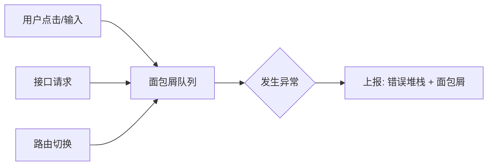

前端异常监控系统的核心，不仅在于拦截报错，更在于建立完整的运行时上下文恢复体系，以便开发者能快速复现与定位。一个成熟的监控体系应涵盖：错误捕获、性能度量、行为追踪以及自动化告警。

## 1. 全方位错误捕获策略

在复杂的 Web 应用中，异常可能来自 JS 引擎、网络请求、资源加载或异步任务。我们需要构建多层拦截机制。

### JS 运行时错误与资源加载异常
`window.onerror` 只能捕获 JS 错误，而 `addEventListener('error')` 在捕获阶段可以拦截到资源（如图片、脚本）加载失败。

```javascript
window.addEventListener('error', (event) => {
  const target = event.target;
  // 区分资源加载错误与 JS 运行时错误
  if (target && (target.src || target.href)) {
    report({
      type: 'RESOURCE_ERROR',
      url: target.src || target.href,
      tagName: target.tagName
    });
  } else {
    report({
      type: 'JS_ERROR',
      message: event.message,
      stack: event.error?.stack
    });
  }
}, true); // 必须在捕获阶段监听
```

### 未处理的 Promise 拒绝
现代应用大量使用 `async/await`，未被 `catch` 的 Promise 异常需要通过 `unhandledrejection` 捕获。

```javascript
window.addEventListener('unhandledrejection', (event) => {
  report({
    type: 'PROMISE_ERROR',
    reason: event.reason?.message || event.reason,
    stack: event.reason?.stack
  });
});
```

### 跨域脚本错误 (Script Error)
如果加载了 CDN 上的第三方脚本且未配置 CORS，`onerror` 只能拿到 "Script error."。
**解决方案**：
1. 服务端设置 `Access-Control-Allow-Origin`。
2. 客户端 `<script>` 标签添加 `crossorigin="anonymous"`。

## 2. 性能监控：Web Vitals

除了错误，性能也是稳定性的重要组成部分。利用 `PerformanceObserver` API，我们可以收集核心指标：

- **FCP (First Contentful Paint)**：首次内容绘制。
- **LCP (Largest Contentful Paint)**：最大内容绘制，衡量加载性能。
- **CLS (Cumulative Layout Shift)**：累计布局偏移，衡量视觉稳定性。

```javascript
new PerformanceObserver((entryList) => {
  for (const entry of entryList.getEntries()) {
    if (entry.name === 'largest-contentful-paint') {
      reportPerformance('LCP', entry.startTime);
    }
  }
}).observe({ type: 'largest-contentful-paint', buffered: true });
```

## 3. 行为追踪与面包屑 (Breadcrumbs)

单纯的堆栈信息往往不足以定位复杂问题。我们需要记录用户在报错前的操作流：
- **路由跳转**：监听 `popstate` 或覆写 `pushState`。
- **用户交互**：全局监听 `click` 事件，记录目标元素的 ID 或 Class。
- **接口请求**：覆写 `XMLHttpRequest` 和 `fetch`，记录请求 URL 和状态码。



## 4. SourceMap 反解析体系

生产环境的代码经过压缩混淆，报错堆栈通常形如 `at a.b (main.js:1:350)`。要还原源码，必须在服务端进行 SourceMap 解析。

### 解析流程
1. **构建阶段**：CI 流水线生成 `.map` 文件，并将其上传至内部监控中心。
2. **上报阶段**：SDK 上报原始堆栈及版本号（Release ID）。
3. **还原阶段**：监控平台利用 `source-map` 库，结合 VLQ 编码的映射表，将行列号转换为源码位置。

```javascript
// 服务端伪代码
const sourceMap = require('source-map');
const consumer = await new sourceMap.SourceMapConsumer(rawSourceMap);
const originalPos = consumer.originalPositionFor({
  line: 1,
  column: 350
});
console.log(originalPos.source, originalPos.line, originalPos.name);
// 输出: src/utils/auth.ts, 42, login
```

## 4. 业务踩坑：SourceMap 的安全分发与线上反解机制

很多公司在做前端监控时，最纠结的就是 SourceMap。
如果把 `.map` 文件直接跟着静态资源一起部署到线上的 CDN，等于向全世界开源了整个前端项目的未混淆源码。
但如果不上传，在 Sentry 或自研监控后台看到的堆栈全都是 `at a.b (main.js:1:350)`，排查难度堪比看天书。

**工业级解决方案：自动化构建隔离传输与隐式映射**

在现代前端监控架构中，SourceMap 的生成与线上应用必须严格物理隔离。典型的 CI/CD 流程如下：

1. **构建阶段（生成与剥离）**
   在执行 `webpack` 或 `vite` 打包时，开启 SourceMap 生成。打包完成后，运行一个后置脚本（Post-build Script）。
   这个脚本负责遍历 `dist/` 目录下所有的 `.js` 文件，利用正则 **强行剥离** 末尾的 `//# sourceMappingURL=...` 注释。
   这样，浏览器在执行线上代码时，根本不知道 SourceMap 的存在，更不会尝试去下载它。

2. **分发阶段（私有上传与清洗）**
   在剥离注释之前，脚本已经将所有的 `.map` 文件与其对应的 `.js` 文件名（通常带有 Hash，如 `main.a1b2c3d4.js.map`）打包上传到了**仅内网可访问的监控分析后台**（或 Sentry 服务器）。
   上传成功后，立刻在 CI 服务器的本地 `dist/` 目录中删除所有 `.map` 文件。最后再把干净的 `dist/` 推送到线上的生产环境 CDN。

3. **反解阶段（隐式匹配与栈还原）**
   当线上用户触发了报错，前端的监控 SDK 捕获到了混淆的错误堆栈：
   `at a.b (https://cdn.example.com/assets/main.a1b2c3d4.js:1:350)`。
   
   SDK 将这个堆栈发送给监控后台。
   监控后台收到堆栈后，提取出报错的脚本 URL 中的文件名 `main.a1b2c3d4.js`。
   接着，后台在其内部的高速存储（如 MinIO 或 Redis）中查找之前 CI 上传的对应的 `main.a1b2c3d4.js.map`。
   找到后，利用 Mozilla 的 `source-map` 库，将 `line: 1, column: 350` 还原成对应的源码位置，并将翻译后的清爽堆栈呈现给开发者。

这套机制既保证了线上源码的绝对安全，又完美保留了快速定位 Bug 的能力，是构建企业级监控体系的必经之路。

## 5. 数据清洗与告警策略


大量的监控数据需要有效的处理策略：
- **聚合去重**：根据错误类型、消息和堆栈生成哈希值，将相同的错误聚合。
- **采样 (Sampling)**：对于高频的性能数据或资源错误，按比例上报以节省资源。
- **分级告警**：基于错误增长率、影响用户数设置阈值，实时通知。

## 6. 总结

构建前端监控体系是一项系统工程。它涵盖了底层的异常拦截、中层的上下文关联，以及后层的自动化解析与分析。这套完整的机制有助于在用户反馈之前，先一步发现并定位线上问题。
