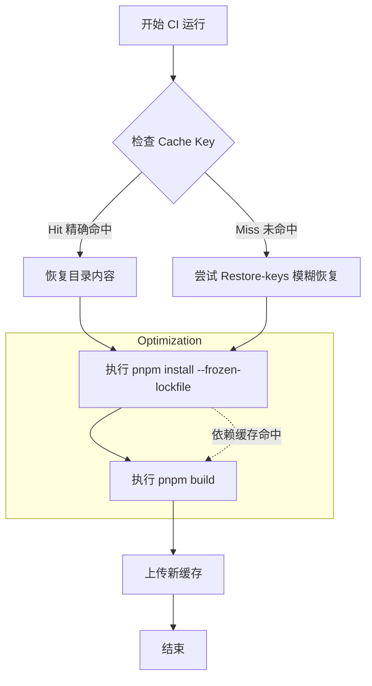

在现代前端工程化实践中，CI/CD（持续集成/持续部署）的效率直接影响开发者的交付体验。一个典型的 React 或 Vue 项目，其流水线耗时通常集中在 `Dependency Install` 和 `Production Build` 两个阶段。本文将探讨如何通过 GitHub Actions 的缓存机制，大幅优化构建时间。

## 1. 核心机制：actions/cache 的工作原理

GitHub Actions 提供的 `actions/cache` 插件允许我们在不同的 Workflow 运行之间持久化特定目录。其核心逻辑基于 **Key-Value 匹配**：

*   **Key**：缓存的唯一标识符。通常包含操作系统标识、工具版本和文件哈希。
*   **Restore-keys**：当精确匹配失败时，用于模糊匹配的备选前缀。
*   **Path**：需要缓存的目录路径。

当流水线启动时，`actions/cache` 会尝试根据 Key 下载缓存；流水线结束时，如果 Key 发生了变化，它会自动上传新的目录内容。

## 2. 依赖层优化：从 node_modules 到全局 Store

传统的缓存方式是直接缓存项目根目录下的 `node_modules`。但在使用 `pnpm` 时，这种方式并非最优。

### 2.1 Pnpm Store 缓存策略
`pnpm` 使用内容寻址存储（Content-addressable store）。我们应该缓存 pnpm 的全局 store 目录，而不是每个项目的 `node_modules`。这样即使多个项目共享同一个 Runner，也能实现最大化的复用。

```yaml
# .github/workflows/ci.yml
- name: Install pnpm
  uses: pnpm/action-setup@v3
  with:
    version: 9

- name: Get pnpm store directory
  shell: bash
  run: |
    echo "STORE_PATH=$(pnpm store path --silent)" >> $GITHUB_ENV

- name: Setup pnpm cache
  uses: actions/cache@v4
  with:
    path: ${{ env.STORE_PATH }}
    key: ${{ runner.os }}-pnpm-store-${{ hashFiles('**/pnpm-lock.yaml') }}
    restore-keys: |
      ${{ runner.os }}-pnpm-store-
```

### 2.2 为什么使用 hashFiles？
`hashFiles('**/pnpm-lock.yaml')` 会根据锁文件的内容生成唯一的哈希值。只要依赖版本没有变动，哈希值就保持不变，从而精准命中缓存。一旦开发者更新了某个包，哈希值改变，CI 会重新安装并更新缓存。

## 3. 构建产物优化：增量构建与 Turborepo

对于大型 Monorepo 或复杂应用，构建过程（Webpack/Vite/Tsc）往往非常耗时。我们可以利用构建工具的本地缓存能力，并将其同步到 CI 缓存中。

### 3.1 Turborepo 远程缓存模拟
Turborepo 默认支持将构建结果缓存到 `.turbo` 目录。在 GitHub Actions 中，我们可以持久化这个目录。

```yaml
- name: Cache Turborepo
  uses: actions/cache@v4
  with:
    path: .turbo
    # 使用 github.sha 确保每次提交都有机会更新缓存
    # 但通过 restore-keys 继承上一次的产物
    key: ${{ runner.os }}-turbo-${{ github.sha }}
    restore-keys: |
      ${{ runner.os }}-turbo-

- name: Build
  run: pnpm build --cache-dir=".turbo"
```

### 3.2 缓存命中流转图
通过合理的配置，CI 的执行路径如下：



## 4. 业务踩坑：缓存雪崩与过时污染的终极解法

在真实的 CI 中，我们经常会遇到这样一种诡异的现象：**原本 2 分钟的构建，跑了几个月后变成了 10 分钟。甚至触发了 GitHub 的 10GB 缓存上限，导致所有的流水线集体变慢。**

这就是经典的**“缓存污染 (Cache Pollution) 与雪崩”**。

### 4.1 缓存污染的元凶

当我们在用 `actions/cache` 缓存 Webpack 或 Vite 的 `.cache` 目录时，构建工具每次都会在里面生成带有新 Hash 的中间产物（比如 `vendor.a1b2.js.cache`）。
GitHub Actions 的 `save` 动作是**累加**的：它会把当前目录的所有内容打包传上去。这意味着：**旧的、再也不会用到的文件（比如上个月的旧 Hash 产物），会一直躺在这个缓存包里，跟着你的项目不断滚雪球。**

最终，光是下载和解压这个庞大的垃圾缓存包，耗时就超过了重新构建一遍的时间！

**工业级解决方案：预清理 (Pre-clean) 与强一致性哈希**

在打包结束后、缓存保存前，我们必须执行一个清理脚本，或者利用构建工具自带的 prune 机制。
例如对于 `next.js` 的缓存，我们可以用 `actions/cache` 的官方高级插件 `setup-node`，它底层处理得更干净；或者手动删除那些 N 天前生成的旧文件：

```yaml
- name: 🧹 Clean up old cache files before saving
  run: |
    # 在上传缓存前，删除 .turbo 或 node_modules/.cache 下超过 7 天未访问的文件
    find .turbo -type f -atime +7 -delete
    find node_modules/.cache -type f -atime +7 -delete
```

### 4.2 并发矩阵构建 (Matrix Strategy) 的包级缓存陷阱

在 Monorepo 中，如果你为了加速，开了 4 台机器（Matrix）并行测试 4 个子包：

```yaml
strategy:
  matrix:
    package: [web, admin, docs, ui]
```

如果每台机器都在最后一步执行了 `actions/cache@v4` 的 `save` 操作，去覆盖同一个 `key: pnpm-store-${{ hashFiles('pnpm-lock.yaml') }}`。
由于并发执行，这 4 台机器会**产生竞争条件 (Race Condition)**，GitHub 会拒绝后 3 台机器的上传（Cache already exists），导致它们的局部构建缓存永远无法被保存。

**破局思路：读写分离与后缀区分**

对于并行任务，缓存的 `key` 必须包含机器的唯一标识，或者将“依赖安装”与“业务构建”分拆到两个独立的 Job 中（如：先由一个单独的 `setup` job 跑完 `pnpm install` 并上传 `node_modules` 缓存，后置的 4 个 Matrix job 全部只读（利用 `restore-keys` 命中））。

```yaml
# 读写分离架构示例
jobs:
  setup-dependencies:
    runs-on: ubuntu-latest
    steps:
      # ... 安装依赖并强制存入精确 key 的缓存
      - uses: actions/cache/save@v4 # 注意这里用的是专门的 save action

  parallel-builds:
    needs: setup-dependencies
    strategy:
      matrix:
        app: [web, admin]
    steps:
      # ... 所有的并行节点，只负责 restore，绝不互相覆盖 save！
      - uses: actions/cache/restore@v4
        with:
          key: ${{ runner.os }}-pnpm-store-${{ hashFiles('pnpm-lock.yaml') }}
```

## 5. 总结


1.  **缓存空间限制**：GitHub 每个仓库的缓存上限为 10GB。超过后会按照“最久未使用”原则剔除。建议定期清理无用的分支缓存。
2.  **跨分支隔离**：默认情况下，子分支可以访问主分支的缓存，但主分支不能访问子分支的缓存。这保证了主干构建的稳定性。
3.  **缓存污染**：如果缓存中包含了具有副作用的临时文件，可能导致构建失败。务必在 `path` 中只包含纯粹的依赖或产物目录。

## 5. 总结

通过 `actions/cache` 配合 `pnpm` 和 `Turborepo`，我们可以构建出一套高效的 CI 流水线。这不仅显著提升了开发效率，还降低了 GitHub Actions 的分钟数消耗。在架构设计时，应始终遵循“哈希驱动、层级缓存、增量构建”的核心原则。
