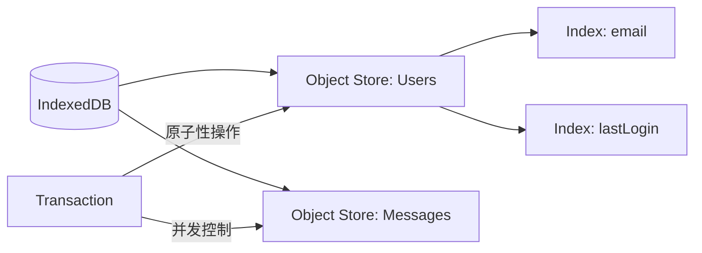

在构建现代复杂 Web 应用（如离线文档编辑器、大型 CRM 系统）时，LocalStorage 的 5MB 容量限制和同步阻塞特性已无法满足需求。IndexedDB 作为浏览器内置的非关系型数据库，提供了海量存储（通常为磁盘剩余空间的 80%）和异步事务支持，是实现 Local-first 架构的核心基石。

## 1. IndexedDB 核心架构与设计模式

IndexedDB 的设计理念更接近于 NoSQL 数据库，其核心组件包括对象仓库 (Object Stores)、索引 (Indexes) 和事务 (Transactions)。



## 2. 使用 Dexie.js 提升工程效率

原生 API 的繁琐（基于请求/响应事件）使得代码难以维护。Dexie.js 提供了优雅的 Promise 封装和强大的查询能力。

### 数据库定义与版本管理
```typescript
import Dexie, { type Table } from 'dexie';

export interface Message {
  id?: number;
  content: string;
  senderId: string;
  timestamp: number;
  status: 'sent' | 'pending' | 'failed';
}

class ChatDatabase extends Dexie {
  messages!: Table<Message>;

  constructor() {
    super('ChatAppDB');
    // 定义版本。注意：索引字段必须在此声明
    this.version(1).stores({
      messages: '++id, senderId, timestamp, status'
    });
  }
}

export const db = new ChatDatabase();
```

## 3. 高性能读写策略：批量操作与事务

在处理海量数据时，频繁开启小事务会导致严重的性能损耗。正确的做法是利用 **批量操作 (Bulk Operations)**。

```typescript
async function syncMessagesFromServer(newMessages: Message[]) {
  try {
    await db.transaction('rw', db.messages, async () => {
      // 1. 批量写入，比循环 put 快一个数量级
      await db.messages.bulkPut(newMessages);

      // 2. 清理过期数据（如只保留最近 1000 条）
      const count = await db.messages.count();
      if (count > 1000) {
        const oldestToKeep = await db.messages
          .orderBy('timestamp')
          .reverse()
          .offset(1000)
          .first();
        
        if (oldestToKeep) {
          await db.messages
            .where('timestamp')
            .below(oldestToKeep.timestamp)
            .delete();
        }
      }
    });
  } catch (error) {
    console.error('Transaction failed:', error);
  }
}
```

## 4. Web Worker 中的离屏存储 (Offscreen Storage)

虽然 IndexedDB 是异步的，但在主线程进行大规模数据的序列化/反序列化（Structured Clone）仍可能导致掉帧。将数据库逻辑移至 Web Worker 是保证极致性能的重要手段。

### Worker 线程逻辑
```typescript
// db.worker.ts
import { db } from './db';

self.onmessage = async (e) => {
  const { type, payload } = e.data;
  if (type === 'QUERY_MESSAGES') {
    const results = await db.messages
      .where('senderId')
      .equals(payload.userId)
      .toArray();
    self.postMessage({ type: 'QUERY_RESULT', results });
  }
};
```


## 5. 业务踩坑：多 Tab 并发写入与事务阻塞的隐性 Bug

在真实的复杂 Web 应用（比如 Notion 这种多 Tab 页打开同一个工作区的工具）中，如果你的用户同时打开了 3 个 Tab，并且同时触发了自动保存逻辑，IndexedDB 的锁机制就会引发一场灾难。

### 5.1 隐蔽的事务挂起 (Transaction Suspending)

IndexedDB 采用了极其严格的**读写锁机制**。如果你对表 `users` 开启了一个 `readwrite`（读写）事务，整个浏览器里其他所有想要写 `users` 的事务都会被阻塞（排队等待）。

很多开发者喜欢在事务里夹带私货（比如网络请求），这就触发了致命错误：**事务挂起与隐式提交**。

```javascript
// ❌ 灾难性的写法：事务内部发生跨 Tick 的微任务/宏任务
await db.transaction('rw', db.users, async () => {
  const user = await db.users.get(1);
  
  // 致命错误：这会导致当前事务在这个 await 期间被隐式提交！
  // 等 fetch 结束，后面的 put 就会抛出 "TransactionInactiveError"
  const response = await fetch('/api/user/sync'); 
  
  await db.users.put({ ...user, synced: true });
});
```

**底层原理：**
IndexedDB 的事务是与浏览器的 **Event Loop** 绑定的。一旦事务回调执行完毕，当前宏任务（或微任务队列空了）结束，浏览器会自动帮你提交事务。
如果你在里面插入了 `fetch`、`setTimeout` 等产生新 Event Loop Tick 的异步操作，事务就会失效。

**工业级解法：分离 I/O 与 DB 操作**

```javascript
// ✅ 正确做法：只读事务 -> 网络请求 -> 写事务
const user = await db.transaction('r', db.users, () => db.users.get(1)); // 事务 1

const response = await fetch('/api/user/sync'); // DB 自由态，不占用锁

// 重新开启短平快的事务 2
await db.transaction('rw', db.users, () => db.users.put({ ...user, synced: true }));
```

### 5.2 QuotaExceededError 与不可靠的持久化

IndexedDB 并不是“安全”的避风港。当用户的 C 盘快满了，或者浏览器分配给该域名的 Quota 被用尽时，会发生两件事：

1. 写入报错：抛出 `QuotaExceededError`。
2. **静默驱逐 (Silent Eviction)**：更可怕的是，浏览器会在硬盘紧张时，**一声不吭地把你的整个 IndexedDB 删掉！**（基于 LRU 策略，按域名清理）。

如果你是用 IndexedDB 存“草稿”，这种驱逐是毁灭性的。

**解法：申请持久化存储 (Persistent Storage)**

在极其关键的离线应用中，你必须主动向浏览器申请将存储标记为持久化。

```javascript
async function requestPersistentStorage() {
  if (navigator.storage && navigator.storage.persist) {
    const isPersisted = await navigator.storage.persisted();
    if (!isPersisted) {
      // 浏览器可能会弹窗询问用户“是否允许该网站在本地永久存储数据”
      const granted = await navigator.storage.persist();
      console.log('Persistent storage granted:', granted);
    }
  }
}
```
被标记为 persisted 的站点数据，除非用户手动去设置里清理缓存，否则浏览器宁可把其他网站的缓存全删光，也不会动你的数据分毫。

## 6. Local-first 架构下的同步挑战


使用 IndexedDB 不仅仅是为了存储，更是为了实现“本地优先”的体验。
- **乐观更新**: 交互时先写入 IndexedDB，再异步同步至服务器。
- **冲突解决**: 引入 CRDT (Conflict-free Replicated Data Types) 或简单的 LWW (Last Write Wins) 策略。
- **增量同步**: 利用 `updatedAt` 索引，仅拉取自上次同步以来的变更。

## 总结

IndexedDB 为前端应用提供了接近原生应用的持久化能力。通过 Dexie.js 的抽象、事务的合理利用以及 Web Worker 的隔离，我们可以构建出在海量数据下依然保持流畅加载和响应的现代 Web 应用。
