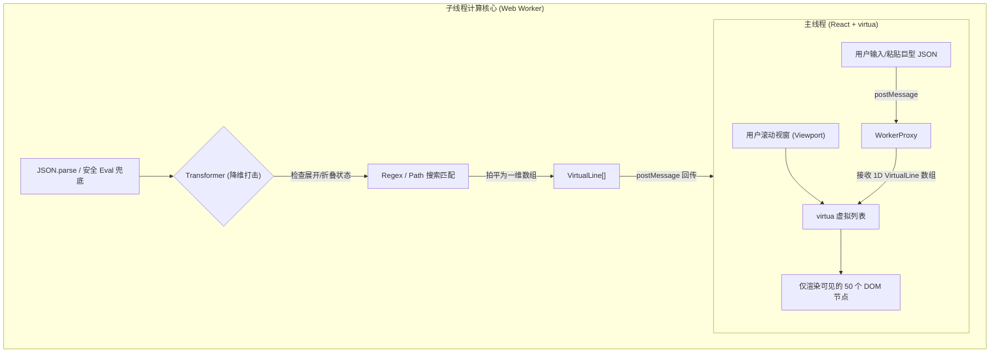
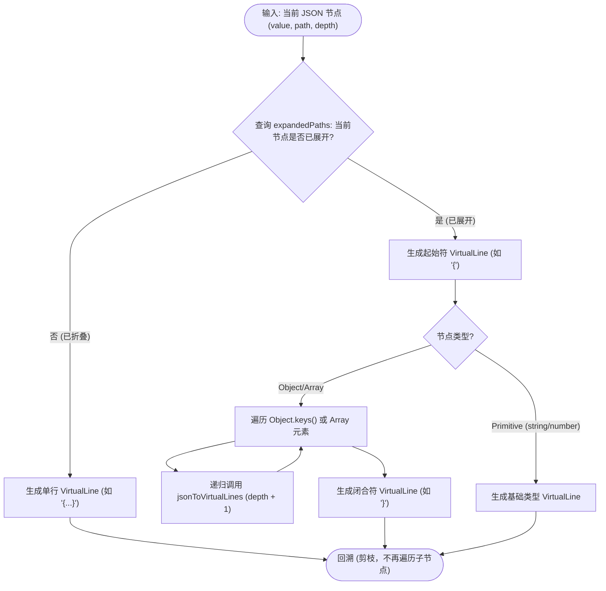
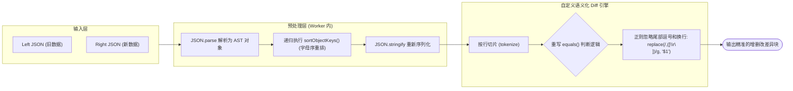

## 1. 背景与痛点：苦涩的“JSON”自由

在前端开发、接口联调或生产环境排查的日常中，我每天都在和无数的 JSON 数据打交道。
市面上并不缺 JSON 格式化工具（比如普通的浏览器插件、或者在线的 JSON Editor），但当系统越来越庞大、微服务拆分越来越细时，我们抓包拿到的**接口返回值动辄大几兆、甚至包含几十万个节点的巨型 JSON 树**。

传统的 JSON 工具在面对这类“巨物”时，常常暴露出致命的缺陷：
1. **渲染主线程卡死 (UI Freezing)**：直接将几十万行的 JSON 塞进页面渲染，浏览器会瞬间假死，滚动条甚至无法拖动。
2. **极其糟糕的搜索体验**：在浏览器原生 `Ctrl+F` 搜索百万级数据时，每按一个字母都会导致长达数秒的页面无响应。
3. **结构比对 (Diff) 的伪智能**：普通的 Diff 工具只会做极其死板的“字符串”比对。如果接口返回的数据只是更换了对象 Key 的排列顺序，或是末尾多了一个逗号，传统工具就会标红报错，这让排查排错变得极其痛苦。

为了彻底解决这一系列开发痛点，我独立主导并孵化了 **JsonTools** 这个专为硬核开发者打造的 Chrome 扩展。它融合了极高的性能优化和深度的前端计算逻辑，本文将对它的架构实现进行详细拆解。

---

## 2. 核心架构设计：多线程离线计算与虚拟化渲染的联姻

处理超大型 JSON 渲染的唯一解，就是**不在主线程里做繁重的运算**。

在 JsonTools 的架构中，我严格遵守了“展示与计算彻底分离”的原则。UI 层 (React) 只负责展现当前屏幕能看到的几十行代码，而将 JSON 的反序列化、节点的折叠/展开运算、以及搜索的高亮计算全部丢进了后端的 Web Worker 中。



这种架构彻底释放了浏览器的渲染压力。无论用户输入的 JSON 是一百行还是一百万行，主线程始终只维护当前视窗内的轻量级 DOM 结构，做到了极致的毫秒级无延迟反馈。

**架构思考：跨线程通信的“结构化克隆”损耗**
把一个几十 MB 的庞大 JSON 字符串通过 `postMessage` 扔给 Web Worker，底层其实会触发浏览器的 [Structured Clone Algorithm (结构化克隆算法)](https://developer.mozilla.org/en-US/docs/Web/API/Web_Workers_API/Structured_clone_algorithm)。这种序列化与反序列化确实会带来几十到上百毫秒的开销。
**但这种取舍是完全值得的**。这笔微小的算力开销发生在异步的子线程中，主线程的 Event Loop 完全不受影响。在这几十毫秒里，用户的页面滚动、按钮点击甚至 CSS 动画依然保持着 60FPS 的完美顺滑，这正是现代前端性能优化的核心理念——**不要阻塞主线程**。

---

## 3. 攻克难题一：百万级 JSON 树的极致展平 (Transformer)

**业务痛点**：
JSON 本质上是一棵极其庞大、无限嵌套的多叉树（Tree）。而基于虚拟列表 (`virtua`) 的渲染器，只能接受一维的数组。如何把“树”拍平成“线”，并且要完美支持用户随时随地的“展开”与“折叠”交互？

**攻克方案**：
我在 Worker 内部编写了一个非常核心的 `transformer.ts` 引擎。它不是简单地调用 `JSON.stringify`，而是结合了 DFS（深度优先遍历）算法，配合一个维护用户交互状态的 `expandedPaths` / `collapsedPaths` 集合（Set）。



**核心降维代码 (`src/utils/transformer.ts`)**：
```typescript
export const jsonToVirtualLines = (
  key: string | undefined,
  value: JsonValue,
  depth: number,
  path: string,
  idPath: (string | number)[],
  onLine: (line: VirtualLine) => void,
  isExpanded: (path: string, depth: number) => boolean
) => {
  // 判断当前节点的折叠状态
  const expanded = isExpanded(path, depth)
  const isCollapsed = !expanded

  const isObj = isPlainObject(value)
  const isArr = Array.isArray(value)

  // 1. 如果当前节点是折叠状态，直接放弃对其子节点的递归遍历，节约海量算力
  if (isCollapsed && (isObj || isArr)) {
    onLine({
      id: `${path}__start`,
      path, depth,
      type: "collapsed",
      content: key ? `"${key}": ${isArr ? "[...]" : "{...}"}` : (isArr ? "[...]" : "{...}"),
    })
    return
  }

  // 2. 否则，生成起始行 ({ 或 [)，并递归下钻子节点
  if (isObj || isArr) {
    onLine({
      id: `${path}__start`,
      path, depth,
      type: isArr ? "array_start" : "object_start",
      content: key ? `"${key}": ${isArr ? "[" : "{"}` : (isArr ? "[" : "{"),
    })
    
    // ... 遍历 Object.keys 或 Array 递归调用 jsonToVirtualLines
    
    // 生成闭合行 (} 或 ])
    onLine({ /* ... */ type: "object_end", content: "}" })
  } else {
    // 3. 压平基本数据类型节点 (string, number, boolean)
    onLine({ /* ... */ type: "primitive", content: `"${key}": ${JSON.stringify(value)}` })
  }
}
```

利用这套在 Web Worker 中的高速递归算法，**一百万行的 JSON 树只需几十毫秒即可被降维映射成一维数组 (`VirtualLine[]`)**。当用户点击“折叠”某个对象时，只需更新状态，再进行一次轻量级的离线重算，主线程 UI 会瞬间完成无缝更替。

**极致渲染的隐秘基石：等宽字体与 O(1) 物理模型**
虚拟列表 (`virtua` 或 `react-window`) 最怕的是“动态高度”。如果每一行 JSON 的高度不固定，系统在滚动时就需要实时计算布局重排 (Reflow)，这在百万级数据下依然是灾难。
为了彻底榨干性能，我在 JsonTools 的渲染层强制使用了 **等宽字体 (Monospace)** 和 **绝对固定的行高 (Fixed Item Height)**。这个极客级的物理设定，把原本极其复杂的 DOM 高度测量全部变成了极速的 `O(1)` 数学乘法（`scrollTop = index * 20px`），构筑了巨量数据滚动丝滑的最终防线。

---

## 4. 攻克难题二：基于语义的真·结构化 JSON Diff 引擎

**业务痛点**：
平时排查接口问题时，最常见的场景就是把两段 JSON 数据扔进 Diff 工具。
但普通的 Diff 工具（包括 Github 的比对）通常只会傻乎乎地对比**纯字符串**。
* 如果接口 A 返回的是 `{"id": 1, "name": "foo"}`
* 接口 B 返回的是 `{"name": "foo", "id": 1}`
这两个 JSON 在业务语义上是**完全等价**的，但纯文本 Diff 会将它们整块标红。甚至在某些换行处多了一个无足轻重的尾部逗号（`,`），也会被强行标红，让排查者眼花缭乱。

**攻克方案**：
我在 `jsonDiff.worker.ts` 中，借助底层的 `diff` 库，重新实现了一个**高定版、懂 JSON 语义的乱序比对引擎 (`DiffJsonNoSort`)**。



1. **乱序对比洗牌**：在传给 Diff 引擎之前，利用深拷贝递归方法 `sortObjectKeys`，强行将所有 Object 内部的 Keys 按照字母顺序重新排列，抹平服务端因序列化产生的无序性。
2. **重写底层容错规则**：我继承了原始的 `Diff` 类，修改了它的核心 `equals` 方法，巧妙地利用正则表达式剥离了碍眼的尾部换行逗号，还开发者一个最纯净的比对视图。

**核心定制代码 (`src/workers/jsonDiff.worker.ts`)**：
```typescript
import * as Diff from "diff"

// 递归洗牌函数：将所有对象的 key 强行排序，解决乱序 Diff 痛点
function sortObjectKeys(obj: unknown): unknown {
  if (obj === null || typeof obj !== "object") return obj;
  if (Array.isArray(obj)) return obj.map(sortObjectKeys);
  
  const sortedKeys = Object.keys(obj).sort();
  const result: Record<string, unknown> = {};
  for (const key of sortedKeys) {
    result[key] = sortObjectKeys((obj as Record<string, unknown>)[key]);
  }
  return result;
}

// 继承底层引擎，重写高阶匹配法则
class DiffJsonNoSort extends Diff.Diff {
  tokenize(value: string) {
    return value.split(/^/m) // 按行切片
  }
  castInput(value: unknown) {
    return typeof value === "string" ? value : JSON.stringify(value, null, 2)
  }
  // 核心魔法：判定两行是否一致时，无视掉末尾的逗号 (trailing commas)
  equals(left: string, right: string) {
    return (
      left.replace(/,([\r\n])/g, "$1") === right.replace(/,([\r\n])/g, "$1")
    )
  }
}
export const diffJsonNoSort = new DiffJsonNoSort()
```

通过这套降维和重组，前端同学在排查 Diff 时，看到的不再是杂乱无章的红绿代码块，而是极其精准、真正发生变动的核心字段。

---

## 5. 交互层点睛：不仅要快，还要极具扩展性

作为一个独立的开发者工具，JsonTools 还内置了一套极高水准的查询引擎（Query Engine）：
* **全方位搜索**：支持正则表达式 (Regex)、全词匹配 (Whole Word) 以及精准的**对象路径搜索 (Path Search)**。所有查询都在子线程离线执行完毕并生成包含高亮边界的 `VirtualLine` 节点。
* **独立窗口体验**：摒弃了小气的弹窗 `Popup`，JsonTools 被设计成了利用 `chrome.tabs.create` 开启在独立专属的 Tab 页 (`tabs/json-preview.html` / `json-diff.html`) 中运行，最大化利用开发者的超宽屏幕和排查体验。
* **开发者体验拉满**：配合 `CopiableText` 提供了一键拷贝任意深层路径的值的能力；结合 `HighlightText` 让匹配字符如同自带发光特效。

---

## 6. 总结

`JsonTools` 并非只是一个把别人的库缝合起来的小玩具，它是一次关于浏览器渲染极限和并发计算能力深挖的工程实践。

*   **面对海量数据渲染瓶颈**，果断引入 Web Worker 多线程离线递归与 Virtua 虚拟列表切片渲染，把主线程从沉重的 DOM 负担中解放出来。
*   **面对僵化的纯文本比对**，深入到底层 Diff AST 引擎重写匹配规则并增加递归乱序洗牌。
