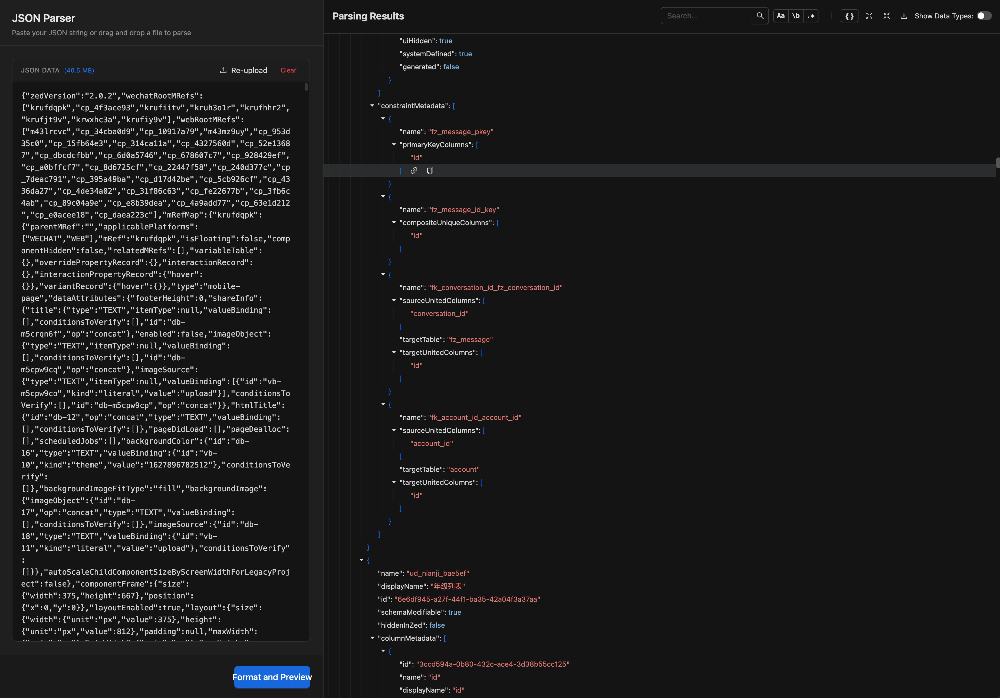
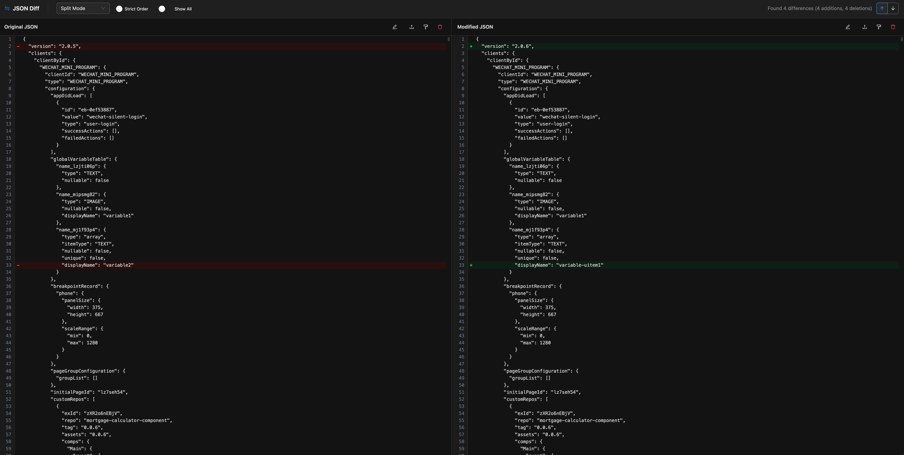
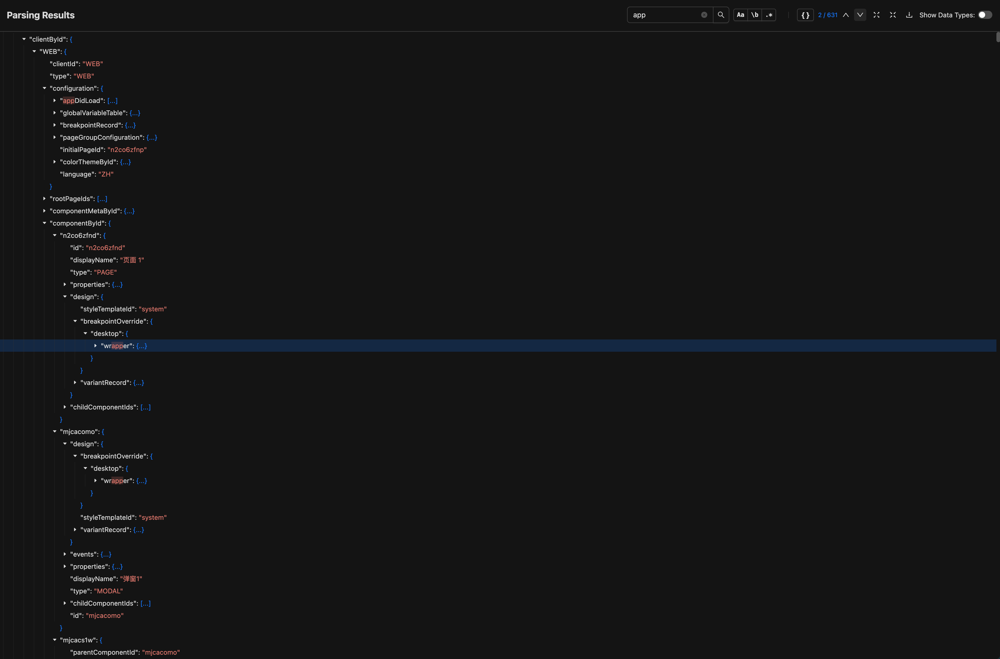

## 1. 简介与安装

欢迎使用 **JsonTools**！

这并不是市面上随处可见的普通 JSON 格式化工具。JsonTools 是专为解决**超大型 JSON 数据处理痛点**而生的高阶扩展程序。

当你面对数以十兆计的抓包数据，或是包含几十万个节点的巨型接口返回值时，普通工具往往会让浏览器瞬间假死。而 JsonTools 凭借底层的 Web Worker 离线计算与极致的 Virtua 虚拟列表渲染，不仅能做到**百万级数据秒开**，还内置了**防乱序的高级 Diff 比对引擎**和强大的**全方位检索系统**。

👉 **[点击前往 Chrome 网上应用店安装 JsonTools](#)** *(后续补充商店链接)*

---

## 2. 基础使用与极速预览 (JSON Preview)

### 2.1 开启独立预览窗口
点击 Chrome 浏览器右上角的 JsonTools 插件图标，在弹出的面板中选择 **JSON 预览 (Preview)**。
为了提供最沉浸的开发者排查体验，JsonTools 摒弃了局促的弹窗，会为你开启一个专属的宽屏独立标签页。

### 2.2 秒开巨型 JSON 数据
无论你手头的 JSON 数据有多庞大，只需将其粘贴到左侧的输入框中：
1. **零卡顿解析**：基于多线程架构，JsonTools 会在后台静默完成解析，绝不阻塞你的任何操作。
2. **无限流畅滚动**：右侧的格式化视图采用了虚拟滚动（Virtual Scroll）技术，即使是百万行级别的 JSON 树，你也可以随意拖拽滚动条，丝滑流畅。

### 2.3 沉浸式树状交互与一键拷贝
* **节点折叠/展开**：点击左侧的箭头，可以快速收起或展开庞大的对象和数组节点。底层引擎会智能过滤不必要的渲染，瞬间完成布局更替。
* **深层路径一键提取**：排查接口时，往往需要提取极深层级字段的取值路径（例如 `data.users[0].profile.avatar`）。在 JsonTools 中，你只需将鼠标悬浮在任意 Key 上，点击旁边出现的**复制图标**，即可一键将该节点的完整数据或访问路径提取到剪贴板。

---

## 3. 高阶功能：真·语义化比对 (JSON Diff)

如果你经常需要排查“为什么昨天正常的接口今天挂了”，那么 JsonTools 的 **Diff** 功能将是你的最强辅助。

### 3.1 告别乱序干扰，专注核心变更
传统的文本比对工具非常死板：只要对象内部的字段顺序发生了变化（比如 A 接口先返回 `id` 后返回 `name`，B 接口相反），它们就会标红报错。

**JsonTools 的 Diff 引擎是“懂 JSON 的”**：
1. 在面板中点击 **JSON 比对 (Diff)** 进入专属比对模式。
2. 将两段数据分别粘贴到 Left 和 Right 窗口。
3. 引擎会自动对所有对象进行**深层递归洗牌（排序）**，并智能忽略掉末尾多余的逗号差异。
4. 你看到的，将是**真正发生变动的业务字段**，而不是被无意义的乱序干扰的红绿代码块。

---

## 4. 全方位检索引擎 (Query Engine)

在几十万行的 JSON 中找一个特定的值无异于大海捞针，且使用浏览器原生的 `Ctrl+F` 会导致严重的页面卡顿。JsonTools 为此重写了整套检索机制：

* **极速离线搜索**：输入关键字后，庞大的计算工作全都在 Web Worker 中瞬间完成，匹配结果会高亮显示并带上发光特效。
* **高级过滤选项**：
  * **正则搜索 (Regex)**：支持使用正则表达式进行高级模式匹配。
  * **区分大小写 (Match Case)**：精准锁定。
  * **全词匹配 (Whole Word)**：排除相似词根的干扰。
  * **路径穿透搜索 (Path Search)**：你可以直接搜索像 `user.*.id` 这样的深层路径键名，快速定位嵌套极深的特定结构。

---

## 5. 个性化设置与语言支持

* **多语言切换**：点击插件主面板右上角的翻译图标，可以一键在中文（简体）和英文之间自由切换界面语言。
* **主题与视效**：JsonTools 默认采用对开发者极其友好的高对比度暗黑（Dark）主题，配合精致的代码语法高亮，长时间排查问题也不会感到刺眼。

---

*(如果觉得这款工具对你有帮助，欢迎在扩展面板底部点击支持作者的 Afdian 或 Ko-fi 链接，你的支持是我持续优化的最大动力 ❤)*