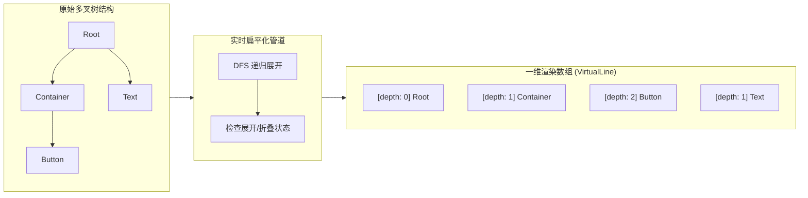

## 1. 背景与痛点：为什么我们需要重造一棵“树”？

在开发 **Zion 无代码编辑器** 时，画布左侧的“图层结构树 (Layers Tree)”以及“页面路由树 (Pages Tree)”是开发者最依赖的视图模块。
起初，我们考虑过使用 Ant Design 的 `Tree` 或市面上开源的树组件。但在低代码/无代码的真实业务场景下，这些传统组件很快就暴露出了主要的缺陷：

1. **DOM 节点溢出**：一个复杂的业务页面很容易拥有上千个互相嵌套的 UI 组件。如果不使用虚拟渲染，仅仅是展开整个大树就会导致浏览器主线程严重卡顿。
2. **高度自由的拖放互动 (DnD)**：用户可以在树中随意拖拽一个层级极深的子节点，不仅能改变它的同级顺序（排序），还能将其拖拽并跨级放入另外一个父节点中（层级嵌套）。
3. **数据一致性灾难**：在拖拽过程中，如果用户试图把一个“父容器”拖进它自己的“子容器”里（引发**循环依赖 / 循环引用**），或者把不允许包含子元素的组件（如纯文本节点）当做父容器，系统需要毫秒级的精准拦截，否则中间的可视化画布将直接崩溃。

为了解决这些底层难题，我从零开始主导并设计了 **LgdTree (Large Graph Data Tree)** 这个专门服务于 Zion 画布生态的高性能虚拟树组件。它基于现代化拖拽引擎 `@dnd-kit/core` 与虚拟列表技术，完美承载了 Zion 百万级组件配置的视图树重任。

---

## 2. 核心架构一：多叉树的“1D”虚拟化扁平降维

要想让一棵拥有上千节点的深层多叉树不卡顿，唯一的解法就是**虚拟列表 (Virtual List)**。但虚拟列表只能渲染一维数组（1D Array），无法直接理解树的 `children` 嵌套结构。

在 LgdTree 的架构中，我设计了一个非常高效的实时扁平化管道 (`flattenTree`)。在每次数据源发生变化或者节点折叠/展开状态改变时，我们会结合 DFS（深度优先遍历）算法，把树形结构扁平化为一个包含 `depth` (缩进深度) 属性的一维数组。



**核心降维逻辑**:
```typescript
// zed/components/LgdTree/utils/index.ts
function flatten(items: TreeData, parentId: string | null = null, depth = 0, result: TreeNode[] = []): TreeNode[] {
  items.forEach((item, index) => {
    const children = item.children || [];
    const newItem = { ...item, children, parentId, depth, index };
    result.push(newItem);
    if (children.length > 0) {
      flatten(children, item.id, depth + 1, result);
    }
  });
  return result;
}
```

利用生成的 `depth`，我们在 React 渲染时通过给每行 `VirtualLine` 加上 `padding-left: ${depth * 20}px` 的缩进，在视觉上视觉上呈现成了一棵树，但在浏览器的 DOM 树上，它永远只有视窗里可见的那十几行简洁的 `<li>` 节点。

---

## 3. 核心架构二：跨级拖拽与意图投影 (Projected Insertion)

LgdTree 最复杂的逻辑在于其定制的拖拽引擎。传统的排序库（如 `react-sortable-hoc`）只能在同层级改变顺序，而我们需要支持**跨层级的嵌套拖拽**。

为了实现这一点，我在 `components/DndMonitor/index.tsx` 中深度定制了 `dnd-kit` 的核心钩子。我们不直接操作真实数据，而是引入了 **意图投影 (Projection)** 的概念。

### 意图推导法则 (The Projection Logic)
当用户拖拽一个节点并在某个目标节点上悬浮时，系统必须根据鼠标的 **X 轴偏移量 (OffsetX)** 和 **Y 轴碰撞 (Collision)**，推导出用户的三个核心意图：
1. **上方插入**：插入为同级前驱节点。
2. **下方插入**：插入为同级后继节点。
3. **内部嵌套**：插入为目标节点的子元素 (Child)。

**核心拦截代码演示**：
```typescript
// zed/src/zed/components/LgdTree/components/DndMonitor/index.tsx
function onDragMove({ delta }: DragMoveEvent) {
  // 利用节流阀实时记录用户的横向拖拽偏移量
  // 横向移动的距离决定了用户是想保持同级 (同 depth)，还是想缩进成为子元素 (depth + 1)
  handleDragMove(delta.x);
}

function onDragOver({ over, active }: DragOverEvent) {
  // 结合当前的 activeId, overId 和 deltaX, 推算出实时投影位置 Projected
  const projected = getProjection(
    items,
    activeId,
    overId,
    dragOffset,   // Y轴偏移
    indentWidth   // 层级缩进单位 (比如 20px)
  );

  // 1. 循环依赖防腐层：一旦查明拖入的是自身的后代节点，立刻终止！
  if (isCircularDependency(activeId, projected.parentId)) {
     return;
  }

  // 2. 派发渲染层，渲染一条带有目标缩进深度的 "蓝色的拖拽落点指示线"
  setProjectedState(projected);
}
```

结合高频节流 (`throttle`)，我们把繁重的坐标解算和防腐校验从 UI 线程解耦，确保拖拽时依然能保持 60 FPS 的流畅体验。

### 微交互容错：防抖传感器与“点击/拖拽”冲突隔离 (Activation Constraints)
在真实的复杂树形组件交互中，有一个非常隐蔽的难点：**点击与拖拽的冲突**。
用户的鼠标往往是不精确的。当他们只想“单击”选中某一行时，手部轻微的抖动会产生 `1~2px` 的偏移，导致系统误判为“拖拽开始”，瞬间打断了选中逻辑并闪烁出拖拽占位符。
为了解决这个微交互痛点，我深度定制了 `@dnd-kit/core` 的 `PointerSensor`（指针传感器）：
```typescript
const sensors = useSensors(
  useSensor(PointerSensor, {
    activationConstraint: {
      distance: 5, // 核心防抖：必须按住并实际移动超过 5 像素，才正式激活拖拽引擎
    },
  })
);
```
仅仅是加了这一个 `distance: 5` 的激活约束阈值，就完美隔离了“轻微手抖的点击”和“明确意图的拖放”，从非常微小的细节处保障了低代码平台“稳如泰山”的交互质感。

---

## 4. 核心难点突破：领域解耦与数据双向同步 (`useNodeDnd`)

在 Zion 的编辑器中，左侧的 `LayersTree` (图层树) 和中间的 `CanvasPro` (画布) 实际上是对同一份 Schema Meta 数据的两套不同视图的映射。
为了保证拖拽完成后，数据能够安全地同步回 MobX Store 并触发全局重绘，我把具体的落地逻辑抽象成了领域特定的 Hook：`useNodeDnd`。

### 优雅的事件分发机制
LgdTree 组件本身是一个“纯视觉与逻辑计算组件”，它不关心具体的业务含义。拖放结束时，它只会向上传递两种原子级的事件：
* `onReorder({ src, dst })`：发生在同层级的拖拽排序。
* `onReparent({ dragItem, src, dst })`：发生了跨层级的改变父节点行为。

而在业务消费侧，`useNodeDnd.ts` 将这些泛化的 UI 动作翻译为非常精准的底层 Mutation 事务：

```typescript
// zed/src/zed/views/CanvasPro/views/LeftSidebar/views/MetaHierarchy/views/LayersTree/hooks/useNodeDnd.ts
export const useNodeDnd = (): Pick<LgdTreeProps, 'onReorder' | 'onReparent'> => {
  const { onMoveMetaChild } = useMetaChildsUpdate();
  const { onUpdateComponentParent } = useUpdateComponentParent();

  // 1. 同级排序事务
  const onReorder = useCallback((params) => {
    const parentMeta = getParentMeta(dragItem.id);
    // 触发底层画布同级的 Mobx Mutation，并由中间的可视化画布响应刷新
    onMoveMetaChild({
      metaId: parentMeta.id,
      from: params.src.index,
      to: params.dst.index,
    });
  }, [...]);

  // 2. 跨层级嵌套事务
  const onReparent = useCallback((params) => {
    const { dragItem, dst } = params;
    // 解析树节点 ID 到底层画布 Component ID 的映射
    const dragCompId = decodeMetaId(dragItem.id).componentId;
    const dropParentId = decodeMetaId(dst.parentId).componentId;

    // ...组装新的 Schema 数据拓扑，通知后端和画布重绘
    onUpdateComponentParent({
      componentId: dragCompId,
      newParentId: dropParentId,
      index: dst.index
    });
  }, [...]);

  return { onReorder, onReparent };
};
```

这种 **UI 抽象 -> 事件抛出 -> 领域 Hook 接管 -> Store 变异更新** 的标准单向数据流设计，彻底终止了原本视图组件和业务模型之间复杂的耦合。

---

## 5. 攻克难题四：双向联动视角下的自动展开与精准定位 (Auto-Scroll in Virtual Tree)

在可视化编辑器中，画布和左侧图层树必须是**双向联动**的：当用户在画布上点击某个极深层级的子组件时，左侧的图层树需要自动滚动并将该节点高亮显示。

在普通的树组件中，这只需要调用 `element.scrollIntoView()`。但在 **虚拟化树组件 (Virtualized Tree)** 中，这是一个技术难点：
1. **节点可能根本不存在**：目标节点可能被折叠在某个父级文件夹内，并没有被渲染在 DOM 上。
2. **不知道滚动距离**：因为树被折叠，目标节点的全局 Index 是未知的，也就无法计算它的 `scrollTop`。

为了解决这个痛点，我在 `useScrollToNode.ts` 中设计了一套非常巧妙的**自动追踪与重绘路由算法**：

```typescript
// zed/src/zed/components/LgdTree/hooks/useScrollToNode.ts (精简版)
export const useScrollToNode = (params: UseScrollToNodeParams) => {
  const { listRef, expandTreeNodes, indentationWidth, itemHeight } = params;

  const onScrollToNode = useCallback(
    (key: string) => {
      // 1. 业务层首先向上查找目标节点的所有父节点 ID，并更新到 expandedKeys 中
      // 2. 这会触发 flattenTree 重新计算 1D 数组 (expandTreeNodes)
      
      // 3. 我们利用 requestAnimationFrame 等待全新的 1D 数组生成完毕
      requestAnimationFrame(() => {
        // 获取目标节点在全新 1D 数组中的真实下标
        const idx = expandTreeNodes.findIndex(({ id }) => id === key);
        if (idx === -1 || !listRef.current) return;

        // 计算目标节点的物理 Y 轴高度和 X 轴横向缩进
        const offsetLeft = (expandTreeNodes[idx].depth + 1) * indentationWidth;
        const scrollTop = idx * itemHeight;

        // 调用 rc-virtual-list 的底层方法，进行像素级坐标跳跃
        listRef.current?.scrollTo({
          top: scrollTop,
          left: offsetLeft,
        });
      });
    },
    [expandTreeNodes, indentationWidth, itemHeight, listRef],
  );

  return { onScrollToNode };
};
```

通过这套算法，无论组件隐藏得有多深，系统都能在毫秒间完成**“祖先节点展开 -> 扁平树重算 -> 像素坐标解算 -> 滚动 API 调用”**的完整链路，实现了所见即所得的双向高亮驱动。

---

## 6. 总结：前端重型基建的破局之道

**LgdTree** 是我在 Zion 无代码平台中核心前端基建项目之一。
它不仅仅是一个长得好看的左侧菜单，它实际上是一个**披着树形外衣的高性能计算引擎**。

通过引入 **1D 扁平化虚拟渲染**、**基于 offsetX/offsetY 的投影意图推导算法**、以及**严格的事务防腐与解耦 Hook 体系**，它完美解决了大量 DOM 卡顿、交叉拖拽死循环等痛点。正有了如此坚如磐石的底层树形调度组件，Zion 的可视化画布能够支撑起数以千计的复杂业务节点和随心所欲的用户操作。
