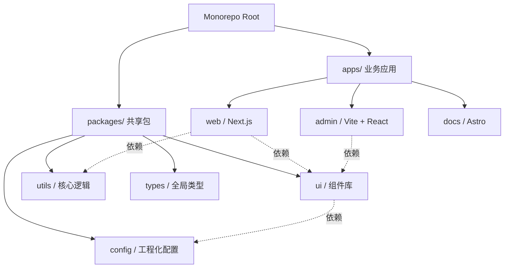

随着前端业务复杂度的指数级增长，多项目（Multi-repo）管理模式的弊端日益凸显：代码复用困难、依赖版本不一致、跨项目重构成本极高。Monorepo（单体仓库）架构因此成为了现代前端工程化的标配。

在 2024 年的今天，`pnpm` + `Turborepo` 已经成为了构建前端 Monorepo 的黄金组合。本文将深入探讨这套架构的优势及其实战落地经验。

## 1. 核心基石：pnpm Workspace

在包管理工具的演进史中，npm 和 Yarn 早期采用的扁平化 `node_modules` 结构虽然解决了嵌套过深的问题，但也引入了“幽灵依赖”（Phantom Dependencies）的隐患。

`pnpm` 通过基于内容寻址的全局存储（Store）和软链接（Symlink）机制，完美解决了这一问题。在 Monorepo 场景下，`pnpm workspace` 提供了极其优雅的多包管理能力。

### 配置 Workspace
在项目根目录创建 `pnpm-workspace.yaml`：

```yaml
packages:
  - 'apps/*'      # 业务应用层
  - 'packages/*'  # 共享基础层
```

通过 `workspace:*` 协议，我们可以轻松实现内部包的相互引用，且保证在本地开发时始终使用最新代码，无需繁琐的 `npm link`。

```json
// apps/web/package.json
{
  "dependencies": {
    "@my-org/ui": "workspace:*",
    "@my-org/utils": "workspace:*"
  }
}
```

## 2. 构建加速器：Turborepo 深度解析

Monorepo 最大的挑战在于构建性能。当仓库中包含数十个包时，全量构建的时间是不可接受的。Vercel 开源的 Turborepo 通过智能的任务编排和缓存机制，显著提升了构建速度。

### 任务拓扑排序
在 `turbo.json` 中，我们可以定义任务之间的依赖关系。Turborepo 会根据依赖图（Dependency Graph）最大化地并行执行任务。

```json
{
  "$schema": "https://turbo.build/schema.json",
  "pipeline": {
    "build": {
      "dependsOn": ["^build"], // 依赖于所有内部依赖包的 build 任务
      "outputs": ["dist/**", ".next/**"]
    },
    "lint": {
      "dependsOn": [] // 无依赖，可立即并行执行
    },
    "dev": {
      "cache": false,
      "persistent": true
    }
  }
}
```

### 远程缓存（Remote Caching）
Turborepo 最具优势的特性是缓存。它不仅能在本地缓存构建产物，还能通过 Vercel 或自定义的 Remote Cache Server 在团队成员和 CI/CD 之间共享缓存。

如果同事 A 已经构建过某个特定的 commit，同事 B 拉取代码后执行 `turbo build`，耗时将从几分钟缩短至几百毫秒（Cache Hit）。

## 3. 业务踩坑：Turborepo 的缓存穿透与隔离部署

Turborepo 虽然快得像魔法，但如果配置不当，在企业级 CI/CD 中很容易翻车。

### 3.1 幽灵构建 (Ghost Builds) 与环境污染

在前后端分离的项目中，我们经常使用环境变量（如 `NEXT_PUBLIC_API_URL`）来区分测试环境和生产环境。
假设你在本地跑了 `turbo build`，打包出了一个连着**测试后端**的产物。
这时，CI 服务器开始打包**生产环境**，Turborepo 计算了一下源码 Hash：“咦，源码没变，直接命中缓存！”
结果是：**生产环境被部署了一个连着测试后端的包。这是致命的生产事故。**

**破局方案：显式声明环境变量依赖**
你必须在 `turbo.json` 中，将所有会影响构建产物内容的环境变量声明在 `env` 字段中。

```json
{
  "$schema": "https://turbo.build/schema.json",
  "pipeline": {
    "build": {
      "dependsOn": ["^build"],
      "outputs": ["dist/**", ".next/**"],
      // 告诉 Turbo：如果下面任何一个环境变量变了，缓存立刻失效，必须重新打包！
      "env": [
        "NODE_ENV",
        "NEXT_PUBLIC_API_URL",
        "CI"
      ]
    }
  }
}
```
也可以在 `.env` 或 `package.json` 同级放一个 `.env.local` 文件，并在 `turbo.json` 配置 `globalEnv`，它会影响所有的 pipeline。

### 3.2 Docker 部署的痛点：依赖体积膨胀与 `turbo prune`

在 Monorepo 里单独部署某一个微应用（比如 `apps/admin`）时，最粗暴的做法是把整个仓库的 `10GB` 的 `node_modules` 连同各种不相关的子包全打进一个 Docker 镜像里。
这会导致镜像体积庞大，拉取极慢。

Turborepo 提供了强大的 `prune` 命令来优雅地进行依赖瘦身。它的核心思想是：**“只拷贝这个子应用真正依赖的源码和 package.json”。**

在 Dockerfile 的构建阶段（Builder Stage）：

```dockerfile
# 1. Prune 阶段
FROM node:18-alpine AS pruner
WORKDIR /app
RUN yarn global add turbo
# 会在 out/ 目录下生成一个“极简版”的 Monorepo，只包含 admin 及其依赖的 packages
RUN turbo prune --scope=admin --docker

# 2. 安装与构建阶段
FROM node:18-alpine AS builder
WORKDIR /app
# 首先只拷贝 package.json 结构（利用 Docker 缓存层加速 pnpm install）
COPY --from=pruner /app/out/json/ .
COPY --from=pruner /app/out/pnpm-lock.yaml ./pnpm-lock.yaml
RUN corepack enable pnpm && pnpm install --frozen-lockfile

# 然后拷贝真正的源码进行构建
COPY --from=pruner /app/out/full/ .
RUN pnpm turbo run build --filter=admin...

# 3. 运行阶段 (Runner)
# ...
```
通过这种方式构建出的 Docker 镜像，体积通常能缩减 70% 以上，且完美利用了 Docker 缓存层。

## 4. 架构实战：目录结构设计


一个健壮的 Monorepo 需要清晰的边界划分。以下是我们团队目前采用的标准目录结构：



### 共享配置的最佳实践
为了保证代码风格的一致性，我们将 ESLint、Prettier、TypeScript 的配置抽离到 `packages/config` 中。

例如，在 `packages/config/tsconfig.base.json` 中定义基础类型规范，然后在各个子包中继承：

```json
// apps/web/tsconfig.json
{
  "extends": "@my-org/config/tsconfig.base.json",
  "compilerOptions": {
    "jsx": "preserve"
  }
}
```

## 总结

`pnpm` 解决了底层依赖的物理隔离与链接问题，而 `Turborepo` 解决了上层任务的调度与缓存问题。两者的结合，使得前端团队能够在享受 Monorepo 带来的代码复用与一致性红利的同时，依然保持极佳的开发与构建体验。

对于中大型前端团队而言，这套架构已经成为支撑业务快速迭代的关键基础设施。
