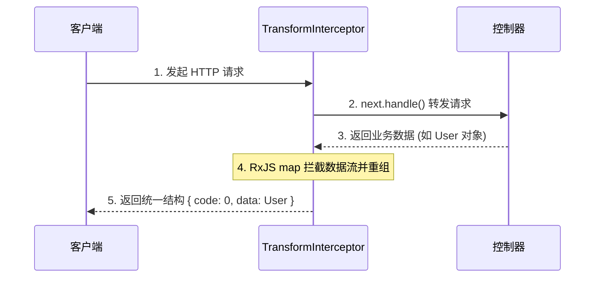
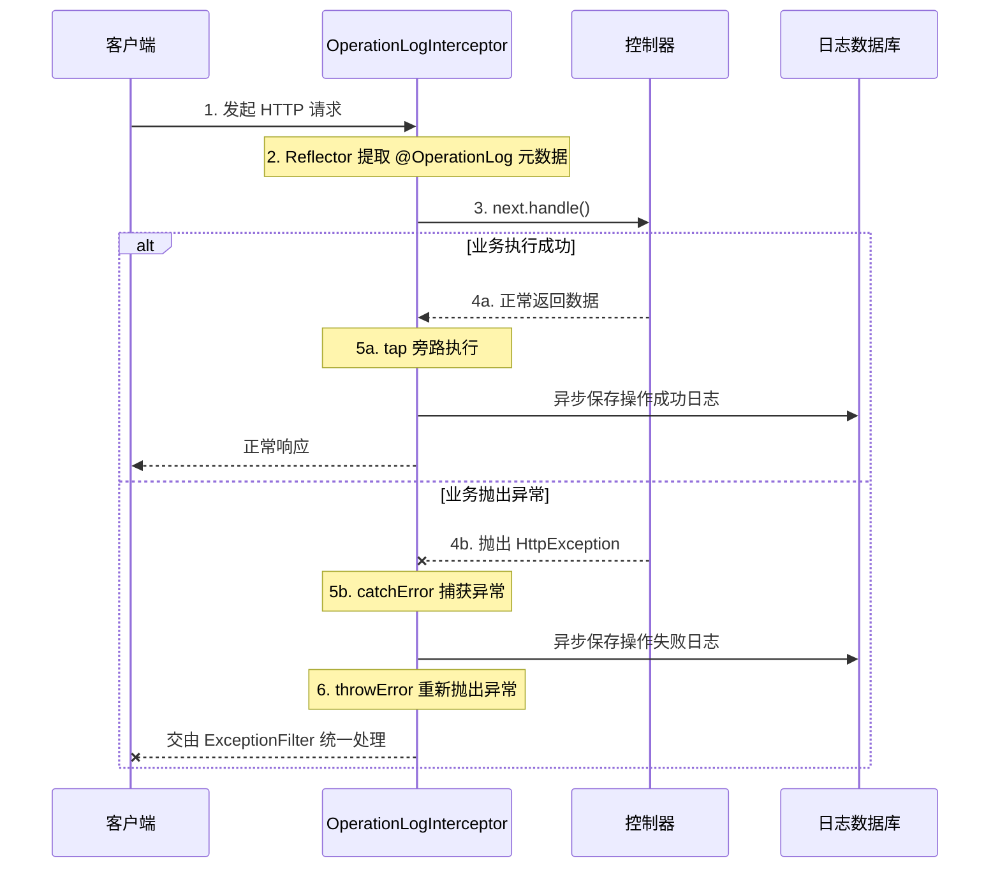

在 NestJS 的请求生命周期中，拦截器（Interceptor）是核心特性之一。拦截器底层依赖于 RxJS 的 Observable 数据流，能够在路由函数执行前后绑定额外的逻辑，修改返回结果或处理抛出的异常。

本篇结合项目中实际封装的两个拦截器——**全局响应拦截器**与**操作日志拦截器**，探讨面向切面编程（AOP）在 NestJS 中的工程实践及设计原理。

---

## 1. 统一数据结构：TransformInterceptor

在前后端分离开发中，前端通常期望后端返回固定的 JSON 结构（如 `{ code: 0, message: 'success', data: ... }`）。如果在每个 Controller 中手动组装这个结构，会导致代码冗余。

利用拦截器，可以拦截控制器返回的原始数据，并在发送给客户端之前统一封装。



```typescript
// apps/server/src/interceptors/transform.interceptor.ts
import {
  CallHandler,
  ExecutionContext,
  Injectable,
  NestInterceptor,
} from "@nestjs/common";
import { Observable } from "rxjs";
import { map } from "rxjs/operators";

export interface Response<T> {
  code: number;
  message: string;
  data: T | null;
}

@Injectable()
export class TransformInterceptor<T> implements NestInterceptor<
  T,
  Response<T>
> {
  intercept(
    _context: ExecutionContext,
    next: CallHandler,
  ): Observable<Response<T>> {
    // next.handle() 触发路由处理函数的执行，并返回一个 Observable
    return next.handle().pipe(
      // 使用 RxJS 的 map 操作符对 Controller 返回的结果进行二次映射
      map((data: unknown) => ({
        code: 0,
        message: "success",
        data: data === undefined ? null : (data as T),
      })),
    );
  }
}
```

### 原理解析与思考

- **拦截器的底层逻辑 `next.handle()`：**
  `CallHandler` 接口包裹了目标 Controller 方法。调用 `next.handle()` 会执行业务逻辑并返回一个 RxJS `Observable`。这意味着数据的返回是延迟计算（Lazy Evaluation）的。在数据被发送给客户端前，可以通过 RxJS 操作符（如 `map`, `tap`, `catchError`）对数据流进行处理。
- **为什么不使用 Express/Fastify 的中间件（Middleware）？**
  中间件作用于底层的 HTTP 协议级别，其上下文中只有 `req` 和 `res` 对象。中间件无法直接获取 NestJS 序列化前的原生 JavaScript 对象，修改响应体较为困难（通常需要重写 `res.send` 方法）。
  而拦截器作用于框架的执行上下文中，`map` 接收到的 `data` 即为 Controller 返回的原生对象。直接对该对象进行结构重组，再由框架底层统一完成 JSON 序列化，实现方式更加清晰解耦。
- **关于 `undefined` 的边界处理：**
  如果控制器方法没有 `return` 任何值，`data` 将是 `undefined`。在标准的 JSON 序列化（`JSON.stringify`）中，值为 `undefined` 的属性会被直接丢弃，导致前端拿到的响应体中缺少 `data` 字段。在拦截器中将其兜底为 `null`，可确保接口数据结构的稳定性。

---

## 2. 非侵入式审计日志：OperationLogInterceptor

在后台系统中，记录用户的操作日志（如操作人、时间、接口、结果）是常见需求。如果直接在每个 Controller 中调用 `LogsService` 写入数据库，业务逻辑将与审计逻辑深度耦合。

`OperationLogInterceptor` 结合自定义装饰器，实现了非侵入式的日志采集。



首先，在 Controller 上声明元数据：

```typescript
// apps/server/src/user/user.controller.ts
@Post()
@OperationLog('创建新用户')
addUser(@Body() user: CreateUserDto) {
  return this.userService.create(user); // 业务代码不包含日志逻辑
}
```

随后，拦截器会在请求处理期间提取元数据并记录日志：

```typescript
// apps/server/src/interceptors/operation-log.interceptor.ts
@Injectable()
export class OperationLogInterceptor implements NestInterceptor {
  constructor(
    private readonly reflector: Reflector,
    private readonly logsService: LogsService,
  ) {}

  intercept(context: ExecutionContext, next: CallHandler): Observable<unknown> {
    // 1. 通过反射获取当前路由是否包含 @OperationLog 装饰器
    const metadata = this.reflector.get<OperationLogMetadata>(
      OPERATION_LOG_KEY,
      context.getHandler(),
    );
    if (!metadata) return next.handle(); // 无装饰器则直接放行

    const request = context.switchToHttp().getRequest();
    const response = context.switchToHttp().getResponse();

    // 2. 拷贝并脱敏请求体（防止明文密码入库）
    const bodyCopy = { ...request.body };
    if ("password" in bodyCopy) bodyCopy.password = "***";
    const data = JSON.stringify(bodyCopy);

    // 3. 监听请求结果流
    return next.handle().pipe(
      tap(() => {
        // 请求成功分支：记录 HTTP 状态码
        const statusCode = response.statusCode || HttpStatus.OK;
        this.saveLog({
          path: request.path,
          method: request.method,
          data,
          result: statusCode,
          userId: request.user?.id,
          description: metadata.description,
        });
      }),
      catchError((error: unknown) => {
        // 请求失败分支：从 HttpException 中提取错误码
        const statusCode =
          error instanceof HttpException
            ? error.getStatus()
            : HttpStatus.INTERNAL_SERVER_ERROR;
        this.saveLog({
          path: request.path,
          method: request.method,
          data,
          result: statusCode,
          userId: request.user?.id,
          description: metadata.description,
        });

        // 必须重新抛出异常
        return throwError(() => error);
      }),
    );
  }
}
```

### 原理解析与思考

- **`ExecutionContext` 的作用：**
  拦截器的入参是 `ExecutionContext`（继承自 `ArgumentsHost`），而不是直接传入 HTTP Request 对象。这是因为 NestJS 的设计是协议无关的。如果该拦截器应用于 GraphQL 或微服务环境，仍可复用这段核心 AOP 逻辑，只需调用对应的方法（如 `GqlExecutionContext.create(context)`）切换上下文即可。
- **为什么使用 RxJS 的 `tap` 操作符？**
  `tap` 是 RxJS 中用于处理副作用（Side Effects）的操作符。它的特点是旁路执行：可以在数据流经过时触发异步日志记录操作，但不会修改原数据流，也不会阻断数据返回给客户端的过程。
- **为什么必须在 `catchError` 中执行 `throwError(() => error)`？**
  当内部业务代码抛出异常（如 `ForbiddenException`）时，控制流会进入 `catchError`。如果在 `catchError` 中仅调用 `this.saveLog()` 而不抛出错误，异常会被拦截器隐式捕获并吞没。这会导致外层的异常过滤器无法接收到错误，前端最终会收到一个状态码为 HTTP 200 的空响应。
  因此，记录完失败日志后，必须使用 `throwError` 重新抛出异常，让流维持错误状态，交由全局 `ExceptionFilter` 接管处理。

## 总结

无论是统一响应格式的 `map`，还是执行旁路日志记录的 `tap` 与异常拦截的 `catchError`，NestJS 的拦截器机制体现了 AOP（面向切面编程）的设计思想。

通过拦截器，可以将响应格式化、审计记录等通用逻辑从核心 Service 业务代码中解耦，从而保证 Controller 与 Service 的职责单一性。
