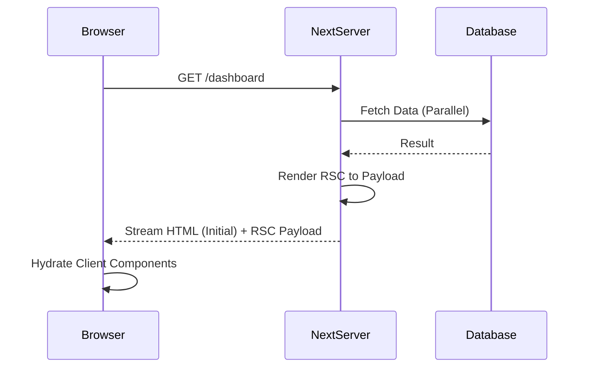

Next.js 的 App Router 引入了 React Server Components (RSC) 作为核心的默认架构，彻底改变了全栈 Web 应用的开发范式。与传统的 Pages Router 相比，App Router 不仅仅是路由定义的改变，更是组件渲染模型、数据获取方式以及客户端/服务端边界的一次重构。

## 1. 嵌套布局与局部路由 (Nested Layouts)

在早期的 Pages Router 中，页面切换往往意味着整个 React 树的重新挂载，或是需要通过自定义的高阶组件维持状态。App Router 通过文件系统路由实现了真正的嵌套布局。

通过在目录中定义 `layout.tsx`，Next.js 能够识别出哪些部分是持久化的，哪些部分是动态变化的。在路由跳转时，只有变化的 `page.tsx` 会被重新渲染，而上层的 `layout.tsx` 保持挂载状态。

```tsx
// app/dashboard/layout.tsx
// 这是一个 Server Component，仅在服务端获取侧边栏数据
import Sidebar from './Sidebar';

export default async function DashboardLayout({ children }: { children: React.ReactNode }) {
  const user = await fetchCurrentUser(); // 服务端直接获取数据，无需 API 中转
  
  return (
    <div className="flex h-screen">
      <Sidebar user={user} />
      <main className="flex-1 overflow-y-auto p-6">
        {children}
      </main>
    </div>
  );
}
```

这种架构带来了 **Partial Rendering (局部渲染)**：当用户在 `/dashboard/settings` 和 `/dashboard/profile` 之间切换时，`DashboardLayout` 及其内部的 `Sidebar` 状态（如滚动位置、输入框内容）将得以保留，仅有 `children` 部分被重新请求和渲染。

## 2. React Server Components (RSC) 的运行机制

RSC 是 App Router 的灵魂。不同于传统的 SSR（服务端渲染后发送 HTML），RSC 允许组件在服务端执行并生成一种特殊的二进制格式（RSC Payload），随后在客户端进行流式解析。

### RSC Payload 包含什么？
1. **渲染后的组件树结构**：描述了 UI 的层级。
2. **传递给 Client Components 的 Props**：序列化后的数据。
3. **占位符**：指示哪些部分是客户端组件，需要加载对应的 JS Bundle。



这种模式最大的优势在于 **Zero Bundle Size**：所有仅在服务端运行的逻辑（如数据库驱动、大型 Markdown 解析库）都不会被包含在发送给浏览器的 JS 包中。

### 2.1 业务踩坑：Server 向 Client 传值的序列化黑洞

在 RSC 架构中，最让新手抓狂的报错莫过于：
`Error: Event handlers cannot be passed to Client Component props.`
或者
`Error: Only plain objects can be passed to Client Components from Server Components.`

**为什么会报错？**
当你在 Server Component 里查询了数据库，拿到了一个 `user` 对象，然后把它当做 prop 传给了一个带有 `'use client'` 指令的客户端组件时，这个 `user` 对象必须跨越 **网络边界（Network Boundary）**。

Next.js 在底层必须把这个对象序列化（变成 JSON 字符串），通过 HTTP 传给浏览器，浏览器再反序列化。
- **支持序列化的**：字符串、数字、布尔值、纯对象（Plain Object）、数组、Promise（没错，Promise 可以传！）。
- **不支持序列化的**：函数（Function / 方法）、Class 实例（比如 `new Date()` 或者 Prisma 返回的带有内部方法的实体对象）。

```tsx
// ❌ 灾难写法
import ClientProfile from './ClientProfile';

export default async function ServerPage() {
  const user = await db.user.findUnique({ id: 1 });
  // user 如果是一个复杂的 Prisma 模型，它内部可能挂载了某些不可序列化的 getter
  // 这会导致整个页面渲染崩溃！
  return <ClientProfile user={user} />
}
```

**工业级解法：DTO 转换与 `server-only` 防御**

为了防止服务端那些不可见人的秘密（比如带有密码哈希、数据库实例方法的对象）意外泄漏到客户端，最佳实践是：
1. 永远在传递前将对象手动解构为纯对象（DTO, Data Transfer Object）。
2. 使用 `server-only` 包作为防御性编程。

```tsx
// lib/data.ts
import 'server-only'; // 如果有客户端组件试图 import 这个文件，构建时直接报错！

export async function getUserDTO(id) {
  const user = await db.user.findUnique({ id });
  // 剥离敏感信息和类方法，只返回纯数据
  return {
    id: user.id,
    name: user.name,
    createdAt: user.createdAt.toISOString() // Date 转字符串
  };
}

// app/page.tsx
import ClientProfile from './ClientProfile';
import { getUserDTO } from '@/lib/data';

export default async function ServerPage() {
  const safeUser = await getUserDTO(1);
  return <ClientProfile user={safeUser} /> // ✅ 安全穿越边界
}
```

## 3. Streaming 与 Suspense


App Router 原生支持流式渲染。通过 React `Suspense`，我们可以将页面拆分为多个独立的区块，优先渲染静态部分，而将耗时的数据获取逻辑包裹在 `Suspense` 中。

```tsx
import { Suspense } from 'react';
import { PostList, PostSkeleton } from './components';

export default function Page() {
  return (
    <section>
      <h1>Latest Posts</h1>
      <Suspense fallback={<PostSkeleton />}>
        <PostList /> {/* 内部进行异步数据获取 */}
      </Suspense>
    </section>
  );
}
```

Next.js 会立即发送页面的 HTML 骨架，并在服务端数据准备就绪后，通过同一个 HTTP 连接将剩余的 HTML 片段“推”给浏览器。这种方式显著提升了 **TTFB (Time to First Byte)** 和 **FCP (First Contentful Paint)**。

## 4. Server Actions：重塑数据突变

传统的表单提交需要开发者编写 API 路由、处理请求验证、执行数据库操作，然后再通过前端 `fetch` 获取结果。Server Actions 将这一过程简化为函数调用。

Server Actions 本质上是基于 HTTP POST 的 RPC（远程过程调用）。当你在客户端调用一个声明了 `'use server'` 的函数时，Next.js 会自动发起一个请求，并处理参数序列化与结果返回。

```tsx
// app/actions.ts
'use server'

import { db } from '@/lib/db';
import { revalidatePath } from 'next/cache';

export async function createPost(formData: FormData) {
  const title = formData.get('title') as string;
  const content = formData.get('content') as string;

  // 1. 校验与持久化
  await db.post.create({ data: { title, content } });

  // 2. 触发服务端缓存失效
  // 这会通知 Next.js 重新生成 /posts 路径的 RSC Payload
  revalidatePath('/posts');
}
```

在客户端使用时，只需将其绑定到 `form` 的 `action` 属性：

```tsx
// app/components/PostForm.tsx
import { createPost } from '../actions';

export default function PostForm() {
  return (
    <form action={createPost}>
      <input name="title" required />
      <textarea name="content" required />
      <button type="submit">发布文章</button>
    </form>
  );
}
```

这种模式不仅消除了 API 胶水代码，还支持 **Progressive Enhancement (渐进式增强)**：即使在浏览器禁用 JavaScript 的情况下，表单提交依然可以通过标准的 HTML Form 机制工作。

## 5. 业务踩坑：丧心病狂的四层缓存体系

很多开发者从 Vite 或 CRA 转到 Next.js App Router 后，最大的疑惑就是：“我明明数据库里的数据已经改了，为什么页面刷新还是旧的？”

这是因为 Next.js 默认开启了极为激进的**四层缓存体系**。如果你不理解它们，你的应用将充满幽灵数据。

1. **Request Memoization (请求记忆)**：
   在同一个 Server Component 渲染周期内，如果你 `fetch` 了同一个 URL 两次，Next.js 会拦截第二次请求，直接复用第一次的结果。这个缓存**只在单次渲染期间存活**。
2. **Data Cache (数据缓存)**：
   这是跨越多次请求的**持久化缓存**。Next.js 拦截了原生的 `fetch`，默认把所有返回结果存到文件系统或 CDN。除非你配置 `fetch(url, { cache: 'no-store' })`，否则它永远不会向源站发新请求！
3. **Full Route Cache (完整路由缓存)**：
   如果在构建阶段，页面没有使用任何动态函数（如 `cookies()`, `headers()`），Next.js 会把整个页面的 RSC Payload 和 HTML 静态化存起来（类似早期的 SSG）。
4. **Router Cache (客户端路由缓存)**：
   这是浏览器内存里的缓存。当用户在客户端 `<Link>` 跳转时，被访问过的 RSC Payload 会被缓存在内存中（默认存活 30 秒 到 5 分钟），按浏览器的返回键瞬间秒开。

**工业级解法：按需爆破缓存 (On-demand Revalidation)**

在真实业务中，我们通常会在 Server Actions 里修改数据后，精准地炸掉特定的缓存：

```tsx
'use server'
import { revalidateTag, revalidatePath } from 'next/cache';

export async function updateArticle(id, content) {
  await db.article.update(id, content);
  
  // 💣 爆破 Data Cache：重新拉取带有这个 tag 的所有 fetch 请求
  revalidateTag(`article-${id}`);
  
  // 💣 爆破 Full Route Cache 和 客户端 Router Cache
  // 让用户下次访问 /blog 列表页时看到最新数据
  revalidatePath('/blog');
}
```
熟练掌控这四层缓存，是精通 Next.js App Router 的终极分水岭。

## 6. 总结


Next.js App Router 通过 RSC 实现了组件级的服务端渲染，通过嵌套布局优化了客户端导航体验，并通过 Server Actions 统一了前后端交互模型。虽然它引入了更高的架构复杂度（如理解 `use client` 边界），但其带来的性能上限和开发效率提升，标志着 React 开发进入了真正的全栈时代。
