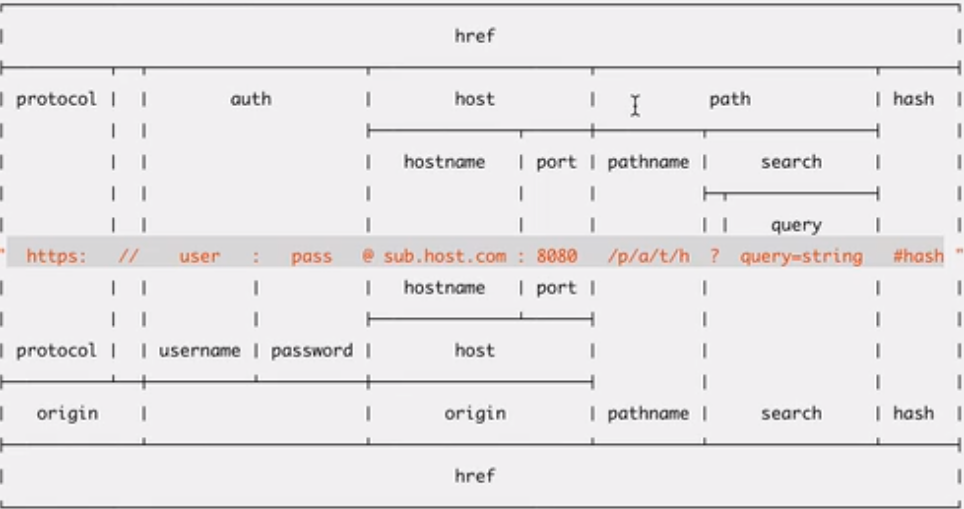
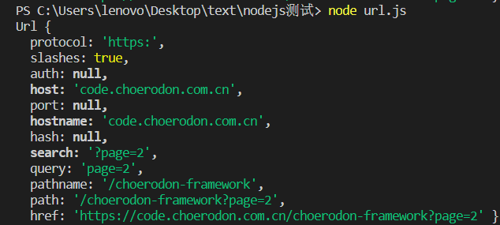
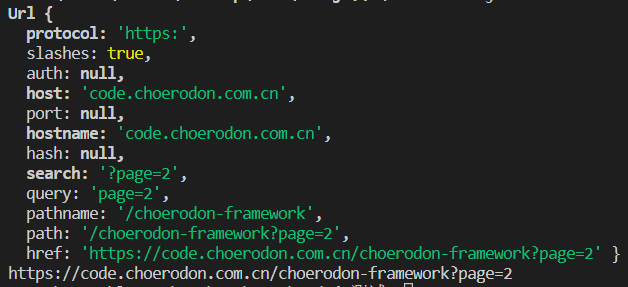
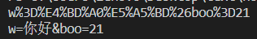
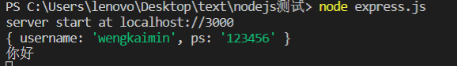
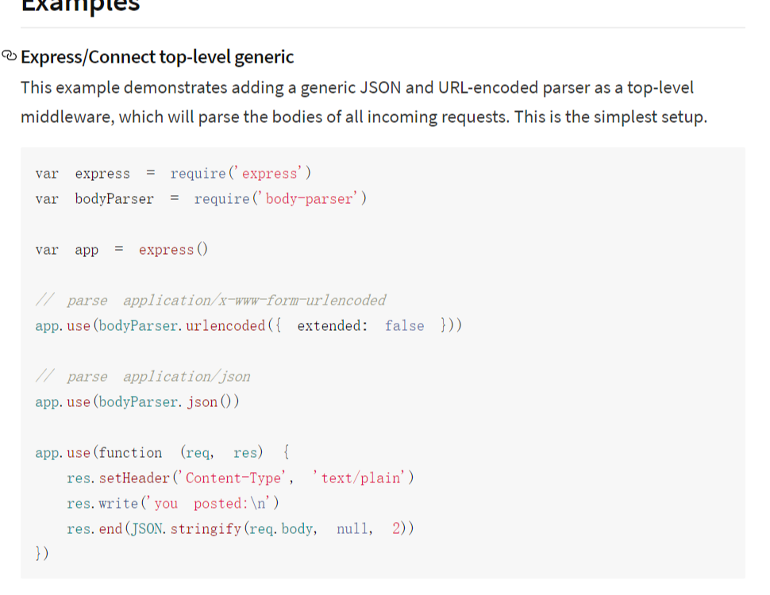
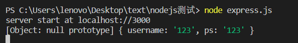
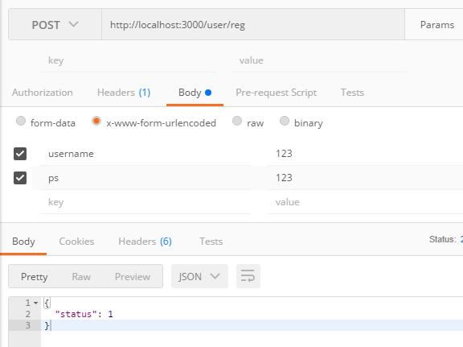
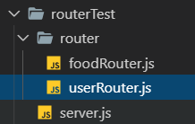

### 1.node自带模块fs文件管理

[nodejs官方文档](http://nodejs.cn/api/fs.html)

#### 1.1 readdir和readdirSync的区别

> 两者都用与读取文件或者文件夹里的文件有啥

---

`fs.readdir(path[, options], callback)`异步函数，需要传入一个回调

- `path` <string> <buffer><url>
- `options`
  - `encoding` **默认值:** `'utf8'`。
  - `withFileTypes`  **默认值:** `false`。
- `callback`(两个参数，错误回调优先)
  - `err`  默认值为null
  - `files`

错误处理代码：

```javascript
let dirs = fs.readdir('./hello.txt', (err, files) => {
    if(err){
        console.log(err);
    }else{
        console.log(files);
    }
})
```


---

`fs.readdirSync(path[, options])` 同步函数

- `path` 
- `options`
  - `encoding`**默认值:** `'utf8'`。
  - `withFileTypes`**默认值:** `false`。
- 返回:

错误处理代码：

```javascript
try {
    let dirs = fs.readdirSync('./node.js'); //异步
}
catch (err) {
    console.log('粗ucol');
    console.log(err)
}
```

因为同步函数没有异步那样的处理错误机制，因此需要配合`try catch`才能捕获错误的同时又不暂停下面的代码运行。

#### 1.2 mkdir和mkdirSync 创建文件

[mkdir文档](http://nodejs.cn/api/fs.html#fs_fs_mkdir_path_options_callback)

#### 1.3 rename 重命名 和 rmdir删除文件

[rename](http://nodejs.cn/api/fs.html#fs_fs_rename_oldpath_newpath_callback)

[rmdir](http://nodejs.cn/api/fs.html#fs_fs_rmdir_path_options_callback)

#### 1.4 writeFile 覆盖写入 和appendFile添加写入文件

#### 1.5 readFile 读取文件内容(二进制数据流)

```javascript
fs.readFile('name.txt',(err,data)=>{
    console.log(data.toString('UTF-8'))
})
```

可以用toString('UTF-8')的方法将文字提取出来；

或者直接在配置项中

```javascript
fs.readFile('name.txt', 'UTF-8', (err, data) => {
    console.log(data)
})
```

#### 1.6 fs.stat(path[, options], callback)

[fs.stat](http://nodejs.cn/api/fs.html#fs_fs_stat_path_options_callback)

---

### 2. url内置模块



#### 2.1 url.parse()和url.format()

[url.parse()](http://nodejs.cn/api/url.html#url_url_parse_urlstring_parsequerystring_slashesdenotehost)将其解析成一个url对象，从而可以从url中获取href中的各种值



[url.format()](http://nodejs.cn/api/url.html#url_url_format_url_options)将对象再拼起来

```javascript
let url = require("url");
let urlStirng = 'https://code.choerodon.com.cn/choerodon-framework?page=2'
let urlObj = url.parse(urlStirng);
console.log(urlObj);
let string = url.format(urlObj);
console.log(string)
```



---

### 3. querystring内置模块

[querystring](http://nodejs.cn/api/querystring.html#querystring_query_string)

#### 3.1 stringfy()对象转成字符串，parse()根据符号解析querystring

#### 3.2 escape()和unescape()编码与解码

```javascript
let qs = require('querystring')
// let string = 'name=weng&pass=12121&sex=0&hello=111'
// let obj = qs.parse(string);
// console.log(obj)
let string = 'w=你好&boo=21';
let code = qs.escape(string);
console.log(code);
let parseCode = qs.unescape(code);
console.log(parseCode);
```



---

### 4. nodemailer 第三方模块

基本的发送邮箱代码：

```javascript
'use strict';
const nodemailer = require('nodemailer');

// 创建发送邮件的请求对象
let transporter = nodemailer.createTransport({
    host: 'smtp.qq.com', //发送方用的邮箱
    port: 465, //端口号
    secure: true, // true for 465, false for other ports
    auth: {
        user: '736653759@qq.com', // 发生方邮箱地址
        pass: 'hebnhkaruvzlbfdg' // mtp验证码
    }
});

// send mail with defined transport object
let mailObj = {
    from: '"Fred Foo 👻" <736653759@qq.com>',
    to: '736653759@qq.com',
    subject: 'Hello test nodemailer ✔', // Subject line
    text: 'Hello world of node.js?', // plain text body
    html: '<b>Hello world?</b>' // html body
};


// main().catch(console.error);
setTimeout(() => {
    transporter.sendMail(mailObj, (err, data) => {
        console.log(data)
    })
}, 2000)
```

### 5. error对象

错误对象本身没有终止代码执行，所以你需要throw抛出异常

```javascript
let err = new Error('发生错误');
throw err;
```

### 6. 爬虫案例 （方法2待补充）

- 获取目标网站

- 分析网站内容  [cheerio](https://cheerio.js.org/) 可以用`jquery`中的选择器进行网页内容分析

  [cheerio中文文档](https://www.jianshu.com/p/629a81b4e013)

  ```javascript
  const cheerio = require('cheerio');
  let $ = cheerio.load('<div><p>hello</p>');
  const img = $('div img').attr('src');
  console.log(img)
  ```

  将一组html转化为类dom,可以通过cheerio实现jq中的$选择器，从而实现一些dom获取的操作。

- 获取有效信息，下载或者其他操作 

[http](http://nodejs.cn/api/http.html#http_http_get_url_options_callback)

[https](http://nodejs.cn/api/https.html)

根据不同的请求选择不同的协议。

<span style='color:red'>*爬图片的代码</span>

##### 方法1：

**downLoad.js文件**

```javascript
const fs = require('fs');
const path = require('path');
const request = require('request');
var dirPath = path.join(__dirname, "MarvelImages"); //__dirname当前路径，加上要创建的文件名
function downloadfile(downloadUrl, index) {
    // 创建文件夹
    if (!fs.existsSync(dirPath)) { // 同步查询文件夹是否存在
        fs.mkdirSync(dirPath); // 同步创建文件夹
        console.log(dirPath + '文件创建成功');
    }
    let imgUrlArray = downloadUrl.split('/');  //分割Url
    let imgUrl = imgUrlArray[imgUrlArray.length - 1]; //获取文件名
    let filename = imgUrl;
    let stream = fs.createWriteStream(path.join(dirPath, filename));
    if (downloadUrl.indexOf('http') !== -1) {
        request(downloadUrl).pipe(stream).on('error', (err) => {
            console.log(err);
        }).on('close', () => {
            console.log(`文件【${filename}】下载完`);
            // callback(null, dest);
        })
    } else {
        console.log(`${downloadUrl}文件找不到`);
    }
}
module.exports = downloadfile;
```

**splider.js**

```javascript
const http = require('http');
const cheerio = require('cheerio');
let downLoad = require('./downLoad');
let mavelUrl = 'http://marvel.mtime.com/'
http.get(mavelUrl, (res) => {
    const { statusCode } = res; //状态码
    const contentType = res.headers['content-type']; //请求到的文件类型
    console.log(`请求到的文件类型` + contentType);
    // 做安全判断
    let error;
    if (statusCode !== 200) {
        error = new Error('请求失败.' + `Status Code: ${statusCode}错误`);
    } else if (!/^text\/html/.test(contentType)) {
        error = new Error('Invalid content-type.\n' + `Expected text/html but received ${contentType}`)
    }
    if (error) { //如果出错的话直接来到这一行
        console.error(error.message);
        res.resume(); //重置缓存
        return false;
    }
    // 数据是分段的,每一次接受到一段数据都会触发data事件，chunk就是数据片段
    // 所以必须用一个string来当总chunk，每一次请求一个拼接一个
    let rawData = '';
    res.on('data', (chunk) => {
        rawData += chunk.toString('UTF-8');
    });
    res.on('end', () => {
        let $ = cheerio.load(rawData);
        $('img').each((index, ele) => {
            let imgSrc = $(ele).attr('src');
            downLoad('http://marvel.mtime.com/' + imgSrc, index);
        })
    })
}).on('error', (err) => {
    console.log('请求错误');
})
```

##### 方法2：

### 7. express框架（写api）

[express中文文档](http://www.expressjs.com.cn/4x/api.html)

#### 7.1.简要用法

先明确一点，接口的构成要素有啥

- ip
- port
- pathname
- method (get post put delete)

**写一个get接口**

```javascript
const express = require('express');
const app = express() //express实例化
// 监听3000端口
app.listen(3000, () => {
    console.log('server start at localhost://3000');
})

// 写一个get接口
app.get('/user/login', (req, res) => {
    console.log(req.query); //接受到的值
    console.log('你好');
    res.send({ status: 'success' });
})

// 协议 http https
```

地址栏中输入http://localhost:3000/user/login?username=wengkaimin&ps=123456



控制台中就能接受到传过来的数据，通过req.query接受get方法传过来的参数

**写一个post接口**

> `express`不提供解析消息体的功能，所以req.body是拿不到主体的，这边提供了一个第三方插件
>
> `body-parser`

[body-parser npm](https://www.npmjs.com/package/body-parser)



```javascript
const express = require('express');
const app = express() //express实例化
const bp = require('body-parser');
// express中app.use表示使用一个中间件
// parse application/x-www-form-urlencoded解析表单格式数据
app.use(bp.urlencoded({ extended: false }))
// parse application/json
app.use(bp.json());
// 监听3000端口
app.listen(3000, () => {
    console.log('server start at localhost://3000');
})

// 写一个get接口
app.get('/user/login', (request, res) => {
    console.log(request.query);
    console.log('你好');
    let { username, ps } = request.query;
    if (username === 'weng' && ps === '1234') {
        res.send({ status: 'success' });
    } else {
        res.send('登陆失败')
    }
});

// 写一个post接口
app.post('/user/reg', (request, result) => {
    // request.body获取数据，消息体，请求体
    // let { us, ps } = request.body;
    console.log(request.body);
    // express不能直接解析消息体
    // 需要第三方插件 body-parser
    result.send({ status: 1 })
})
// 协议 http https
```






#### 7.2 中间件 middlewear

- 内置中间件 static
- 自定义中间件（全局）（局部）
- 第三方中间件（body-parse) (拦截器)

<!--一定要在合适的地方next()-->

```javascript
const express = require('express');

const app = express();

// 中间件
// 全局中间件,所有请求发送之前都要走这一步
app.use('/', (req, res, next) => {
    let { token } = req.query;
    if (token) {
        res.send("OK");
        next(); //是否继续往下执行
    } else {
        res.send('缺少token');
    }
    
})

app.get('/test1', (requst, result) => {
    console.log('test1')
    console.log(requst.query)
})

app.get('/test2', (requst, result) => {
    console.log('test2')
})

app.listen(3000, () => {
    console.log('server start at localhost://3000')
})
```

#### 7.3 静态资源目录 static

> 指定一个目录，可以被访问 像apache的www一样

部署静态资源文件

```javascript
const express = require('express');
const path = require('path');
const app = express();
const dirPath = path.join(__dirname, '/static');
console.log(dirPath);

app.use(express.static(dirPath)); //可以从这个路径直接获取到资源

app.listen(3000, () => {
    console.log('server start at localhost://3000')
})
```

#### 7.4 路由



server.js

```javascript
const express = require('express');
const app = express();

let userRouter = require('./router/userRouter');
let foodRouter = require('./router/foodRouter');

app.use('/user', userRouter);
app.use('/food', foodRouter)


app.listen(3000, () => {
    console.log("server start localhost:3000");
})
```

userRouter.js

```javascript
const express = require('express');
const router = express.Router();

router.get('/add', (req, res) => {
    res.send('user add')
})

router.get('/del', () => {
    console.log('user delete')
})

module.exports = router
```


### 8. MongoDB **非关系型数据库**


#### 8.1 指令基本

- mongodb 数据库名
- mongod 命令行启动数据库命令
- mongo 命令行操作数据库指令
- mongoose node 操作数据库插件    [中文文档](http://www.mongoosejs.net/docs/cnhome.html)
- show dbs
- show collections
