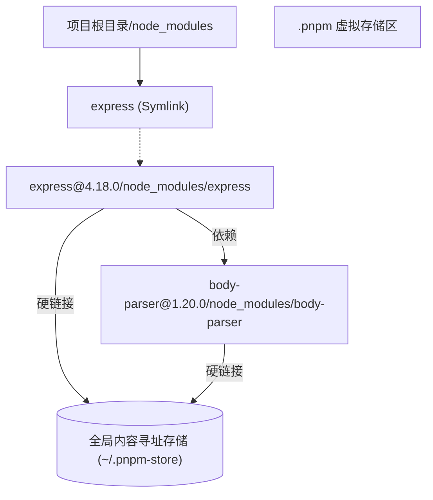

在 Node.js 生态中，`node_modules` 的结构演进史就是一部解决“依赖地狱”的斗争史。从 npm v3 开始引入的扁平化结构虽然解决了路径过长的问题，却带来了更隐蔽的工程隐患：**幽灵依赖 (Phantom Dependencies)**。

## 1. 扁平化结构的代价

在 npm v2 时代，依赖是嵌套安装的。如果 A 依赖 B，B 依赖 C，结构如下：
`node_modules/A/node_modules/B/node_modules/C`。
这导致了严重的依赖冗余和 Windows 下的路径长度限制（260 字符）。

为了解决这些问题，npm v3 和 Yarn 引入了 **Hoisting (提升)** 机制，将所有间接依赖尽可能地安装到根目录的 `node_modules` 中。

### 什么是幽灵依赖？
由于模块被提升到了顶层，开发者可以在代码中直接 `import` 那些并未在 `package.json` 中显式声明的库。

```json
// package.json
{
  "dependencies": {
    "express": "^4.18.0"
  }
}
```

```javascript
// 开发者可以直接导入 body-parser，因为它是 express 的依赖，被提升到了顶层
import bodyParser from 'body-parser'; 
```

**风险点：**
1. **不可靠性**：一旦 `express` 在升级时移除了对 `body-parser` 的依赖，你的项目会立即在本地或 CI 环境中报错。
2. **版本冲突**：如果项目中有多个库依赖了不同版本的同一个间接依赖，提升机制可能会导致版本覆盖，引发难以排查的 Bug。

## 2. pnpm 的破局：基于 Symlink 的严格隔离

pnpm 抛弃了完全的扁平化，引入了 **基于内容寻址的存储 (Content-addressable storage)** 和 **严格的符号链接 (Symlink)** 机制。

### pnpm 的 node_modules 布局
当你使用 pnpm 安装依赖时，根目录的 `node_modules` 仅包含你在 `package.json` 中声明的包。这些包实际上是到 `.pnpm` 目录下的软链接。

```text
node_modules
├── express -> .pnpm/express@4.18.0/node_modules/express
└── .pnpm
    ├── express@4.18.0
    │   └── node_modules
    │       ├── express (实际文件或硬链接)
    │       └── body-parser -> ../../body-parser@1.20.0/node_modules/body-parser
    └── body-parser@1.20.0
        └── node_modules
            └── body-parser
```



### 核心优势
1. **严格限制访问**：由于根目录 `node_modules` 下没有 `body-parser`，代码中 `import 'body-parser'` 会直接报错。这强制开发者必须显式声明依赖。
2. **解决多版本冗余**：在扁平化结构中，如果一个包无法被提升（版本冲突），它会被多次安装。pnpm 通过全局 Store 确保同一个文件在磁盘上只存在一份。
3. **极速安装**：由于使用了硬链接，安装过程主要是创建链接的操作，速度显著优于 npm/yarn。

## 3. 深度解析：Symlink 寻址原理

Node.js 的模块解析算法在遇到符号链接时，会解析出其 **真实路径 (realpath)**。

当 `express` 尝试加载 `body-parser` 时：
1. 它在自己的 `node_modules`（即 `.pnpm/express@4.18.0/node_modules/`）中寻找。
2. 找到了指向 `../../body-parser@1.20.0/...` 的软链接。
3. Node.js 顺着链接找到真实文件并加载。

这种设计巧妙地利用了 Node.js 的原生机制，既实现了物理上的单实例存储，又实现了逻辑上的严格隔离。

## 4. 业务踩坑与兼容性处理

虽然 pnpm 的隔离机制极其优秀，但在老旧项目的迁移过程中，不可避免会遇到一些“历史遗留问题”。

### 4.1 兼容“幽灵依赖”：shamefully-hoist

很多老旧的 Webpack 插件（如 `eslint-plugin-*` 或某些 Babel preset）在内部硬编码了寻找子依赖的逻辑，或者默认其子依赖一定会被提升到根目录。

在迁移 pnpm 时，这些工具往往会报 `Module not found`。作为临时过渡方案，你可以配置 `.npmrc` 放宽隔离限制：

```ini
# .npmrc
# 创建半隔离的提升结构，让不规范的第三方包能找到依赖
shamefully-hoist=true
```
但请注意，这是**饮鸩止渴**。长期来看，应该通过显式声明依赖或使用 `packageExtensions` 来彻底解决：

```json
// package.json (pnpm 的补丁机制)
"pnpm": {
  "packageExtensions": {
    "bad-webpack-plugin@1.0.0": {
      "peerDependencies": {
        "webpack": "^4.0.0"
      }
    }
  }
}
```

### 4.2 Peer Dependencies 的严格校验

在 npm/Yarn 中，如果 A 依赖 React 17，B 依赖 React 18，包管理器可能会强行提升一个版本，导致另一个组件在运行时崩溃。

pnpm 处理 `peerDependencies` 的策略极其严格：**它会为不同的 Peer 依赖组合，创建不同的虚拟实例。**

例如，如果两个不同的包同时依赖了 `button-ui`，但提供了不同版本的 `react` 作为 peer：

```text
.pnpm
├── button-ui@1.0.0(react@17.0.2)
└── button-ui@1.0.0(react@18.2.0)
```
pnpm 会在 `.pnpm` 目录下创建两个 **独立的硬链接实例**。这完美解决了 React Hooks 中的 `Invalid hook call`（通常由于项目中存在多个 React 实例导致）问题。

但这也意味着，在开发 Monorepo 组件库时，如果你没有在子包中正确声明 `peerDependencies`，pnpm 绝对不会像 Yarn 那样“默默帮你找齐”，而是直接抛出错误。这就倒逼开发者必须保证依赖声明的绝对严谨。

## 5. 依赖治理的最佳实践


在使用 pnpm 构建大型 Monorepo 或复杂项目时，建议遵循以下原则：

- **严格模式**：保持 `hoist=false`（pnpm 默认行为），确保依赖边界清晰。
- **Peer Dependencies 处理**：pnpm 会为不同的 peer 依赖组合创建不同的虚拟路径，这解决了 npm 中长期存在的 peer 依赖冲突问题。
- **利用 pnpm-workspace.yaml**：在多包管理中，通过 `workspace:*` 协议引用内部包，确保版本同步。

## 5. 总结

幽灵依赖是前端工程化中的隐患。pnpm 通过结构优化，并辅以 Symlink 和硬链接技术，在不牺牲性能的前提下，有效解决了依赖隔离与复用的矛盾。对于追求稳定性的中大型项目，迁移至 pnpm 是合理的架构选择。
