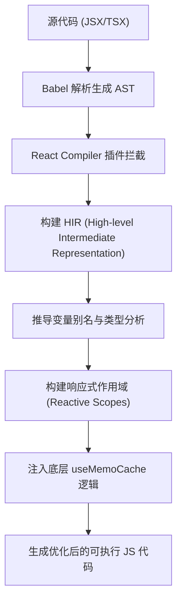

React 19 是 React 演进史上的一个重要里程碑。与以往仅仅增加上层 API 不同，React 19 在编译层和异步数据流控制上进行了深度的架构调整。其核心目标是降低开发者在状态同步和性能优化上的心智负担，使代码逻辑更加贴近原生 JavaScript 的编写直觉。

本文将从工程实践与底层原理的角度，详细解析 React 19 的核心特性，并探讨其对现代前端架构的影响。

## 1. React Compiler：从手动缓存到 AOT 静态分析

在 React 19 之前，React 的渲染模型依赖于开发者手动进行 Memoization（记忆化）。为了防止父组件渲染导致子组件的不必要更新，或者防止复杂计算在每次渲染时重复执行，代码中往往充斥着 `useMemo`、`useCallback` 以及 `React.memo`。

这种模式存在两个主要问题：
1. **代码侵入性强**：业务逻辑被大量的缓存依赖数组（Dependency Arrays）包裹，可读性下降。
2. **依赖维护困难**：开发者容易遗漏依赖项，导致闭包陷阱（Stale Closures），或者添加了不必要的依赖，导致缓存失效。

### 1.1 编译器工作原理

React Compiler（曾用名 React Forget）是一个基于 Babel 的预先（AOT）编译器。它在构建阶段对 React 组件和 Hook 进行静态分析（Static Analysis），构建出控制流图（Control Flow Graph）和数据依赖图。

Compiler 的核心机制是将组件内部的变量分配到不同的“响应式作用域（Reactive Scopes）”中。如果某个作用域内的输入依赖没有发生变化，Compiler 会利用底层注入的 `useMemoCache` Hook 直接返回缓存的输出，从而跳过当前作用域的重新计算和子组件的 Diff 过程。



### 1.2 编译前后的代码映射

以一个常见的数据过滤和事件绑定组件为例：

```tsx
// 优化前的常规写法 (React 18)
function ProductList({ products, filter }) {
  // 需要手动处理计算缓存
  const filteredProducts = useMemo(() => {
    return products.filter(p => p.category === filter);
  }, [products, filter]);

  // 需要手动保持引用稳定
  const handleSelect = useCallback((id: string) => {
    trackEvent('select', id);
  }, []);

  return (
    <ul>
      {filteredProducts.map(product => (
        <ProductItem key={product.id} item={product} onSelect={handleSelect} />
      ))}
    </ul>
  );
}
```

在 React 19 环境下，开发者只需编写最基础的业务逻辑，Compiler 会在编译后生成类似以下的底层代码（抽象伪代码表示）：

```javascript
// Compiler 编译后的底层逻辑 (伪代码)
import { c as _useMemoCache } from "react/compiler-runtime";

function ProductList({ products, filter }) {
  // 分配一个包含 4 个插槽的缓存数组
  const $ = _useMemoCache(4);

  let filteredProducts;
  // 校验依赖插槽 $[0] 和 $[1]
  if ($[0] !== products || $[1] !== filter) {
    filteredProducts = products.filter(p => p.category === filter);
    // 更新缓存
    $[0] = products;
    $[1] = filter;
    $[2] = filteredProducts;
  } else {
    // 命中缓存
    filteredProducts = $[2];
  }

  let handleSelect;
  if ($[3] === Symbol.for("react.memo_cache_sentinel")) {
    handleSelect = (id) => { trackEvent('select', id); };
    $[3] = handleSelect;
  } else {
    handleSelect = $[3];
  }

  return /* JSX 渲染 */;
}
```

Compiler 的引入使得 UI 的更新链路更加确定，大幅减少了因为人为疏忽导致的性能退化。


### 1.3 业务踩坑：Compiler 的“逃生舱”与失效场景 (Bailouts)

很多开发者以为接入了 React Compiler，就可以随便写代码了。实际上，Compiler 的静态分析非常严格，如果你的代码触犯了 **Rules of React**，编译器会直接放弃优化（这个过程被称为 **Bailout**），并且在没有任何报错的情况下退回到原始的未缓存状态。

**最常见的导致 Compiler 罢工的坏味道：**

1. **直接修改外部变量 (Mutating external variables)**：
   React 要求组件必须是纯函数。如果你在组件渲染期，修改了一个定义在组件外部的变量，Compiler 会检测到这种非纯行为并 Bailout。
   ```tsx
   let renderCount = 0; // 外部变量
   function BadComponent() {
     renderCount++; // ❌ 违反纯函数规则，Compiler 放弃优化
     return <div>{renderCount}</div>;
   }
   ```

2. **直接修改 Props 或 State (Mutating Props/State)**：
   ```tsx
   function UserProfile({ user }) {
     user.name = "Alice"; // ❌ 直接修改 props 对象，Bailout!
     return <div>{user.name}</div>;
   }
   ```

3. **动态调用 Hooks**：
   把 Hooks 放在 `if` 或 `for` 循环里，这不仅会引发运行时的 React 报错，Compiler 在静态分析阶段也会直接拦截并 Bailout。

**如何排查 Bailout？**
在工业级项目中，我们必须引入官方的 ESLint 插件 `eslint-plugin-react-compiler`。它不仅能在编写代码时标红这些破坏规则的代码，还能明确告诉你“这行代码导致了编译器罢工”。

```json
// .eslintrc.json
{
  "plugins": ["react-compiler"],
  "rules": {
    "react-compiler/react-compiler": "error"
  }
}
```
如果确实遇到了极其复杂的第三方库导致 Compiler 误判，你可以使用 `"use no memo"` 指令作为逃生舱，显式地告诉编译器跳过当前组件的优化。

## 2. Actions 架构：标准化数据突变 (Data Mutations)


在客户端应用中，数据获取（Query）通常与数据突变（Mutation）交织在一起。React 18 通过 Suspense 规范了数据获取，但在表单提交、数据更新等 Mutation 场景，开发者仍需要手动管理 `isPending`、`error` 状态，并在请求完成后手动重置 UI。

React 19 引入了 **Actions** 概念，将异步数据流与原生 HTML `<form>` 元素深度绑定，提供了一套标准化的状态流转范式。

### 2.1 useActionState 与原生表单的结合

`useActionState` 取代了早期的 `useFormState`，专门用于管理带有异步副作用的表单状态。

```tsx
import { useActionState } from 'react';

// 异步 Action 函数
async function updateProfile(prevState: any, formData: FormData) {
  const username = formData.get('username');
  try {
    const res = await fetch('/api/profile', {
      method: 'POST',
      body: JSON.stringify({ username }),
    });
    if (!res.ok) throw new Error('Update failed');
    return { success: true, message: 'Saved successfully' };
  } catch (err) {
    return { success: false, error: err.message };
  }
}

export default function ProfileEditor() {
  // state 包含 action 的返回值，formAction 绑定至 <form>，isPending 提供提交状态
  const [state, formAction, isPending] = useActionState(updateProfile, null);

  return (
    <form action={formAction}>
      <input type="text" name="username" disabled={isPending} />
      <button type="submit" disabled={isPending}>
        {isPending ? 'Saving...' : 'Save'}
      </button>
      {state?.error && <div className="text-red-500">{state.error}</div>}
      {state?.success && <div className="text-green-500">{state.message}</div>}
    </form>
  );
}
```

通过这种方式，表单的默认提交行为会被 React 拦截，且异步请求期间的 `isPending` 状态更新不再阻塞其他的交互输入，保证了应用在网络延迟期间的响应性。

### 2.2 useOptimistic：乐观 UI 更新的最佳实践

在复杂的业务系统中（如即时通讯、点赞操作），为了提升感知性能，通常会在网络请求完成前预先更新 UI（即“乐观更新”）。如果请求失败，则回滚到之前的状态。

React 19 原生提供了 `useOptimistic` Hook，将这一复杂的状态机逻辑封装为标准 API。

```tsx
import { useOptimistic, useState } from 'react';

export function LikeButton({ initialLikes, postId }) {
  const [likes, setLikes] = useState(initialLikes);

  // optimisticLikes 是乐观状态，addOptimisticLike 是触发器
  const [optimisticLikes, addOptimisticLike] = useOptimistic(
    likes,
    // 定义乐观状态的更新规则
    (currentState, optimisticValue: number) => currentState + optimisticValue
  );

  const handleLike = async () => {
    // 1. 立即更新 UI（无需等待网络请求）
    addOptimisticLike(1);
    
    try {
      // 2. 发起真实的网络请求
      const newLikes = await api.submitLike(postId);
      // 3. 请求成功，同步真实数据
      setLikes(newLikes);
    } catch (e) {
      // 若请求失败，组件重新渲染时，useOptimistic 会自动丢弃乐观状态，回退到原始的 likes 值
      console.error("Failed to like");
    }
  };

  return <button onClick={handleLike}>Likes: {optimisticLikes}</button>;
}
```

## 3. 全新的 use Hook：解决条件异步读取的痛点

在 React 的规则体系中，Hooks 不能在条件语句（`if`）或循环中使用。这在处理按需加载的数据或 Context 时带来了架构上的冗余。

React 19 提供了一个名为 `use` 的特殊 API。它既可以用于读取 Promise，也可以用于读取 Context。最重要的是，**`use` 可以在条件语句内部调用**。

### 3.1 配合 Suspense 的按需读取

当 `use` 接收一个尚未 Resolve 的 Promise 时，它会抛出该 Promise，触发外层最近的 `<Suspense>` 回退逻辑（Fallback）。一旦 Promise 完成，React 会从挂起点恢复渲染。

```tsx
import { use, Suspense } from 'react';

function UserComments({ commentsPromise }) {
  // use 可以在 if 语句内使用。当 commentsPromise 未完成时，组件挂起
  const comments = use(commentsPromise);
  
  if (comments.length === 0) {
    return <div>No comments found.</div>;
  }

  return (
    <ul>
      {comments.map(c => <li key={c.id}>{c.text}</li>)}
    </ul>
  );
}

export default function Post({ showComments, commentsPromise }) {
  return (
    <div>
      <h1>Post Content</h1>
      {showComments && (
        <Suspense fallback={<div>Loading comments...</div>}>
          {/* 将 Promise 传递给子组件进行拆解 */}
          <UserComments commentsPromise={commentsPromise} />
        </Suspense>
      )}
    </div>
  );
}
```

这种模式鼓励开发者将数据获取（Fetching）的逻辑向上提升，将数据解包（Unwrapping）的逻辑下沉，进一步实现了视图与数据流的解耦。

## 4. 总结

React 19 的更新核心可以概括为“底层自动化”与“数据流规范化”。

*   **React Compiler** 在编译阶段解决了由于闭包和对象引用变更引发的不必要重渲染问题，开发者不再需要过度依赖人工 Memoization。
*   **Actions** 和 **useOptimistic** 为表单和异步交互提供了状态机的标准解法，避免了离散的布尔值状态导致的代码复杂性。
*   **use Hook** 结合 Suspense，构建了一套更符合直觉的异步资源加载模型。

对于前端架构而言，这些特性意味着我们可以将架构的重心从“如何避免组件卡顿”转移到“如何设计更合理的数据流与领域模型”上，推动整体工程质量向更成熟的方向演进。
