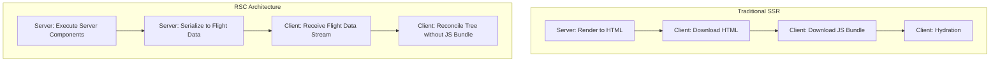

React Server Components (RSC) 代表了 React 渲染模型的根本性演进。本文将深入分析其架构差异与底层实现。

## 1. 渲染架构差异：SSR vs RSC

传统的 SSR (Server-Side Rendering) 仅仅是在服务端生成初始的 HTML 字符串，到达客户端后，仍然需要下载全量的 React 组件代码并执行 Hydration（水合）以绑定事件。

RSC 引入了真正的“服务端组件”。这些组件仅在服务端执行，产出的是一种被称为 React Flight 的序列化数据格式，而非原生 HTML。客户端接收到 Flight 数据后，直接将其协调（Reconcile）到现有的组件树中。



## 2. 状态边界与 "use client"

在 RSC 中，服务端组件无法访问浏览器 API，也无法使用 `useState` 或 `useEffect`。所有的交互与状态管理必须委托给客户端组件。

```tsx
// ServerComponent.tsx (默认在服务端执行)
import db from '@/lib/db';
import ClientInteractiveButton from './ClientButton';

export default async function ProductDetails({ id }) {
  // 直接在组件内访问数据库
  const product = await db.query('SELECT * FROM products WHERE id = ?', [id]);
  
  return (
    <div>
      <h1>{product.name}</h1>
      {/* 将数据作为 props 传递给客户端组件 */}
      <ClientInteractiveButton productId={product.id} />
    </div>
  );
}

// ClientButton.tsx
'use client'; // 明确声明边界
import { useState } from 'react';

export default function ClientInteractiveButton({ productId }) {
  const [count, setCount] = useState(0);
  return <button onClick={() => setCount(c => c + 1)}>Add {count}</button>;
}
```

## 3. RSC Payload (Flight 数据格式) 探秘

RSC 与传统 SSR 最大的区别在于数据传输层。RSC 返回的不是 HTML 字符串，也不是纯 JSON，而是一种被称为 **React Flight** 的流式序列化协议。

让我们看一个真实的 RSC Payload 示例。假设我们有以下服务端组件：

```tsx
// ServerComponent.tsx
import ClientComponent from './ClientComponent';

export default async function Page() {
  const data = await fetch('https://api.example.com/data').then(res => res.json());
  return (
    <div className="container">
      <h1>{data.title}</h1>
      <ClientComponent user={data.user} />
    </div>
  );
}
```

当浏览器请求这个组件时，它接收到的 Flight 流大致如下：

```text
0:["$","div",null,{"className":"container","children":[
  ["$","h1",null,{"children":"Hello RSC"}],
  ["$","@1",null,{"user":{"name":"Alice","id":123}}]
]}]
1:I{"id":"./src/ClientComponent.tsx","chunks":["client-bundle"],"name":"default"}
```

**解析：**
- `0:` 代表渲染树的根节点结构。注意它用特殊的占位符 `@1` 表示这里有一个客户端组件。
- `1:I` 代表客户端组件的模块引用（Module Reference）。它告诉 React："当你解析到 `@1` 时，请去下载 `client-bundle.js` 并实例化里面的 `default` 导出"。

这种格式支持**流式传输 (Streaming)**。只要服务端获取到部分数据，就可以立刻下发对应的行，React 在客户端可以即刻协调（Reconcile）并渲染出可见部分，这在 Suspense 边界下表现得尤为强大。

## 4. RSC 与 SSR 的协同工作流

许多人容易混淆 RSC 和 SSR。实际上，在如 Next.js App Router 的架构中，它们是**协同工作**的。

1. **首屏加载 (Initial Load)**：
   - 服务端首先运行 RSC，生成 Flight 树。
   - 然后，**服务端 SSR 引擎**会接管这棵 Flight 树，并在服务端直接将其渲染成完整的 HTML 字符串下发给浏览器（为了 SEO 和首屏 FCP）。
   - 浏览器展示 HTML，下载客户端组件的 JS 代码，并进行 Hydration。

2. **路由导航 (Client Navigation)**：
   - 当用户点击 `<Link>` 跳转时，浏览器不再请求整个页面的 HTML。
   - Next.js 会向服务端发起一个特殊的请求（带有 `RSC: 1` 请求头）。
   - 服务端仅运行目标页面的 RSC，并只返回 **Flight 数据流**。
   - 客户端 React 接收流数据，精准地更新 DOM，整个过程没有任何全局刷新。

## 5. Server Actions：打通读写的最后一公里

RSC 完美解决了**“服务端读取数据”**的问题，但如何将用户操作**“写回”**服务端呢？在传统的 SPA 中，我们需要手动编写 API 路由，然后通过 `fetch` 提交数据。

React 19 引入的 **Server Actions** 彻底改变了这一范式。它允许你在客户端组件中直接调用定义在服务端的函数。

```tsx
// actions.ts (服务端执行)
'use server'

export async function updateProfile(formData: FormData) {
  const name = formData.get('name');
  await db.updateUser({ name });
  // 触发当前路径的重新验证，拉取最新的 RSC payload
  // revalidatePath('/profile'); 
}

// ProfileForm.tsx (客户端执行)
'use client'
import { updateProfile } from './actions';

export default function ProfileForm() {
  // 这里的 updateProfile 实际上是一个被编译器转换过的 RPC 调用
  return (
    <form action={updateProfile}>
      <input name="name" />
      <button type="submit">Save</button>
    </form>
  );
}
```

在底层，构建工具会将 `'use server'` 的函数转换成一个隐藏的 HTTP POST 接口。当表单提交时，React 会自动序列化参数，发起 RPC 请求。这使得我们可以完全抛弃胶水 API 层的编写，实现了真正的全栈类型安全与逻辑闭环。

## 6. 架构优势与边界权衡


RSC 的主要优势在于显著减小了客户端的 JavaScript Bundle 体积，因为依赖的大型库（如 Markdown 解析器、日期处理库）可以仅保留在服务端。
然而，这也引入了新的复杂性：开发者必须清晰地划分组件的执行环境，并在 Server 和 Client 之间处理好序列化数据的传递边界。
