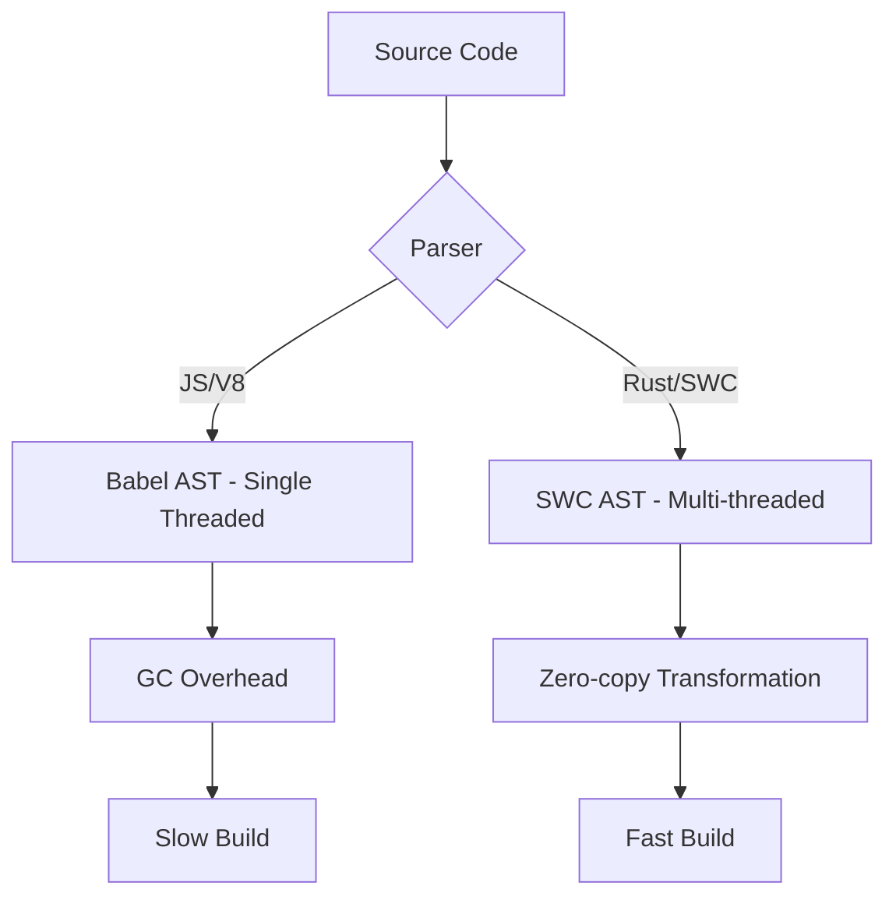

前端工具链正在经历一场由底层系统语言驱动的重构浪潮。随着大型 Monorepo 规模的膨胀，基于 V8 引擎执行的 Node.js 工具在内存碎片处理和单线程执行效能上已经触及了物理瓶颈。Rust 凭借其内存安全特性和极高的执行效率，成为了下一代前端基础设施的首选。

## 1. 性能瓶颈：V8 GC 与单线程限制

传统的 JavaScript 工具（如 Babel, ESLint）运行在 Node.js 环境中。虽然 V8 引擎极其强大，但在处理数万个文件的 AST (Abstract Syntax Tree) 转换时，面临两个核心问题：
1. **垃圾回收 (GC) 压力**：频繁创建和销毁 AST 节点会导致大量的内存分配，触发 V8 的 Stop-the-world GC，造成明显的卡顿。
2. **单线程模型**：虽然 Node.js 有 Worker Threads，但在 JS 层进行大规模数据交换的开销抵消了并行计算的收益。

## 2. Rust 的底层优势：内存安全与并行化

Rust 通过所有权 (Ownership) 系统在编译期管理内存，消除了运行时的 GC 开销。在前端编译场景下，这意味着更稳定的内存占用和更快的执行速度。

### 2.1 SWC 的架构优势

SWC (Speedy Web Compiler) 是 Babel 的 Rust 替代品。它利用了 Rust 的以下特性：
* **Rayon 并行计算**：自动将 AST 遍历任务分发到所有 CPU 核心。
* **SIMD 指令集优化**：在字符串处理和哈希计算中使用单指令多数据流优化。



### 2.2 零拷贝解析与内存布局

Rust 允许开发者精细控制数据的内存布局。SWC 在解析代码时，尽量使用 `&str` 切片引用原始文件内容，而不是为每个 Token 创建新的字符串对象。这种“零拷贝”思路极大地减少了内存分配次数。

## 3. 现代工具链对比：Rspack 与 Rolldown

目前业界正在从“JS 编写的工具”转向“Rust 编写的核心 + JS 插件系统”。

| 特性 | Webpack | Rspack | Rolldown |
| :--- | :--- | :--- | :--- |
| 核心语言 | JavaScript | Rust | Rust |
| 兼容性 | 完整生态 | 兼容 Webpack 插件 | 兼容 Rollup API |
| 性能 | 较慢 (依赖持久化缓存) | 极快 (原生多线程) | 极快 (旨在统一 Vite 生产/开发) |

### 3.1 Rspack 配置示例

Rspack 旨在提供 Webpack 的平替体验，同时将构建速度显著提升。

```javascript
// rspack.config.js
module.exports = {
  entry: { main: './src/index.tsx' },
  module: {
    rules: [
      {
        test: /\.tsx?$/,
        use: {
          loader: 'builtin:swc-loader',
          options: {
            jsc: {
              parser: { syntax: 'typescript', tsx: true },
              transform: { react: { runtime: 'automatic' } }
            }
          }
        }
      }
    ]
  }
};
```

## 4. 业务踩坑：V8 与 Rust 的跨语言通信灾难 (FFI 瓶颈)

很多公司看到 SWC 和 Rspack 这么快，兴冲冲地把业务项目里的 Webpack 换掉，结果发现：**构建速度不仅没变快，反而更慢了！**

这是因为，他们虽然用了 Rust 写的核心构建引擎，但业务代码里配置了大量**自己用 JavaScript 写的 Custom Loader（比如某个把 `.vue` 转成 JS 的私有 Loader）**。

### 4.1 昂贵的序列化开销

当 Rust 引擎在多线程极速解析 AST 时，突然遇到了一个 JS Loader。
此时，Rust 必须停下来，把当前文件的源码、AST 和上下文配置**序列化成字符串（JSON）**，通过 NAPI-RS (Node.js API for Rust) 发送给 V8 引擎。
V8 收到字符串后，**反序列化**，单线程跑完 JS 代码，然后再**序列化**回传给 Rust。

在这个过程中，原本 Rust "零拷贝"带来的性能红利，被这来回跨越语言边界（Foreign Function Interface, FFI）的极其昂贵的拷贝和反序列化开销彻底吞噬！

**工业级解法：全链路 Rust 化 (Built-in Loaders)**

为了解决这个问题，Rspack 和 SWC 提出了终极方案：**将常用的 Loader 用 Rust 重写，内置进引擎中（builtin:swc-loader）。**
如果你想让构建快到起飞，你必须尽量少用、甚至不用任何 JS 写的 Loader 和 Plugin，而是尽可能寻找其对应的 Rust 替代品。

这就是为什么这几年，前端圈疯狂用 Rust 重写各种工具（如 Biome 替代 Prettier+ESLint，Oxc 替代 Babel parser）的根本原因——**只有当整个工具链都在 Rust 内存空间内闭环流转，不再回传给 V8 时，前端基建的性能天花板才会被真正打破。**

## 5. 演进趋势：从脚本化到工程化


前端工程化正式从松散的 JS 脚本执行，走向更底层、更注重系统级内存与多线程调度的编译新时代。虽然 Rust 增加了工具链的开发门槛，但其带来的构建效率提升直接转化为开发者的生产力。未来，诸如类型检查（如 STC）、代码格式化（如 Biome）等领域都将全面拥抱 Rust。
