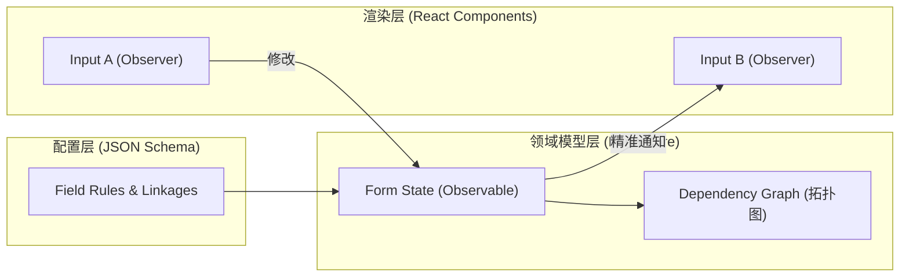

在企业级中后台系统中，表单是承载业务逻辑最密集的组件。随着业务复杂度的增加，开发者往往会面临以下挑战：几百个字段的联动逻辑、动态增删的自增列表、复杂的跨字段异步校验，以及由于 React 顶层状态更新导致的严重渲染卡顿。本文将探讨如何通过 **Schema 驱动** 与 **状态机分离** 的架构设计来应对这些挑战。

## 1. 传统受控模式的困局

在传统的 React 开发中，我们习惯于将表单状态（State）提升至父组件。

```javascript
// 传统模式：任何一个 Input 改变都会导致 Form 整体重渲染
const [formData, setFormData] = useState({});
return (
  <form>
    <Input value={formData.a} onChange={v => setFormData({...formData, a: v})} />
    <Input value={formData.b} />
    {/* 当表单项达到 100+ 时，输入会产生明显延迟 */}
  </form>
);
```

这种模式的架构优势是简单直观，但在复杂场景下存在两个主要缺陷：
1.  **性能瓶颈**：全量渲染（Re-render）的开销随字段数量呈线性增长。
2.  **逻辑耦合**：联动逻辑（如“选择 A 后隐藏 B”）散落在各个组件的 `onChange` 中，难以维护。

## 2. Schema 驱动架构：MVVM 的回归

Schema 驱动的核心思想是将表单的**结构（Structure）**、**逻辑（Logic）**与**渲染（UI）**解耦。我们使用 JSON Schema 来描述表单，而表单的运行状态则由一个独立的状态机管理。

### 2.1 状态机下沉与局部更新
借鉴 MVVM 模式，我们将每个表单项（Field）视为一个独立的 Observable 节点。UI 组件通过订阅（Subscribe）特定节点的状态来决定何时重绘。



### 2.2 JSON Schema 的扩展协议
标准的 JSON Schema 主要用于校验，我们在其基础上扩展了 `x-component`（指定组件）和 `x-reactions`（描述联动）。

```json
{
  "type": "object",
  "properties": {
    "role": {
      "type": "string",
      "title": "用户角色",
      "enum": [{ "label": "管理员", "value": "admin" }, { "label": "普通用户", "value": "user" }],
      "x-component": "Select"
    },
    "permissionCode": {
      "type": "string",
      "title": "权限代码",
      "x-component": "Input",
      "x-reactions": {
        "dependencies": ["role"],
        "fulfill": {
          "state": {
            "visible": "{{$deps[0] === 'admin'}}",
            "required": "{{$deps[0] === 'admin'}}"
          }
        }
      }
    }
  }
}
```

## 3. 核心机制：依赖收集与响应式引擎

为了实现高效联动，架构内部维护了一个**依赖关系拓扑图**。

1.  **初始化**：解析 Schema 中的 `dependencies`，建立节点间的指向关系。
2.  **依赖收集**：当 `permissionCode` 声明依赖 `role` 时，它会自动注册到 `role` 的观察者列表中。
3.  **精准派发**：当用户修改 `role` 的值，状态机仅触发 `permissionCode` 的计算逻辑和重渲染，表单的其他部分保持静默。

这种机制类似于 Vue 的响应式系统，但在表单场景下，它能处理更复杂的路径匹配（如数组下标联动 `users.*.name`）。

## 4. 业务踩坑：依赖收集与路径引擎 (Path Engine) 的深水区

当你真正尝试去写一个 Schema 引擎时，最难的不是“监听状态变化”，而是**“数组循环与深层路径匹配”**。

设想一个经典的动态增删列表场景：`用户有多个联系人，每个联系人有名字和手机号。如果名字是“张三”，手机号就必须必填。`

在扁平的表单里，这个联动叫 `name -> phone`。
但在动态数组里，这个联动变成了：`users[0].name -> users[0].phone`，`users[1].name -> users[1].phone`。

**传统的 EventEmitter 或 Redux 此时会瞬间崩溃。** 因为你不可能为数组的每一行去手动注册独立的事件监听器，尤其是当数组发生 `push`、`pop`、`splice` 时，索引(Index) 会全盘错乱。

### 4.1 工业级解法：路径匹配器 (Path Matcher)

成熟的表单架构（如 Formily）内部一定会实现一个极其强悍的 **Path Engine**。它允许使用类似于正则的通配符语法来声明联动依赖：

```json
{
  "users": {
    "type": "array",
    "items": {
      "type": "object",
      "properties": {
        "name": { "x-component": "Input" },
        "phone": { 
          "x-component": "Input",
          "x-reactions": {
            // 神奇的通配符：只依赖“当前行的 name”
            "dependencies": [".name"], 
            // 相对路径的底层会被 Path Engine 解析为真正的绝对路径：
            // 如果当前在 users[1].phone，它会自动去拿 users[1].name 的值
            "fulfill": {
              "state": { "required": "{{$deps[0] === '张三'}}" }
            }
          }
        }
      }
    }
  }
}
```

底层的核心思想是：**状态机不存储组件树，只存储一颗巨大的 JSON 状态树。** 组件在渲染时，通过 `Context` 注入自己当前的绝对路径（如 `users.1.phone`）。当它需要依赖数据时，状态机会通过路径系统计算出兄弟节点的绝对路径，并精确返回数据，同时利用 Proxy 完成依赖收集。

## 5. 架构反思：隔离副作用 (Effects) 的面条代码

随着业务的堆叠，表单的联动逻辑会越来越像一团乱麻：
*   如果选了 A，清空 B，隐藏 C，并且向后端发一个请求去获取 D 的下拉列表。
*   如果请求 D 失败了，弹出一个 Toast，并把 A 重置为初始值。

如果你把这些逻辑全部写在 Schema 的 `x-reactions` 或者组件的 `onChange` 里，代码将彻底失去可读性。

**最佳实践：基于生命周期的 Effects 拦截器**

表单不应该只是一堆数据的集合，它是一个拥有完整生命周期（onInit, onMount, onFieldValueChange, onSubmit, unMount）的沙箱。
我们应该在 Schema 之外，独立注入一层 `Effects` 副作用拦截器：

```typescript
import { onFieldValueChange, setFieldState } from '@form-core';

const myFormEffects = () => {
  // 监听任意路径符合 pattern 的字段变化
  onFieldValueChange('users.*.role', (field) => {
    // 提取当前行号
    const index = field.path.segments[1]; 
    const currentRole = field.value;
    
    // 发起异步请求
    fetchPermissions(currentRole).then(res => {
      // 精确操作兄弟节点的状态
      setFieldState(`users.${index}.permissions`, state => {
        state.dataSource = res.list;
        state.loading = false;
      });
    });
  });
};

// 渲染表单时注入
<SchemaForm schema={schema} effects={myFormEffects} />
```

通过将 **UI 的描述（Schema）** 与 **行为的流转（Effects）** 彻底剥离，即使是拥有 500+ 字段的巨型表单，也能保持代码的极度清晰和高可维护性。

## 6. 架构优势总结


在企业级应用中，校验往往涉及异步接口（如“检查用户名是否重复”）。Schema 驱动架构支持将校验规则声明化：

```javascript
const schema = {
  "x-validator": [
    { "required": true, "message": "必填项" },
    { "format": "url", "message": "请输入合法的 URL" },
    {
      "validator": "{{asyncValidateFromServer}}" // 引用外部注入的异步校验函数
    }
  ]
};
```
通过将校验逻辑从 UI 组件中抽离，我们可以实现“校验规则随 Schema 动态下发”，这对于低代码平台或动态表单场景非常有用。


*   **显著提升性能**：通过局部渲染技术，支撑大规模字段表单依然保持流畅交互。
*   **逻辑高度内聚**：所有联动规则都在 Schema 中定义，业务逻辑一目了然。
*   **跨端/跨框架能力**：核心状态机（Form Core）是纯 JS 编写的，可以轻松适配 React、Vue 甚至原生环境。
*   **易于测试**：可以脱离 UI 直接对 Form Core 进行逻辑单元测试。

## 7. 结语

Schema 驱动表单架构在处理复杂企业级业务时，它所带来的**可维护性**和**性能优势**是传统模式难以替代的。选择合适的工具（如 Formily）或自研一套轻量级的 Schema 引擎，是提升中后台开发效率的关键。
