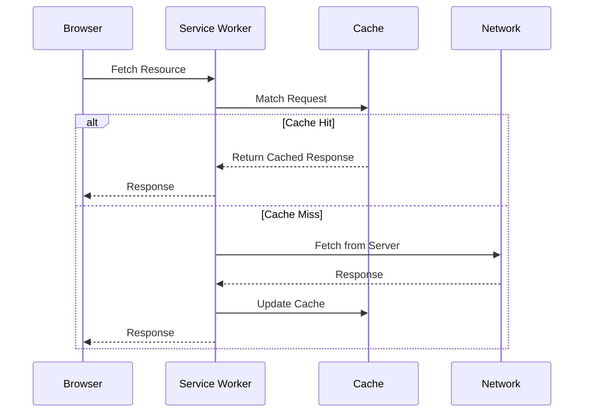

Service Worker 是运行在浏览器后台的独立线程，作为 Web 应用与网络之间的代理层。它是构建 PWA (Progressive Web Apps) 的核心，通过拦截网络请求并管理本地缓存，实现了离线可用和极快的二次加载体验。

## 1. Service Worker 生命周期

理解 SW 的生命周期是实现缓存策略的前提。它与普通 JS 脚本不同，具有严格的阶段划分：

1. **Registration**：在主线程调用 `navigator.serviceWorker.register()`。
2. **Installation**：触发 `install` 事件，通常用于预缓存 (Pre-cache) 静态资源。
3. **Activation**：触发 `activate` 事件，用于清理旧版本的缓存空间。
4. **Redundant**：被新版本取代或安装失败。

```javascript
// sw.js
const CACHE_NAME = 'v2-assets';

self.addEventListener('install', (event) => {
  event.waitUntil(
    caches.open(CACHE_NAME).then((cache) => {
      return cache.addAll([
        '/',
        '/styles/main.css',
        '/scripts/app.js',
        '/offline.html'
      ]);
    })
  );
});
```

## 2. 核心缓存策略解析

通过监听 `fetch` 事件，我们可以根据业务需求定制不同的响应逻辑。

### 2.1 Cache First (缓存优先)

适用于字体、图片等不常变动的静态资源。



### 2.2 Network First (网络优先)

适用于对实时性要求较高的 API 请求。如果网络不可用，则回退到缓存。

### 2.3 Stale-While-Revalidate (SWR)

这是性能与实时性的最佳平衡方案。它立即返回缓存内容，同时在后台发起网络请求更新缓存。

```javascript
self.addEventListener('fetch', (event) => {
  event.respondWith(
    caches.open(CACHE_NAME).then((cache) => {
      return cache.match(event.request).then((cachedResponse) => {
        const fetchPromise = fetch(event.request).then((networkResponse) => {
          // 更新缓存
          cache.put(event.request, networkResponse.clone());
          return networkResponse;
        });
        // 返回缓存或等待网络
        return cachedResponse || fetchPromise;
      });
    })
  );
});
```

## 3. 缓存失效与更新机制

Service Worker 的更新遵循“字节对比”原则。如果 `sw.js` 文件发生 1 字节的变化，浏览器就会尝试安装新版本。

* **Skip Waiting**：新 SW 安装后默认进入等待状态，调用 `self.skipWaiting()` 可强制立即接管页面。
* **Clients Claim**：在激活阶段调用 `self.clients.claim()`，让新 SW 立即控制所有已打开的标签页。

## 4. 业务踩坑：僵尸更新危机与 Opaque Response

Service Worker 看似完美，但在真正上线给百万用户使用时，绝大多数开发者都会被它的**更新机制**和**缓存污染**折磨得痛不欲生。

### 4.1 僵尸更新：为什么用户总是看到旧页面？

假设你用 `SWR (Stale-While-Revalidate)` 策略缓存了 `index.html`。
昨天你发了 v1.0，今天紧急发了 v2.0 修复一个致命 Bug。

用户的浏览器行为如下：
1. 用户访问网站，SW 拦截了请求。
2. SW 发现缓存里有 v1.0 的 `index.html`，**立刻返回给浏览器**。用户看到了旧版的页面！
3. 同时，SW 在后台悄悄拉取了 v2.0 的 `index.html` 并更新了缓存，顺便发现 `sw.js` 也变了。
4. 浏览器下载了新的 `sw.js`，触发了 `install`，但因为旧的 SW 还在控制当前页面，新 SW 会进入 **`waiting` (等待态)**。
5. **致命问题来了**：只要用户不**把所有相关的 Tab 页全部关掉**，这个新的 SW 就永远不会 `activate`！即使用户疯狂点浏览器的刷新按钮 (F5)，看到的依然是旧页面！

**工业级解法：弹窗提示 + 强制接管 (Skip Waiting)**

不要指望用户会主动关闭所有 Tab，你必须在 UI 层做强制干预。

1. 在注册 SW 时，监听 `updatefound` 事件。如果发现有一个新 Worker 处于 `installed` 且正在等待，就在页面顶部弹出一个提示条：**“发现新版本，点击刷新”**。
2. 当用户点击“刷新”按钮时，通过 `postMessage` 告诉那个正在等待的新 SW：“快给我 `skipWaiting`！”。

```javascript
// 主线程 (main.js)
navigator.serviceWorker.register('/sw.js').then(reg => {
  reg.addEventListener('updatefound', () => {
    const newWorker = reg.installing;
    newWorker.addEventListener('statechange', () => {
      // 检查它是否处于等待接管状态
      if (newWorker.state === 'installed' && navigator.serviceWorker.controller) {
        showUpdateToast(() => {
          // 用户点击更新，发送消息强制 skipWaiting
          newWorker.postMessage({ type: 'SKIP_WAITING' });
        });
      }
    });
  });
});

// 监听控制权转移，强制刷新页面加载新资源
let refreshing = false;
navigator.serviceWorker.addEventListener('controllerchange', () => {
  if (!refreshing) {
    refreshing = true;
    window.location.reload();
  }
});
```

```javascript
// Service Worker (sw.js)
self.addEventListener('message', (event) => {
  if (event.data && event.data.type === 'SKIP_WAITING') {
    // 强制杀掉旧 SW，自己立刻接管
    self.skipWaiting();
  }
});

// 一旦接管，立刻宣布控制所有 clients
self.addEventListener('activate', (event) => {
  event.waitUntil(self.clients.claim());
});
```
这是唯一一种能够保证 100% 版本一致性的 PWA 热更新方案。

### 4.2 Opaque Response (不透明响应) 的缓存雪崩

有时候你会用 SW 去缓存第三方的 CDN 图片或 API。由于存在跨域，且第三方没配 `Access-Control-Allow-Origin` (CORS)，此时 `fetch` 拿到的 `Response` 类型会变成 **`opaque`**。

**可怕的陷阱：**
1. Opaque 响应的 HTTP 状态码永远是 `0`，你根本不知道这个请求是成功还是 404 / 500！
2. 浏览器出于安全考虑，如果把 Opaque 响应存进 Cache Storage，为了防止黑客进行跨域大小推测攻击，浏览器会给它分配一个极度膨胀的配额（哪怕一张图片只有 10KB，浏览器也会按 **7MB** 来计算存储空间！）。

如果你不小心用 `cache.put(request, opaqueResponse)` 存了几张跨域图，用户的存储空间瞬间就被吃掉了几百兆，触发上面提到的 `QuotaExceededError` 和浏览器静默删库！

**防爆盾策略：永远只缓存状态码为 200 或明确允许的跨域响应**

```javascript
self.addEventListener('fetch', (event) => {
  event.respondWith(
    caches.match(event.request).then(cached => {
      return cached || fetch(event.request).then(response => {
        // 关键防御：如果是跨域的不透明响应 (type === 'opaque') 且不是 200，绝不缓存！
        // 除非你百分百确认这是一个有效的 CDN 资源
        if (!response || response.status !== 200 || response.type === 'opaque') {
          return response; 
        }

        // 可以安全缓存
        const responseToCache = response.clone();
        caches.open(CACHE_NAME).then(cache => cache.put(event.request, responseToCache));
        return response;
      });
    })
  );
});
```

## 5. 最佳实践建议


1. **不要缓存 sw.js 本身**：确保服务器对 SW 脚本设置 `Cache-Control: no-cache`，否则会导致应用无法更新。
2. **分层缓存**：将核心 UI 框架资源设为预缓存，将业务数据设为运行时缓存 (Runtime Cache)。
3. **优雅降级**：始终提供一个 `offline.html` 页面，在网络和缓存均失效时展示，提升用户体验。

合理运用 Service Worker 不仅能提升加载速度，更能让 Web 应用在弱网环境下保持高度的可用性。
