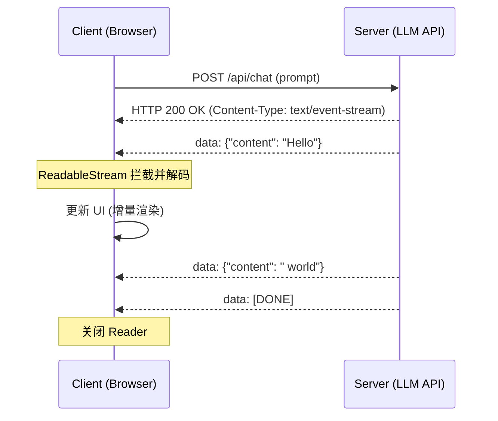

大语言模型 (LLM) 的交互范式要求前端具备处理“流式响应”的能力。传统的 JSON 整包返回模式在面对长文本生成时，会导致明显的首字节等待（Time to First Byte, TTFB）延迟。Server-Sent Events (SSE) 凭借其轻量化和基于标准 HTTP 的特性，已成为 LLM 应用前端交互的重要组成部分。

## 1. 协议选型：为什么是 SSE 而非 WebSocket？

在 LLM 对话场景中，数据流向主要是单向的（服务端向客户端推送 Token）。

| 特性 | SSE (Server-Sent Events) | WebSocket |
| :--- | :--- | :--- |
| **协议** | 标准 HTTP (HTTP/1.1 / HTTP/2) | 独立的二进制协议 (ws://) |
| **连接性** | 单向 (Server -> Client) | 全双工 (双向) |
| **防火墙** | 易穿越，兼容现有 LB 和网关 | 需特殊配置，易被代理拦截 |
| **重连机制** | 内置自动重连 | 需手动实现心跳与重连逻辑 |
| **多路复用** | 配合 HTTP/2 支持良好 | 需独立连接 |

对于 LLM 而言，SSE 能够复用现有的鉴权（Cookie/Auth Header）体系，是一种资源消耗较低且高效的选择。

## 2. 前端流式解析深度实践

现代浏览器通过 `fetch` API 的 `body` 属性暴露了 `ReadableStream`，允许我们在数据到达时立即处理。

### 2.1 核心解析逻辑
处理流式数据时，最关键的是解决 **UTF-8 字符截断问题**。一个中文字符可能被拆分到两个不同的数据块中，直接解码会导致乱码。

```javascript
async function consumeStream(response) {
  const reader = response.body.getReader();
  // TextDecoder 会自动处理跨 chunk 的字节状态
  const decoder = new TextDecoder('utf-8');
  let buffer = '';

  while (true) {
    const { value, done } = await reader.read();
    if (done) break;

    // 解码当前 chunk，注意 stream: true 参数
    const chunk = decoder.decode(value, { stream: true });
    buffer += chunk;

    // 处理 SSE 格式 (data: { ... }\n\n)
    const lines = buffer.split('\n');
    // 保留最后一个可能不完整的行
    buffer = lines.pop() || '';

    for (const line of lines) {
      const message = line.replace(/^data: /, '').trim();
      if (message === '[DONE]') return;
      if (message) {
        try {
          const json = JSON.parse(message);
          updateUI(json.choices[0].delta.content);
        } catch (e) {
          console.error('Parse error', e);
        }
      }
    }
  }
}
```

### 2.2 流程时序图




## 3. 业务踩坑：大模型流式输出的硬核挑战

在真实的 ChatGPT 级产品中，网络的不稳定性和后端缓冲池的设计会导致无数的边界情况。

### 3.1 跨 Chunk 的 JSON 截断灾难

我们在前面的代码中用了 `buffer.split('\n')` 来按行分割。但在极端的网络环境或者高并发下，TCP 报文会被无情劈开。
假设后端推送了一个包含中文字符的完整 JSON：
`data: {"content": "我是一个人工智能"}\n\n`

它可能被切成了两个 `Uint8Array` Chunk 到达前端：
- Chunk 1: `data: {"content": "我是一`
- Chunk 2: `个人工智能"}\n\n`

如果前端粗暴地在 Chunk 1 到达时立刻尝试去 `JSON.parse`，就会遭遇 `Unexpected end of JSON input` 的致命崩溃。

**工业级解决方案：双重缓冲（Buffer）+ 游标切割**

最佳实践是维护一个外部的 `string` 缓冲区。在每次接收到 Chunk 并通过 `TextDecoder({stream: true})`（这个 `stream: true` 非常关键，它会把被截断的 UTF-8 中文字节保留到下一次解码中）解码后，将字符串拼接到 Buffer。
然后通过正则或循环去寻找**完整的双换行符** `\n\n`，只有找到双换行符，才把这部分字符串切下来送去 `JSON.parse`，剩下的继续留在 Buffer 里等待下一个 Chunk。

```javascript
// 伪代码：稳健的切帧逻辑
let buffer = '';
while (true) {
  const { value, done } = await reader.read();
  if (done) break;
  buffer += decoder.decode(value, { stream: true });
  
  // 寻找 SSE 的消息边界
  let boundary = buffer.indexOf('\n\n');
  while (boundary !== -1) {
    const rawMessage = buffer.slice(0, boundary);
    buffer = buffer.slice(boundary + 2); // 截断消费过的数据
    
    if (rawMessage.startsWith('data: ')) {
      const jsonStr = rawMessage.slice(6);
      if (jsonStr === '[DONE]') return;
      try {
        const payload = JSON.parse(jsonStr);
        updateUI(payload.content);
      } catch(e) {
        // 如果这里还报错，说明后端的 JSON 格式本身就是坏的
      }
    }
    boundary = buffer.indexOf('\n\n');
  }
}
```

### 3.2 优雅中断：AbortController 的双端协同

当模型生成到一半，用户点击了“停止生成”。如果前端只是默默地把 UI 的加载动画关掉，那是灾难性的。
后端的 GPU 会继续把剩下的 1000 个字算完，极大地浪费了昂贵的算力资源。

前端**必须**主动掐断 TCP 连接。在 fetch 中传入 `AbortController.signal`，调用 `abort()` 会直接终止底层的网络流。

```javascript
const controller = new AbortController();
fetch('/api/chat', { signal: controller.signal })
  // ...
  
// 用户点击停止
controller.abort(); 
```

**后端配合**：在 Node.js 或 Go 等后端服务中，必须监听 Request 的 `close` 或 `aborted` 事件。一旦检测到客户端主动断开，立刻向下游的 LLM 引擎发送取消信号（Cancel Signal），停止推理。

## 4. 渲染性能与 UX 优化


流式输出通常伴随着高频的状态更新（每秒数十次），这会对前端渲染性能造成压力。

### 3.1 避免主线程阻塞
*   **增量渲染**：避免每次都重新解析整个 Markdown 字符串。可以使用支持增量更新的解析器，或者对输入进行节流。
*   **Web Worker 解析**：将 Markdown 转 HTML 的繁重任务移至 Web Worker 中，释放主线程。

### 3.2 交互细节优化
*   **自动滚动控制**：当用户手动向上滚动查看历史记录时，应暂停自动滚动到底部，避免干扰阅读。
*   **AbortController**：支持用户手动中断生成。通过 `controller.abort()` 停止 fetch 请求，服务端感知到连接断开后停止模型推理。

```javascript
const controller = new AbortController();
fetch('/api/chat', { signal: controller.signal })
  .then(response => consumeStream(response))
  .catch(err => {
    if (err.name === 'AbortError') console.log('User cancelled');
  });

// 用户触发中断操作
// controller.abort();
```

## 4. 总结

SSE 流式输出已成为大模型应用的标准配置。掌握 `ReadableStream` 的底层 API，并关注高频数据流下的渲染性能优化与异常处理机制，是构建稳定、流畅的 LLM 交互界面的关键。
