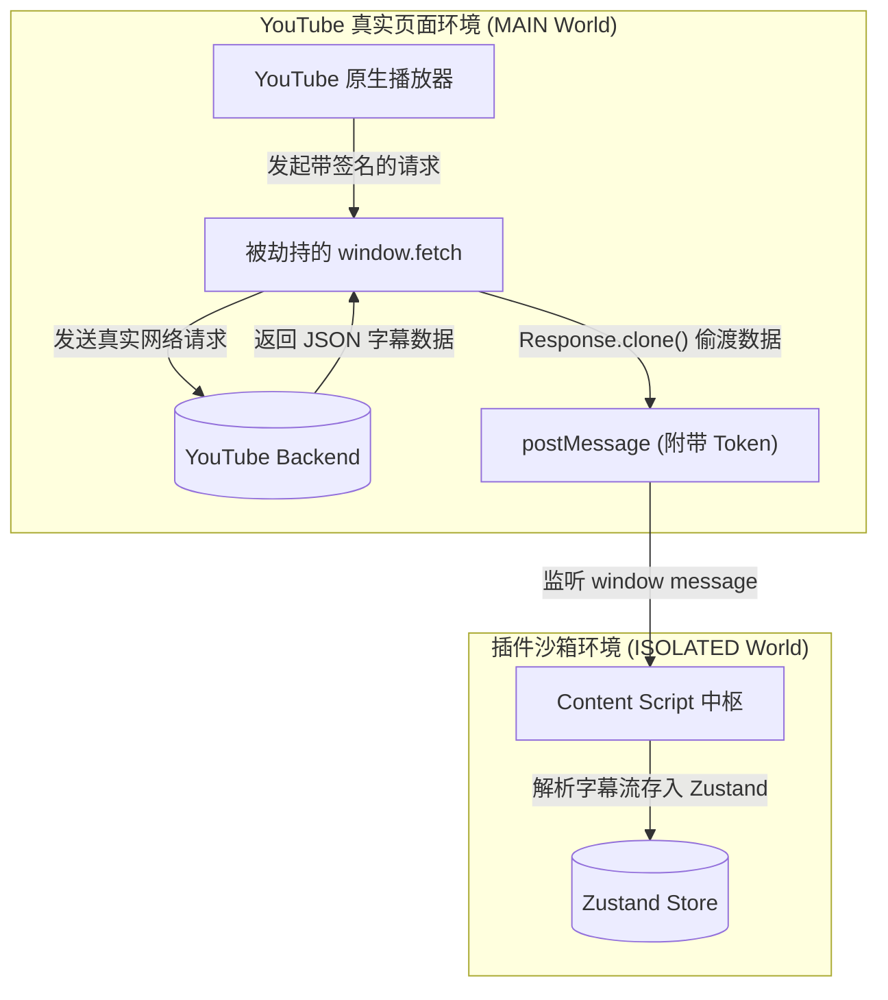
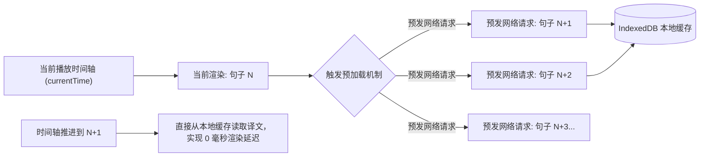

## 1. 背景与项目概述

在海外视频学习和日常娱乐中，原生的 YouTube 播放器只能单选一种字幕，这对于非母语学习者来说是一个巨大的痛点。为了解决这个问题，我从零到一独立设计、开发并开源了 **TubeWidget - Dual Subtitles**（目前已成功上架 Chrome 应用商店）。

整个项目采用了当今最前沿的现代浏览器插件技术栈：
* **核心框架**：**Plasmo**（完美支持 Manifest V3，拥有极佳的开发者体验）。
* **UI 与样式**：**React 18** + **TailwindCSS** + **Ant Design**。
* **状态与数据**：**Zustand** (响应式状态) + **Dexie.js** (IndexedDB 本地高频缓存)。
* **翻译引擎路由**：支持 Google 免费版、DeepL、Microsoft 以及 Google Cloud 等多通道分发。

这不是一个简单的 DOM 爬虫工具，而是一个深入视频播放器骨髓的工程化产品。本文将详细拆解该插件底层极其硬核的拦截架构与优化细节。

---

## 2. 核心痛点一：突破隔离沙箱，强行拦截官方网络请求

### 业务痛点与技术封锁
YouTube 具有极其严苛的防爬虫机制。其官方的字幕数据接口（`/api/timedtext`）强依赖于前端播放器动态生成的加密签名（Signature）。如果我们像普通的插件那样，在 Content Script 中手动发起 `fetch` 请求去拉取字幕数据，必然会遭遇 `403 Forbidden` 的无情拦截。

同时，Chrome 插件的 Content Script 默认运行在安全隔离的 **ISOLATED World** 中，根本无法触碰或修改宿主页面的 `window.fetch` 或 `XMLHttpRequest`，这就断绝了“普通抓包”的可能。

### 架构攻坚：Main World 注入与底层 Hook
为了拿到带有官方合法签名的字幕数据，我利用了 Plasmo 提供的 `world: "MAIN"` 能力，在页面加载的第一时间（`run_at: "document_start"`），将一段名为 `youtube-main-world.ts` 的探针脚本**强行打入 YouTube 真实的主执行环境**。

在这个没有沙箱限制的世界里，我直接重写了原生的 `window.fetch`，并在不破坏官方请求的前提下，将返回的 JSON 字幕流通过 `clone()` 偷渡出来，最后使用一个安全的 Token 握手机制，通过 `postMessage` 传递回插件的隔离上下文中。



**核心注入代码 (`src/contents/main-world/hook-fetch.ts`)**：
```typescript
export function setupFetchHook(getHandshakeToken: () => string) {
  const originalFetch = window.fetch

  // 强行重写宿主环境的 fetch
  window.fetch = async function (...args) {
    const url = args[0] instanceof Request ? args[0].url : args[0]?.toString() || ""
    const response = await originalFetch.apply(this, args)

    try {
      // 如果拦截到的是目标 timedtext (字幕) 接口
      if (isTimedTextUrl(url)) {
        // 规避掉贴片广告的无关字幕
        if (!isAdVideo(url)) {
          const clone = response.clone()
          clone.json().then((data) =>
            // 通过握手 Token 将原汁原味的官方数据派发回插件沙箱
            dispatchCaptionEvent(url, data, getHandshakeToken())
          ).catch(() => {})
        }
      }
    } catch {}

    // 将毫无篡改的 Response 返回给 YouTube 官方逻辑，保证播放器不出错
    return response
  }
}
```

此外，为了保证 YouTube **必然会发起字幕请求**，我还编写了 `ensureCCEnabled` 轮询方法，模拟真实的物理点击，去自动点亮原生播放器上的 `CC` 按钮。

---

## 3. 核心痛点二：零冲突的 UI 渲染与原生字幕“隐形”

### 业务痛点
YouTube 原生播放器的 DOM 极其复杂且动态变化。如果我们贸然删除其原生的字幕节点，会导致官方内部的代码逻辑（如位置计算、重绘机制）报出 TypeError 并导致播放器崩溃。
同时，我们自己用 Tailwind 编写的 React 双语字幕 UI，绝不能被宿主页面（YouTube）原有的全局 CSS 污染，也不能去污染宿主。

### 架构攻坚：Shadow DOM 与动态 Class 屏蔽
1. **绝对隔离的 Shadow DOM**：
   我利用 Plasmo 的 `getInlineAnchor` 特性，将整个 React 渲染树挂载在 `#movie_player` 内部的影子节点中（Shadow Root）。这样外部的 CSS 穿透不进插件，插件的 Tailwind 工具类也不会泄露到外部。

2. **原生降级策略（“隐形”而非“抹杀”）**：
   我没有去删除原生的 CC 节点，而是在全局动态注入了一段高优先级的脱离流样式 `<style>`。当用户开启了 TubeWidget 双语字幕时，通过赋予宿主播放器 `.tube-widget-active` 标志，**彻底将原生字幕在视觉和交互上隐形，但保留其在 DOM 树中的物理存在**。

```typescript
// 动态隐藏 YouTube 原生字幕渲染（配合 UI 层控制）
function injectDynamicSubtitleHider() {
  if (document.getElementById("ytranslater-dynamic-cc-hider")) return

  const style = document.createElement("style")
  style.id = "ytranslater-dynamic-cc-hider"
  // 当播放器具有 tube-widget-active 标志时，彻底隐藏所有原生字幕容器及指针事件
  style.textContent = `
    .tube-widget-active .ytp-caption-window-container { opacity: 0 !important; pointer-events: none !important; }
    .tube-widget-active .caption-window { opacity: 0 !important; pointer-events: none !important; }
  `
  document.head.appendChild(style)
}
```

---

## 4. 核心痛点三：高精度时间同步与翻译预加载流水线

### 业务痛点
调用外部的大模型或 DeepL API 翻译一句话存在不可忽视的网络延迟（通常在几百毫秒到一两秒不等）。如果在字幕出现的那一瞬间才去触发 `translate` 请求，双语字幕必然会严重脱节，用户体验极差。

### 架构攻坚：Look-ahead Prefetch Pipeline (滑动窗口预加载)

1. **毫秒级时间帧同步与跳变阻断 (Seek Handling)**：
   除了抛弃粗糙的 `setInterval` 改用 `requestAnimationFrame` 同步 `<video>.currentTime`，这里还有一个极其复杂的边界场景（Edge Case）：如果用户突然在进度条上拖拽跳跃了 30 分钟呢？
   我的底层状态机能够精准侦测到这类**非线性的时间跳变 (Time Seek)**。当检测到 `currentTime` 与上一帧的差值大于设定的阈值时，系统会立刻中断旧的预加载队列，废弃掉正在路上的无关网络请求，并在跳跃后的新基准线上重新建立 `baseIndex` 的 5 句缓存流水线。

2. **超前滑动窗口翻译**：
   在 UI 渲染的骨干 `Overlay` 组件中，我设计了一个超前滑动窗口流水线。当前视频线性播放到某一句字幕时，程序会自动向前探知之后的 **5 句字幕 (`PREFETCH_COUNT = 5`)**，并在后台静默派发翻译任务。



**核心预加载引擎代码 (`src/contents/overlay/index.tsx`)**：
```tsx
useEffect(() => {
  // ...省略环境与边界判断

  // 找到当前时间轴对应的基准字幕下标
  let baseIndex = currentSegment 
    ? segments.findIndex((s) => s.id === currentSegment.id)
    : segments.findIndex((s) => s.tStartMs >= currentTimeMs);

  if (baseIndex === -1) return;

  const PREFETCH_COUNT = 5; // 永远提前预加载后续的 5 句字幕
  
  for (let i = 0; i <= PREFETCH_COUNT; i++) {
    const nextIndex = baseIndex + i;
    // 如果该片段尚未被预加载过，则推入预加载队列
    if (nextIndex < segments.length && nextIndex > maxPrefetchedIndexRef.current) {
      const nextSegment = segments[nextIndex];
      // 底层自动查库/发起网络请求，并缓存到 IndexedDB
      prefetchTranslation(nextSegment.text, settings.targetLang);
      maxPrefetchedIndexRef.current = nextIndex;
    }
  }
}, [currentSegment?.id, segments.length, settings?.targetLang, currentTimeMs]);
```

配合传递到打字机 UI 组件 (`Subtitle`) 上的 `durationMs`（该段字幕的物理寿命），实现了原生般丝滑、绝不卡顿的双语同轨显示。

## 5. 极致体验：动态打字机特效 (Typewriter Effect) 与 UI 隔离

除了后端的预加载和底层拦截，TubeWidget 在 UI 表现上也下足了功夫，特别是字幕的呈现方式。

如果我们直接把外部模型翻译好的长句子“啪”地一下怼到屏幕上，会对用户的视觉产生强烈的突兀感，并且和原生 YouTube 字幕那种随语音节奏出现的感觉完全脱节。

为此，我在 `Subtitle` 组件中实现了一套**基于真实物理寿命的自适应打字机特效**。

**核心算法 (`src/contents/overlay/components/Subtitle/index.tsx`)**：
```tsx
export const Subtitle = ({ text, translation, durationMs }: SubtitleProps) => {
  const [currentIndex, setCurrentIndex] = useState(0)

  useEffect(() => {
    if (!translation) return
    setCurrentIndex(0)

    // durationMs 是底层从拦截到的官方字幕时间轴提取出的这句字幕的总存活时间
    // 我们强制打字机特效在字幕总寿命的 75% 内播放完毕，留下 25% 的时间让用户阅读全句
    const targetTypingTime = durationMs * 0.75
    let speed = targetTypingTime / translation.length
    
    // 限制单字敲击的物理速度，最快 15ms，最慢 50ms 防止像树懒一样慢
    speed = Math.max(15, Math.min(speed, 50))

    const interval = setInterval(() => {
      setCurrentIndex((prev) => {
        if (prev < translation.length) return prev + 1
        clearInterval(interval)
        return prev
      })
    }, speed)

    return () => clearInterval(interval)
  }, [translation, durationMs])

  return (
    // 渲染时：已敲击出的文字不透明，未敲击的保留占位但透明，防止容器疯狂抖动
    <>
      <span>{translation.slice(0, currentIndex)}</span>
      <span style={{ opacity: 0 }}>{translation.slice(currentIndex)}</span>
    </>
  )
}
```
这套自适应速率算法，保证了不管一句话有多长或者语速有多快，双语字幕的出现节奏始终能和视频发音的起伏保持着极其舒适的同步律动感。

---

## 7. 成本与性能优化：Dexie.js 的本地缓存降频

作为一款支持多翻译引擎（包括付费调用的 OpenAI 和 Google Cloud）的插件，重播同一视频或遇到极高频出现的语句（如 "Subscribe to my channel" 或 "Thank you for watching"）时，如果每次都发起真实的 API 调用，将会烧毁大量的 Token 额度。

我在插件的底层接入了基于 IndexedDB 封装的 **Dexie.js**。所有经由 `TranslateRouter` 的请求，都会通过 `MD5(sourceText + targetLanguage)` 算法生成一个极短且唯一的 Hash 摘要（Digest）作为主键。
在真正发起 HTTP 请求前，路由会先拦截并查询本地 IndexedDB 数据库：
*   **同视频击中**：用户反复拖拽进度条、或者是重温某一段精彩对话时，100% 缓存击中，零网络开销、零延迟。
*   **跨视频击中**：不同 YouTuber 说的相同打招呼日常用语，只要语种一致，Hash 就一致。即使用户看的是一个全新的视频，只要这句话曾经被翻译过，同样能瞬间从本地提库！这种跨域（Cross-Pollination）的缓存策略，把使用付费大模型 API 的成本压缩到了物理极限。

---

## 8. 总结

YouTube 的环境犹如一个庞大的、充满了代码混淆和动态防御黑盒。

从利用 `world: "MAIN"` 打破隔离沙箱窃取原生接口流，到极其克制的原生 CSS “隐形降级”，再到结合 `requestAnimationFrame` 和**超前滑动窗口**打造的零延迟翻译预加载体系——TubeWidget 完美跨越了扩展开发的深水区，呈现出了极其成熟、稳定且性能爆表的双语字幕产品体验。
