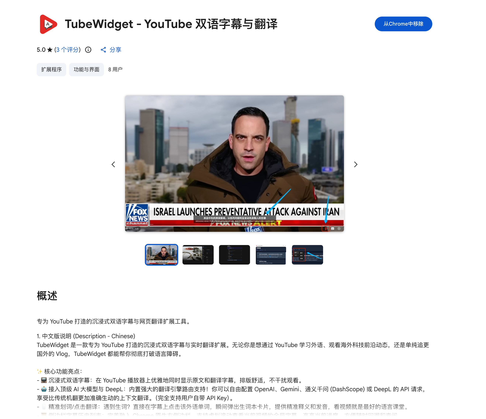
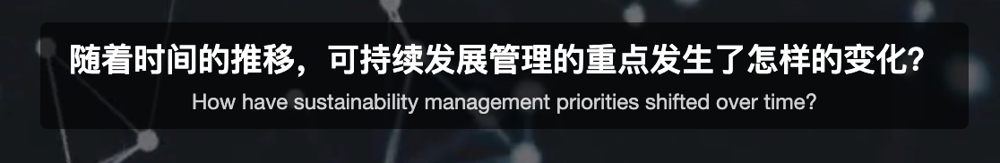
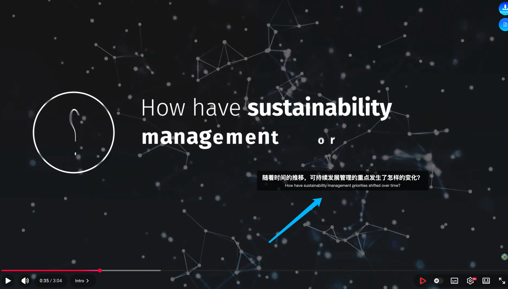
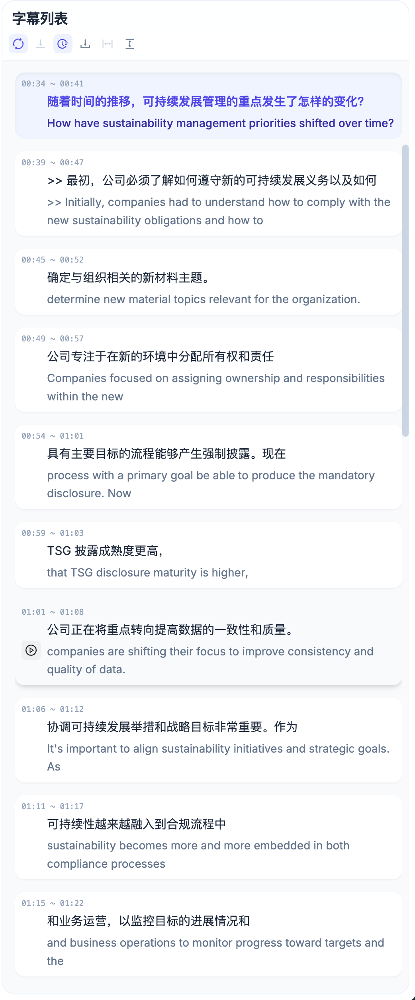
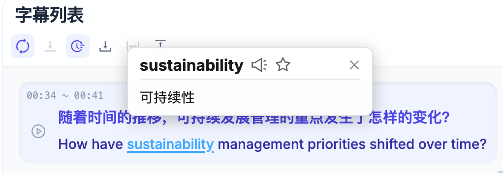
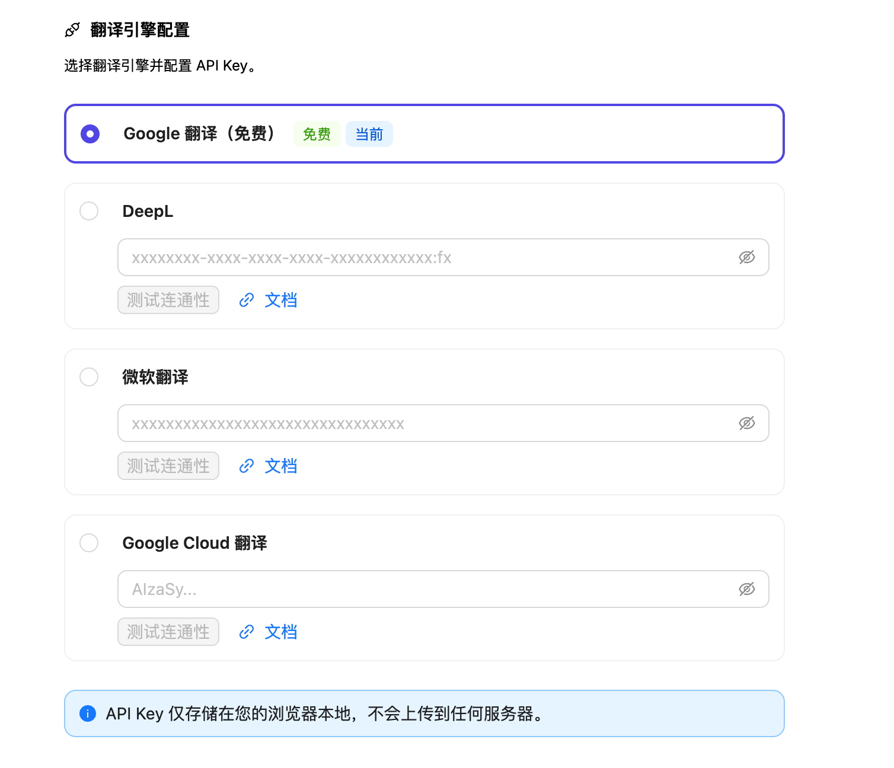

## 1. 简介与安装

欢迎使用 **TubeWidget - Dual Subtitles**！

这是一款专门为 YouTube 打造的沉浸式双语字幕扩展程序。它不仅能为你提供零延迟的双语对照字幕，还内置了**智能打字机动效**、**多款大厂翻译引擎**（支持 DeepL、Google、Microsoft 等）以及强大的**点词即译交互式字典**。无论是追剧、看 Vlog 还是深度学习外语，TubeWidget 都是你不可或缺的利器。

👉 **[点击前往 Chrome 网上应用店安装 TubeWidget](https://chromewebstore.google.com/detail/tubewidget-dual-subtitles/jfadikahfcmphjjaoelplocfpebfchml?hl=zh-CN&utm_source=ext_sidebar)**

---

## 2. 基础使用与双语字幕

### 2.1 开启双语字幕
安装插件后，打开任意一个带有 CC 字幕的 YouTube 视频页面。
1. TubeWidget 会在后台自动探测并为你解析原文字幕。
2. 插件会自动隐去 YouTube 呆板的原生字幕，在视频画面底部渲染出我们为你定制的**高清晰度双语对照字幕**。

### 2.2 自由拖拽与个性化主题定制
如果你觉得字幕挡住了视频的关键画面（例如进度条或比分板），别担心！
**将鼠标悬浮在双语字幕区域**，即可自由拖拽字幕框，将其移动到视频画面的最合适角落。

此外，TubeWidget 提供了极其强大的**字幕主题定制能力**。在侧边栏设置中，你可以：
* **一键切换预设主题**：内置了包括 `Netflix 风格`、`沉浸式 (Immersive)`、`学习模式 (Study)`、`赛博朋克霓虹 (Neon)`、`毛玻璃 (Glassmorphism)`、`高对比度 (HighContrast)` 等多款专业设计的预设主题，满足你在观影、学习、夜间模式等不同场景下的视觉需求。
* **高自由度精调**：除了预设，你还可以分别对“译文”和“原文”进行像素级的自定义。包括字体颜色、字号大小、字体粗细、文字阴影（柔和、发光或描边）、背景透明度，以及是否开启**动态打字机特效**。

---

## 3. 沉浸式侧边栏：完整双语字幕列表 (Side Panel)

除了视频底部的动态字幕，TubeWidget 还为你提供了一个强大的**浏览器侧边栏 (Side Panel) 工作台**。点击 Chrome 浏览器右上角的插件图标，即可唤出专属的侧边栏。

### 3.1 自动滚动的原文/译文对照
侧边栏会实时提取当前视频的所有双语字幕，并将它们按时间轴拼接成一篇**易于阅读的文章列表**。
- **自动跟随播放进度 (Auto-Scroll)**：当你观看视频时，侧边栏会自动高亮当前正在朗读的句子，并向下滚动，就像看卡拉 OK 歌词一样。
- **点击空降跳转 (Seek to Time)**：想要重温某一句台词？直接在侧边栏中点击该句字幕左侧的**播放按钮**，视频便会瞬间跳转至该时间点重新播放。

### 3.2 侧边栏内的点词即译
同样的，侧边栏里的长文章也支持**实时查词功能**。在侧边栏阅读时遇到生词，鼠标点击同样会呼出翻译字典卡片，帮你全方位理解视频内容。

---

## 4. 进阶功能：点词即译 (交互式字典)

在观看外语视频时，遇到不认识的生词怎么办？去查字典？太慢了！

TubeWidget 将原生的一长串文本**实时解析成了可交互的单词序列**。
当你遇到不懂的生词时：
1. 直接在视频播放中（或侧边栏长文中）**点击那个英文单词**。
2. 视频会自动为你暂停（可选配置），并在单词上方瞬间弹出一个精致的**翻译释义卡片 (WordPopup)**。
3. 字典卡片关闭后，视频即可继续流畅播放，让你的学习过程绝不被打断。

---

## 5. 翻译引擎配置 (DeepL / Google / Microsoft)

TubeWidget 默认提供免费的 Google 基础翻译通道。但如果你追求**信达雅的高质量翻译**，插件同样支持接入你自己的大厂 API 密钥。

### 5.1 如何切换翻译引擎
1. 在插件的**侧边栏 (SidePanel)** 顶部工具栏中，点击配置按钮进入设置页。
2. 在「翻译引擎 (Translation Engine)」设置中，你可以看到多个选项：
   - **Google 免费版 (默认)**：即插即用，无需配置。
   - **DeepL (推荐)**：极其精准自然的神经机器翻译。
   - **Google Cloud / Microsoft**：企业级云翻译通道。

### 5.2 配置私有 API Key
如果你选择了 DeepL 等高级通道：
1. 填入你申请好的对应 `API Key`。
2. 插件会将你的 Key **安全地存储在浏览器本地**，绝不会上传到任何第三方服务器。
3. 由于我们底层的 IndexedDB (Dexie.js) **全量缓存机制**，相同的句子在本地只会消耗一次 API 请求，帮你极大限度地节省 Token 与计费成本。

---

## 6. 个性化样式与偏好设置

在 TubeWidget 的设置面板中，你完全可以掌控字幕的外观与行为：
* **目标语言 (Target Language)**：支持将字幕实时翻译为中文、日语、韩语、西班牙语等数十种语言。
* **字幕外观设置**：
  * 调整**字体大小 (Font Size)**，适应你的视力与屏幕。
  * 随时切换**仅显示译文**或**双语对照**模式。

---

## 7. 常见问题 (FAQ)

**Q：为什么我打开 YouTube 视频，没有出现 TubeWidget 的双语字幕？**
**A：** 
1. 请确保当前播放的视频**本身带有 CC 官方字幕**（自动生成或人工上传均可）。如果没有官方字幕，我们无法拦截并进行翻译。
2. 请确保 YouTube 播放器右下角的 `[CC]` 按钮是开启状态。插件通常会帮你自动点亮它。

**Q：翻译速度感觉变慢了？**
**A：** 如果使用默认的免费公共通道，在网络高峰期可能会有轻微延迟。强烈建议在配置页中填入自己的 **DeepL 免费 API Key**，体验毫秒级、零延迟的极致解析！

**Q：字幕卡在屏幕中间了怎么复原？**
**A：** 你可以随时拖拽字幕将其拉回画面底部。如果排版彻底错乱，可以刷新页面或在设置面板中点击“恢复默认设置”。

---

赶快去享受属于你的无国界视频漫游之旅吧！如果觉得好用，别忘了去 Chrome 商店给我们一个五星好评 ⭐⭐⭐⭐⭐！
