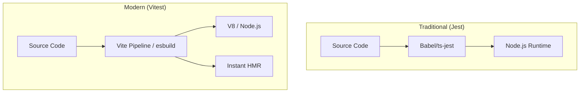

在过去很长一段时间内，Jest 凭借其“开箱即用”的特性统治了前端测试领域。然而，随着 ESM 的普及和 Vite 等新型构建工具的兴起，基于 CommonJS 架构的 Jest 在大型项目中表现出明显的滞后性。前端测试工具链正经历一场从“模拟环境”向“原生管线”的转变。

## 1. Vitest：打破测试与构建的隔阂

Vitest 的核心优势在于它直接复用了 Vite 的转换器、插件系统和配置文件。

### 1.1 统一的转换管线
在 Jest 中，我们需要配置 `babel-jest` 或 `ts-jest` 来处理代码转换，这往往导致测试环境与生产环境的编译行为不一致。Vitest 直接调用 Vite 的 `dev server` 逻辑，确保测试运行在与开发环境完全相同的代码路径上。



### 1.2 性能优势：esbuild 与并行化
Vitest 利用 `esbuild` 进行极速转换，并基于 `tinypool` 实现多线程并行执行。对于拥有数千个单元测试的项目，冷启动时间通常能显著缩短。

```typescript
// vitest.config.ts 深度配置示例
import { defineConfig } from 'vitest/config';

export default defineConfig({
  test: {
    // 启用多线程并行
    threads: true,
    // 模拟浏览器环境
    environment: 'jsdom',
    // 自动清理 mock
    restoreMocks: true,
    // 覆盖率配置
    coverage: {
      provider: 'v8',
      reporter: ['text', 'json', 'html'],
      all: true,
    },
    // 针对大型项目的分片执行
    shard: {
      index: 1,
      size: 4,
    }
  },
});
```

## 2. 业务踩坑：Jest 的内存泄漏噩梦与 Vitest 的架构救赎

如果你在一个有超过 1000 个单元测试文件的大型仓库里用过 Jest，你一定遇到过这个极其崩溃的场景：
**在本地跑单个文件秒出结果，但在 CI 上跑全量测试时，跑到第 500 个文件，Node.js 突然卡死，接着爆出 `FATAL ERROR: Ineffective mark-compacts near heap limit Allocation failed - JavaScript heap out of memory`。**

### 2.1 为什么 Jest 必然会 OOM？

Jest 为了保证每个测试文件之间互不干扰（避免你在 test A 里修改了 `window.location` 影响了 test B），它在底层使用了 Node.js 的 `vm` 模块。
每次执行一个测试文件，Jest 就会创建一个全新的 `vm` 隔离沙箱，并在里面注入一整套极其庞大的 JSDOM 环境。

致命的问题在于：**Node.js 的 `vm` 模块在频繁创建和销毁时，存在严重的内存泄漏问题（V8 引擎的 Context 无法被垃圾回收）。**
只要你的测试文件够多，内存占用就会像滚雪球一样从 500MB 飙升到 4GB，直到把 CI 机器撑爆。

### 2.2 Vitest 的 Tinypool 线程池拯救世界

Vitest 从一开始就吸取了 Jest 的血泪教训。它不仅抛弃了沉重的 Babel 转换，还引入了基于 `Piscina` 的 `tinypool` 架构。

在 Vitest 中，每个测试文件不再是一个沉重的 `vm` 沙箱，而是被分发到独立且轻量级的 **Worker Threads（工作线程）** 中运行。
更绝的是，Vitest 提供了 `poolOptions.threads.isolate: false` 和全新的 `browser` 模式。当你在 CI 上遇到内存瓶颈时，可以**关闭严格的隔离模式**，让多个测试文件在一个 Worker 内复用 V8 上下文，彻底消灭了 OOM 的可能。

```typescript
// vitest.config.ts
export default defineConfig({
  test: {
    // 开启 pool 机制，告别 Jest 的 vm 内存泄漏
    pool: 'threads',
    poolOptions: {
      threads: {
        // 在极端大型项目中，可以关闭隔离以换取极致的内存和速度
        isolate: false, 
      }
    }
  }
});
```

## 3. Playwright：重塑 E2E 测试体验


如果说 Vitest 解决了单元测试的效率问题，那么 Playwright 则大幅优化了端到端测试（E2E）的稳定性。

### 2.1 架构差异：CDP vs WebDriver
不同于 Selenium 依赖的 WebDriver 协议，Playwright 通过浏览器底层的调试协议（如 Chrome DevTools Protocol）直接控制浏览器引擎。这种方式响应更快，且能捕获更细粒度的网络请求和控制台日志。

### 3.2 核心特性分析
*   **原生并发**：Playwright 可以在单个进程中启动多个独立的浏览器上下文（Browser Context），实现真正的并行测试，而无需为每个测试用例启动完整的浏览器实例。
*   **自动等待 (Auto-waiting)**：内置了对元素可见性、可点击性的智能轮询，减少了测试脚本中的 `sleep` 或手动等待逻辑。
*   **Trace Viewer**：在 CI 环境失败时，Playwright 会生成完整的追踪文件，包含每一帧的 DOM 快照、网络请求和动作回放，提升调试效率。

```typescript
// playwright.config.ts 生产级配置
import { defineConfig, devices } from '@playwright/test';

export default defineConfig({
  testDir: './e2e',
  timeout: 30 * 1000,
  expect: { timeout: 5000 },
  fullyParallel: true,
  forbidOnly: !!process.env.CI,
  retries: process.env.CI ? 2 : 0,
  workers: process.env.CI ? 4 : undefined,
  reporter: 'html',
  use: {
    actionTimeout: 0,
    baseURL: 'http://localhost:3000',
    trace: 'on-first-retry',
    video: 'on-first-retry',
  },
  projects: [
    { name: 'chromium', use: { ...devices['Desktop Chrome'] } },
    { name: 'firefox', use: { ...devices['Desktop Firefox'] } },
    { name: 'webkit', use: { ...devices['Desktop Safari'] } },
  ],
});
```

## 4. 业务踩坑：Flaky Tests 与视觉回归 (Visual Regression) 测试

写过 E2E 测试的人都知道，E2E 最让人头疼的不是不会写，而是 **Flaky Tests（时过时挂的幽灵测试）**。
你点了一个保存按钮，有时候弹窗 0.1 秒就出来了，测试通过；有时候服务器卡了，弹窗 1.5 秒才出来，测试就挂了。

### 4.1 Playwright 的超能力：自动等待 (Auto-waiting)

在以前的 Selenium 或 Cypress 时代，我们的代码里布满了丑陋的 `await sleep(1000)`。
Playwright 彻底改变了这一点，它内置了**严格的行动前置校验 (Actionability Checks)**。

当你执行 `await page.locator('.submit-btn').click()` 时，Playwright 会在底层以极高的频率疯狂轮询，直到满足以下所有条件才执行点击：
1. 元素存在于 DOM 中（Attached）
2. 元素是可见的（Visible，没有 display: none 或被其他元素遮挡）
3. 元素是稳定的（Stable，没有在执行 CSS transform 动画）
4. 元素接收到了指针事件（Receives Events，没有 `pointer-events: none`）

如果超过了 `actionTimeout`（默认 30 秒）还没满足，它才会报错。这直接消灭了 90% 因为时序问题导致的 Flaky Tests。

### 4.2 终极挑战：像素级视觉比对 (Snapshot Testing)

在核心的 C 端业务（比如电商首页）中，仅仅断言“元素存在”是不够的。老板最怕的是：按钮在，但是 CSS 样式全乱了，字盖在了一起。

Playwright 提供了极其强大的 `toHaveScreenshot` 能力。但在团队协作时，一个巨大的坑是：**Mac 上截的图，拿到 Linux (CI 机器) 上去比对，100% 会报错。**
因为不同的操作系统、不同的显卡驱动，甚至连字体的抗锯齿边缘渲染（Anti-aliasing）都有细微的像素差异！

**工业级解法：用 Docker 抹平渲染环境差异**

千万不要把本地截的 Base 图片提交到 Git 仓库让 CI 去比对。
必须使用 Playwright 官方提供的 Docker 镜像来统一截图和比对环境：

```bash
# 1. 在本地使用 Docker 生成 Base 截图（macOS/Windows 统一用 Linux 渲染引擎）
docker run -v $PWD:/work/ -w /work -it mcr.microsoft.com/playwright:v1.40.0-jammy npx playwright test --update-snapshots

# 2. 在 CI (也是 Ubuntu Jammy 环境) 中执行比对
npx playwright test
```

结合代码里的容差配置：
```typescript
// playwright.config.ts
import { expect } from '@playwright/test';

// 允许不超过 5% 的像素有细微的颜色偏差（解决字体抗锯齿造成的误报）
expect.extend({
  toHaveScreenshot(received, name) {
    return expect(received).toHaveScreenshot(name, {
      maxDiffPixelRatio: 0.05, 
    });
  },
});
```
通过 Docker 容器化 + 合理的抗锯齿容差，你可以把 E2E 测试推进到“视觉无损”的最高境界。

## 5. 现代测试金字塔的重构


随着工具链的演进，我们的测试策略也应随之调整：

1.  **单元测试 (Vitest)**：关注纯函数、工具类及业务逻辑。追求高覆盖率和执行速度。
2.  **组件测试 (Vitest + Browser Mode)**：利用 Vitest 的浏览器模式直接在真实引擎中运行组件测试，替代部分资源消耗较高的 E2E 测试。
3.  **端到端测试 (Playwright)**：仅覆盖核心业务路径（如注册、下单、支付）。利用 Playwright 的并发能力优化 CI 耗时。

## 6. 总结

从 Jest 迁移到 Vitest + Playwright 是对开发反馈环的深度优化。Vitest 带来的高效 HMR 体验和 Playwright 提供的稳定 E2E 验证，共同构成了一套支撑现代复杂前端应用的工程化底座。
