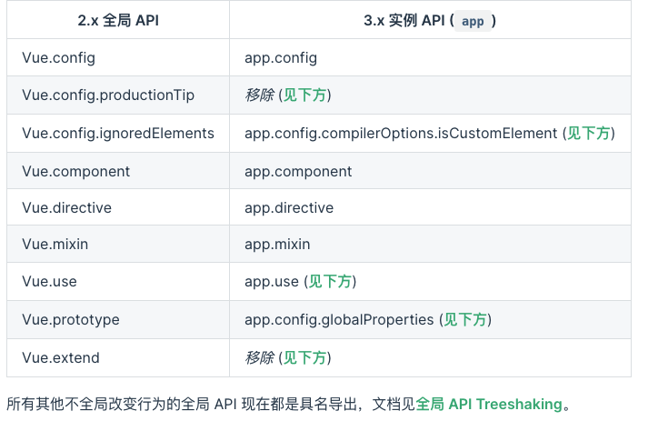

> 记录vue2到vue3版本迁移事项
>
> [官方迁移文档](https://v3.cn.vuejs.org/guide/migration/introduction.html)

# api变化

## 全局api变化

### new Vue ---> createApp 🚩 ➕

> vue2中没有app 的概念，通过`Vue`的统一构造函数进行全局的配置，单页应用中无法创建多个不同全局配置的根应用（[会造成全局配置污染](https://v3.cn.vuejs.org/guide/migration/global-api.html#%E4%B8%80%E4%B8%AA%E6%96%B0%E7%9A%84%E5%85%A8%E5%B1%80-api-createapp)）
>
> vue3中有了app概念，通过[createApp](https://github.com/vuejs/core/blob/4951d4352605eb9f4bcbea40ecc68fc6cbc3dce2/packages/runtime-dom/src/index.ts#L53)创建返回的实例**暴露全局api**，解决了vue2中的问题

- Vue2

  ```js
  import Vue from "vue";
  import App from './App.vue'
  
  new Vue({
    render: (h) => h(App)
  }).$mount("#app");
  ```

- Vue3

  > createApp 生成一个app实例，该实例拥有全局的可配置上下文
  >
  
  ```js
  import { createApp } from 'vue'
  import App from './App.vue'
  
  const app = createApp(App).mount('#app');
  ```
  

所以现在所有全局会改变Vue行为的api都改到了app应用实例上了




### internal Apis  🚩

[文档](https://v3.cn.vuejs.org/guide/migration/global-api-treeshaking.html#_2-x-%E8%AF%AD%E6%B3%95)

> vue2中不少global-api是作为静态函数直接挂在构造函数上的，例如`Vue.nextTick()`，如果我们从未在代码中用过它们，就会形成所谓的`dead code`，这类global-api造成的`dead code`无法使用webpack的tree-shaking排除掉。
>
> vue3中做了相应的变化，将它们抽取成为独立函数，这样打包工具的摇树优化可以将这些dead code排除掉。

Vue2

```js
import Vue from 'vue';
Vue.nextTick(()=>{})
```

Vue3

```js
import { nextTick } from 'vue'
nextTick(() => {})
```

官方文档列出受影响的api

*[Image missing: image-20220416125617961]*

### `app.config`

#### `globalProperties`  🚩➕

> 添加可在程序内的任何组件实例中访问的全局属性。

Vue2

```js
import Vue from 'vue'
Vue.prototype.$http = axios
```

vue3

```js
// Vue3
const app = Vue.createApp({})
app.config.globalProperties.$http = axios
```


#### `devtools`

> 配置是否允许 [vue-devtools](https://link.juejin.cn?target=https%3A%2F%2Fgithub.com%2Fvuejs%2Fvue-devtools) 检查代码。开发版本默认为 `true`，生产版本默认为 `false`。生产版本设为 `true` 可以启用检查。

```js
- Vue.config.devtools = true
+ app.config.devtools = true    

```

#### `errorHandler`

```js
- Vue.config.errorHandler = function (err, vm, info) {
  // handle error
  // `info` 是 Vue 特定的错误信息，比如错误所在的生命周期钩子
  // 只在 2.2.0+ 可用
}
+ app.config.errorHandler = (err, vm, info) => {
  // handle error
  // `info` 是 Vue 特定的错误信息，比如错误所在的生命周期钩子
  // 这里能发现错误
}

```

> 指定组件的渲染和观察期间未捕获错误的处理函数。这个处理函数被调用时，可获取错误信息和 Vue 实例。

> 错误追踪服务 [Sentry](https://link.juejin.cn?target=https%3A%2F%2Fsentry.io%2F) 和 [Bugsnag](https://link.juejin.cn?target=https%3A%2F%2Fdocs.bugsnag.com%2Fplatforms%2Fbrowsers%2Fvue%2F) 都通过此选项提供了官方支持。

#### `warnHandler`

```js
- Vue.config.warnHandler = function (msg, vm, trace) {
  // `trace` 是组件的继承关系追踪
}
+ app.config.warnHandler = function(msg, vm, trace) {
  // `trace` 是组件的继承关系追踪
}

```

> 为 Vue 的运行时警告赋予一个自定义处理函数。注意这只会在开发者环境下生效，在生产环境下它会被忽略。

#### `isCustomElement` ➕

- 替代掉Vue2.x的ignoredElements

```js
- Vue.config.ignoredElements = [
  // 用一个 `RegExp` 忽略所有“ion-”开头的元素
  // 仅在 2.5+ 支持
  /^ion-/
]

// 一些组件以'ion-'开头将会被解析为自定义组件
+ app.config.isCustomElement = tag => tag.startsWith('ion-')

```

> 指定一个方法来识别在Vue之外定义的自定义组件(例如，使用[Web Component API](https://link.juejin.cn?target=http%3A%2F%2Fwww.ruanyifeng.com%2Fblog%2F2019%2F08%2Fweb_components.html))。如果组件符合这个条件，它就不需要本地或全局注册，Vue也不会抛出关于Unknown custom element的警告

> 注意，这个函数中不需要匹配所有原生HTML和SVG标记—Vue解析器会自动执行此检查

#### `optionMergeStrategies`

```js
const app = Vue.createApp({
  mounted() {
    console.log(this.$options.hello)
  }
})

app.config.optionMergeStrategies.hello = (parent, child, vm) => {
  return `Hello, ${child}`
}

app.mixin({
  hello: 'Vue'
})

// 'Hello, Vue

```

> 定义自定义选项的合并策略。
>
> 合并策略接收在**父实例**options和∗∗子实例∗∗options和**子实例**options和∗∗子实例∗∗options，分别作为第一个和第二个参数。上下文Vue实例作为第三个参数传递

##### 【自定义选项合并策略】[mixin](https://link.juejin.cn?target=https%3A%2F%2Fgithub.com%2Fvuejs%2Fdocs-next%2Fblob%2Fmaster%2Fsrc%2Fguide%2Fmixins.md%23custom-option-merge-strategies)

```js
const app = Vue.createApp({
  custom: 'hello!'
})

app.config.optionMergeStrategies.custom = (toVal, fromVal) => {
  console.log(fromVal, toVal)
  // => "goodbye!", undefined
  // => "hello!", "goodbye!"
  return fromVal || toVal
}

app.mixin({
  custom: 'goodbye!',
  created() {
    console.log(this.$options.custom) // => "hello!"
  }
})

```

> - optionMergeStrategies先获取到子实例的$options的mixin而没有父实例【custom第一次改变从undefined到goodbye--->打印"goodbye!", undefined】
> - 父实例的options替换掉子实例的options替换掉子实例的options替换掉子实例的options【custom第二次从goodbye到hello!--->打印了"hello", "goodbye!"】
> - 最后在打印app.config.optionMergeStrategies.custom返回的父实例的$options

> 无论如何this.options.custom最后会返回合并策略的return的值【使用场景利用父子组件的options.custom最后会返回合并策略的return的值【使用场景利用父子组件的options.custom最后会返回合并策略的return的值【使用场景利用父子组件的options,然后返回计算等操作得到所需要的值】optionMergeStrategies合并$options变化

#### `performance`

```js
- Vue.config.performance=true;
+ app.config.performance=true;

```

> 设置为 true 以在浏览器开发工具的性能/时间线面板中启用对组件初始化、编译、渲染和打补丁的性能追踪。只适用于开发模式和支持 performance.mark API 的浏览器上。

### `app.directive`
> [教程文档](https://link.juejin.cn?target=https%3A%2F%2Fgithub.com%2Fvuejs%2Fdocs-next%2Fblob%2Fmaster%2Fsrc%2Fguide%2Fcustom-directive.md)

> 注册或获取全局指令。

```js
import { createApp } from 'vue'
const app = createApp({})

// 注册
app.directive('my-directive', {
  // 指令的生命周期
  // 在绑定元素的父组件被挂载之前调用
  beforeMount(el, binding, vnode) {},
  // 在挂载绑定元素的父组件时调用
  mounted(el, binding, vnode) {},
  // 在更新包含组件的VNode之前调用
  beforeUpdate(el, binding, vnode, prevNode) {},
  // 组件的VNode及其子组件的VNode更新之后调用
  updated(el, binding, vnode, prevNode) {},
  // 在卸载绑定元素的父组件之前调用
  beforeUnmount(el, binding, vnode) {},
  // 在卸载绑定元素的父组件时调用
  unmounted(el, binding, vnode) {}
})

// 注册 (指令函数)
app.directive('my-directive', (el, binding, vnode, prevNode) => {
  // 这里将会被 `mounted` 和 `updated` 调用
})

// getter，返回已注册的指令
const myDirective = app.directive('my-directive')

```

- el: 指令绑定到的元素。这可以用来直接操作DOM。

- binding【包含下列属性的对象】

  - instance：使用指令的组件的实例

  - value：指令的绑定值，例如：`v-my-directive="1 + 1"`中，绑定值为 `2`

  - oldValue：指令绑定的前一个值，仅在 `beforeUpdate` 和 `updated` 钩子中可用。无论值是否改变都可用

  - arg：传给指令的参数，可选。例如 `v-my-directive:foo` 中，参数为 `"foo"`

  - modifiers：一个包含修饰符的对象。例如：`v-my-directive.foo.bar` 中，修饰符对象为 `{ foo: true, bar: true }`

  - dir：一个对象，在注册指令时作为参数传递;  举个例子，看下面指令

    ```js
    app.directive('focus', {
      mounted(el) {
        el.focus()
      }
    })
    
    ```

    dir就是下面的对象

    ```vue
    {
      mounted(el) {
        el.focus()
      }
    }
    
    ```

- vnode

  编译生成的虚拟节点

- prevNode

  前一个虚拟节点，仅在beforeUpdate和updated钩子中可用

  > tips:除了 `el` 之外，其它参数都应该是只读的，切勿进行修改。如果需要在钩子之间共享数据，建议通过元素的 [`dataset`](https://link.juejin.cn?target=https%3A%2F%2Fdeveloper.mozilla.org%2Fzh-CN%2Fdocs%2FWeb%2FAPI%2FHTMLElement%2Fdataset) 来进行

### `app.unmount` 🚩➕

> 在所提供的DOM元素上卸载应用程序实例的根组件

```js
import { createApp } from 'vue'

const app = createApp({})
// 做一些必要的准备
app.mount('#my-app')

// 应用程序将在挂载后5秒被卸载
setTimeout(() => app.unmount('#my-app'), 5000)
```


### `app.component`

- Vue2.x【注册或获取全局组件。注册还会自动使用给定的 `id` 设置组件的名称】

  ```js
  // 注册组件，传入一个选项对象 (自动调用 Vue.extend) 
  
  Vue.component('my-component', { /* ... */ }) 
  
  // 获取注册的组件 (始终返回构造器) 
  var MyComponent = Vue.component('my-component')
  
  ```

- Vue3【注册或获取全局组件. 注册还会自动使用给定的 name组件 设置组件的名称】[全局组件](https://link.juejin.cn?target=https%3A%2F%2Fcodepen.io%2Fteam%2FVue%2Fpen%2FrNVqYvM)

  > 基本vue2写法一致

  ```js
  import { createApp } from 'vue'
  
  const app = createApp({})
  
  // 注册组件，传入一个选项对象
  app.component('my-component', {
    /* ... */
  })
  
  // 获取注册的组件 (始终返回构造器) 
  const MyComponent = app.component('my-component', {})
  ```


## watch

> 以`.`分割的表达式不再被watch支持，可以使用计算函数作为*w**a**t**c**h*支持，可以使用计算函数作为watch参数实现。

**Vue2**

```js
watch: {
    "data.id"(val) {  
    },
},
```

**Vue3**

```js
const data = reactive({
  id:121
});
watch(data.id,()=>{})
```


## emits ➕

> [官方文档](https://v3.cn.vuejs.org/guide/migration/emits-option.html#emits-%E9%80%89%E9%A1%B9)

- emits 可以是数组或对象
- 触发自定义事件
- 如果emits是对象，则允许我们配置和事件验证。验证函数应返回布尔值，以表示事件参数是否有效。


## 依赖注入provide/inject

> 与vue2中使用方法没有什么很大的差异，但是亮点是可以提供相应式的数据

### 基础使用方法

看文档

### 响应式方法  🚩➕

例如：

```js
import { ref, reactive } from 'vue'

// 提供者
setup() {
  const book = reactive({
    title: 'Vue 3 Guide',
    author: 'Vue Team'
  })
  const year = ref('2020')

 /*提供reactive响应式*/
  provide('book', book)
 /*提供ref响应式*/
  provide('year', year)
}
```

#### 弊端

提供相应式的方法之后，子组建就可以尝试对这个引用值进行修改，从而导致单向数据流通的紊乱

为了避免这种情况，基于provide进行封装

```js
/*
 * @Author: 翁恺敏
 * @Date: 2022-04-10 16:11:32
 * @LastEditors: 翁恺敏
 * @LastEditTime: 2022-04-16 15:21:11
 * @FilePath: /vue3-vite-test/src/hooks/useProvide.ts
 * @Description: provide （observerable provide）
 */
import { provide, readonly, reactive, ref, isReactive } from "vue";
import forEach from "lodash/forEach";

const useProvide = (shouldReactive: Boolean = true) => {
  const handleProvide = (providers: Record<string, any>): void => {
    forEach(providers, (value, key) => {
      let provideValue;
      const isFunction = typeof value === "function";
      if (!isFunction) {
        provideValue =
          shouldReactive && !isReactive(value) ? ref(value) : value;
      }
      provide(key, isFunction ? provideValue : readonly(provideValue));
    });
  };

  return handleProvide;
};

export default useProvide;
```


## defineAsyncComponent(异步组件)


# 生命周期函数

## **与 2.x 版本生命周期相对应的组合式 API** 🚩➕

- ~~`beforeCreate`~~ -> 使用 `setup()`
- ~~`created`~~ -> 使用 `setup()`
- `beforeMount` -> `onBeforeMount`
- `mounted` -> `onMounted`
- `beforeUpdate` -> `onBeforeUpdate`
- `updated` -> `onUpdated`
- `beforeDestroy` -> `onBeforeUnmount`
- `destroyed` -> `onUnmounted`
- `errorCaptured` -> `onErrorCaptured`


## 非组合式api

只是改了名字


# 内置指令变化

## `v-model` 🚩

> [官方文档](https://v3.cn.vuejs.org/guide/component-basics.html#%E5%9C%A8%E7%BB%84%E4%BB%B6%E4%B8%8A%E4%BD%BF%E7%94%A8-v-model)

 ### 组件使用

**vue2 --- v-model**

```jsx
<ChildComponent v-model="pageTitle" />

<!-- 简写: -->
<ChildComponent :value="pageTitle" @input="pageTitle = $event" />
```

如果要将属性或事件名称更改为其他名称，则需要在 `ChildComponent` 组件中添加 `model` 选项：

```jsx
<!-- ParentComponent.vue -->
<ChildComponent v-model="pageTitle" />
```

```js
// ChildComponent.vue
export default {
  model: {
    prop: 'title',
    event: 'change'
  },
  props: {
    // 这将允许 `value` 属性用于其他用途
    value: String,
    // 使用 `title` 代替 `value` 作为 model 的 prop
    title: {
      type: String,
      default: 'Default title'
    }
  }
}
```

所以，在这个例子中 `v-model` 的简写如下：

```jsx
<ChildComponent :title="pageTitle" @change="pageTitle = $event" />
```

**Vue2 --- v-bind.sync**

在某些情况下，我们可能需要对某一个 prop 进行“双向绑定”(除了前面用 `v-model` 绑定 prop 的情况)。建议使用 `update:myPropName` 抛出事件。例如，对于在上一个示例中带有 `title` prop 的 `ChildComponent`，我们可以通过下面的方式将分配新 value 的意图传达给父级：

```js
this.$emit('update:title', newValue)
```

如果需要的话，父级可以监听该事件并更新本地 data property。例如：

```jsx
<ChildComponent :title="pageTitle" @update:title="pageTitle = $event" />
```

为了方便起见，我们可以使用 `.sync` 修饰符来缩写，如下所示：

```jsx
<ChildComponent :title.sync="pageTitle" />
```

**Vue3 --- v-model**

```jsx
<ChildComponent v-model="pageTitle" />

<!-- 简写: -->

<ChildComponent
  :modelValue="pageTitle"
  @update:modelValue="pageTitle = $event"
/>

<ChildComponent v-model:title="pageTitle" />

<!-- 简写: -->

<ChildComponent
  :title="pageTitle"
  @update:title="pageTitle = $event"
/>
```


## `v-is` 🚩➕

> V-is 仅限于indom的模版

> Vue3中只能使用is在内置的component组件上面

**vue2**

```html
<table>
  <tr :is="'my-component'"></tr>
</table>
```

**vue3**

> :is不再适用于indom的模版

```html
<table>
  <tr v-is="'my-component'"></tr>
</table>
```


## `v-slot` 🚩➕

> 插槽在vue3中统一了vue2的slot和scope-slot

**Vue2**

```jsx
<!--  子组件中：-->
<slot name="title"></slot>

<!--  父组件中：-->
<template slot="title">
    <h1>歌曲：成都</h1>
<template>
```

如果我们要**在 slot 上面绑定数据，可以使用作用域插槽**，实现如下：

```js
// 子组件
<slot name="content" :data="data"></slot>
export default {
    data(){
        return{
            data:["走过来人来人往","不喜欢也得欣赏","陪伴是最长情的告白"]
        }
    }
}

<!-- 父组件中使用 -->
<template slot="content" slot-scope="scoped">
    <div v-for="item in scoped.data">{{item}}</div>
<template>
```

**Vue3**

在 Vue2.x 中具名插槽和作用域插槽分别使用`slot`和`slot-scope`来实现， 在 Vue3.0 中将`slot`和`slot-scope`进行了合并同意使用。 Vue3.0 中`v-slot`：

```vue
<!-- 父组件中使用 -->
 <template v-slot:content="scoped">
   <div v-for="item in scoped.data">{{item}}</div>
</template>

<!-- 也可以简写成： -->
<template #content="{data}">
    <div v-for="item in data">{{item}}</div>
</template>
```


# 自定义指令变化 🚩➕

vue3中指令api和组件保持一致，具体表现在：

- bind → **beforeMount**
- inserted → **mounted**
- **beforeUpdate**: new! 元素自身更新前调用, 和组件生命周期钩子很像
- update → removed! 和updated基本相同，因此被移除之，使用updated代替。
- componentUpdated → **updated**
- **beforeUnmount** new! 和组件生命周期钩子相似, 元素将要被移除之前调用。
- unbind  →  **unmounted**


# 内置组件

## `teleport` 🚩➕

[源码](https://github.com/vuejs/core/blob/main/packages/runtime-core/src/components/Teleport.ts)

**Props**

- `to` - `string` 必填属性，必须是一个有效的query选择器，或者是元素(如果在浏览器环境中使用）。中的内容将会被放置到指定的目标元素中

  ```js
  <!-- 正确的 -->
  <teleport to="#some-id" />
  <teleport to=".some-class" />
   /*元素*/
  <teleport to="[data-teleport]" />
  
  <!-- 错误的 -->
  <teleport to="h1" />
  <teleport to="some-string" />
  
  ```

- `disabled`  - `boolean` 这是一个可选项 ，做一个是可以用来禁用的功能，这意味着它的插槽内容不会移动到任何地方，而是按没有`teleport`组件一般来呈现【默认为false】

  ```js
  <teleport to="#popup" :disabled="displayVideoInline">
    <h1>999999</h1>
  </teleport>
  
  ```

  注意，这将移动实际的DOM节点，而不是销毁和重新创建，并且还将保持任何组件实例是活动的。所有有状态HTML元素(比如一个正在播放的视频)将保持它们的状态。【控制displayVideoInline并不是销毁重建，它保持实例是存在的，不会被注销】


## `Suspense` 🚩➕

> [官方文档](https://v3.cn.vuejs.org/guide/migration/suspense.html#%E4%BB%8B%E7%BB%8D)

> 官方文档目前还是标注为试验性

该 `<suspense>` 组件提供了另一个方案，允许将等待过程提升到组件树中处理，而不是在单个组件中。

自带两个 `slot` 分别为 `default、fallback`。顾名思义，当要加载的组件不满足状态时,`Suspense` 将回退到 `fallback`状态一直到加载的组件满足条件，才会进行渲染。

Suspense.vue

```vue
<template>
  <button @click="loadAsyncComponent">点击加载异步组件</button>
  <Suspense v-if="loadAsync">
    <template #default>
      <!-- 加载对应的组件 -->
      <MAsynComp></MAsynComp>
    </template>
    <template #fallback>
      <div class="loading"></div>
    </template>
  </Suspense>
</template>

<script>
import { ref, defineAsyncComponent } from 'vue'

export default {
  components: {
    MAsynComp: defineAsyncComponent(() => import('./AsynComp.vue')),
  },
  setup() {
    const loadAsync = ref(false)
    const loadAsyncComponent = () => {
      loadAsync.value = true
    }
    return {
      loadAsync,
      loadAsyncComponent,
    }
  },
}
</script>

<style lang="less" scoped>

button {
  padding: 12px 12px;
  background-color: #1890ff;
  outline: none;
  border: none;
  border-radius: 4px;
  color: #fff;
  cursor: pointer;
}
.loading {
  position: absolute;
  width: 36px;
  height: 36px;
  top: 50%;
  left: 50%;
  margin: -18px 0 0 -18px;
  background-image: url('../assets/loading.png');
  background-size: 100%;
  animation: rotate 1.4s linear infinite;
}
@keyframes rotate {
  from {
    transform: rotate(0);
  }
  to {
    transform: rotate(360deg);
  }
}
</style>


```

AsynComp.vue

```vue
<template>
  <h1>this is async component</h1>
</template>

<script>
import { setup } from 'vue'
export default {
  name: 'AsyncComponent',
  async setup() {
    const sleep = (time) => {
      return new Promise((reslove, reject) => {
        setTimeout(() => {
          reslove()
        }, time)
      })
    }
    await sleep(3000) //模拟数据请求
  },
}
</script>


```


## `Fragments` 🚩➕

Vue3.0组件中可以允许有多个根组件，避免了多个没必要的div渲染

```html
<template>
  <div>头部</div>
  <div>内容</div>
</template>

```

这样做的好处：

- 少了很多没有意义的div
- 可以实现平级递归，对实现tree组件有很大帮助


# 相应式系统 🚩🚩🚩

## 响应式系统 API

### `reactive`

desc: 接收一个普通对象然后返回该普通对象的响应式代理【等同于 2.x 的 `Vue.observable()`】

- ssss

  tips:`Proxy`对象是目标对象的一个代理器，任何对目标对象的操作（实例化，添加/删除/修改属性等等），都必须通过该代理器。因此我们可以把来自外界的所有操作进行拦截和过滤或者修改等操作

> 响应式转换是“深层的”：会影响对象内部所有嵌套的属性。基于 ES2015 的 Proxy 实现，返回的代理对象**不等于**原始对象。建议仅使用代理对象而避免依赖原始对象

> `reactive` 类的 api 主要提供了将复杂类型的数据处理成响应式数据的能力，其实这个复杂类型是要在`object array map set weakmap weakset` 这五种之中

> 因为是组合函数【对象】，所以必须始终保持对这个所返回对象的引用以保持响应性【不能解构该对象或者展开】例如 `const { x, y } = useMousePosition()`或者`return { ...useMousePosition() }`

```js
function useMousePosition() {
    const pos = reactive({
        x: 0,
        y: 0,
      })
        
    return pos
}


```

[`toRefs`](https://v3.cn.vuejs.org/guide/composition-api-introduction.html#torefs) API 用来提供解决此约束的办法——它将响应式对象的每个 property 都转成了相应的 ref【把对象转成了ref】。

> ```js
>  function useMousePosition() {
>     const pos = reactive({
>         x: 0,
>         y: 0,
>       })
>     return toRefs(pos)
> }
> 
> // x & y 现在是 ref 形式了!
> const { x, y } = useMousePosition()
> 
> ```

### `ref`

接受一个参数值并返回一个响应式且可改变的 ref 对象。ref 对象拥有一个指向内部值的单一属性 `.value`

```js
const count = ref(0)
console.log(count.value) // 0

```

> 如果传入 ref 的是一个对象，将调用 `reactive` 方法进行深层响应转换

#### 陷阱

- `setup` 中`return`返回会自动解套【在模板中不需要`.value`】

  

- ref 作为 reactive 对象的 property 被访问或修改时，也将自动解套 `.value`

  ```js
  const count = ref(0)
  /*当做reactive的对象属性----解套*/
  const state = reactive({
    count,
  })
  /* 不需要.value*/
  console.log(state.count) // 0
  
  /*修改reactive的值*/
  state.count = 1
  /*修改了ref的值*/
  console.log(count.value) // 1
  
  ```

  > 注意如果将一个新的 ref 分配给现有的 ref， 将替换旧的 ref
  >
  > ```js
  > /*创建一个新的ref*/
  > const otherCount = ref(2)
  > 
  > /*赋值给reactive的旧的ref，旧的会被替换掉*/
  > state.count = otherCount
  > /*修改reactive会修改otherCount*/
  > console.log(state.count) // 2
  > /*修改reactive会count没有被修改 */
  > console.log(count.value) // 1
  > 
  > ```

- 嵌套在 reactive `Object` 中时，ref 才会解套。从 `Array` 或者 `Map` 等原生集合类中访问 ref 时，不会自动解套【自由数据类型是Object才会解套，`array ` `map ` `set `  `weakmap ` `weakset`集合类 **访问 ref 时，不会自动解套**】

  ```js
  const arr = reactive([ref(0)])
  // 这里需要 .value
  console.log(arr[0].value)
  
  const map = reactive(new Map([['foo', ref(0)]]))
  // 这里需要 .value
  console.log(map.get('foo').value)
  
  ```

#### 心智负担上 `ref `  vs  `reactive`

- 在普通 JavaScript 中区别`声明基础类型变量`与`对象变量`时一样区别使用 `ref` 和 `reactive`
- 所有的地方都用 `reactive`，然后记得在组合函数返回响应式对象时使用 `toRefs`。这降低了一些关于 ref 的心智负担

### `readonly`

传入一个对象（响应式或普通）或 ref，返回一个原始对象的**只读**代理。一个只读的代理是“深层的”，对象内部任何嵌套的属性也都是只读的【返回一个永远不会变的只读代理】【场景可以参数比对等】

```js
const original = reactive({ count: 0 })

const copy = readonly(original)

watchEffect(() => {
  // 依赖追踪
  console.log(copy.count)
})

// original 上的修改会触发 copy 上的侦听
original.count++

// 无法修改 copy 并会被警告
copy.count++ // warning!

```

## `reactive`响应式系统工具集

### `isProxy`

> 检查一个对象是否是由 `reactive` 或者 `readonly` 方法创建的代理

### `isReactive`

> 检查一个对象是否是由 `reactive` 创建的响应式代理
>
> ```js
> import { reactive, isReactive } from 'vue'
> const state = reactive({
>       name: 'John'
>     })
> console.log(isReactive(state)) // -> true
> 
> ```

> 如果这个代理是由 `readonly` 创建的，但是又被 `reactive` 创建的另一个代理包裹了一层，那么同样也会返回 `true`
>
> ```js
> import { reactive, isReactive, readonly } from 'vue'
> const state = reactive({
>       name: 'John'
>     })
> // 用readonly创建一个只读响应式对象plain
> const plain = readonly({
>     name: 'Mary'
> })
> //readonly创建的，所以isReactive为false
> console.log(isReactive(plain)) // -> false  
> 
> // reactive创建的响应式代理对象包裹一层readonly,isReactive也是true,isReadonly也是true
> const stateCopy = readonly(state)
> console.log(isReactive(stateCopy)) // -> true
> 
> ```

### `isReadonly`

> 检查一个对象是否是由 `readonly` 创建的只读代理

## `reactive`高级响应式系统API

### `toRaw`

> 返回由 `reactive` 或 `readonly` 方法转换成响应式代理的普通对象。这是一个还原方法，可用于临时读取，访问不会被代理/跟踪，写入时也不会触发更改。不建议一直持有原始对象的引用【`**不建议赋值给任何变量**`】。请谨慎使用

被**`toRaw`**之后的对象是没有被代理/跟踪的的普通对象

```js
const foo = {}
const reactiveFoo = reactive(foo)

console.log(toRaw(reactiveFoo) === foo) // true
console.log(toRaw(reactiveFoo) !== reactiveFoo) // true

```

### `markRaw`

显式标记一个对象为“永远不会转为响应式代理”，函数返回这个对象本身。

> 【`markRaw`传入对象，返回的值是永远不会被转为响应式代理的】
>
> ```js
> const foo = markRaw({
>     name: 'Mary'
> })
> console.log(isReactive(reactive(foo))) // false
> 
> ```

> 被 markRaw 标记了，即使在响应式对象中作属性，也依然不是响应式的
>
> ```js
> const bar = reactive({ foo })
> console.log(isReactive(bar.foo)) // false
> 
> ```

#### `markRaw`注意点

- markRaw和 shallowXXX 一族的 API允许**选择性的**覆盖reactive或者readonly 默认创建的 "深层的" 特性【响应式】/或者使用无代理的普通对象

- 设计这种「浅层读取」有很多原因

  - 一些值的实际上的用法非常简单，并没有必要转为响应式【例如三方库的实例/省市区json/Vue组件对象】
  - 当渲染一个元素数量庞大，但是数据是不可变的，跳过 Proxy 的转换可以带来性能提升

- 这些 API 被认为是高级的，是因为这种特性仅停留在根级别，所以如果你将一个嵌套的，没有 `markRaw` 的对象设置为 reactive 对象的属性，在重新访问时，你又会得到一个 Proxy 的版本，在使用中最终会导致**标识混淆**的严重问题：执行某个操作同时依赖于某个对象的原始版本和代理版本（标识混淆在一般使用当中应该是非常罕见的，但是要想完全避免这样的问题，必须要对整个响应式系统的工作原理有一个相当清晰的认知）。

  ```js
  const foo = markRaw({
    nested: {},
  })
  
  const bar = reactive({
    // 尽管 `foo` 己经被标记为 raw 了, 但 foo.nested 并没有
    nested: foo.nested,
  })
  
  console.log(foo.nested === bar.nested) // false
  
  ```

  - foo.nested没有被标记为(永远不会转为响应式代理)，导致最后的值一个reactive

### `shallowReactive`

只为某个对象的私有（第一层）属性创建浅层的响应式代理，不会对“属性的属性”做深层次、递归地响应式代理，而只是保留原样【第一层是响应式代理，深层次只保留原样(不具备响应式代理)】

```js
const state = shallowReactive({
  foo: 1,
  nested: {
    bar: 2,
  },
})

// 变更 state 的自有属性是响应式的【第一层次响应式】
state.foo++
// ...但不会深层代理【深层次不是响应式】(渲染性能)
isReactive(state.nested) // false
state.nested.bar++ // 非响应式

```

### `shallowReadonly`

类似于`shallowReactive`，区别是：

- 第一层将会是响应式代理【第一层修改属性会失败】，属性为响应式
- 深层次的对象属性可以修改，属性不是响应式

```js
const state = shallowReadonly({
  foo: 1,
  nested: {
    bar: 2,
  },
})

// 变更 state 的自有属性会失败
state.foo++
// ...但是嵌套的对象是可以变更的
isReadonly(state.nested) // false
state.nested.bar++ // 嵌套属性依然可修改

```

## `ref` 响应式系统工具集

### `unref`

`unref`是`val = isRef(val) ? val.value : val` 的语法糖

```js
unref(ref(0))===unref(0)===0   返回number

function useFoo(x: number | Ref<number>) {
  const unwrapped = unref(x) // unwrapped 一定是 number 类型
}

```

### `toRef`

`toRef` 可以用来为一个 reactive 对象的`属性`【某个属性区别toRefs每一个属性】创建一个 ref。这个 ref 可以被传递并且能够保持响应性

```js
const state = reactive({
  foo: 1,
  bar: 2,
})

//reactive获取单个属性转为ref【fooRef只是一个代理】
const fooRef = toRef(state, 'foo')

fooRef.value++
console.log(state.foo) // 2

state.foo++
console.log(fooRef.value) // 3

```

### `toRefs`

把一个响应式对象转换成普通对象，该普通对象的每个 property 都是一个 ref ，和响应式对象 property 一一对应

```js
const state = reactive({
  foo: 1,
  bar: 2,
})

const stateAsRefs = toRefs(state)
/*
stateAsRefs 的类型如下:

{
  foo: Ref<number>,
  bar: Ref<number>
}
*/

// ref 对象 与 原属性的引用是 "链接" 上的
state.foo++
console.log(stateAsRefs.foo) // 2

stateAsRefs.foo.value++
console.log(state.foo) // 3

```

> 可以通过`toRefs`返回可解构的reactive，因为`toRefs`包裹之后返回一一对应的ref属性
>
> ```js
> function useFeatureX() {
>   const state = reactive({
>     foo: 1,
>     bar: 2,
>   })
> 
>   // 对 state 的逻辑操作
> 
>   // 返回时将属性都转为 ref
>   return toRefs(state)
> }
> 
> export default {
>   setup() {
>     // 可以解构，不会丢失响应性
>     const { foo, bar } = useFeatureX()
> 
>     return {
>       foo,
>       bar,
>     }
>   },
> }
> 
> ```

### `isRef`

检查一个值是否为一个 ref 对象

## `ref` 高级响应式系统API

### `customRef`

用于自定义一个 `ref`，可以显式地控制依赖追踪和触发响应，接受一个工厂函数，两个参数分别是用于追踪的 `track` 与用于触发响应的 `trigger`，并返回一个一个带有 `get` 和 `set` 属性的对象【实际上就是手动 `track`追踪 和 `trigger`触发响应】

- 以下代码可以使得v-model防抖

```js
function useDebouncedRef(value, delay = 200) {
  let timeout
  return customRef((track, trigger) => {
    return {
      get() {
          /*初始化手动追踪依赖讲究什么时候去触发依赖收集*/
        track()
        return value
      },
      set(newValue) {
          /*修改数据的时候会把上一次的定时器清除【防抖】*/
        clearTimeout(timeout)
        timeout = setTimeout(() => {
            /*把新设置的数据给到ref数据源*/
          value = newValue
            /*再有依赖追踪的前提下触发响应式*/
          trigger()
        }, delay)
      },
    }
  })
}

setup() {
    return {
        /*暴露返回的数据加防抖*/
      text: useDebouncedRef('hello'),
    }
  }

```

### `shallowRef`

创建一个 ref ，将会追踪它的 `.value` 更改操作，但是并不会对变更后的 `.value` 做响应式代理转换（即变更不会调用 `reactive`）

> 前面我们说过如果传入 ref 的是一个对象，将调用 `reactive` 方法进行深层响应转换,通过`shallowRef`创建的ref,将不会调用reactive【对象不会是响应式的】
>
> ```js
> const refOne = shallowRef({});
> refOne.value = { id: 1 };
> refOne.id == 20;
> console.log(isReactive(refOne.value),refOne.value);//false  { id: 1 }
> 
> ```

### `triggerRef` 【与`shallowRef`配合】

手动执行与`shallowRef`相关的任何效果

```js
const shallow = shallowRef({
  greet: 'Hello, world'
})

// 第一次运行打印 "Hello, world" 
watchEffect(() => {
  console.log(shallow.value.greet)
})

// 这不会触发效果，因为ref是shallow
shallow.value.greet = 'Hello, universe'

// 打印 "Hello, universe"
triggerRef(shallow)
```

# Composition API

## setup

`setup` 函数是一个新的组件选项。作为在组件内使用 **Composition API** 的入口点

- 注意 `setup` 返回的 ref 在模板中会自动解开，不需要写 `.value`【`setup` 内部需要`.value`】

### 调用时机

- 创建组件实例，然后初始化 `props` ，紧接着就调用`setup` 函数。从生命周期钩子的视角来看，它会在 `beforeCreate` 钩子之前被调用
- 如果 `setup` 返回一个对象，则对象的属性将会被合并到组件模板的渲染上下文

### 参数

- `props` 作为其第一个参数

> 注意 `props` 对象是响应式的，`watchEffect` 或 `watch` 会观察和响应 `props` 的更新
>
> **不要**解构 `props` 对象，那样会使其失去响应性

```js
export default {
  props: {
    name: String,
  },
  setup(props) {
    console.log(props.name)
     watchEffect(() => {
      console.log(`name is: ` + props.name)
    })
  },
}
```

- 第二个参数提供了一个上下文对象【从原来 2.x 中 `this` 选择性地暴露了一些 property（attrs/emit/slots）】

  > `attrs` 和 `slots` 都是内部组件实例上对应项的代理，可以确保在更新后仍然是最新值。所以可以解构，无需担心后面访问到过期的值

  为什么props作为第一个参数？

  - 组件使用 `props` 的场景更多，有时候甚至只使用 `props`
  - 将 `props` 独立出来作为第一个参数，可以让 TypeScript 对 `props` 单独做类型推导，不会和上下文中的其他属性相混淆。这也使得 `setup` 、 `render` 和其他使用了 TSX 的函数式组件的签名保持一致

  > **`this` 在 `setup()` 中不可用**。由于 `setup()` 在解析 2.x 选项前被调用，`setup()` 中的 `this` 将与 2.x 选项中的 `this` 完全不同。同时在 `setup()` 和 2.x 选项中使用 `this` 时将造成混乱

  ```js
  setup(props, { attrs }) {
      // 一个可能之后回调用的签名
      function onClick() {
        console.log(attrs.foo) // 一定是最新的引用，没有丢失响应性
      }
    }
  ```

