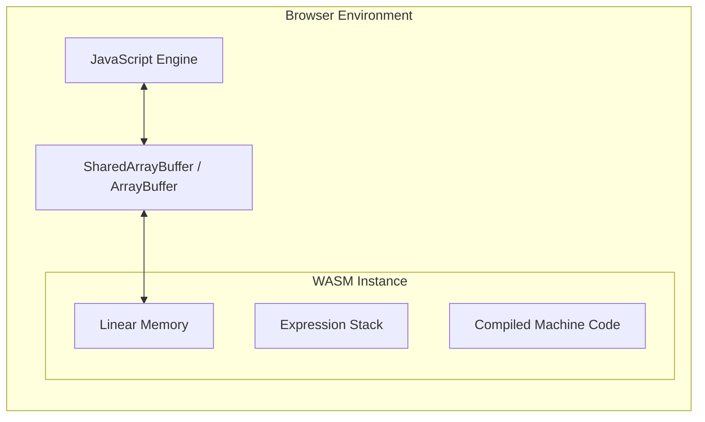

WebAssembly (WASM) 的出现并非为了取代 JavaScript，而是为了填补 Web 平台在处理 CPU 密集型任务时的性能短板。作为一种低级的类汇编二进制格式，WASM 为浏览器引入了近乎原生的执行效率，使得原本只能在桌面端运行的复杂应用能够平滑迁移至 Web 环境。

## 1. WASM 核心架构与执行机制

WASM 之所以高效，源于其设计上的预编译与强类型特性。与 JavaScript 需要经过解析（Parsing）、解释（Interpreting）和即时编译（JIT）的复杂过程不同，WASM 在下载后即可直接进入基线编译器。

### 1.1 线性内存模型 (Linear Memory)
WASM 使用一个连续、可扩展的原始字节数组作为其内存空间。这种模型与 C/C++ 的内存布局高度一致，允许开发者手动管理内存分配。



### 1.2 验证与编译
WASM 模块在执行前会经过严格的单次扫描验证，确保其不违反类型安全或访问越界。由于其二进制格式已经过高度优化，现代浏览器（如 Chrome 的 V8 引擎）可以利用多线程并行编译 WASM 模块，甚至在下载过程中就开始编译（Streaming Compilation）。

## 2. 业务踩坑：JS 与 WASM 的“过路费”陷阱 (Serialization Overhead)

很多前端第一次把一段复杂的加解密逻辑用 Rust 写成 WASM 后，在浏览器里一跑，结果发现：**比纯 JavaScript 还要慢！**

这就是经典的 **WASM 边界通信开销（FFI Overhead）** 问题。

### 2.1 昂贵的内存拷贝

在 JS 中调用 WASM 函数时，数字类型（如 `int32`）可以直接通过 V8 的寄存器传递，速度极快。
但是，如果你想传一个长度为 10MB 的字符串，或者一张 4K 分辨率的图片（Uint8Array）给 WASM 处理，灾难就来了。

WASM 运行在一个隔离的沙箱中，它不能直接读取 JS 的堆内存（Heap）。你必须：
1. 在 WASM 的线性内存（Linear Memory）中 `malloc` 分配出一块 10MB 的空白区域。
2. JS 引擎将这 10MB 的图片数据，**逐字节拷贝（Copy）** 到 WASM 的内存空间中。
3. WASM 执行极速的图像处理。
4. 处理完后，JS 引擎再次从 WASM 内存中把那 10MB 数据**拷贝**出来，转成 JS 的 `Uint8Array`。

如果你的图片处理本身只需要 2 毫秒，但这两次内存拷贝花费了 10 毫秒，WASM 的性能红利就彻底变成了负数！

### 2.2 工业级解法：SharedArrayBuffer 与零拷贝 (Zero-copy)

在处理音视频、3D 渲染等真正的高密集型场景时，我们必须彻底消灭内存拷贝。
现代浏览器提供了 `SharedArrayBuffer`，它允许 JS 的 Web Worker 和 WASM 实例**从物理上映射到同一块内存地址**。

```javascript
// 1. 在 JS 主线程预分配 16MB 的共享内存
const sharedMemory = new WebAssembly.Memory({
  initial: 256, // 256 pages * 64KB = 16MB
  maximum: 512,
  shared: true  // 关键参数：开启共享
});

// 2. 将这块内存的控制权传递给 WASM 实例
const wasmInstance = await WebAssembly.instantiateStreaming(fetch('image-processor.wasm'), {
  env: { memory: sharedMemory }
});

// 3. JS 直接通过视图操作这块内存（不需要任何拷贝！）
const jsView = new Uint8Array(sharedMemory.buffer);
jsView.set(hugeImageData, 0); // 将图片流直接打入这块物理内存

// 4. 通知 WASM 开始干活，WASM 会直接原地修改这块内存
wasmInstance.exports.processImage(0, hugeImageData.length);

// 5. JS 直接从 jsView 里读取被 WASM 修改后的结果，渲染到 Canvas 上
```
通过这种方式，JS 和 WASM 就像是在同一个房间里的两个人，直接在一个黑板（共享内存）上读写，彻底省去了“传小纸条（拷贝）”的开销。

## 3. 杀手级业务落地：突破前端的物理极限

除了传统的计算密集型任务，WASM 正在改变前端能做的事情的边界。

### 3.1 视频本地转码：FFmpeg.wasm
以前，用户上传了一个 500MB 的 `.avi` 视频，前端只能原封不动地传给后端，由后端的集群消耗巨量 CPU 去转码成 `.mp4`。不仅服务器成本高昂，用户的上传等待时间也极长。

现在，借助 `FFmpeg.wasm`，我们直接把整个用 C 写的视频转码引擎搬到了浏览器里。
用户选完视频，**利用用户电脑的 CPU 甚至 GPU（借助 WebGPU）** 在本地将其压缩到 50MB 的 `.mp4`，然后再上传。这为视频类网站（如 B站、YouTube 创作者中心）节省了海量的 CDN 带宽和服务器算力。

### 3.2 浏览器端的关系型数据库：SQLite-WASM
在 Local-first（本地优先）架构中，IndexedDB 的 API 极度难用，且不支持复杂的 `JOIN` 表查询。
通过将 SQLite 编译为 WASM，并结合现代浏览器的 `OPFS (Origin Private File System)` API 进行高性能的本地磁盘落盘。我们现在可以直接在浏览器里执行：
```sql
SELECT users.name, orders.total FROM users LEFT JOIN orders ON users.id = orders.user_id;
```
这让前端拥有了和后端一模一样的高性能数据查询和强事务能力。Figma 和 Notion 的 Web 端底层都已经重度依赖这种架构。

## 4. 落地建议与工具链选择

*   **Rust 生态**：目前最成熟的选择。`wasm-pack` 提供了完整的构建、打包及发布流程，生成的胶水代码极大地简化了 JS 互操作。
*   **Emscripten**：适用于将现有的大型 C/C++ 项目（如 AutoCAD, Google Earth）迁移至 Web。
*   **AssemblyScript**：语法接近 TypeScript，适合不熟悉底层语言的前端开发者快速上手，但需注意其内存管理仍需手动介入。

## 5. 总结

WASM 并非万能药。在评估是否引入 WASM 时，应遵循“计算密度”原则：只有当计算任务的耗时远大于 JS-WASM 边界通信开销时，WASM 才能带来真正的收益。随着 WASI（WebAssembly System Interface）和组件模型（Component Model）的推进，WASM 的边界将进一步扩展至服务端与边缘计算领域。
