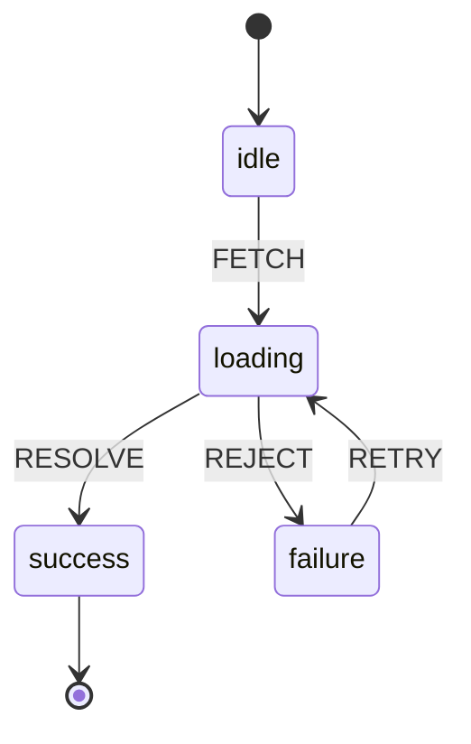

在处理复杂的前端 UI 交互时，开发者经常面临逻辑分支爆炸的问题。多步骤表单、复杂的拖拽引擎或带有权限判断的支付链路，如果仅依赖离散的 `boolean` 变量（如 `isLoading`, `isError`），会导致代码难以维护且极易产生非法状态。

## 1. 离散变量引发的“不可能状态”

常规的 React `useState` 模式通常如下：

```typescript
const [isLoading, setIsLoading] = useState(false);
const [isError, setIsError] = useState(false);
const [data, setData] = useState(null);

// 逻辑漏洞：可能同时存在 isLoading 为 true 且 isError 为 true 的情况
if (isLoading && isError) {
  // 这种物理意义上不可能存在的状态组合，在逻辑上却被允许了
}
```

这种隐式的逻辑缺陷随着业务迭代会演变成“意大利面条”代码。有限状态机 (Finite State Machine, FSM) 提供了一种数学模型，通过显式定义状态和转换路径来消除这些隐患。

## 2. 有限状态机 (FSM) 的数学模型

一个标准的 FSM 由五个核心要素组成：
1. **States (S)**：系统所有可能存在的有限状态集合。
2. **Events (E)**：触发状态转换的输入信号。
3. **Transitions (T)**：定义在特定状态下接收特定事件后，系统应迁移到的新状态。
4. **Actions (A)**：在状态转换或进入/退出状态时执行的副作用。
5. **Context (C)**：状态机携带的扩展数据（在 XState 中称为 Extended State）。



## 3. XState 核心实现与分层架构

XState 不仅仅是 FSM 的实现，它还支持分层状态机 (Hierarchical State Machines) 和并行状态 (Parallel States)。

### 3.1 状态机配置示例

```typescript
import { createMachine, assign } from 'xstate';

interface FetchContext {
  retries: number;
  errorMessage?: string;
}

const fetchMachine = createMachine<FetchContext>({
  id: 'fetch',
  initial: 'idle',
  context: { retries: 0 },
  states: {
    idle: {
      on: { FETCH: 'loading' }
    },
    loading: {
      on: {
        RESOLVE: 'success',
        REJECT: {
          target: 'failure',
          actions: assign({
            errorMessage: (_, event: any) => event.data
          })
        }
      }
    },
    failure: {
      on: {
        RETRY: {
          target: 'loading',
          cond: (ctx) => ctx.retries < 3,
          actions: assign({ retries: (ctx) => ctx.retries + 1 })
        }
      }
    },
    success: { type: 'final' }
  }
});
```

### 3.2 React 集成

通过 `@xstate/react` 提供的 `useMachine` 钩子，可以将控制流逻辑与 UI 渲染彻底解耦。

```tsx
import { useMachine } from '@xstate/react';

function DataFetcher() {
  const [state, send] = useMachine(fetchMachine);

  return (
    <div>
      {state.matches('idle') && <button onClick={() => send('FETCH')}>Start</button>}
      {state.matches('loading') && <p>Loading... (Attempt: {state.context.retries})</p>}
      {state.matches('failure') && (
        <button onClick={() => send('RETRY')}>Retry</button>
      )}
      {state.matches('success') && <p>Data loaded successfully.</p>}
    </div>
  );
}
```

## 4. 业务踩坑：Context 滥用与状态黑洞

XState 最容易被新手误用的地方，就是把它当成 Redux 来用，把所有业务数据都塞进 `context` 里。

**陷阱：**
假设你在做一个电商系统，你把长达 1000 条的商品列表数组存进了 XState 的 `context.productList` 中。
XState 的哲学是“不可变数据（Immutable）”。每次状态机发生转换（哪怕只是从 `idle` 变成 `loading`），底层的解释器都会对整个 `context` 进行浅拷贝更新。如果你的 `context` 里塞满了巨大的业务对象，不仅会导致严重的性能开销（内存抖动），还会让状态机的调试器面板直接卡死。

**最佳实践：分离“控制状态”与“数据状态”**

状态机只应该管理**控制流（Control Flow）**，而不应该管理**数据流（Data Flow）**。

- **应该放进 XState Context 的**：重试次数（retries）、当前选中的步骤索引（stepIndex）、表单的校验有效性（isValid）。
- **不应该放进 XState Context 的**：巨大的 JSON 列表、富文本编辑器的内部实例、File 对象。

对于巨大的业务数据，最佳的做法是：**用 XState 控制状态，用 Zustand/React Context 存储数据。** XState 的 `actions` 负责触发数据层的更新。

## 5. React 18 严格模式下的并发陷阱

在 React 18 的 Strict Mode 下，组件在开发环境会被挂载、卸载、再挂载。这对于普通的 `useState` 影响不大，但对于 `useMachine` 却是致命的。

如果你的状态机在 `entry` 动作中包含了一个发送网络请求的 `invoke` 服务，那么在 Strict Mode 下，这个网络请求会被**意外地发送两次**，甚至导致状态机收到乱序的回调而卡在死胡同。

**解决方案：**

1. **避免在极短的 entry 动作中做不可逆的副作用**。
2. **使用单例模式或 `spawn`**：如果某个状态机掌管的是全局级或模块级的核心逻辑，不要在组件树深处使用 `useMachine` 动态创建它。应该在组件外部使用 `createActor` 实例化它，然后在 React 中通过 `@xstate/react` 的 `useActor` 引入这个单例的引用。

```typescript
// store/authMachine.ts (组件外部)
import { createActor } from 'xstate';
import { authMachine } from './machine';

// 全局单例 Actor
export const authActor = createActor(authMachine).start();

// Component.tsx
import { useSelector } from '@xstate/react';
import { authActor } from './store/authMachine';

function UserProfile() {
  // 只订阅自己关心的状态，避免由于其他状态变更导致组件无意义的重渲染
  const isReady = useSelector(authActor, (state) => state.matches('ready'));
  // ...
}
```

## 6. 架构优势与确定性


引入状态机后，前端架构从“基于变量的条件判断”转向了“基于状态的驱动模型”。

1. **消除非法状态**：系统永远处于定义的有效状态之一，不存在 `loading` 且 `error` 的中间态。
2. **逻辑可视化**：XState 提供的可视化工具可以将代码直接转换为状态图，方便产品经理与开发人员对齐逻辑。
3. **高可测试性**：状态转换是纯函数式的，可以通过编写针对事件序列的测试用例，覆盖所有可能的交互路径。

这种模式在处理如低代码编辑器、复杂审批流等高交互场景时，能显著降低系统的认知负荷。
