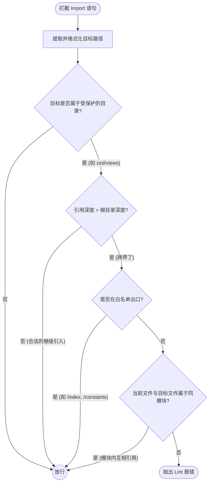
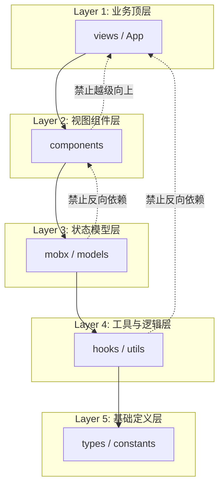
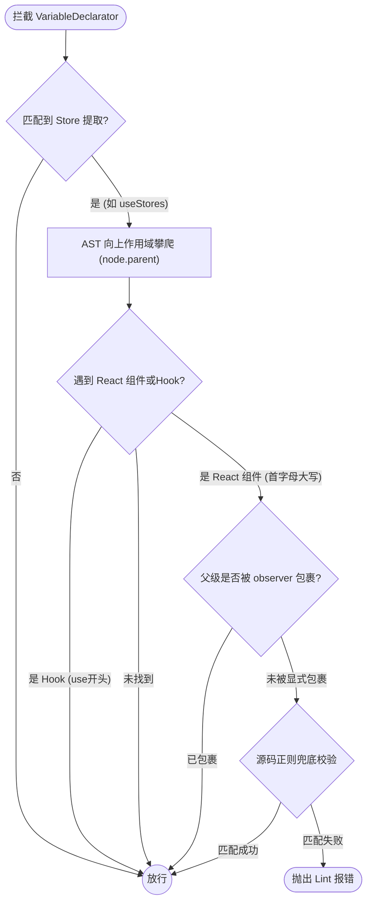

## 1. 背景与初衷

随着 Zion Editor (`zed`) 前端工程体量的不断溢出，传统的业界开源 ESLint 规则集（如 `eslint-config-airbnb`、`plugin:react/recommended`）已经远远无法满足我们对大型项目**架构分层、模块解耦以及状态响应安全性**的非常苛刻的要求。

在团队数十人的日常协作中，经常会遇到以下令人头疼的架构腐化问题：
1. **跨模块深度引用**：A 模块图方便，绕过了 B 模块暴露的公共 `index.ts`，直接 `import` 了 B 模块内部极深层级的一个私有组件或函数。导致 B 模块重构时牵一发而动全身。
2. **架构反向依赖（反向依赖）**：底层的 `utils` 或 `hooks` 模块，为了方便，竟然 import 了最顶层的 `views` 模块里的常量，导致底层代码彻底失去独立性。
3. **响应式状态遗漏的难以排查的 Bug**：开发者在 React 组件里通过 Hook 取出了 MobX 的 Store，却忘记用 `observer` 包裹该组件。导致数据发生变化时，UI 死活不更新，非常难排查。

借着构建系统（Webpack 到 Rsbuild）及 ESLint 引擎（升级至 v9 Flat Config）大升级的契机，我在 `config/eslint-rules/` 目录下**从零自研了一套专属于 zed 的定制化 ESLint AST 规则集**。

本文将详细剖析这三大底层规则的设计思想与实现细节。

---

## 2. 规则一：跨模块深度引用限制 (no-cross-module-deep-import)

### 痛点与设计目标
`zed` 各个业务模块（如 `views/AF`、`components/LegendaryTable`、`mobx/stores/FileStore`）在设计上应该像黑盒一样，外部只能通过其根目录的 `index.ts` 访问公共 API。
如果放任跨模块深度引用，会产生极强的、不可控的网状耦合，并极易引发循环依赖。

我的目标是：
* **防范私有 API 泄露**：确保模块内部重构（修改私有组件名、移动目录）安全。
* **白名单豁免机制**：允许跨模块引用纯类型（`import type`），因为类型在编译后会被抹除，不造成实际运行时耦合；允许特定公共出口（如 `constants`, `types`）的深度引用。

### 核心实现思路与 AST 拦截
该规则的核心是拦截所有的模块导入途径，包括普通 `import`、重导出 (`export {x} from`) 甚至动态按需加载 (`await import()`)。



```javascript
// config/eslint-rules/no-cross-module-deep-import.mjs (节选片段)
create(context) {
  const checkImport = (node, importPath, isTypeOnly = false) => {
    // 1. 纯类型导入直接豁免，不造成运行时耦合
    if (isTypeOnly) return;
    
    // 2. 解析与格式化路径
    const normalizedImportPath = targetImportPath.replace(/^@src\//, '');
    const importParts = normalizedImportPath.split('/').filter(Boolean);

    // 3. 动态配置各核心目录的合法深度阈值
    const protectedRoots = {
      views: { depth: 3 },       // e.g. zed/views/AF (允许的根深度为3)
      components: { depth: 3 },  // e.g. zed/components/Button
      mobx: { depth: 4, subName: 'stores' }, // e.g. zed/mobx/stores/FileStore
    };
    const config = protectedRoots[importParts[1]];
    if (!config) return;

    // 4. 判定引入是否越界（深度大于根目录深度）
    if (importParts.length <= config.depth) return;

    // 5. 白名单放行：允许深入引入暴露的公共出口
    const extraPath = importParts.slice(config.depth).join('/');
    const allowedDeepPaths = /^((index(\.(tsx|ts|js|jsx))?)|constants(\.(ts|js))?|types(\/.*)?)$/;
    if (allowedDeepPaths.test(extraPath)) return;

    // 6. 模块内同源放行：属于同一个模块内部的代码可以随意互相引入
    if (currentModuleName === importedModuleName) return;

    // 7. 越界且非同源，触发红牌警告！
    context.report({
      node,
      messageId: 'deepImportForbidden',
      data: { sourceModule: currentModuleName, targetModule: importedModuleName, internalPath: extraPath }
    });
  };

  return {
    ImportDeclaration(node) { checkImport(node.source, node.source.value, node.importKind === 'type'); },
    ExportNamedDeclaration(node) { /* ... */ },
    ImportExpression(node) { /* ... */ }
  };
}
```

---

## 3. 规则二：架构反向依赖限制 (no-reverse-dependency)

### 痛点与设计目标
标准的分层架构数据流应当是单向的：上层（视图）可以依赖下层（组件/工具），下层绝不能依赖上层。但在历史长河中，常出现底层 `utils` 贪图方便引入了顶层 `views` 的情况。
这会导致底层逻辑被顶层业务“污染”，破坏了 `hooks`、`utils` 等通用代码被抽离为独立 NPM 包的可能性（严重影响我们后续引入 Turborepo 的架构演进）。

### 核心实现思路与架构防腐
我在 AST 规则中硬编码了整个项目的**架构层级秩序表（数字越小层级越高，权限越高）**。



```javascript
// config/eslint-rules/no-reverse-dependency.mjs (节选片段)
create(context) {
  // 维护了一份硬编码的绝对秩序架构层级表
  const layerConfig = {
    views: 1,      App: 1,
    components: 2,
    mobx: 3,       models: 3,
    hooks: 4,      utils: 4,
    types: 5,      constants: 5,
  };

  return {
    ImportDeclaration(node) {
      // 1. 获取当前文件所在的层级
      const sourceLayer = layerConfig[sourceModule];
      
      // 2. 获取试图 import 的目标文件层级
      const targetLayer = layerConfig[targetModule];

      // 3. 防腐判定：一旦当前层级数字大于目标层级（意味着底层的低权限模块引入了高层级模块）
      if (sourceLayer > 0 && targetLayer > 0 && sourceLayer > targetLayer) {
        context.report({
          node,
          message: `💩 架构规范：禁止反向依赖。 [${sourceModule}] 属于底层模块，不能直接依赖上层的 [${targetModule}]。`,
        });
      }
    }
  };
}
```
*这套规则就像一道单向阀，从根本上杜绝了“反向依赖”的代码腐化。*

---

## 4. 规则三：MobX 响应式遗漏检测 (mobx-require-observer)

### 痛点与设计目标
Zion 高度依赖 MobX 进行响应式状态管理。最愚蠢但也最折磨人的 Bug 是：开发者在组件里使用了 `useStores()` 提取了数据，却忘记用 `observer()` 包裹组件。这导致底层数据变了，但 React 组件根本不更新！

以前这种问题只能靠肉眼 Code Review，现在我将其写成了一套非常复杂的**多重 AST 分析器**。

### 核心实现思路与 AST 攀爬探测

这个规则的难点在于：Store 是怎么取出来的？组件是怎么被包裹的？包裹的方式可能是在导出时，也可能是在定义时。

#### 第一步：多维度 Store 提取捕获
我们通过监听 AST 的 `VariableDeclarator` (变量声明)，利用正则智能推导是否在提取局部/全局 Store：
* 监听特定 Hook：`useStores()`, `useLocalStore()`, `useXxxStore()`。
* 监听变量名暗示：`const canvasStore = useContext()`。
* 监听解构行为：`const { afStore } = useAFContext()`。

*真实的 AST 语法树解剖视角（以 `useStores()` 为例）*：
```json
{
  "type": "VariableDeclarator",
  "id": { "type": "ObjectPattern", "properties": [{ "key": { "name": "canvasStore" } }] },
  "init": {
    "type": "CallExpression",
    "callee": { "type": "Identifier", "name": "useStores" }
  }
}
```
通过比对 AST 节点特征：`node.init.type === 'CallExpression'` 且 `callee.name.includes('Store')`，我们就能像精准定位一样，在编译阶段精准定位到响应式数据的挂载点。

### 4.1 业务踩坑：AST 向上作用域攀爬 (Scope Climbing) 的精准误判排雷

在检测“是否漏写了 `observer`”这个规则中，最初级的写法往往是：找到 `useStore`，然后就立刻抛出警告。
但这种写法在真实业务中会产生**海量的误报 (False Positives)**，直接被同事们喷到下线。

**为什么会误报？**
1. **普通工具函数调用**：开发者在一个普通的非 React `utils` 函数里，调用了一个提供外置状态的 `getStore()`，这根本不需要 `observer`。
2. **高阶组件隔空包裹**：组件被 `forwardRef` 或者 `withRouter` 包裹了好几层，`observer` 写在了最外层。
3. **自定义 Hook 内部提取**：开发者写了一个 `useUserData` 的 Hook，里面调用了 `useStore`，此时警告应该抛给使用这个 Hook 的组件，而不是这个 Hook 本身！

**工业级解法：AST 节点攀爬与黑白名单过滤**

为了实现**“零误报”**的 Lint 拦截，我编写了一段硬核的 AST 作用域攀爬代码。当我们在 AST 树中捕获到 Store 提取逻辑时，我们利用 `node.parent` 指针，像爬树一样**逐层向上寻找当前代码执行的真实上下文 (Context)**。

```javascript
// 核心攀爬探测器：向上寻找真正的 React 组件宿主
function findReactComponentHost(node) {
  let currentNode = node.parent;
  
  while (currentNode) {
    // 1. 如果爬到了一个函数声明 (FunctionDeclaration / ArrowFunctionExpression)
    if (currentNode.type === 'FunctionDeclaration' || currentNode.type === 'ArrowFunctionExpression') {
      
      // 获取函数的名称
      const funcName = getFunctionName(currentNode);
      
      // 2. 误报排雷：如果是以 use 开头的自定义 Hook，绝对安全，立刻放行！
      if (/^use[A-Z]/.test(funcName)) {
        return { type: 'HOOK', node: currentNode };
      }
      
      // 3. 命中目标：首字母大写，且有 return JSX 语句，确认为 React 组件！
      if (/^[A-Z]/.test(funcName) && hasJSXReturn(currentNode)) {
        return { type: 'COMPONENT', node: currentNode, name: funcName };
      }
    }
    
    // 继续向上爬一层
    currentNode = currentNode.parent;
  }
  
  return { type: 'UNKNOWN', node: null };
}
```

通过这种严密的 Scope Climbing 算法，插件拥有了近乎人类 Code Review 的上下文感知能力。它能精准识别出当前这行 `useStore` 到底是在 Hook 里、在普通函数里、还是在真正的 React 渲染周期里，从而真正做到了可用性极高的工业级架构守卫。

## 5. “潜在问题”问题排查：老版本 ESLint 的字节数限制 Bug




```javascript
// config/eslint-rules/mobx-require-observer.mjs (节选逻辑展示)
// 1. 向上攀爬寻找父级 React 组件
let currentNode = node;
let componentNode = null;
while (currentNode) {
  if (currentNode.type === 'FunctionDeclaration' && /^[A-Z]/.test(currentNode.id.name)) {
    componentNode = currentNode;
    break;
  }
  currentNode = currentNode.parent;
}

// 2. 检查 AST 结构是否被 observer 显式包裹
let isWrappedDirectly = false;
let checkParent = componentNode.parent;
while (checkParent) {
  if (checkParent.callee && (checkParent.callee.name === 'observer' || checkParent.callee.name === 'memoWithObserver')) {
    isWrappedDirectly = true;
    break;
  }
  checkParent = checkParent.parent;
}

// 3. 终极兜底：剥离所有注释的纯净源码正则扫描
if (!isWrappedDirectly) {
  const cleanText = context.getSourceCode().text.replace(/\/\*[\s\S]*?\*\/|\/\/.*/g, '');
  const observerRegex = new RegExp(`(observer|memoWithObserver)\\s*\\(\\s*${compName}`);
  if (!observerRegex.test(cleanText)) {
    context.report({ node, messageId: 'requireObserver' });
  }
}
```

这套规则的落地，彻底根治了我们在日常迭代中因为漏写 `observer` 导致的“难以排查的”刷新 Bug，节省了大量的排查时间。

### 性能防劣化 (Early Return / Bailout)
自定义 ESLint 规则如果写得不够收敛，会在开发者每次按下 `Cmd+S` 时触发全量的 AST 深层遍历，导致 VSCode 的 Lint 提示严重卡顿（甚至耗时几秒钟）。
为了保障极致的研发体验，我在所有自定义规则的入口处都做了 **尽早退出 (Bailout)** 优化：
* **特征预检**：在进入昂贵的 AST 树遍历之前，先通过 `context.getSourceCode().text` 获取全文的纯字符串。利用高效率的正则表达式粗筛（例如 `if (!/Store|use[A-Z]/i.test(text)) return {}`），如果文件内压根没有相关的关键字，直接跳过整棵 AST 的解析。

这种深度的性能防劣化处理，确保了即便在非常庞大的单体仓库中，Lint 进程也始终保持在毫秒级响应。

---

## 5. “潜在问题”问题排查：老版本 ESLint 的字节数限制 Bug

在这些自定义规则刚推上测试流水线时，我们遇到了一个非常异常的 Bug。在我们公司内部使用的基于 Phabricator 的代码审查系统 (`arc lint`) 结合老版本的 lint 检查器时，抛出了如下异常：

```text
Exception: Parameter (...) passed to "setCode()" when constructing a lint message must be a scalar with a maximum string length of 128 bytes, but is 163 bytes in length.
```

**原因分析**：
这是因为我在自定义 ESLint 报错信息中，附带了异常代码的物理路径作为错误追踪，导致单条 Lint Message 的内容长度超出了当时 `arc` 校验工具硬编码的 128 bytes 的极限阈值，直接导致流水线崩溃。

**解决方案**：
如果你所在的基础架构组也遇到了此类报错，不用怀疑自己写的 ESLint 规则有问题，这是基础设施的历史技术债。你需要做的是去重新拉取更新（拉取新的 arc 相关仓库代码）来打破这个老旧的版本限制。

---

## 6. 总结与落地推广

为了让这些阻断性规则在不打断团队当前开发节奏的前提下平滑落地，我们将这些自定义规则默认配置为了 `warn` 级别。

并在 CI 和日常脚本中加入了专属的可视化检测命令：
```bash
# 生成一份专门展示不规范代码架构的可视化 HTML 报告
npm run lint:report

# 修复所有可以自动修复的规则
npm run lint-fix
```