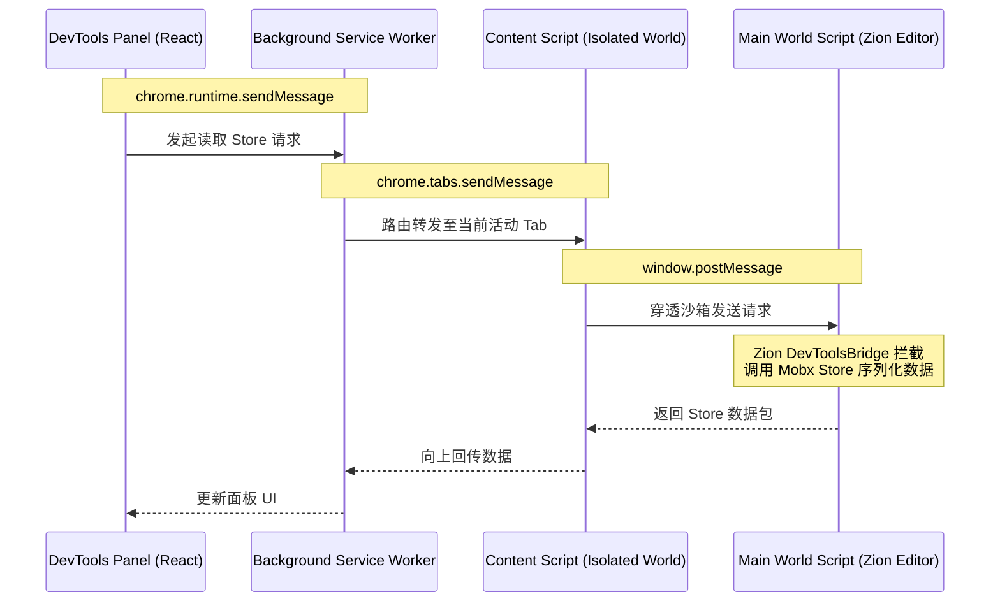
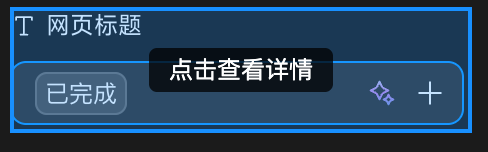
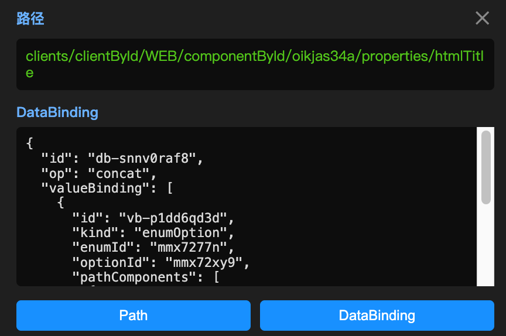
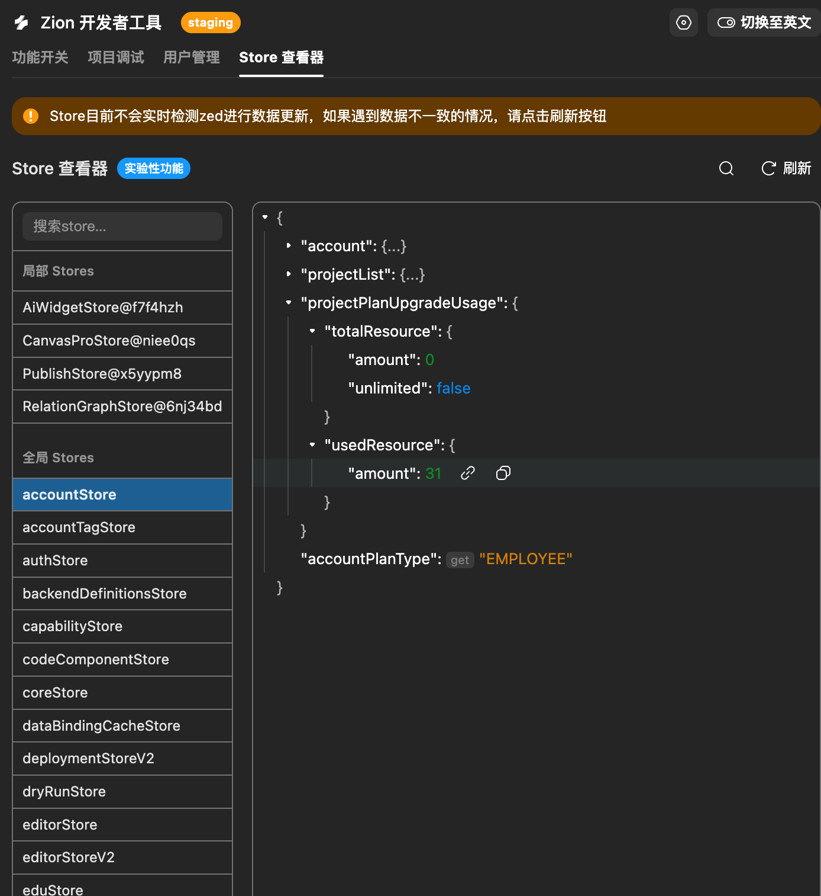
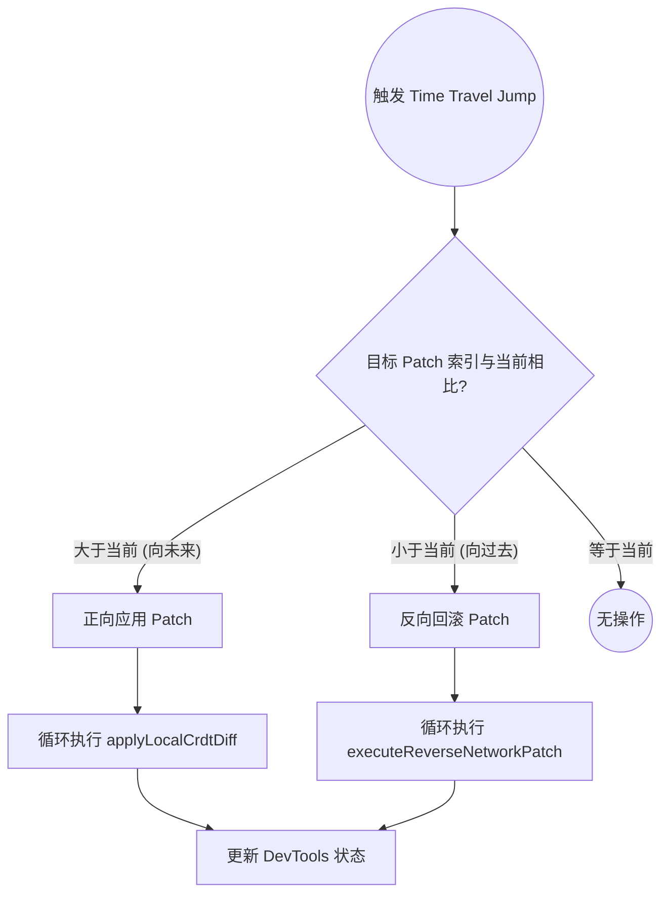
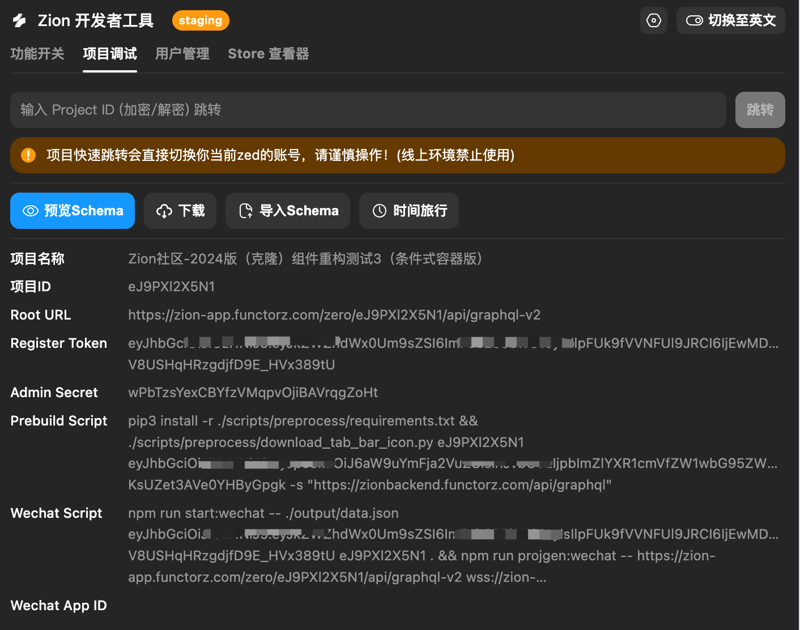

## 1. 背景与概述

在复杂的大型前端项目中，特别是像 **Zion Editor** 这种低代码/无代码可视化编辑器，传统的 React DevTools 或 Redux DevTools 往往显得力不从心。Zion Editor 底层包含了庞大的项目配置树（Project Store）、基于 CRDT（冲突无关复制数据类型）的协作数据流（Schema Store），以及复杂的可视化画布渲染逻辑。

为了解决日常开发和调试中的痛点，我从零到一独立设计并开发了 **Zion DevTools** (`zed-devtools`)。这是一个基于 Plasmo 和 React 构建的定制化 Chrome 浏览器插件，它通过“桥接”（Bridge）与 Zion 的运行时内核 (`zed`) 深度绑定，实现了三大核心能力：

1. **DOM 到业务数据的逆向穿透 (Inspector)**：一键抓取画布 DOM 背后隐藏的 React 数据绑定信息。
2. **巨型状态树的丝滑审查 (Store Inspector)**：支撑百万级节点的 Mobx/Zustand 状态树，实现零卡顿渲染与双向数据同步。
3. **协作数据的时光漫游 (Time Travel)**：基于 CRDT 底层机制，实现协作 Patch 的微秒级正向重放与逆向回滚。

本文将详细拆解该项目的架构设计、核心难点以及技术实现细节。

---

## 2. 整体架构设计：四层通信隧道

浏览器插件有着严格的安全沙箱（Isolated World）限制。插件的 UI 面板（Panel）无法直接访问页面的内部变量（如 `window.Zed` ），Content Script 也只能操作 DOM 而无法读取页面的 JS 执行上下文。

为了实现 DevTools 面板与 Zion Editor 运行时的双向通信，我设计了一套 **“四层通信隧道”** 架构：



1. **Panel (UI 层)**：开发者交互的界面，负责数据的展示与指令的下发。
2. **Background (路由层)**：作为整个插件的中枢神经，负责鉴权、跨 Tab 消息路由以及代码注入（Script Injection）。
3. **Content Script (中继层)**：运行在目标页面的隔离沙箱中，负责监听 URL 变化并作为 `chrome.runtime` 和 `window.postMessage` 之间的翻译网关。
4. **Main World (执行层)**：包含两部分：一是我通过 Background 强行注入的 Helper 脚本；二是 Zion 源码内置的 `DevToolsBridge` 监听器，它们直接运行在页面的真实执行环境中，拥有最高的数据访问权限。

---

## 3. 核心难点与攻克细节

### 难题一：跨越隔离世界，精准抓取组件数据绑定 (React Fiber Inspector)

**痛点**：
在 Zion 画布上，渲染出的真实 DOM 并没有存放复杂的 `DataBinding` 业务配置。普通的 Content Script 跑在隔离环境，完全碰不到页面里的 React 运行态。我们要实现“按住特定快捷键，鼠标悬浮元素即可查看底层绑定数据”，面临极大的权限和定位挑战。

**攻克方案**：
我编写了一段硬核的注入代码 (`helper.ts`)，并在 Background 中利用 `chrome.scripting.executeScript` 的 `world: "MAIN"` 属性，将其强行打入 **MAIN World**。
在这段脚本中，我劫持了 React 底层的内部机制：通过检索 DOM 节点上隐藏的 `__reactFiber$` 属性，获取真实的 Fiber Node，并沿着父级指针 (`fiber.return`) 向上层层级联遍历，直到精准提取出 Zion 内部独有的业务属性。

**核心代码 (`zed-devtools/src/contents/inspector/main-world/helper.ts`)**：

```typescript
// 寻找 DOM 节点上隐藏的 React Fiber 引用
function getFiber(dom: Element): FiberNode | null {
  const key = Object.keys(dom).find((k) => k.startsWith("__reactFiber$"));
  return key ? (dom as unknown as Record<string, FiberNode>)[key] : null;
}

// 向上级联查找，直到提取出 Zion 内部的 dataBinding 属性
function findDataBinding(dom: Element): Record<string, unknown> | null {
  let fiber = getFiber(dom);
  let depth = 0;
  // 控制遍历深度(最大15层)，防止无穷回溯带来的性能损耗
  while (fiber && depth < 15) {
    if (fiber.memoizedProps?.dataBinding) {
      return fiber.memoizedProps.dataBinding;
    }
    fiber = fiber.return ?? null;
    depth++;
  }
  return null;
}
```

配合 `keydown` / `mousemove` / `click` 的事件劫持（使用 `stopImmediatePropagation` 阻断画布默认点击），最终实现了极其惊艳的无缝查探体验。




---

### 难题二：百万级巨型 JSON 树的无卡顿渲染 (Store Inspector)

**痛点**：
Zion 的 Store 是一棵极其庞大且嵌套极深的对象树。如果直接在 DevTools Panel 中进行 JSON 的解析、展平和渲染，主线程会瞬间被阻塞，导致插件和浏览器假死。

**攻克方案：Web Worker 多线程 + 视窗虚拟列表**
我采用了“降维打击”的策略：
1. **多线程计算**：引入 Web Worker (`storeWorker.ts`)，将巨型 JSON 的深度遍历、路径生成、状态展开计算全部丢进子线程。主线程只负责接收处理好的、轻量的一维数组 (`VirtualLine[]`)。
2. **虚拟化渲染**：结合 `virtua` 库，把树形结构的渲染降维成了对一维数组的**按需切片加载**。即便 Store 包含十万个节点，DOM 树上也只存在当前视窗可见的那几十个元素。

**核心代码 (`zed-devtools/src/panels/views/StoreInspector/hooks/useStoreWorker.ts`)**：

```typescript
export const useStoreWorker = ({ data, expandedPaths }) => {
  const [virtualLines, setVirtualLines] = useState<VirtualLine[] | null>(null);

  // 初始化 Web Worker，将繁重的 JSON 解析与展平操作移出 UI 线程
  const { postMessage, isProcessing } = useWorker({
    workerFactory: () =>
      new Worker(new URL("../utils/storeWorker.ts", import.meta.url), {
        type: "module",
      }),
    onMessage: (data) => {
      // 接收 Worker 展平好的一维视图数组，UI 层仅需绑定到虚拟列表上
      if (data.success) {
        setVirtualLines(data.result);
      }
    },
  });

  const refreshView = useCallback(() => {
    if (!data) return;
    postMessage({ data, expandedPaths: Array.from(expandedPaths) });
  }, [data, expandedPaths]);

  return { virtualLines, isProcessing, refreshView };
};
```



---

### 难题三：基于 CRDT 架构的时间旅行调试 (Time Travel)

**痛点**：
像 Redux DevTools 那样的时光回溯，本质上是暴力的“全局 State 快照替换”。但 Zion 的协作底层是基于 CRDT 的，数据的演变是由无数个原子化的 `Patch`（补丁）串联而成。如果直接替换全局状态，会彻底破坏 CRDT 的协作一致性与内部时钟。

**攻克方案：精准的 Patch 回放与逆向剥离**
我在 Zion 端（`useTimeTravel.ts`）打通了底层的协同引擎。在时间线中穿梭时：
*   **向未来跳转（正向）**：依次执行 `applyLocalCrdtDiff` 叠加 Patch。
*   **向过去跳转（逆向）**：依次执行 `executeReverseNetworkPatch` 进行精准的反向剥离运算。

**业务流程展示**：



**核心逻辑 (`zion-all/zed/src/zed/views/DevToolsBridge/hooks/useTimeTravel.ts`)**：

```typescript
const onTimeTravelJump = useCallback(({ targetIndex }) => {
  const currentIndex = lastPatchIndexRef.current;
  const patches = currentNetworkPatchesRef.current;

  // 如果目标节点在未来，执行正向补丁应用
  if (targetIndex > currentIndex) {
    for (let i = currentIndex + 1; i <= targetIndex; i += 1) {
      applyLocalCrdtDiff(patches[i].content, {
        isPendingApplication: false,
        skipValidation: true, // 时间旅行时跳过常规校验
      });
    }
  } 
  // 如果目标节点在过去，执行网络补丁的反向重算与剥离
  else {
    for (let i = currentIndex; i > targetIndex; i -= 1) {
      const result = executeReverseNetworkPatch(patches[i]);
      if (!result.successful) {
        console.error('[DevTools Bridge] Failed to reverse patch at index', i);
        return;
      }
    }
  }

  // 记录当前游标并广播通知 DevTools 更新 UI
  lastPatchIndexRef.current = targetIndex;
  onBroadcastTimeTravelStatus();
}, [onBroadcastTimeTravelStatus]);
```



配合 `StoreRehydrate.rehydrate` 进行深度模型重水化，开发者可以在协作数据的任意一个历史变更节点之间自如穿梭，这对于排查多人协同冲突和复杂状态 Bug 而言是极大的效率提升。

---

### 难题四：SPA 路由侦听与企业级安全沙箱隔离

**痛点**：
Zion Editor 是一个重度的单页应用（SPA）。由于 Chrome Extension 的 Content Script 运行在隔离沙箱中，我们无法直接覆写（Hook）Main World 中的 `history.pushState` 来监听路由变化。另外，作为一个具有高权限的数据桥接插件，如果任意一个恶意网页都能向插件发送或接收调试指令，将带来极大的安全渗透隐患。

**攻克方案：轮询降级与严格的白名单校验**
1. **SPA 路由监听**：在 `bridge-relay.ts` 中，我采用原生 `popstate` 监听，并结合兜底的高频轮询 (`setInterval` 500ms) 的方式，来捕捉画布或工作区的 URL 切换。一旦 URL 发生变化，立刻通知 Background 重置插件的缓存和连接状态。
2. **按需执行与环境校验**：在 `background.ts` 中，所有跨 Tab 转发的消息 (`RELAY_TO_TAB`) 以及代码注入请求，都会经过一层严苛的 `SUPPORTED_URL_PATTERNS` 正则校验。确保插件的超能力只在 Zion 的本地开发 (`localhost`)、预发和生产域名下激活，从物理层面隔离安全风险。

**核心代码 (`zed-devtools/src/background.ts`)**：

```typescript
/** 支持的 URL 匹配模式（安全白名单） */
const SUPPORTED_URL_PATTERNS = [
  /^http:\/\/localhost(:\d+)?\//,
  /^https:\/\/zion\.functorz\.work\//,
  /^https:\/\/zion\.functorz\.com\//,
  /^https:\/\/editor\.momen\.app\//,
];

const isUrlSupported = (url?: string): boolean => {
  if (!url) return false;
  return SUPPORTED_URL_PATTERNS.some((pattern) => pattern.test(url));
};

chrome.runtime.onMessage.addListener((message, sender) => {
  // 路由转发前严格校验宿主环境
  if (message.type === DevToolsMessageType.RELAY_TO_TAB && message.tabId) {
    chrome.tabs.get(message.tabId).then((tab) => {
      // 拦截非法域名的渗透，静默忽略
      if (!isUrlSupported(tab.url)) return; 
      chrome.tabs.sendMessage(message.tabId, message.payload);
    });
  }
});
```

---

### 细节打磨：利用 Esbuild 动态编译与静态隔离注入

通常在 Chrome 插件开发中，注入脚本会作为静态资源放在 `manifest.json` 的 `web_accessible_resources` 中。但为了确保我的 Inspector 核心探针 (`helper.ts`) 能够始终获得最新的 TypeScript 类型支持、不受外部打包工具污染，且不向宿主环境暴露全局变量，我编写了一个独立构建流：

在执行 `pnpm build` 或 `pnpm dev` 时，利用 **esbuild** 脚本 (`scripts/build-inspector.ts`)，将 `helper.ts` 实时编译、打包、转义成一段纯文本的立即执行函数 (IIFE) 字符串（`helperCode.ts`），然后再由 Background 通过 `chrome.scripting.executeScript` 的 `func` 和 `args` 动态注入到页面的 Main World。

这种高度工程化的做法，不仅做到了逻辑的绝对隔离，还完美兼顾了现代 TypeScript 开发的丝滑体验。

---

## 4. 总结

`zed-devtools` 的开发不仅是一次简单的 Chrome 扩展实践，更是一次对 React 渲染机制、浏览器线程模型和前端数据协同底层的深度剖析与重构。

通过引入四层架构打破沙箱壁垒、利用 Web Worker 和虚拟列表突破性能瓶颈、结合 CRDT 实现时光倒流，最终呈现的是一个拥有极致性能和强大洞察力的开发者利器。这套技术方案同样适用于其他大型前端应用的专属调试工具开发，极具工程借鉴价值。
