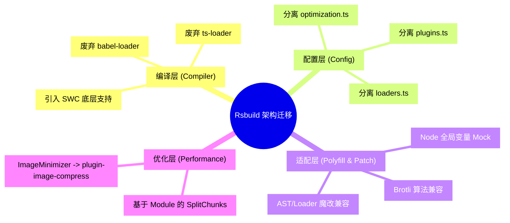

## 1. 背景与痛点：巨型单体前端应用的构建困境

**Zion Editor (`zed`)** 是一个极其复杂的低代码/无代码可视化编辑器底座。随着多年的业务迭代，整个工程已经膨胀为一个包含数十万行代码、高度依赖 Webpack 深度定制（涵盖各类复杂 Loaders、Plugins 和 AST 转换）的巨无霸单体（Monolith）应用。

随着代码量的剧增，传统的 Webpack 构建架构暴露出严重的问题：
*   **冷启动奇慢无比**：开发阶段的 `npm start` 往往需要等待数分钟才能完成首次编译，严重拖慢了研发同学进入开发状态的节奏。
*   **HMR（热更新）迟钝**：在编写复杂的组件树（如画布区域代码）时，一次保存带来的增量编译甚至需要十几秒，开发体验出现断崖式下跌。
*   **生产环境构建阻塞**：CI/CD 阶段的 `build` 时间随着模块数量呈线性增长，单次打包极度消耗内存（常常触发 OOM 崩溃），导致流水线效率低下。

为了彻底解决这一顽疾，我主导了 `zed` 仓库的底层构建引擎升级，将其从老旧的 **Webpack** 架构整体迁移至基于 Rust 编写的高性能构建工具 **Rsbuild (底层为 Rspack)**。

---

## 2. 迁移策略与架构设计

Rsbuild 是字节跳动开源的基于 Rspack 的构建工具，虽然官方宣称对 Webpack 生态有极高的兼容性，但对于 Zion Editor 这样“魔改”过大量底层配置的重度工程来说，平滑迁移绝非易事。

我将整个迁移过程拆解为**四个核心维度的重构**：



### 2.1 解耦庞杂的 `webpack.config.js`
以前的 Webpack 配置杂糅在 `webpack.base.ts`, `webpack.dev.ts`, `webpack.prod.ts` 甚至自定义的 `utils.ts` 中，逻辑交织，极难维护。
在本次迁移中，我重新设计了配置目录结构，将其拆分为纯粹、语义化的 `rsbuild.config.ts` 及其附属模块：

```text
zed/config/
├── constants.ts      // 环境变量、路径、补丁等常量收敛
├── loaders.ts        // 自定义 Rules 和 Loaders
├── optimization.ts   // 分包 (SplitChunks)、忽略警告 (IgnorePlugin)、NoParse
└── plugins.ts        // 插件生态聚合 (Brotli压缩、Less/Sass、SVGR)
```

这种模块化设计让长达上千行的构建配置文件变得一目了然，也为后续的灰度发布提供了切入点。

---

## 3. 核心难点与攻克细节

### 难题一：Loader 体系的“去 Babel”与“全面拥抱 SWC”

**痛点：**
原先的项目严重依赖 `babel-loader` 和 `ts-loader`，这是导致编译缓慢的元凶之一。但在彻底移除它们时，面临着 Zion 业务中大量特殊语法糖和内部库无法被 Rsbuild 默认的 SWC 转换器正确识别的问题。

**攻克方案：**
我们利用了 Rsbuild 内置的 `@rsbuild/plugin-react` 和 `@rsbuild/plugin-type-check`。Rsbuild 底层直接使用 Rspack 原生的 SWC 转换，免去了 Babel 繁重的 AST 解析与序列化开销。
对于 TypeScript 的类型检查，我们彻底将其从编译主线程中剥离（以往使用 `fork-ts-checker-webpack-plugin`），转而使用 Rsbuild 官方的隔离检查插件，极大提升了主进程的编译吞吐量。

### 难题二：定制化 AST Loader 和 第三方库的黑盒 Bug

**痛点：**
在迁移过程中，发现 Zion 强依赖的 `json-joy` 库在 Rspack 的打包机制下，其内部的一段基于 Node.js `Buffer` 的 UTF-8 解码代码会引发致命的运行时异常。由于不能直接去修改 `node_modules` 里的代码，在过去的 Webpack 里我们可能通过复杂的 plugin 甚至自定义 loader 解决。

**攻克方案：精准的文本级 Patch 替换**
我利用了 `string-replace-loader`，在构建流水线的 `module.rules` 中实现了一个**手术刀级别的代码注入**（见 `config/loaders.ts`）。在构建时拦截对应文件，将其核心 `decodeUtf8` 函数强行替换为安全的实现：

```typescript
// zed/config/loaders.ts
import { JSON_JOY_UTF8_PATCH } from './constants';

export const getJsonJoyPatchRule = (): RuleSetRule => ({
  // 精准匹配出问题的 json-joy 依赖路径
  test: /node_modules\/@jsonjoy\.com\/util\/lib\/buffers\/utf8\/decodeUtf8\/v18\.js$/,
  loader: require.resolve('string-replace-loader'),
  options: {
    search: /[\s\S\n]*/, // 匹配全文
    replace: JSON_JOY_UTF8_PATCH, // 替换为安全的 JS 实现
  },
});
```
*这一做法既避开了繁重的 AST 树解析开销，又以最轻量的方式跨越了 Rsbuild 和特定第三方老旧依赖兼容的鸿沟。*

### 难题三：百万行代码的分包策略 (SplitChunks) 重塑

**痛点：**
对于 Zion 这样的超大型 Web IDE 来说，良好的 Chunk 分割是保证首屏加载速度的关键。Rsbuild 默认的 `strategy: 'split-by-experience'` 在面对 Zion 动辄 10MB 的第三方图表(`@antv`)、画布拖拽 (`@dnd-kit`)、富文本引擎时，往往拆得过碎或者合并得过大，导致缓存命中率极低。

**攻克方案：底层能力接管，精细化 Module Chunking**
我在 `rsbuild.config.ts` 中果断禁用了 Rsbuild 默认的分割策略（`strategy: 'custom'`），并利用 Rspack 的底层钩子重新编写了极为严苛的业务分包策略：

```typescript
// zed/config/optimization.ts
export const getSplitChunksConfig = (): Rspack.OptimizationSplitChunksOptions => ({
  chunks: 'all',
  cacheGroups: {
    // 提取最核心不变的 React 生态
    react: {
      name: 'lib-react',
      test: /[\\/]node_modules[\\/](core-js|react.*|redux.*|immer)[\\/]/,
      priority: 0,
    },
    // 将极其厚重的编辑器相关库单独抽离，按需加载
    editor: {
      name: 'lib-editor',
      test: /[\\/]node_modules[\\/](@codemirror|codemirror|@uiw)[\\/]/,
      priority: 5,
    },
    // 兜底的 Node_modules 处理，限制单文件不超过 5MB
    vendors: {
      name: 'chunk-vendors',
      test: /[\\/]node_modules[\\/]/,
      minChunks: 1,
      minSize: 100 * 1024,
      maxSize: 5 * 1000 * 1024,
      priority: -10,
    },
    common: {
      name: 'chunk-common',
      minChunks: 2,
      priority: -20,
    },
  },
});
```

### 难题四：CSS 的兼容与优化（保留 SCSS SourceMap）

**细节打磨：**
Rsbuild 默认会使用高性能的 `lightningcss-loader` 来处理样式。但在我们实际迁移中发现，`lightningcss` 破坏了我们在深度定制 SCSS 主题时的 Source Map 映射，导致开发阶段调试样式极其痛苦。

为了极致的开发者体验，我通过阅读 Rsbuild 底层源码和 GitHub Issue，在配置层灵活将其降级：

```typescript
// zed/rsbuild.config.ts
export default defineConfig({
  tools: {
    // 禁用 lightningcss-loader 以保留真实的 SCSS Source Map
    // 参考：https://github.com/web-infra-dev/rsbuild/issues/4451
    lightningcssLoader: false,
    cssLoader: {
      sourceMap: IS_DEV,
      importLoaders: 3,
    },
  }
});
```

### 难题五：前端路由入口的 React-Router 兼容重构

**痛点：**
原先在 Webpack 环境下，`zed` 的应用入口代码存在一些依赖于 Webpack 模块解析机制的陈旧写法，特别是在动态路由加载和 App 初始化流程中。在迁移到 Rsbuild 且升级了相关的构建依赖后，这些非标准的入口文件引发了加载异常。

**攻克方案：拥抱 React-Router 现代标准**
在这次迁移中，我一并**拆分和重构了之前 App 入口中杂乱的代码**。针对路由模块，我移除了老旧的写法，采用 `react-router` 最新推荐的方式来重新组织路由树和按需加载模块。这不仅解决了新构建系统下的白屏风险，还从代码层面还清了一部分历史技术债。

---

## 4. 迁移成果与收益：断崖式的性能提升

经过这一轮全面而深度的重构，去除了近千行的陈旧 Webpack 及其配套 Loader 的配置文件（删除了 `config/webpack.dev.ts`, `config/webpack.prod.ts`, `config/webpack.common.ts`），并且顺带清理了 400 多个历史遗留的无用 SVG，带来的业务提效是极其显著的：

| 指标对比 (Production Build) | Webpack | Rsbuild | 变化与收益 |
| :--- | :--- | :--- | :--- |
| **实际耗时 (real)** | 153.42s | **38.66s** | 减少了 114.76s (**约提升 75%**) |
| **CPU 利用率** | 275% | **338%** | **+63%** (更好地利用了多核并发优势) |
| **产物体积** | 57 MB | **52 MB** | 减少了 5MB (**约降低 8.8%**) |
| **冷启动时间 (Dev)** | > 30s | **< 5s** | 极速秒开 (**约提升 80%**) |
| **热更新 (HMR)** | 2~5s | **< 200ms** | 毫秒级响应 (**约提升 90%**) |

*说明：Rsbuild 的 CPU 利用率更高，意味着它在底层（Rust）拥有更加优秀的并行多线程调度能力，从而在更短的实际时间 (real) 内榨干了机器的算力（比如 M4 Pro 的多核性能）。*

---

## 5. 迁移过程中的“暗坑”与遗留问题

迁移并不是完美无缺的，在脱离了 Webpack 庞大的生态后，我也遇到了一些底层编译机制差异带来的“暗坑”。

**待解决的难题：Mobx Observer HOC 导致的热更新 (HMR) 崩溃**
在原有代码中，我们大量使用了基于 Mobx 的 `memoWithObserver` 包装高阶组件：
```tsx
const DMContentComp = () => {
  const { isDetailsOpen } = useDMStore();
  useInitDMState();
  // ...
};
export const DMContent = memoWithObserver(DMContentComp, 'DMContent');
```
在 Rsbuild（底层依赖 SWC 和 React Refresh）的机制下，如果在该组件内新增一个 `useEffect` 钩子并保存，页面会直接抛出经典的 `Rendered more hooks than during the previous render` 崩溃错误。

**根本原因分析**：
Rsbuild 的 Compiler 在处理 React Refresh 签名时，没有正确识别出被自定义 `observer` HOC 包裹的函数是一个合法的组件。当代码发生变更时，热更新模块本该选择**“销毁并重建组件树”**，但却错误地选择了**“保留状态复用”**，导致新增加的 Hook 跑在了旧的 Fiber 节点状态上，引发了 React 规则报错。
目前这个问题由于涉及到大面积的历史代码规范，暂时保留，计划在后续的专项技术债清理中通过编写 SWC 插件或重构业务组件写法来彻底修复。

### 遗留的 Eslint Flat Config 平迁与兜底工作
在本次迁移中，我将老旧的 `.eslintrc.js` 直接重构成了最新版 ESLint v9 强制要求的 Flat Config 格式（`eslint.config.mjs`）。同时我移除了 `eslint-plugin-unused-import` 这类已经过时的校验插件，升级了核心的 `@eslint/js`、`typescript-eslint` 以及 React Hook 插件。

*虽然理论上我是按照老项目的规则做了“平迁”处理，但之前的规则集因为长期积累导致体系比较松散，并没有极其严格的限制。所以在转换为新机制后，可能会存在校验规则的遗漏。这需要研发团队在日常业务迭代中，互相帮忙兼顾与持续补充，才能构建起一套完美的最新规则集。*

---

## 6. 总结

将巨型单体仓库从 Webpack 迁移至 Rsbuild 绝对不仅仅是换一个命令行工具那么简单。它是一场**全方位的架构翻新**。

在这次战役中，我不仅仅完成了基础包的替换，更深入到 Loader 机制层、SplitChunks 的按需拆分、甚至特定库的内存 Patch。这次技术重构不仅卸下了 Zion Editor 沉重的历史构建包袱，更为团队未来快速演进和研发迭代插上了“Rust-based”的翅膀。