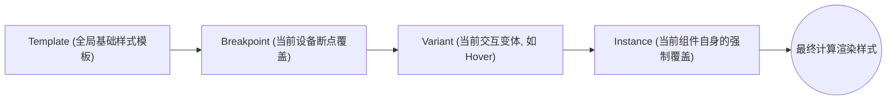

## 1. 背景与历史包袱

在低代码/无代码平台的演进过程中，“组件样式系统（Styling System）”往往是第一个遇到架构瓶颈的模块。

随着平台内置组件数量的增加和用户界面自定义需求的膨胀，Zion 早期基于扁平化 `mRef` 属性存储样式的方案很快暴露出了非常严重的技术债：

1. **样式无法复用与 Schema 膨胀**：如果用户希望 50 个按钮保持统一的样式，旧版架构下这 50 个按钮实例的 Schema 会完全复制这几十个 CSS 属性。这种重复导致整个页面的 JSON Schema 体积呈指数级增长，严重拖慢了网络解析与渲染性能。
2. **类型安全与结构化定义的缺失**：旧版定义非常僵化且缺乏约束（例如 `width` 强制为 `number`，或者直接使用松散的 `string`）。这导致在配置复杂样式（如渐变色、阴影、多单位尺寸）时极易出错，且无法在代码层面对不合法的样式组合进行拦截。
3. **断点与交互变体（Hover/Active）管理的混乱**：早期的设计缺乏对响应式（Breakpoints）和伪类（Variants/Triggers）的抽象层支持。

为了解决以上问题，我主导设计并落地了 Zion 全新的组件样式架构方案，核心围绕 **数据结构抽象** 与 **Comp Style Templates** 展开。

---

## 2. 核心解法一：CSS 属性的强类型抽象与结构重塑

为了建立健壮的样式基建，必须打破“纯 CSS 字符串”的限制。我将原本松散的样式字段与标准 CSS 规范对齐，进行了深度的结构化与强类型抽象。

### 2.1 颜色与数值的结构重塑
在重构中，我们摒弃了简单的 `string` 或 `number` 定义。
例如，针对宽度/高度等布局尺寸，拆分出了明确的单位枚举（`SizeUnit`）和结构化的尺寸定义：

```typescript
export enum SizeUnit {
  FIXED = 'px',
  RELATIVE = '%',
  FILL = 'fr',
  AUTO = 'auto',
}

export interface SizeDefaultMeasure {
  value: number; 
  unit: SizeUnit; 
}

export interface SizeStyle {
  width: SizeDefaultMeasure | 'auto';
  height: SizeDefaultMeasure | 'auto';
  minWidth?: SizeDefaultMeasure;
  maxWidth?: SizeDefaultMeasure;
}
```

针对颜色等需要复杂渲染的属性，我们也引入了枚举化分类（如 `DefaultColorStyle`、`LinearGradientColorStyle`），使其能够安全地支持纯色与渐变色。

### 2.2 复杂类型的精细拆解与聚合
为了贴合 TypeScript 的严格校验体系，我将原先庞大的字段进行了分类聚合：
* **Layout 布局**：整合 `display`, `justifyContent`, `alignItems`, `flexDirection`, `flexWrap`, `rowGap`, `columnGap`，形成完整的 `FlexLayoutStyle` / `GridLayoutStyle`。
* **Position 定位**：根据 `PositionKeyword` (relative/absolute/fixed/sticky)，拆分对应的方向坐标。
* **BoxShadow 阴影**：拆分 `offsetX`, `offsetY`, `blur`, `spread`, `color`。
* **Typography 字体**：统一收敛到 `TextStyle` 下，合并 `color`, `fontFamily`, `fontWeight`, `lineHeight` 等。

最终，所有的 CSS 能力被整合成了大一统的 `Styles` 基础数据结构：

```typescript
export interface Styles {
  layout: LayoutStyle;
  size: SizeStyle;
  position: PositionStyle;
  margin: MarginStyle;
  padding: PaddingStyle;
  text: TextStyle;
  background: BackgroundStyle;
  border: BorderStyle;
  // ... 其他属性
}
```

---

## 3. 核心解法二：Comp Style Templates 抽象层架构

为了解决 Schema 的无限膨胀，我引入了 **Comp Style Templates (组件样式模板)** 概念。
这套架构的核心思想是将“抽象层面的样式定义”与“组件的实例数据”彻底剥离，形成 **抽象层 (Abstract Layer)** 与 **实例层 (Instance Layer)** 的双层架构。

### 3.1 抽象层 (Abstract Layer)：模板配置设计
我们在 Schema 根节点建立了一个统一的 `styleTemplates` 字典。所有的样式定义（如 primary button、outline button）都作为独立的实体存放在此，由 `CompStyleTemplateConfig` 进行描述。

```typescript
interface Schema {
  styleTemplates: CompStyleTemplates;
  mRefsMap: Record<string, ComponentMeta>;
}

// 模板基于组件类型 (ComponentType) 进行隔离存放
type CompStyleTemplates = Record<
  ComponentType,
  Record<CompStyleTemplateConfig['id'], CompStyleAttributes>
>;
```

### 3.2 实例层 (Instance Layer)：多断点与交互变体矩阵
组件实例本身不再存储海量的 CSS 代码，它只保留一个 `template` 的引用 ID。同时，为了支持响应式和特殊状态，实例层 (`CompStylesDefault`) 引入了对 **断点 (Breakpoints)** 和 **交互变体 (Interaction Variants)** 的原生支持。

在断点设计上，我们预设了标准化的枚举（如 `PresetBreakpoint.WEB1`, `WEB2`），允许开发者针对不同屏幕尺寸进行样式重写。在交互变体上，支持了 `Hover`, `Active` 等状态的精细化配置。

```typescript
enum PresetBreakpoint {
  WEB1 = 'WEB1', // e.g., >= 1440px
  WEB2 = 'WEB2', // e.g., >= 1024px
  MOBILE = 'MOBILE',
}

enum InteractionVariant {
  HOVER = 'Hover',
  ACTIVE = 'Active',
  DISABLED = 'Disabled',
}

// 实例层的样式定义结构
interface CompStylesDefault {
  template: CompStyleTemplateConfig['id']; // 指向全局抽象模板
  breakpoint: Record<PresetBreakpoint, Partial<CompStyleAttributes>>;
  variant?: Record<PresetBreakpoint, Record<InteractionVariant, Partial<CompStyleAttributes>>>;
}
```

最终应用在 DOM 上的样式，遵循一套严格的优先级覆盖顺序：



这种设计使得当我们想要一键替换全站按钮的背景色时，只需修改一条 `styleTemplates` 记录即可。所有继承该模板的组件实例样式将自动发生变更，这极大地减小了项目的 JSON 体积。

---

## 4. 架构优势：Component-Property 矩阵的 TS 类型实现

在无代码平台中，并非所有组件都支持所有样式。比如，一个纯文本 (`Text`) 不应该有内部容器（Container）颜色配置；一个输入框 (`Input`) 需要特有的 `placeholderColor`；而滚动容器则需要定制 `scrollbar` 样式。

为了在代码层杜绝错误配置，我将这一套样式矩阵完全用 TypeScript 类型实现了约束。不同的组件类型拥有独立的 `xxxStyles` 接口定义，精确控制了哪些区域可以使用哪些样式，甚至包括特定的伪元素：

```typescript
// 以 Input 组件为例，包含特有的 placeholderColor
export interface InputStyles {
  wrapper: {
    layout: BlockLayoutStyle;
    size: SizeStyle;
    // ...
  };
  input: {
    text: TextStyle;
    background: BackgroundStyle;
    placeholderColor: DefaultColorStyle; // 特有伪元素样式
  };
}

// 滚动容器特有样式
export interface ScrollableContainerStyles {
  container: {
    scrollbar: ScrollbarStyle; // 滚动条定制
  };
}
```

通过这种**基于 `Pick` 和 `Omit` 的组合式类型定义**，前端的属性面板（Right Sidebar）能够通过类型推导，精准地为不同组件的特定层级提供合法的样式配置控件。

**架构演进细节：**
在这次重构中，我们对历史遗留的组件结构也进行了清理。例如，早期用于占位和布局的 `blank-container` 组件被正式废弃，全面拥抱基于 `view` 模板的 `CustomView` 架构。`CustomView` 配合全新的样式矩阵，不仅能够替代 `blank-container` 的所有功能，还能提供更清晰的 DOM 结构和更好的样式扩展能力。

---

## 5. 总结

Zion 的 `Comp Style Templates` 重构是一次深度的 Schema 数据模型改造。

它通过强类型的结构化抽象打破了纯 CSS 字符串的局限，利用 `Abstract Layer` 与 `Instance Layer` 的分离，以及 `Template < Breakpoint < Variant` 的多维矩阵模型，解决了样式复用与 JSON 膨胀问题。配合底层严格的 `Component-Property` 类型矩阵和对 `CustomView` 等现代组件架构的升级，这套基建为 Zion 未来更复杂的 UI 搭建需求（如多端适配、设计系统导入）提供了底层支持。
