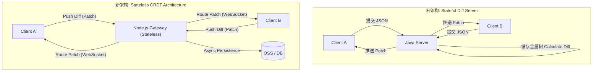
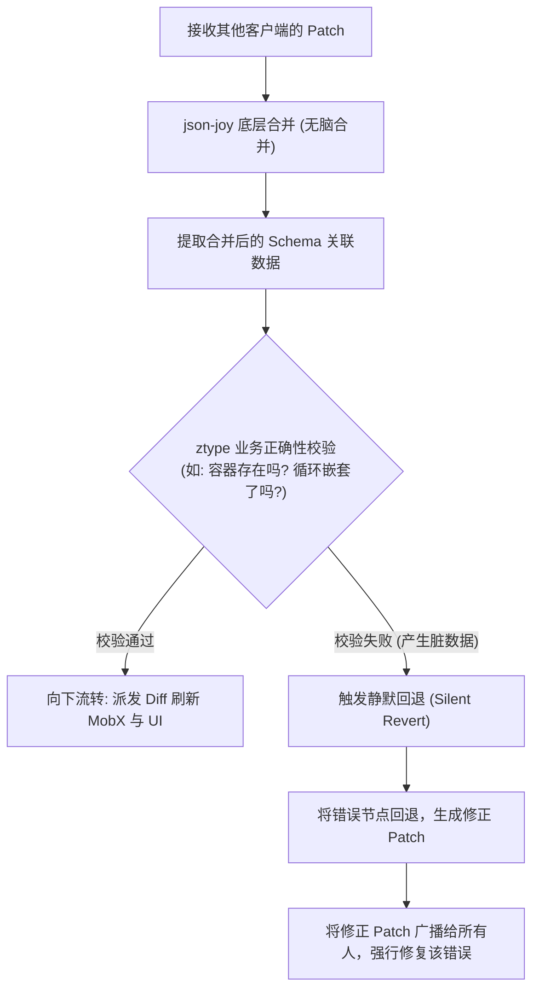
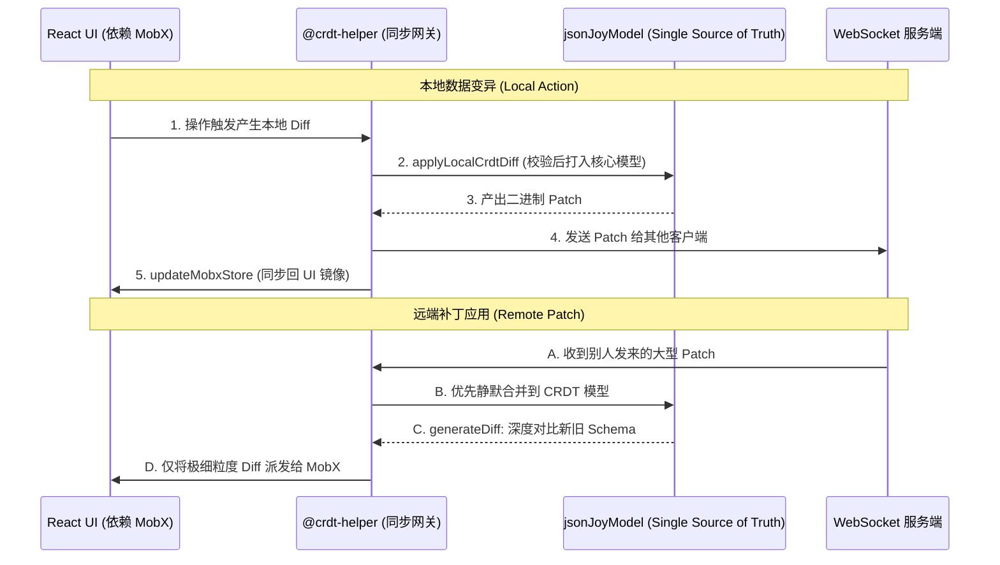

## 1. 背景与痛点：传统 Diff 架构的“核心瓶颈”

在无代码编辑器（如 Zion）中，多人实时协同编辑是一项基础且至关重要的能力。在重构之前，我们依赖于一个传统的、基于 Java 编写的 **状态化 (Stateful) Diff Server**。

这个旧架构在初期支撑了业务发展，但随着平台内项目数量的激增和画布组件树的无限膨胀，它很快暴露出几个主要的缺陷：

1. **服务端内存溢出 (OOM)**：为了能够比对和计算两个客户端传来的 Diff，Java 服务端必须在内存中全量缓存所有活跃项目的 `AppSchema`（JSON 树）。项目一多，内存消耗极大，频繁导致 OOM 崩溃，且完全无法通过简单的横向扩容（Scale-out）来解决。
2. **中间态缓存失效**：由于缓存数量有限，一旦项目被挤出缓存，重新加载和计算 Diff 需要极长的时间。
3. **并发同步冲突**：在高频的多人协同编辑场景下，高度依赖 Server 端串行处理并推送同步更新。一旦推送延迟，客户端经常会弹出版本冲突（`old_value_mismatch`），甚至导致用户丢失大批量的编辑数据，无法保存。

为了解决“服务端性能瓶颈”和“客户端合并冲突”这核心挑战，我们决定引入 **CRDT (无冲突复制数据类型)**，将核心计算下放，开启一场颠覆性的架构重构。

---

## 2. 技术选型：为什么是 CRDT 与 `json-joy`？

在协同领域，主要分为 OT (Operational Transformation) 和 CRDT 两大流派。我们选择了 CRDT，因为它通过数学上的**交换律和结合律**，保证了在去中心化或网络延迟的情况下，各个客户端最终合并出来的数据必然是一致的（Eventual Consistency），从而**彻底消灭了需要人工干预的合并冲突**。

在具体的库选型上，目前业界最火的是 `Yjs` 和 `Automerge`。但经过深思熟虑，我们最终选择了 **`json-joy/lib/json-crdt`**，原因非常现实且底层：

* **完美契合底层数据结构**：Zion 编辑器的底层配置 (`AppSchema`) 是非常复杂的 JSON 树。`json-joy` 的 CRDT 节点类型原生就抽象成了 `con` (常量)、`val` (值引用)、`obj` (对象)、`arr` (数组) 等结构，这种原汁原味的 JSON 语义，极大降低了我们从旧 Schema 迁移的成本。
* **极致的传输体积**：它提供了极简的二进制编码协议，能把庞大的 `Patch` (补丁) 压到极小，非常适合我们动辄几百 K 的无代码组件属性同步。

---

## 3. 架构演进：Diff Server 的“无状态化”改造

重构的最核心目标，就是让 Server 端“失忆”。既然 CRDT 能保证多端数据的自动一致，服务端就不再需要在内存里硬扛那棵庞大的 JSON 树了。



在全新的架构下，后端的角色从“计算中心”退化成了一个**“补丁路由器 (Patch Router)”和“持久化存储器”**：
1. **初始化**：客户端打开编辑器时，直接从 OSS (`crdtModelUrl`) 下载打好的基础模型二进制快照，再从 DB 拉取增量 Patch，在**本地内存中重建** CRDT Model。
2. **实时协同**：所有人的本地操作都被转换成二进制 Patch。服务器收到 Patch 后，无需做任何校验与合并，直接通过 WebSocket 广播给房间内的其他人。

服务端从此再无 OOM 之忧，理论上可以支持无限的横向扩容。

---

## 4. 底层技术挑战剖析 (The Core)

虽然架构很美好，但在落地过程中，我们遭遇了几个 `json-joy` 早期版本（乃至整个协同领域）的深水区挑战。

### 挑战一：完善 `json-joy`，自主实现 Undo/Redo 引擎

**痛点**：对于一个专业的低代码编辑器，撤销/重做（Undo/Redo）是绝对的刚需。但在当时，**`json-joy` 原生版本根本不支持 Undo/Redo 功能！**
在协同环境下，如果你只是单纯地把整个树的状态替换为一分钟前的快照，那不仅会撤销你自己的操作，还会把你同事在这过去一分钟里写的心血全部覆盖掉。

**解法：基于差异的反向补丁生成器 (`reverseLocalPatch.ts`)**
既然官方不支持，我们就自己造！我们扩展了原生的操作，设计了一个包含了非常详尽上下文的自定义 `Diff` 接口：

```typescript
// 我们自定义的 Diff 数据结构，包含了逆向操作所需的全部元信息
interface DiffItem {
  operation: 'add' | 'update' | 'delete' | 'move' | 'copy';
  newValue: any;
  oldValue?: any;
  pathComponents: PathComponent[]; // 精准的目标路径，如 ['components', 'button_1', 'style']
}
```

当用户按下 `Cmd+Z` 触发 Undo 时，我们不会退回旧状态，而是**在当前最新状态下，动态计算并派发一个“反向补丁 (Reverse Patch)”**。在 `reverseLocalPatch.ts` 的深层逻辑中，每一个操作都有绝对的数学逆运算：

```typescript
// 非常简化的核心逆向路由逻辑演示
function reverseDiffItem(item: DiffItem): DiffItem {
  switch (item.operation) {
    case 'add':
      // 别人/自己加的内容，逆向操作就是把它删掉
      return { ...item, operation: 'delete', newValue: undefined, oldValue: item.newValue };
    case 'delete':
      // 删掉的内容，利用缓存的 oldValue 原样复原
      return { ...item, operation: 'add', newValue: item.oldValue, oldValue: undefined };
    case 'update':
      // 修改属性，直接将新旧值互换
      return { ...item, operation: 'update', newValue: item.oldValue, oldValue: item.newValue };
    // ... move 与 copy 的非常复杂的逆向拓扑运算
  }
}
```
**高光时刻**：在真正执行反转应用之前，为了防止别人刚刚把这个容器删了，你现在却要“撤销修改里面按钮的颜色”引发底层报错，我们还加入了一个 **沙盒模拟校验 (Dry-run)**。
底层调用了 `executeCrdtNodeUpdateOptimized`，在当前被别人改得“发生变更”的 CRDT 树上**虚拟执行**一次反向操作，如果抛出校验异常，说明该历史操作在当前时空已经不合法，系统会直接丢弃这个 Undo 动作；如果校验通过，逆向 Diff 最终会被转化为正常的 CRDT Patch 广播出去，完美攻克了多人时序下的状态回溯难题。

### 挑战二：业务逻辑正确性拦截 (The Firewall)

**痛点**：`json-joy` (或者任何 CRDT) 只能保证数学意义上 JSON 数据结构的**最终一致性**，但它**完全不懂你的业务正确性**。
举个极端的例子：用户 A 往 `List` 容器里放了一个 `Button` 组件，触发了 `Button` 创建的 Patch；与此同时，用户 B 把整个 `List` 容器给删除了。
CRDT 完美合并了这两个操作，最终结果是：数据库里多出了一个幽灵 `Button`，但它根本没有可以挂载的父容器！这种脏数据一旦渲染，直接导致 React 运行时白屏崩溃。

**解法：合并后的 `ztype` 业务防火墙**
我们在每次接收并应用远端 Patch 后，强制接入了底层业务类型校验器（基于 `ztype`），像一道防火墙一样严格拦截渲染层：



在核心同步逻辑中，任何数据进入画布渲染前，都会进行拓扑图关联检查。如果发现合并出来的 JSON 违反了低代码业务的逻辑约束，系统会进行**静默回退 (Silent Revert)**。我们宁可让那个非法操作“无效”，也绝对不允许脏数据污染并打断当前用户的编辑心流。

### 挑战三：双状态树的平滑过渡 (Dual-Store Architecture)

**痛点**：面对有着数百万行遗留代码的大型编辑器，我们不可能停下业务发版，花半年时间把所有依赖 `MobX` 状态响应式的组件全部重写为订阅 `json-joy`。

**解法：核心模型与台前镜像**
为了在不重构老组件的前提下接入协同，我们构建了一个名为“双状态树（Dual-Store）”的过渡期架构：



1. **Single Source of Truth**：`jsonJoyModel` 成为了真正的幕后单一数据源，所有本地操作、网络同步、冲突消解，全都在它内部原子化完成。
2. **MobX 作为投影镜像**：原有的 `MobX Store` 被降级为视图层的一个镜像。当收到远端全量的 CRDT 更新时，为了防止 MobX 触发全屏海量 Re-render 卡死，底层会先执行 `generateDiff` 计算出极小粒度的差异（例如仅仅是一个子节点的 `insert`），然后只将这些细微的变动派发给 MobX 增量更新。

旧组件完全感知不到底层换了引擎，依然欢快地吃着 MobX 的响应式福利，实现了架构切换的“零阵痛”。

### 挑战四：抽象与封装——`@functorz/crdt-helper` 的诞生与实战

**痛点**：`json-joy` 提供的 API 非常底层（如 `api.find()`, `ObjNode`, `ArrNode`, `api.flush()`），如果让 `zed`（前端业务项目）直接操作这些底层 API，会导致业务逻辑与 CRDT 引擎深度耦合。一旦未来需要更换协同引擎，或者在 Node.js 网关层复用逻辑，重构成本将是灾难性的。

**解法：独立封装 `@functorz/crdt-helper` 桥接层**
为了实现业务与底层协同引擎的解耦，我们抽离出了一个独立的 npm 包 `@functorz/crdt-helper`。它扮演了“适配层”和“协调者”的角色：
1. **API 升维**：将 `json-joy` 晦涩的节点操作，封装为面向业务的 `executeCrdtNodeUpdateAndTransformDiff` 等高级方法。
2. **双向数据流同步**：它不仅负责把业务的 `Diff` 写入 CRDT 模型，还负责将 CRDT 的变化反向解析，并通过回调（如 `updateMobxStore`）精准更新 MobX 状态树。
3. **多端复用**：作为纯逻辑包，它同时运行在 `zed` 前端和 Node.js 协同网关中，保证了双端对 Patch 解析逻辑的绝对一致。

#### 真实场景追踪：在 `zed` 中修改一个按钮的颜色

为了让你更直观地感受到这套架构的运转，我们来追踪一个最常见的操作：**用户在右侧属性面板，将一个 Button 的颜色改为了红色 (`#FF0000`)**。

**第一步：UI 触发与本地 Diff 生成**
当用户修改颜色时，`zed` 的视图层并不会直接修改 MobX，而是生成一个标准的业务 `DiffItem`：
```typescript
const diff = {
  __typename: 'DiffItem',
  operation: 'update',
  pathComponents: ['components', 'button_1', 'style', 'color'],
  newValue: '#FF0000'
};
```

**第二步：进入本地应用管线 (`applyLocalCrdtDiff.ts`)**
`zed` 会调用核心管线 `applyLocalCrdtDiff`。在这里，系统首先会通过 `typeSystemStore.genIncrementalInfo` 进行严格的业务类型校验。校验通过后，正式呼叫 `@functorz/crdt-helper`：

```typescript
// zed/src/zed/views/Collaboration/utils/applyLocalCrdtDiff.ts
const result = Crdt.executeCrdtNodeUpdateAndTransformDiff(
  [diff], // 业务 Diff
  schemaStore.jsonJoyModel, // 核心模型：CRDT 实例
  coreStore, // 旧的 Schema 状态
  updateMobxStore, // 非常关键的回调：用于同步 MobX
);
```

**第三步：`crdt-helper` 的核心逻辑 (`NodeUpdate/index.ts`)**
在 `crdt-helper` 内部，它会精准找到 `json-joy` 树上的对应节点并执行修改，随后生成用于网络传输的二进制 Patch：

```typescript
// @functorz/crdt-helper 内部逻辑简写
export const executeCrdtNodeUpdateAndTransformDiff = (...) => {
  // 1. 寻址并修改底层 CRDT 节点
  const operableNode = model.api.find(['components', 'button_1', 'style']);
  operableNode.set({ color: '#FF0000' }); 

  // 2. 触发回调，将极细粒度的变更同步给 MobX 镜像
  const crdtDiffs = transformLocalDiffsToCrdtFormat([item], model, oldSchema, updateMobxStore);

  // 3. 冲刷出二进制补丁，并转为 Base64 准备广播
  const patch = model.api.flush();
  return { patchBase64: convertPatchToBase64(patch), diffsFromCrdt: crdtDiffs };
};
```

**第四步：MobX 镜像更新与网络广播**
在上述步骤中，传入的 `updateMobxStore` 回调被触发：
```typescript
// zed/src/zed/views/Collaboration/utils/updateMobxStore.ts
export function updateMobxStore(node: any, diff: DiffItem) {
  const lastKey = diff.pathComponents.at(-1)?.key; // 'color'
  node[lastKey] = diff.newValue; // 直接修改 MobX 对象，触发 React 局部重渲染
}
```
至此，UI 瞬间变成了红色。同时，`crdt-helper` 返回的 `patchBase64` 会被推入 `schemaStore.addWaitingUploadPatches` 队列，通过 WebSocket 传输至服务器，并最终被房间内的其他客户端通过 `useApplyNetworkPatches` 接收并静默合并。

---

#### 4. 性能优化策略：选择性 CRDT 实例化 (Constant Node Pruning)
在将庞大的 JSON Schema 转换为 CRDT 模型时，如果为深层嵌套的每一个属性都创建 CRDT 节点（每个节点都需要维护逻辑时钟、Tombstone 等元数据），会导致灾难性的内存开销和极慢的初始化速度。

Zion 在 `@functorz/crdt-helper` 中引入了一个非常底层的启发式剪枝引擎（`ALL_NODE_MATCH`）。它会在递归构建 CRDT 树时，精准识别出那些**不需要细粒度协同**或**总是被整体替换**的子树（例如 `componentFrame`、`tableMetadata`、`dataBinding` 等）。

对于这些子树，引擎会停止递归，直接使用 `json-joy` 的常量节点 `s.con(json)` 进行包裹：

```typescript
// crdthelper/packages/crdt/utils/BuildSchema/index.ts
export const buildSchema = (json: any, pathComponents: DiffPathComponent[]): any => {
  for (const nodeMatch of ALL_NODE_MATCH) {
    if (isFullMatch(nodeMatch)) {
      if (nodeMatch.valueMatch(json)) {
        return s.con(json); // 👈 核心优化：直接作为常量节点，停止递归！
      }
    } else if (isPartialMatch(nodeMatch)) {
      if (nodeMatch.pathMatch(pathComponents.slice(0, -1))) {
        const lastKey = pathComponents.at(-1)?.key ?? '';
        if (nodeMatch.isConstKey(lastKey)) {
          return s.con(json); // 👈 核心优化：特定 Key 直接作为常量节点
        }
      }
    }
  }
  
  // ... 否则继续递归构建 s.arr 或 s.str
};
```

**为什么这个设计很绝？**
这意味着 CRDT 引擎将这些庞大的对象视为**不透明的、不可变的值**。当用户修改它们时，触发的是整个对象的替换（基于 LWW 机制），而不是逐个属性的 Merge。这在保留了核心业务细粒度协同能力的同时，**砍掉了极高比例的不必要 CRDT 元数据开销**，极大地降低了内存占用并提升了首屏加载速度。
## 5. 总结与展望

这场“底层重构”式的重构，彻底拔掉了压在 Zion 基础设施头上的 OOM 问题。

从中心化的 **Stateful Diff Server** 演进到 **Stateless CRDT Architecture**，我们不仅优化了服务器的内存占用，更为用户带来的是**真正的 Local-first (本地优先)** 编辑体验——网络再差、甚至断网离线，用户依然可以毫无延迟地高频拖拽组件，等网络恢复时，CRDT 会用抹平分歧。

虽然当前我们为了向后兼容，依然保留了 MobX 作为渲染代理。但在在未来，我们是要全量废弃mobx，让 React 组件直接响应原生的 CRDT 变更事件。
