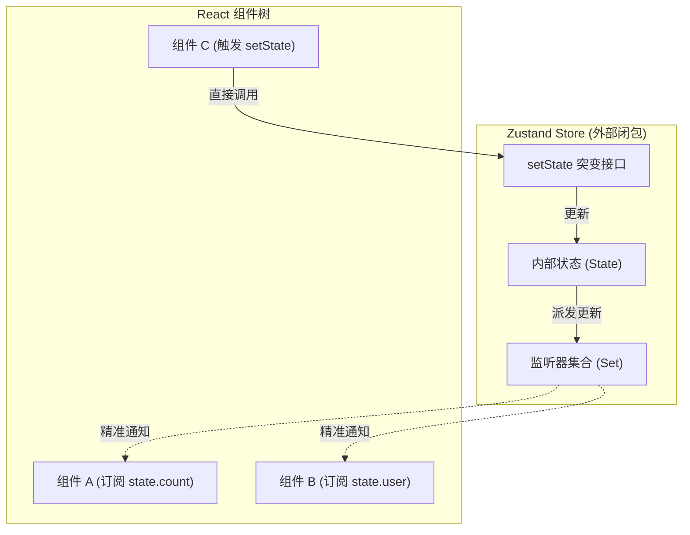

在 React 生态系统中，状态管理经历了从早期的 Redux、MobX，到 Context API，再到如今的原子化（Jotai/Recoil）和极简闭包状态机（Zustand）。Zustand 凭借其极其轻量的包体积、灵活的中间件机制和零样板代码（Boilerplate）的特性，成为了现代 React 项目中极具竞争力的选择。

本文将从 Zustand 的核心原理出发，剖析其底层实现以及它在并发模式（Concurrent Mode）下的状态一致性保障。

## 1. 架构理念：独立于 React 的状态机

传统基于 React Context 的状态库，其状态（State）被强绑定在 React 组件树的生命周期内。这意味着如果顶层 Provider 的状态发生任何改变，无论底层组件是否使用了该状态，都可能触发整棵子树的重渲染（Re-render）。

Zustand 采取了截然不同的架构：**它的 Store 是一个完全游离于 React 之外的纯 JavaScript 对象闭包**。状态的变化直接在外部发生，通过订阅机制按需通知 React 组件更新。



### 1.1 Vanilla Store 的核心实现

为了理解其运行机制，我们可以自己实现一个简化版的 Zustand 核心，它不依赖于任何框架。

```javascript
// Zustand vanilla store 核心原理简化版
const createStoreImpl = (createState) => {
  let state;
  // 维护一个 Set 用于存放所有订阅了该 Store 的回调函数
  const listeners = new Set();

  const setState = (partial, replace) => {
    // 允许传入函数或对象进行更新
    const nextState = typeof partial === "function" ? partial(state) : partial;

    // 如果状态没有发生实质性改变，直接返回，避免不必要的派发
    if (!Object.is(nextState, state)) {
      const previousState = state;
      // 支持全量替换 (replace) 或部分合并 (assign)
      state = replace ? nextState : Object.assign({}, state, nextState);
      // 遍历通知所有监听器
      listeners.forEach((listener) => listener(state, previousState));
    }
  };

  const getState = () => state;

  const subscribe = (listener) => {
    listeners.add(listener);
    // 返回一个取消订阅的函数，供组件卸载时调用
    return () => listeners.delete(listener);
  };

  // 提供操作接口，并将其实例化
  const api = { setState, getState, subscribe };
  state = createState(setState, getState, api);
  return api;
};
```

通过这段纯粹的 JavaScript 代码，Zustand 在脱离了 React 环境后依然可以正常运行，这极大地方便了在 Web Worker、普通 JS 类或者 Vue 等其他框架中复用逻辑。

## 2. 跨层同步与 React 18 Concurrent Mode 挑战

在 React 18 引入的并发渲染（Concurrent Rendering）机制下，由于渲染过程可以被中断和恢复，如果外部的 Store 在 React 执行耗时较长的渲染树遍历时发生了更新，会导致树中已经渲染的组件和尚未渲染的组件读取到不一致的状态，这就是著名的**渲染撕裂 (Tearing)** 问题。

### 2.1 useSyncExternalStore 的引入

为了安全地将外部状态同步到 React 内部，React 官方在 v18 中提供了 `useSyncExternalStore` Hook。Zustand 在其 React 绑定层中深度集成了该钩子，它强制在状态发生突变时，让当前的渲染任务失效并立即同步最新状态。

```typescript
import { useSyncExternalStoreWithSelector } from "use-sync-external-store/shim/with-selector";

// Zustand 在 React 层的绑定逻辑
export function useStore(api, selector = api.getState, equalityFn) {
  // slice 是组件最终获取到的局部状态
  const slice = useSyncExternalStoreWithSelector(
    api.subscribe, // 外部 Store 提供的订阅函数
    api.getState, // 外部 Store 提供的获取全量状态函数
    api.getServerState || api.getState, // SSR 环境下的初始状态获取
    selector, // 局部状态选择器 (例如 state => state.bears)
    equalityFn, // 自定义比较函数 (例如 shallow)
  );
  return slice;
}
```

通过 `useSyncExternalStore` 的封装，Zustand 在并发模式下提供了与原生 React State 同等的安全保障。

### 2.2 精准控制重渲染 (Selector & Equality)

Zustand 的核心优势在于其细粒度的订阅控制。

如果组件使用 `const bears = useStore(state => state.bears)`，当 `state.nuts` 发生改变时，即使外部状态树变了，由于 `state.bears` 这个切片（Slice）没有变化，`useSyncExternalStoreWithSelector` 的浅比较机制会拦截这次更新，当前组件便不会触发重渲染。

对于返回对象或数组的 Selector，我们可以结合 Zustand 提供的 `shallow` 函数：

```typescript
import { create } from 'zustand';
import { shallow } from 'zustand/shallow';

const useBearStore = create((set) => ({
  bears: 0,
  nuts: 0,
  increasePopulation: () => set((state) => ({ bears: state.bears + 1 })),
}));

// 组件只会在 bears 或 nuts 发生改变时渲染，不会受到其他状态影响
function BearCounter() {
  const { bears, nuts } = useBearStore(
    (state) => ({ bears: state.bears, nuts: state.nuts }),
    shallow
  );

  return <h1>{bears} bears, {nuts} nuts</h1>;
}
```

## 3. 中间件架构 (Middleware Pattern)

Zustand 的 API 设计极其灵活，它允许开发者通过高阶函数（Higher-Order Functions）实现洋葱圈模型（Onion Architecture）的中间件拦截。

### 3.1 柯里化与状态扩展

中间件的核心本质是一个接收底层 `createState` 并返回新的 `createState` 函数的工厂函数。

例如，实现一个简单的日志中间件，它会在每次 `set` 操作前打印当前状态：

```typescript
// 自定义日志中间件
const logMiddleware = (config) => (set, get, api) =>
  config(
    (args) => {
      console.log("  applying", args);
      // 调用底层原始的 set 方法
      set(args);
      console.log("  new state", get());
    },
    get,
    api,
  );

// 使用中间件
const useStore = create(
  logMiddleware((set) => ({
    count: 0,
    inc: () => set((state) => ({ count: state.count + 1 })),
  })),
);
```

### 3.2 Immer 与持久化

在处理深层嵌套状态时，直接修改对象往往会导致意外的浅拷贝丢失。通过结合 Immer 中间件，开发者可以直接“修改”状态树，底层会自动生成结构共享的新对象。

```typescript
import { create } from "zustand";
import { immer } from "zustand/middleware/immer";

const useDeepStore = create(
  immer((set) => ({
    deep: { nested: { obj: { count: 0 } } },
    inc: () =>
      set((state) => {
        // 利用 Immer 直接修改属性，无需层层展开拷贝
        state.deep.nested.obj.count += 1;
      }),
  })),
);
```

同理，Zustand 提供了内置的 `persist` 中间件，自动将状态序列化至 `localStorage` 或 `sessionStorage`，大大简化了表单草稿箱或用户偏好设置等场景的数据落盘工作。


## 4. 企业级开发的高阶玩法：Zustand + React Context

虽然 Zustand 主打的是“脱离 Context 的全局状态”，但在**组件库开发**或**复杂微前端/多实例页面**场景中，全局单例往往是灾难。

例如：一个页面里渲染了三个独立的 `<VideoPlayer />` 组件，如果它们共用一个 `useVideoStore`，状态就会互相覆盖。

最佳实践是：**将 Zustand Store 实例作为值，放入 React Context 中。** 这样既实现了多实例隔离，又保留了 Zustand 的细粒度重渲染优势。

```tsx
import { createContext, useContext, useRef } from 'react';
import { createStore, useStore } from 'zustand';

// 1. 定义 Store 的类型与工厂函数，而不是直接 create()
interface PlayerProps {
  isPlaying: boolean;
  volume: number;
}
interface PlayerState extends PlayerProps {
  play: () => void;
  pause: () => void;
}

type PlayerStore = ReturnType<typeof createPlayerStore>;
const createPlayerStore = (initProps?: Partial<PlayerProps>) => {
  return createStore<PlayerState>()((set) => ({
    isPlaying: false,
    volume: 50,
    ...initProps,
    play: () => set({ isPlaying: true }),
    pause: () => set({ isPlaying: false }),
  }))
}

// 2. 创建 Context (Context 的值是一个 Store 实例，不是状态数据本身)
const PlayerContext = createContext<PlayerStore | null>(null);

// 3. Provider 组件
export function PlayerProvider({ children, ...props }: React.PropsWithChildren<Partial<PlayerProps>>) {
  const storeRef = useRef<PlayerStore>();
  if (!storeRef.current) {
    storeRef.current = createPlayerStore(props); // 初始化单次实例
  }
  return (
    <PlayerContext.Provider value={storeRef.current}>
      {children}
    </PlayerContext.Provider>
  )
}

// 4. 自定义 Hook: 结合 useContext 和 Zustand 的 useStore
export function usePlayerContext<T>(selector: (state: PlayerState) => T): T {
  const store = useContext(PlayerContext);
  if (!store) throw new Error('Missing PlayerProvider');
  return useStore(store, selector);
}
```

通过这种模式，当 `isPlaying` 变化时，**Context 的值（即 store 实例本身的引用）并未改变**，因此不会触发所有子组件重渲染。只有那些通过 `usePlayerContext(s => s.isPlaying)` 订阅了该切片的子组件才会更新。这是目前 React 中构建复杂、高性能状态多实例隔离的最佳方案之一。

## 5. API 演进：useShallow 的引入

在 Zustand v4 及早期版本中，我们通常将 `shallow` 作为 `useStore` 的第三个参数传入：

```tsx
// 老写法 (v4 之前)
const { nuts, bears } = useStore(
  (state) => ({ nuts: state.nuts, bears: state.bears }), 
  shallow
);
```

在 Zustand v5 (及 v4 的后期次要版本) 中，官方引入了更符合 Hooks 语义的 `useShallow` 辅助函数。它直接包裹 Selector，将比较逻辑内聚：

```tsx
import { useShallow } from 'zustand/react/shallow'

// 新写法 (推荐)
const { nuts, bears } = useStore(
  useShallow((state) => ({ nuts: state.nuts, bears: state.bears }))
);
```
这种改变不仅让 TypeScript 的类型推导更加稳健，而且通过提前浅比较，进一步减少了内部的不必要计算。

## 6. 总结与权衡


Zustand 通过剥离状态容器与视图层，在单向数据流的基础上，提供了与 Redux 相当的可控性，却省去了所有复杂的样板代码。

- **对比 Context**：Zustand 利用外部闭包结合 Selector 实现了极细粒度的组件渲染控制，有效规避了 Context 导致的不必要渲染开销。
- **对比 Jotai/Recoil**：原子化状态管理更适合那些状态之间存在复杂派生关系、或状态频繁创建销毁的网格应用（如电子表格）。而 Zustand 依然遵循中心化存储（Centralized Store）的范式，更适合管理结构相对稳定的全局状态（如用户信息、主题配置、大型表单数据）。

作为架构师，在选择状态管理方案时，理解库底层的运行机制往往比盲目追求流行度更为重要。Zustand 这套精巧的 `Vanilla Store + useSyncExternalStore` 架构，为我们提供了一个性能与易用性平衡的绝佳参考。
