## 需求说明

### 情况1：

猪齿鱼平台是个相对复杂的多表格多表单数据处理平台，有些模块的数据量庞大，并且有些喜欢嵌入在tab页面当中，如果频繁的去访问这些页面就会频繁的请求，如果数据量庞大，每次访问都会去请求数据，等待时间就变长了，例如下面这个界面：


这个页面相当于是历史的执行记录，因为数据量庞大，我们可以看到这个页面请求过后响应速度较慢，假设我在短时间内切到别的记录又切回来要看，那还得重新再去请求这1000多条的数据，这个是没有必要的，用户等待时间就变长了

### 情况2：

在一个页面渲染的过程中，或者在某些不正当的交互操作中，用户可能频繁的向后台去发送同一个请求（参数url等待都一样），或又是再渲染页面的一瞬间触发了多次同一请求，这样就很浪费带宽，多次请求前端还需要进行多次的响应处理，例如以下情况

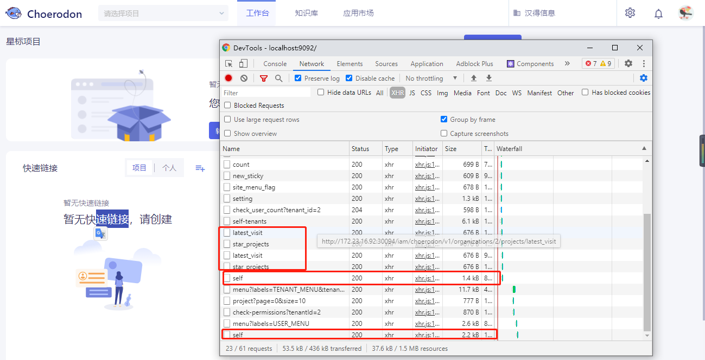

在渲染页面时，同时发送了多个相同请求，大多时候是页面逻辑处理的有问题，多次向后台获取数据了，或者是我频繁的去点击一个没有做防抖的按钮或者没有节流的一些频繁请求

### 情况3：

假设我错误的点击了一个菜单的同时又去切到了另外一个菜单，这时候虽然说已经切换到了想要的菜单路由下对应的界面，但是由于你错误的操作，虽然上个页面在切路由瞬间被销毁，但是初始化页面的一些获取后台数据的请求已经发出去了，你访问的当前页面是不需要这些请求的。例如：


这个例子就是，我先点击了代码管理的菜单，代码管理模块组件瞬间被加载出来，并且发送页面请求，这时候一瞬间切换到应用流水线的菜单，这时候我们会看见，代码管理模块的请求很多没必要的都发送出去了，这些请求并不是我们应用流水线模块需要用的到的。

如果上个页面的请求很慢或者很多情况下，都会占用不必要的资源以及前端处理时间，占用资源。

## 需求分析

1. 针对情况1, 我们可以做缓存, 类似于DataSet的lookup，但又不完全类似。也可以做类似tab的数据缓存处理， 但是如果页面多起来，我们就需要多次分别对数据进行缓存处理。
2. 针对第二种的情况，可以将重复的请求给取消掉，或者说在这一瞬间发送的多次相同请求都共用第一次发送的那个请求的响应状态。一些按钮或者频繁请求的操作做节流和防抖处理，这个就不再这次的讨论范围内了
3. 第三种情况在切换路由的时候可以想办法把上个页面还在pending中的请求给取消掉
4. 猪齿鱼平台用的是axios + DataSet来进行前后端数据交互以及请求处理的，所以基于他们要如何完美实现呢？

**综上所述：**我们要实现一个，能够实现取消，又能实现缓存的，重点是实现相同请求的状态数据的公用以及不影响dataset的使用的东西

可以想到的是，我们肯定是要对axios的拦截器或者一些特殊属性例如axios的适配器，做处理。

### 缓存分析

参考猪齿鱼lookup的缓存原理，以下放出lookup缓存的部分源码；

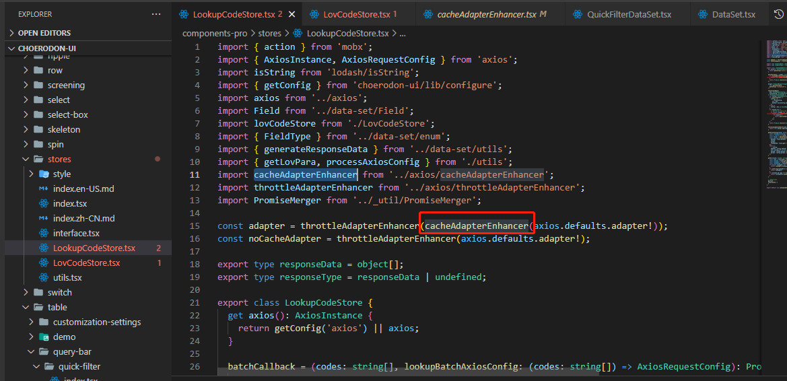

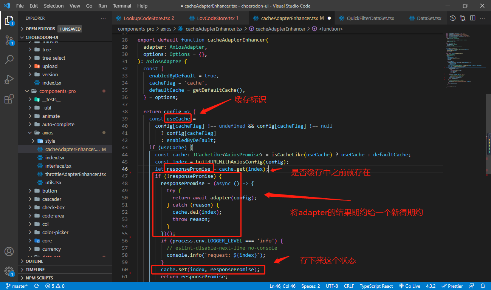

lookup通过标识确定是否缓存，之后将适配器返回的期约直接给一个新得期约，之后存储这个新得期约，在下次发送相同请求时候直接将这个期约抛给它，从而实现请求的复用

**首先我们要明白axios 的 adpater的原理：**

源码是这样的

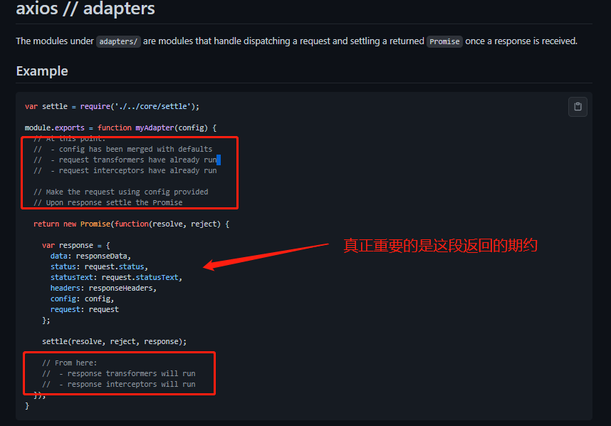

可以知道的是，axios 的 transformRequest以及他的各个请求拦截器是在return这个期约之前发生的，之后请求完成，adapter将请求后的结果传递给期约，之后期约落定，后面才触发响应数据转换（transformReponse）以及响应拦截器（这个顺序非常的重要）。

既然要缓存，一定要把第一次落定的请求期约，想办法（包含了响应码数据等等等）存储起来，需要用到的时候才去使用，所以可以确定的是我们缓存需要对adapter进行操作，并且在响应和请求的拦截器中做标识等等操作


### 多次相同请求处理

一开始我想用XMLHttpRequest的abort也就是axios的CancelToken（axios对abort进行了封装）去将页面正在渲染的时候一个个重复的请求cancel掉，但是这样有多种弊端，留到最后一点讲。

多次相同请求是一瞬间的事情，要在这一瞬间复用请求必须用到上面缓存所说的存储期约。

一瞬间咱们就可以定一个默认时间戳，例如1000ms，这个时间戳表示的是，在这1000ms中进来的请求都共用一个adapter的期约，这样定义一个默认时间戳，就可以做到类似取消重复请求的作用（实际上是用了缓存）。

当然既然加了缓存，又加了时间戳，灵活应用一下就可以实现一个，在对应时间内不单单是1000ms，我发的相同请求都共用，我们可以将时间戳直接定义在axios默认属性上或者axios创建出来的实例上面，定义默认值1000ms，之后如果想要缓存时间长一点的话直接在dataset的transport对应的方法配置项下面或者是axios实例上添加时间戳，用来覆盖默认的时间戳，因此可以实现长效缓存。

例如：

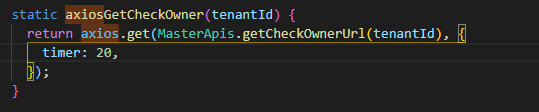

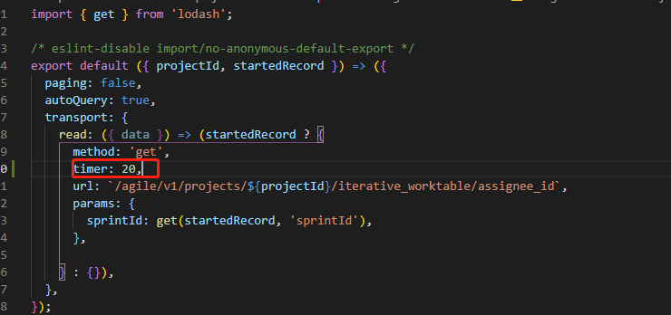


### 切换路由取消pending请求

这里必须用到axios的CancelToken。上面说到CancelToken的其实就是对`XMLhttpRequest`的abort方法进行封装， `XMLHttpRequest` 对象是我们发起一个网络请求的根本，在它底下有怎么一个方法 `.abort()`，就是中断一个已被发出的请求。 

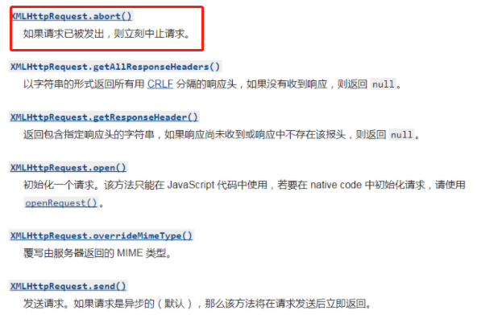

 简单理解就是通过 `new axios.CancelToken()`给每个请求带上一个专属的CancelToken，之后会接收到一个`cancel()` 取消方法，用于后续的取消动作。 

所以，每次请求进来的时候去获取本次请求的CancelToken，之后将其存起来（这里假设用CancelQueue的一个Map数据类型（`Object.prototype.toString.call(CancelQueue) = '[object Map]'`）），之后假如这个请求落定了，就将这个存储CancelToken的请求标识删除。

如果这时候切换路由了，我们就去CancelQueue中，遍历一遍所有的请求标识（因为这时候再队列里头的肯定是还在pending的请求），调用其存储的CancelToken调用cancel方法进行请求取消，并删除标识。

```js
// 1. 获取 axios CancelToken
const { CancelToken } = axios;

// 2. 获取当前请求的source，并且将其cancel方法存储起来
const source = CancelToken.source();

// 3. 之后调用这个cancel方法
source.cancel();

```


## 实现

### axios的实例化

首先实例化axios(这是我们全局封装的axios)，在其中加入缓存标识，标识开启缓存（重复请求共用）

```js
const instance:AxiosStatic = axios.create({
  timeout: 30000,
  baseURL: API_HOST,
});

// 这里配置一个缓存请求得标识
instance.defaults.enabledCancelCache = true;
```


### 标识的实现

对于每一个请求创建一个标识，标识唯一，标识是通过每一个请求的`url`, `params`, `method`, 以及 `data`建立标识，只要通过这4者建立的标识相同，那我们就能确定某些请求是相同的，

如下`getMark`是建立主标识，`getDataMark`是对响应体内的data的标识

params要进行参数拼接，现在主流基本在用`application/json`形式，Axios默认以这种形式工作，我们给后端接口传递参数也简单 ，但是有时候需要 Content-Type必须以application/x-www-form-urlencoded形式 ，以JSON格式后台是收不到的，而这时候就要进行序列化处理（先前是有前辈在这里做了处理的），但是这里不多说参数序列化

```js
import { get } from 'lodash';
import { AxiosRequestConfig } from 'axios';
import JSONbig from 'json-bigint';
import paramsSerializer from './paramsSerializer';

// 单独处理data，response里面返回的config.data是个字符串对象
function getDataMark(data:any) {
  let stringifyData = data;
  if (typeof stringifyData === 'string') {
    stringifyData = JSONbig.parse(stringifyData);
  }
  return stringifyData;
}

// 区别请求的唯一标识，这里用方法名+请求路径
// 如果一个项目里有多个不同baseURL的请求 + 参数
export default function getMark(config:AxiosRequestConfig) {
  const getKey = (key:string) => get(config, key);

  // params标识处理，将其处理成?key=value&key2=value的形式
  const tempQueryString = (getKey('paramsSerializer') ?? paramsSerializer)(getKey('params'));

  // data标识处理
  const dataMark = JSONbig.stringify(getDataMark(getKey('data')));

  // base标识
  const requestMark = [
    config?.method?.toLowerCase() || 'unknownMethod',
    config?.url,
  ];

  getKey('params') && requestMark.push(tempQueryString);
  getKey('data') && requestMark.push(dataMark);
  return requestMark.join('&');
}
```

最终的拼接形式是 `method & url & params & data`的形式，

例如下面这个请求

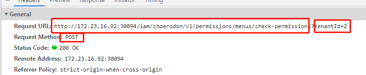

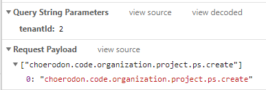

最终拼接出来的是

`post&http://172.23.16.92:30094/iam/choerodon/v1/permissions/menus/check-permissions&tenantId=2&["choerodon.code.organization.project.ps.create"]`


### 缓存实现

这里我们采用拦截器的形式去添加缓存逻辑，以下是添加了请求拦截器

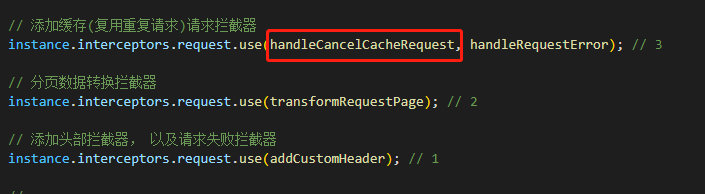

下面标红的是添加响应拦截器

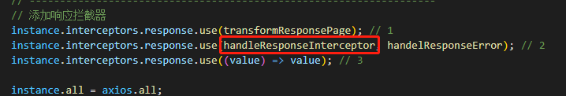

至于这里拦截器的顺序为什么是这样的，后续再说

其次，我们要明白请求的几种情况

假设现在有一个A请求进来了

1. 还在pending的时候，在默认时间戳内（1000ms）又进来了一个一模一样的A请求（重复了,共用状态）
2. A请求已经落定了**成功了**，在定义的时间戳范围内又进来了多个一模一样的请求（缓存）
3. A请求落定**失败了**，在定义的时间戳范围内又进来了多个一模一样的请求（不缓存）


最后明确需要存储在缓存实例中的数据格式

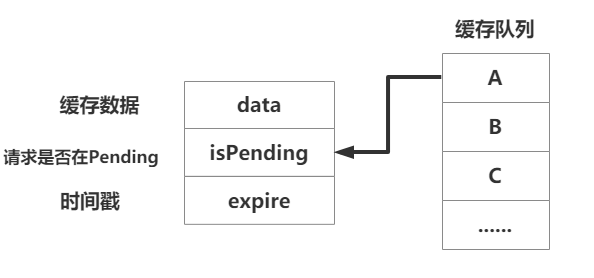

#### 存储数据

我们需要以一种键值对的形式去存储，可选项就属Object或者Map。

但是这里我们需要频繁的对缓存的数据进行查找，插入，赋值，删除操作等等。

在小数量数据情况下Object的查找数据相对Map来的快，但是涉及更多插入的和删除的情况下都是Map性能来的优势，并且相同内存下Map能够存储更多的键值对，这里显然存在庞大数据的情况

于是这里封装一个`AxiosCache`缓存类，然后写一些私有方法在里头


```js
class AxiosCache {
  constructor() {
    super();
    this.cacheData = new Map();
  }
    
  get size() {
    return this.cacheData.size;
  }

  get(key) {
    return this.cacheData.get(key);
  }

  delete(key) {
    this.cacheData.delete(key);
  }

  has(key) {
    return this.cacheData.has(key);
  }

  set(key, value) {
    this.cacheData.set(key, value);
  }

  isEmpty() {
    return !!this.cacheData.size;
  }

  clear() {
    this.cacheData = new Map();
  }
}
const axiosCache = new AxiosCache();
```


#### 请求拦截器实现

1. 当A请求进来时候发现先前并没有在缓存队列中做过标识，也就是说标识里头不存在以上的那些字段，这时候我们就将A请求做个标识，并且设置它的isPending（正在请求）为`true`

   ```ts
   axiosCache.set(cancelCacheKey, {
       isPending: true,
   });
   ```

2. 当A请求已经做过标识的时候，这时候又进来一个A1请求

   倘若第一次做过标识的A请求已经不是在pending状态并且在这次请求的时间戳的范围内（在后面讲响应拦截器的时候会把A的isPending字段在某种条件下设置为`false`, 并且存储A请求响应后的数据），A1请求就直接去取A缓存的数据

   这里就涉及到上面所说的适配器的用处，直接在A1请求config的适配器返回一个成功落定的期约，通过标识拿到cache实例中缓存的数据数据。

   ```ts
   // isPending为false的情况下，并且在时间戳的范围内
   if (expire && expire > Date.now()) {
     tempConfig.adapter = () => {
       const resolveData: AxiosResponse = {
         data,
         headers: tempConfig.headers,
         config: {
           ...tempConfig,
           useCache: true,
         },
         // @ts-expect-error
         request: tempConfig,
       };
       return Promise.resolve(resolveData);
     };
   }
   ```
   这里定义一个`useCache`的字段表明这个是再用缓存数据，后续的响应拦截器中会讲到

   

3. 当A请求已经做过标识的时候，这时候又进来一个A1请求

   倘若第一次做过标识的A请求还在pending的状态，我又想共用缓存数据，但是并不清楚什么时候A请求才会结束。
   
   这时候我们就想，用一个发布订阅的模式，将A1请求的**期约落定时机**订阅起来，在A请求落定的时候告诉A1你是时候也该落定了就去**发布**信息，这时候缓存的数据就是在A请求落定时候，去发布顺便给A1传递的.
   
   > 其实这个过程可以有多个A1进来
   
   如果不好理解的这里有流程图
   
   ​	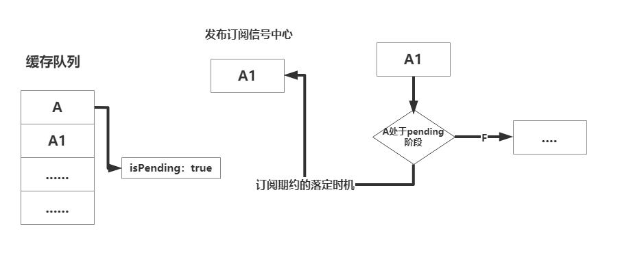

   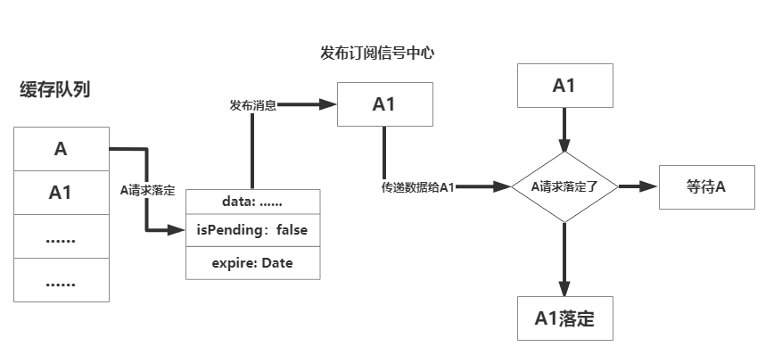
   
    ```ts
    // 说明找到了请求但是找到的这个缓存的请求还在pending，这时候订阅一个期约待会要用
    tempConfig.adapter = () => new Promise((resolve) => {
        axiosEvent.once(cancelCacheKey, (res:unknown) => {
          const resolveData: AxiosResponse = {
            data: res,
            headers: tempConfig.headers,
            config: {
              ...tempConfig,
              useCache: true,
            },
            // @ts-expect-error
            request: tempConfig,
          };
          resolve(resolveData);
        });
    });
    ```
   
   这里A1请求订阅了以一个以cancelCacheKey为标识的信号。

至于A请求落定的时机，到响应拦截器中做处理

4. 如果A请求请求失败怎么办？那这时候我们不做处理，也不做标识，请求失败走的是请求失败的拦截器。

以下是整个请求拦截器代码

```ts
import { AxiosRequestConfig, AxiosResponse } from 'axios';
import { get } from 'lodash';
import getMark, { transformDataToString } from '../utils/getMark';
import { axiosCache, axiosEvent } from '../instances';

export function handleCancelCacheRequest(config:AxiosRequestConfig) {
  const tempConfig = config;
  // 是否开启了缓存（复用重复请求状态）
  const enabledCancelCache = get(tempConfig, 'enabledCancelCache');
  if (enabledCancelCache) {
    // 获取标识
    const cancelCacheKey = getMark(tempConfig);

    if (!axiosCache.has(cancelCacheKey)) {
      axiosCache.set(cancelCacheKey, {});
    }

    const {
      data, // 缓存的数据
      isPending, // 请求是否是pending状态
      expire, // 时间戳
    } = axiosCache.get(cancelCacheKey);

    if (isPending) {
      // 说明找到了请求但是找到的这个缓存的请求还在pending，这时候订阅一个期约待会要用
      tempConfig.adapter = () => new Promise((resolve) => {
        axiosEvent.once(cancelCacheKey, (res:unknown) => {
          const resolveData: AxiosResponse = {
            data: res,
            headers: tempConfig.headers,
            config: {
              ...tempConfig,
              useCache: true,
            },
            // @ts-expect-error
            request: tempConfig,
          };
          resolve(resolveData);
        });
      });
    } else if (expire && expire > Date.now()) {
      tempConfig.adapter = () => {
        const resolveData: AxiosResponse = {
          data: transformDataToString(data),
          headers: tempConfig.headers,
          config: {
            ...tempConfig,
            useCache: true,
          },
          // @ts-expect-error
          request: tempConfig,
        };
        return Promise.resolve(resolveData);
      };
    } else {
      axiosCache.set(cancelCacheKey, {
        isPending: true,
      });
    }
  }

  return tempConfig;
}
```


#### 响应拦截器的实现

实现了请求拦截器之后，我们来处理在先前拦截器中的一些字段，以及请求失败的数据处理

1. 我们先对响应成功的的拦截器做处理

   首先是响应成功的情况下而且也成功拿到想要的数据，假设这个响应成功的请求是上述的A请求，这时候我们就应该记录下A请求最终的所有数据以及它需要的缓存时间，并且设置它isPending字段为false，最重要的是给订阅了cancelCacheKey的信息的请求们发布一个信号，告诉你们可以来拿我的（A请求）数据了！

   ```ts
   if (enabledCancelCache && !useCache) {
       const finalData = resData;
       axiosCache.set(config?.cancelCacheKey || cancelCacheKey, {
         data: finalData,
         isPending: false,
         expire: Date.now() + Number(enabledCancelCache) * 500,
       });
       // 发布这个信号让所有订阅了A的都能接受到信息
       axiosEvent.emit(cancelCacheKey, finalData);
   }
   ```
   这里为什么要多一次useCache的判断呢?
   
   因为我先前在请求拦截器中处理了adapter用来处理缓存, 走完了adapter才会走响应拦截器，也就是说，我在响应拦截器里头还得判断，这次到底是走的缓存，还是第一次需要做缓存呢？所以才知道为什么我在上面的adapter里头加入了useCache的字段。
   
   简单来说，就是A请求第一次进来，useCache就是false，就得去存值，接下来进来A1，那我就得走缓存，我不再去重新设置新值了。
   
   
   
2. 没有成功拿到想要的数据，也就是后端返回错误信息的情况

   这里我们的后台返回的错误标识是failed字段，就直接将isPending设置为false不做后续处理，并且将在订阅了的请求信号都删除(删除是因为A请求失败就已经报错，其他请求就不必再重复报错)

   ```js
   axiosCache.set(cancelCacheKey, {
     isPending: false,
   });
   axiosEvent.delete(cancelCacheKey);
   ```
   
3. 当然响应失败拦截器中也需要做上述这样的处理

这是最终的响应成功的拦截器代码👇

```js
import { AxiosResponse } from 'axios';
import get from 'lodash/get';
import {
  prompt,
} from '@/utils';
import { axiosCache, axiosEvent } from '../instances';
import getMark from '../utils/getMark';

export default function handleResponseInterceptor(response:AxiosResponse) {
  const resData = get(response, 'data');
  const config = get(response, 'config') || {};

  const { enabledCancelCache, useCache } = config;
  const cancelCacheKey = getMark(config);
  if (get(response, 'status') === 204) {
    return response;
  }
  if (resData?.failed === true) {
    axiosCache.set(cancelCacheKey, {
      ...(axiosCache.get(cancelCacheKey) || {}),
      isPending: false,
    });

    if (!response?.config?.noPrompt) {
      prompt(resData.message, 'error');
    }
    throw resData;
  }

  if (enabledCancelCache && !useCache) {
    const finalData = resData;
    axiosCache.set(config?.cancelCacheKey || cancelCacheKey, {
      data: finalData,
      isPending: false,
      expire: Date.now() + Number(enabledCancelCache) * 500,
    });
    axiosEvent.emit(cancelCacheKey, finalData);
  }

  return resData;
}

```


### 切换路由取消pending请求

这里的思路就相对比较简单，按照上面需求分析所说的存储cancelToken给每一个请求，之后切换路由将pending的请求取消掉

因此我们不单单需要实现存储cancelToken的一个队列，还有处理他的拦截器，我们还需要监听路由的变化，找到这个时机将所有pending请求cancel掉

#### 拦截器的实现

这里我们封装一个拦截器`routeCancelInterceptor`

```js
// 添加切换路由取消pending请求拦截器
instance.interceptors.request.use(routeCancelInterceptor); // 4
```

需要一个取消请求的队，列于是封装一个实例用来存储对应的请求，包含相对应的get，set，等方法，最重要的是

cancelAllRequest方法，用于遍历所有存储的pending请求，之后在切路由的时候，遍历数据取消它。这里为什么还需要引入前面做了缓存的axiosCache，后头会细讲

```js
import { axiosCache } from './index';

class RouteAxios {
  constructor() {
    this.pendingRequest = new Map();
  }

  get size() {
    return this.pendingRequest.size;
  }

  get(key) {
    return this.pendingRequest.get(key);
  }

  delete(key) {
    this.pendingRequest.delete(key);
  }

  has(key) {
    return this.pendingRequest.has(key);
  }

  set(key, value) {
    this.pendingRequest.set(key, value);
  }

  isEmpty() {
    return !!this.pendingRequest.size;
  }

  clear() {
    this.pendingRequest = new Map();
  }

 cancelAllRequest() {
    for (const [key, value] of this.pendingRequest) {
      if (value?.cancel && typeof value.cancel === 'function') {
        value.cancel();
        axiosCache.delete(key); // 这里为什么这么做？后续在说
      }
    }
    this.clear();
  }
}
export const axiosRoutesCancel = new RouteAxios();


```

之后要我们就在请求拦截器里头处理cancelToken

当然首先也是先检测是否有这个`enabledCancelRoute`字段表明是否要将这个请求加入切换路由取消请求的方案，之后调用source()，获取存储其`source.cancel`方法，重点是要在config上加入cancelToken，表明这个请求待会可能会被取消（简单来讲这个标识对应这个source.cancel的执行目标）

```js
import axios, { AxiosRequestConfig } from 'axios';
import get from 'lodash/get';
import { axiosRoutesCancel } from '../instances';
import getMark from '../utils/getMark';

export function routeCancelInterceptor(config:AxiosRequestConfig) {
  const tempConfig = config;
  const enabledCancelRoute = get(tempConfig, 'enabledCancelRoute');
  if (enabledCancelRoute) {
    const cancelRouteKey = tempConfig?.cancelCacheKey || getMark(config);
    const { CancelToken } = axios;
    const source = CancelToken.source();
    tempConfig.cancelToken = source.token;
    axiosRoutesCancel.set(cancelRouteKey, {
      cancel: source.cancel,
      name: cancelRouteKey,
    });
  }

  return tempConfig;
}

```

如果请求在还没切换路由的时候就已经响应成功（这里不管是否拿到正确数据），就应该直接删除这个存储的key值

这里就在响应成功的拦截器中处理，在失败拦截器中也是一样的处理方案

```js
if (enabledCancelRoute) {
    axiosRoutesCancel.delete(cancelCacheKey);
}
```


#### 路由守卫的实现

实现了拦截器我们还需要简单的实现一个路由守卫，用来监听路由变化

在全局，我们封装了一个叫做PermissionRoute的守卫，这守卫是对`react-router-dom`的route做了变向封装

```ts
const PermissionRoute: React.FC<PermissionRouteProps> =()=> React.ReactDOM
```

给这个组件配置参数，叫做`enabledRouteChangedAjaxBlock`，默认为true, 标识这个路由下的请求，在切换的时候都会被取消，当然每个请求自己也会标识自己是否在切换路由的时候要被取消，后者的优先级大于前者

之后我们写一个组件销毁的生命周期函数（路由切换的时候，这个路由对应的路由守卫组件就会被销毁，随之销毁（取消）的也就是当前页面正在pending的请求）

```js
useEffect(() => function () {
    if (enabledRouteChangedAjaxBlock && axiosRoutesCancel.size) {
      axiosRoutesCancel.cancelAllRequest();
    }
},
[location]);
```

useEffect返回一个销毁的函数，并且cancel掉所有pending请求。

这里具体可以看看PermissionRoute的封装代码，方便理解

```ts
import React, { useEffect, useMemo } from 'react';
import { Route, RouteProps, useLocation } from 'react-router-dom';
import { noaccess as NoAccess, Permission } from '@/index';
import useQueryString from '@/hooks/useQueryString';
import Skeleton from '@/containers/components/c7n/master/skeleton';
import { axiosRoutesCancel } from '@/containers/components/c7n/tools/axios/instances';

interface PermissionRouteProps extends RouteProps {
  service: string[] | ((type: 'project' | 'organization' | 'site') => string[]),
  enabledRouteChangedAjaxBlock: boolean,
}
const isFunction = (something: unknown): something is Function => typeof something === 'function';

const PermissionRoute: React.FC<PermissionRouteProps> = ({ enabledRouteChangedAjaxBlock = true, service, ...rest }) => {
  const { type } = useQueryString();
  const location = useLocation();
  const codes = useMemo(() => (isFunction(service) ? service(type) : (service || [])), [service, type]);
  const route = (
    <Route
      {...rest}
    />
  );

  useEffect(() => function () {
    if (enabledRouteChangedAjaxBlock && axiosRoutesCancel.size) {
      axiosRoutesCancel.cancelAllRequest();
    }
  },
  [location]);

  return (codes.length > 0)
    ? (
      <Permission
        service={codes}
        noAccessChildren={<NoAccess />}
        defaultChildren={<Skeleton />}
      >
        {route}
      </Permission>
    )
    : (
      <Route
        {...rest}
      />
    );
};
export default PermissionRoute;


// 用法
<PermissionRoute
    service={['choerodon.code.project.project.overview.ps.default']}
    exact
    path={`${match.url}agile/project-overview`}
    component={ProjectOverview}
/>
```


## 遗留问题

### 为什么不用CancelToken去取消重复请求而用缓存原理？

我们知道取消重复请求原理是abort，定义是：请求如果发出，则立刻终止请求；

#### 原因一：

这个终止就很微妙，终止之后的请求我们可以知道它走了响应失败的拦截器，也就是说我们前端还是把数据发给了后端，后端还会做数据处理比如（post，put等），只是终止了，但是后端并不知道我们终止了请求，只是前端终止没有在像响应成功拦截器一样对数据做处理

但是实际上我们要的效果不是这样，我们要的是在那一瞬间的所有相同请求状态复用，重复的请求们是不可以在那一瞬间再发送给后端的，而是只有那个第一次的请求才发出去，如果使用CancelToken这样就没有意义了

#### 原因二

abort会导致浏览器中的network中一堆报红，看上去比较不美观。

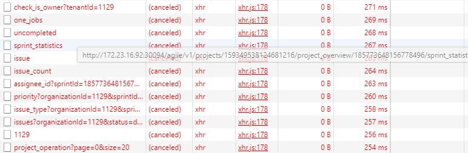


#### 原因三

如果用了cancelToken我又想做缓存，还不如直接用缓存来，也可以达到效果


### 为什么拦截器的添加顺序会影响到缓存？

这也是在上面讲axios的adapter的时候提及过

请求拦截器是的执行顺序是后添加的先执行

响应拦截器是先添加的先执行

例如：我们项目的请求拦截器是这样添加的

```js
// 添加切换路由取消pending请求拦截器
instance.interceptors.request.use(routeCancelInterceptor); // 4

// 添加缓存(复用重复请求)请求拦截器
instance.interceptors.request.use(handleCancelCacheRequest, handleRequestError); // 3

// 分页数据转换拦截器
instance.interceptors.request.use(transformRequestPage); // 2

// 添加头部拦截器， 以及请求失败拦截器
instance.interceptors.request.use(addCustomHeader); // 1
```

按顺序是从下到上执行，按照标注的1，2，3，4执行

响应拦截器是这样的

```js
// 添加响应拦截器
instance.interceptors.response.use(transformResponsePage); // 1
instance.interceptors.response.use(handleResponseInterceptor, handelResponseError); // 2
```


### 路由取消cancelAllRequest方法中为什么要删除cache中的数据？


## 难点解决


