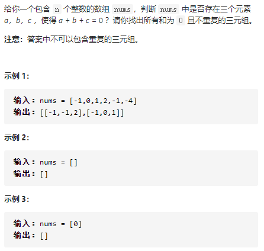
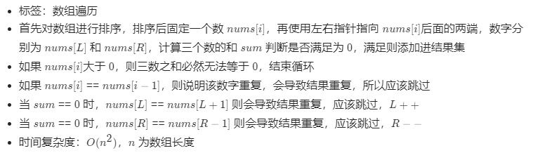

15.三数之和



思路：




```js
/**
 * @param {number[]} nums
 * @return {number[][]}
 */
var threeSum = function(nums) {
    let ans = [];
    const len = nums.length;
    if(nums == null || len < 3) return ans;
    nums.sort((a, b) => a - b); // 排序
    for (let i = 0; i < len ; i++) {
        if(nums[i] > 0) break; // 如果当前数字大于0，则三数之和一定大于0，所以结束循环
        if(i > 0 && nums[i] == nums[i-1]) continue; // 去重
        let L = i+1;
        let R = len-1;
        while(L < R){
            const sum = nums[i] + nums[L] + nums[R];
            if(sum == 0){
                ans.push([nums[i],nums[L],nums[R]]);
                while (L<R && nums[L] == nums[L+1]) L++; // 去重
                while (L<R && nums[R] == nums[R-1]) R--; // 去重
                L++;
                R--;
            }
            else if (sum < 0) L++;
            else if (sum > 0) R--;
        }
    }        
    return ans;
};
```


