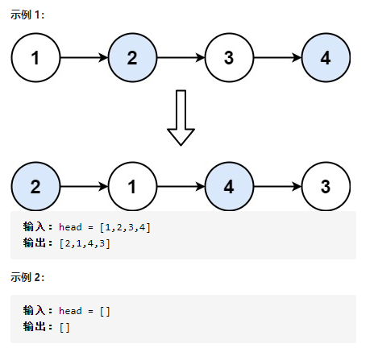

1.  给定一个链表，两两交换其中相邻的节点，并返回交换后的链表。

**你不能只是单纯的改变节点内部的值**，而是需要实际的进行节点交换。



题解：

```js
/**
 * Definition for singly-linked list.
 * function ListNode(val, next) {
 *     this.val = (val===undefined ? 0 : val)
 *     this.next = (next===undefined ? null : next)
 * }
 */
/**
 * @param {ListNode} head
 * @return {ListNode}
 */
var swapPairs = function(head) {
    if(!head || !head.next){
        return head
    };
    let header = new ListNode();
    header.next = head
    let vnode = header;
    while(head && head.next){
        const temp = head.next;
        head.next = head.next.next;
        temp.next = head;
        vnode.next = temp;
        vnode = head;
        head = head.next;
    }
    return header.next;
};
```

