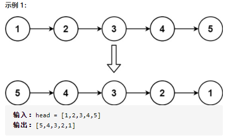

206.给你单链表的头节点 `head`,请你反转链表，并返回反转后的链表



迭代解法：

```js
if(!head){
        return head;
    }
    const virsualNode = new ListNode();
    virsualNode.next = head;
    while(head.next){
        let temp = head.next;
        head.next = head.next.next;
        temp.next = virsualNode.next;
        virsualNode.next = temp;
    }
    return virsualNode.next
```

